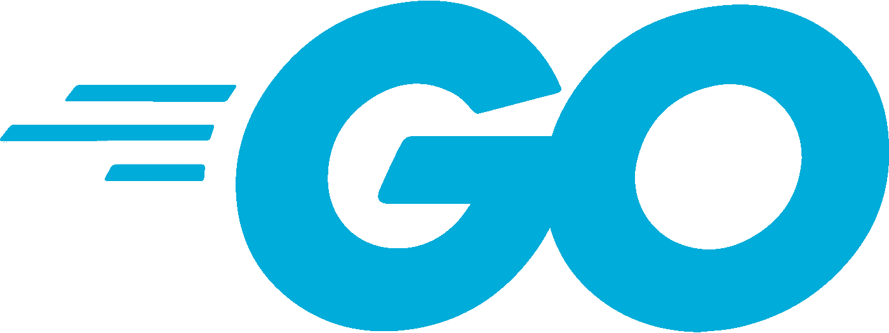

# Golang 1.18:你需要知道的

> 原文：<https://betterprogramming.pub/golang-1-18-what-you-need-to-know-a5701f7e14ab>

## 在 Go 1.18 中有两个主要的东西你需要知道:类型参数(泛型)和模糊测试，但是为什么它们如此重要呢？

Go Logo 由 Go 作者—[https://blog.golang.org/go-brand](https://blog.golang.org/go-brand)

Golang 团队正在努力开发 Golang 1.18，该版本将于 2022 年 2 月发布，看起来这将是一个大版本。Golang 1.18 将引入泛型(称为类型参数)以及模糊测试，这有可能永远改变我们开发和测试 Golang 程序的方式！下面我们来看看这两个新特性。

# 类型参数(又名泛型)

类型参数(在其他语言中也称为泛型)将允许 Go 程序员用占位符类型名定义函数和方法。这将允许开发人员编写可以在项目的不同部分重用的代码，但仍然一般地为他们期望它支持的所有类型的数据工作。

让我们来看一个普通的 Go 函数(1.18 之前)，它返回两个输入的最小数目:

如你所见，我们接受两个整数作为参数。`min(1,2)`和`min(2,1)`都将返回`1`。到目前为止还不错，但是当你想得到两个浮点值的最小数目时会发生什么呢？我们将不得不编写一个新的函数，它将两个浮点值作为参数，并且我们将无法重用第一个函数中的代码。函数的主体仍然是完全相同的代码。如果我们想获得两个 float64 值中的最小值，我们必须再次引入相同的函数，将 float64 作为参数。

现在我们来看看 Go 中的泛型:

泛型带来的最大变化是，现在可以用任意的占位符类型名来定义函数，这个占位符类型名以后将作为其他类型的参数。在 Go 中，泛型是以`type T`的形式编写的。

这意味着您可以用任何占位符类型名称定义一个函数，该名称稍后将由另一个参数填充。因此，让我们将之前的示例重构为新的通用方法:

如您所见，代码有点长。首先，我们有一个接口，它将所有数值类型声明为一个名为“numeric”的新类型这意味着我们可以在泛型中使用`float64`和`int`。然后我们像以前一样定义一个新的函数`min`。

不同的是，现在函数的头部有一个类型参数:`min[T numeric]…`。这告诉 Go 类型`T`应该是数字类型，所以我们在接口中声明的任何类型都可以。之后，一切又恢复正常，我们像以前一样声明函数，只是我们用`T`替换了`int`。

如果现在调用新函数，Go 将检查用户提供的类型是否适合接口。如果是，它将在整个函数中用该类型替换`T`。所以如果我们输入一个类型为`int`的数字，我们也会得到一个整数。如果我们输入一个`float64`，我们将得到一个`float64`返回，以此类推。因此，我们现在有了一个单一的“全能”函数，而不是编写 12 个内容完全相同，但 Go 中每个数值类型的参数类型不同的函数。

# 模糊测试

除了泛型，Go 还将在 Golang 版本中从一开始就内置模糊测试。模糊测试允许对大量不同的输入进行测试。例如，我们有一个函数，它接受两个数字作为参数，并对它们进行处理。我们现在要确保函数在单元测试中正常工作。

正常的方法是为我们期望函数处理的每个数字编写一个测试。如果我们的输入数据是[0，100]、[200，100]和[1234，4321]，那么我们总共有三个测试。但是如果用户输入了我们没有想到的东西呢？也许是负数？所以我们也必须测试这些。还有很多。

函数的最初开发者可能不会考虑大数，因为他们认为没有人会在函数中插入一个大数，但也许有人会这样做。因此，他们还必须覆盖这些，以避免程序崩溃。对于数字，这可能很容易，但是如果测试只在输入[-1337，1337]时失败，该怎么办呢？

所有其他数字工作正常。开发人员不可能测试每一个可能的输入值。这就是模糊测试的由来。模糊测试在你的函数中输入大量的随机值来测试它们。这是如何做到的:

测试必须在*_test.go 文件中作为名为`FuzzXxx`的函数，并且应该带有一个`*testing.F`参数，就像`TestXxx`函数带有一个`*testing.T`参数一样。这是模糊测试的基本语法:

在第二行，你可以看到我们有一个正常的测试参数`t *testing.T`和`n int`。

第一个参数`t`是你对普通单元测试所做的一切。但是后面的参数更有意思。您实际上可以使用任何类型，Go 将自动运行带有随机参数输入的主体，这符合您的类型。

因此，如果我们的测试函数接受一个数字类型，Go 将用随机数运行它。然后，您可以像平常一样检查错误，并且不必担心测试集。一切都将由模糊测试包来处理。

# TL；速度三角形定位法(dead reckoning)

如果你是 Golang 开发人员，即将发布的 Go 1.18 将带来两个重大变化，可能会改变你在代码中使用泛型和模糊测试的方式。

有了泛型，程序员可以创建函数来处理任何类型，而不必为每个数字类型编写 12 个不同的版本。模糊测试允许开发人员针对随机值运行单元测试，这有助于确保测试中覆盖更多可能的输入数据。

# 有关系的

 [## 你需要知道的 Golang 社区空间！

### Go 是一种编程语言，在过去的十年里，它的流行程度有了显著的提高。Go 开发者…

blog.marvinjwendt.com](https://blog.marvinjwendt.com/golang-community-spaces-that-you-need-to-know-776dd75b95d5)