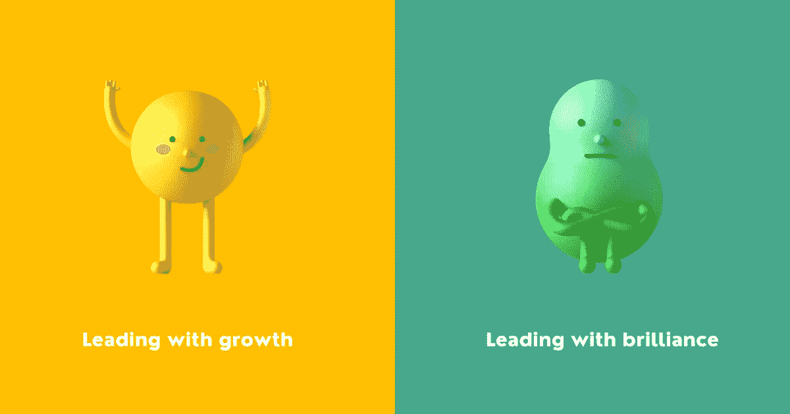

# 优秀的领导力关乎成长，而非才华

> 原文：<https://betterprogramming.pub/good-leadership-is-about-growth-not-brilliance-af8ca30f1a3a>

## 领导力与个人的伟大和权利无关；用勇气和激情来领导是一种谦逊



鸣谢:作者

你有没有想过表扬可能是负面的？我想不会。毕竟看起来无害，好像还挺有效的。传统观点认为，如果你赞扬人们，他们就会有动力做得更好。

那些一生都被好心的父母、朋友和老师称赞才华和聪明的人，或者那些在童年时期极度关注才华和聪明的人，学会了只重视智力。难怪这些人在进入职场的每一步都会不断寻求认可和要求表扬。

每一个机会都是对他们智力的一种衡量——我看起来聪明吗，别人会怎么评价我，如果别人觉得我的想法很蠢怎么办。由于一心一意地关注于验证自己，他们所有的行为都植根于确立自己的价值。每一个错误都会损害他们的声誉，每一次失败都反映了他们的能力。他们不太在乎学习，更在乎证明自己。他们的道德感有时会受到打击，因为他们会采取野蛮的行为——通过大喊大叫、侮辱、控制或不当邀功来贬低他人——所有这些都是为了增强他们的自尊。

斯坦福大学心理学教授卡罗尔·德韦克在摩根·麦考尔的书《壮志凌云》中总结了这一不幸的现实

> “人们通常喜欢不利于他们成长的事物。。。。人们喜欢利用他们的长处。。。为了达到快速，戏剧性的效果，即使。。。他们没有发展他们以后需要的新技能。人们喜欢相信他们像每个人说的那样好。。。不要把他们的弱点看得太重。人们不喜欢听到坏消息或受到批评。。。。存在巨大的风险。。。离开自己擅长的领域，去尝试掌握新的东西。”

# 组织是怎么对待这种人的？

他们滋养并促进这种心态。他们称赞人们的聪明想法，传达了这样的信息，*“我们重视才华和聪明。”*他们对取得成就的人给予奖励和奖金，告诉其他人“我们只关心成功”

当这些人担任领导角色时会发生什么？他们重视才华高于一切的心态放大了，导致灾难性的结果。历史上充满了领导失败的例子，那些伟大的承诺最终变成了最大的灾难。这篇来自马尔科姆·格拉德威尔的刊登在*《纽约客》*上的[文章现在和 18 年前一样有效。在描述安然公司的人才心态和在公司总部走廊徘徊的麦肯锡顾问时，他指出](https://www.newyorker.com/magazine/2002/07/22/the-talent-myth)

> “他们在那里寻找有能力跳出框框思考的人。他们从来没有想到，如果每个人都必须跳出框框思考，也许是框框需要修正。”

他还谈到了重视天赋的环境的影响，以及当时局艰难、自我形象受到威胁时会发生什么,“他们难以承受后果。他们不会参加补习课程。他们不会站出来面对投资者和公众，承认他们错了。他们宁愿撒谎。”

赞美他人的智慧和成就是培养未来领导者的唯一途径吗？有没有更好的出路？

如果我们赞扬人们的努力工作，赞扬他们在失败和挫折中坚持不懈的能力，赞扬他们主动培养新技能，赞扬他们勇于面对错误，相信他们的成长，并实施正确的策略来克服他们的缺点，会怎么样？这种赞美告诉他们什么？

它告诉他们努力培养能力的价值。它教会他们实施正确的策略来解决问题的重要性。它鼓励他们寻求帮助，以便在工作中取得进展。它创造了一种学习的热情，这种热情不是由看起来聪明的需要驱动的，而是由培养技能、延伸自我以成长的愿望驱动的。

当这些人走上领导岗位时，这种心态会引导他们将公司及其员工的福祉置于自身需求之前，将团队合作置于个人成就之上，并促进员工的成长和发展。

> “作为具有成长意识的领导者，他们从相信人类的潜力和发展开始，包括他们自己和他人的潜力和发展。他们没有把公司作为成就自己的工具，而是把它作为自己、员工和整个公司发展的引擎。”—卡罗尔·德韦克

不像那些专注于辉煌而拖垮公司的领导者，这些领导者带领他们的公司走向伟大，让他们自己和周围的人充满感激之情。

仔细选择你的赞美，因为你会发现赞美成长比赞美才华有更大的好处。

# 当领导者关注才华时

他们生活在一个个人伟大和权利的世界，争夺标签，并会做任何事情来提升自己的形象。他们没有建立一个持久的公司，而是花费时间和金钱来提升自己的形象。

由于对认可的持续需求，他们利用公司里的人来满足他们的自我并展示他们的优越感。一切都是为了讨好老板。他们身边都是能提升他们自尊的人。一致赢得他们的钦佩，而不一致是对他们智力的攻击。他们不是听完人们的意见，而是惩罚不同意见，让人们闭嘴。

他们抨击那些天赋较低的人缺乏智力，并发现那些比他们更有天赋的人也同样具有威胁性。他们虐待员工，大喊大叫，侮辱，控制和虐待他们的工作方式。他们通过让别人感觉更糟来让自己感觉更好。员工无时无刻不在担心被评判。当人们因为错误而被嘲笑时，他们很快就会学会低着头，停止使用他们的批判性思维技能，并屈服于群体思维。

他们的优越感使他们看不到现实。他们对投诉视而不见，无视警告信号，解雇那些告诉他们不想听的人。他们的决策标准是基于什么能让他们看起来不错，而不是什么对公司的长期发展有利。

当一个领导者拒绝面对残酷的事实时会发生什么？

> “当一个领导者让自己成为人们担心的主要现实，而不是现实成为主要现实时，你就有了平庸或更糟的配方。这是魅力较弱的领导者往往比魅力更强的领导者产生更好的长期结果的关键原因之一。”—吉姆·科林斯

由于成功和失败是他们身份的一部分——成功意味着他们聪明，失败意味着他们不聪明——他们为失败寻找借口并责怪他人，而不是承担个人责任。他们没有投资于公司未来的发展，而是因为害怕失败而谨慎行事，对来自竞争的挑战变得不那么敏感，听从那些经过尝试和测试的，并拒绝承担风险。为什么要接受一个会损害他们名誉的挑战呢？相反，他们可能会不惜一切代价跨越道德界限来击败竞争对手。成功是他们所追求的，他们如何获得成功并不重要。

由于更多地关注人才，而不是潜力，他们不会投资于指导和训练员工。他们没有采取措施发展员工并帮助他们合作，而是让他们相互竞争。

卡罗尔·德韦克总结了他们卓越的思维模式:“我的天才不仅定义和验证了我。它定义并验证公司。它创造价值。我的天才是利润。哇！”

# 当领导者关注增长时

它们以学习模式运行。他们不自称是天才，但承诺投资于自身的发展和人民的发展。发展公司的动力和热情使他们采取长期战略而不是短期策略。他们在游戏中不是为了提升自我或建立自尊。激发和激励他们的是塑造公司未来的纯粹快乐。他们不仅仅是为了声望，而是为了挑战。

他们明白通往成功的道路需要经历失败。为什么要失去推动他们未来发展的机会呢？因此，他们没有躲在失败的背后，而是直面失败。失败并不能定义他们的能力。这是自我反省的重要时刻。它们是培养技能、探索可能性、尝试和投资美好未来的机会。

他们以脆弱开始。他们接受错误，将组织的焦点从隐藏错误转移到寻找解决方案。当他们不知道某事时，他们不说“我不知道”，而是假装隐藏他们的无知这三个铿锵有力的字，展现了谦逊和自信。为了做出决定，他们邀请其他人分享他们的意见，促进建设性批评的文化。由于他们不会将自己的身份与自己的观点联系起来，他们更看重寻找正确的答案，这需要公开的分歧和支持观点的灵活性，而不是他们的正义感。

毫无疑问，困难的情况会让他们不舒服。他们没有让不适妨碍有意义的谈话，而是欣然接受。他们选择忽略自己的不适，关注这些讨论所提供的价值——节省了因期望不一致和缺乏明确目标而产生的压力和焦虑而浪费的大量时间。

他们强硬但富有同情心。他们不回避给出关键的反馈，同时也挑战组织中的人走出他们的舒适区。它们使人们能够通过正确的反馈渠道做出决策，从而帮助组织做出更好的决策。

具有增长思维的领导者按照 Lou Gerstner 在《谁说大象不会跳舞》中所说的那样运作，他通过拯救 IBM 免于破产而扭转了它的命运

> “等级对我来说没什么意义。让我们把能够帮助解决问题的人召集到一起开会，不管他们的立场如何。”

他们没有被现实蒙蔽，而是专注于寻找能够推动公司前进的解决方案。这需要密切关注市场趋势的变化，识别和投资未来的增长领域，并承担适当的风险。

他们关注潜力和发展，投资于确定和培养组织的未来技能，这些技能在困难的情况下会很有用，使他们在竞争中获得优势。他们通过辅导和指导来提高生产力，通过鼓励协作来重视团队合作，并定义共同的成功衡量标准。

学者兼作家沃伦·本尼斯被广泛认为是当代领导力研究领域的先驱，他在《组织天才》中写道

> “领导者是这样的人，他们充满激情地相信，他们可以诱使其他人分享他们的梦想。”

他对领导力最令人钦佩的观点是—

> “优秀的领导者让人们觉得他们处于事物的核心，而不是边缘。每个人都觉得自己对组织的成功有所贡献。当这种情况发生时，人们会感到集中，这让他们的工作有了意义。”

什么样的领导者会这样想——那些专注于辉煌的领导者还是那些受增长驱动的领导者？

```
Follow me on [Twitter](https://twitter.com/techtello) for more stories. This story was originally published at [https://www.techtello.com](https://www.techtello.com/leadership-is-about-growth-not-brilliance/).
```