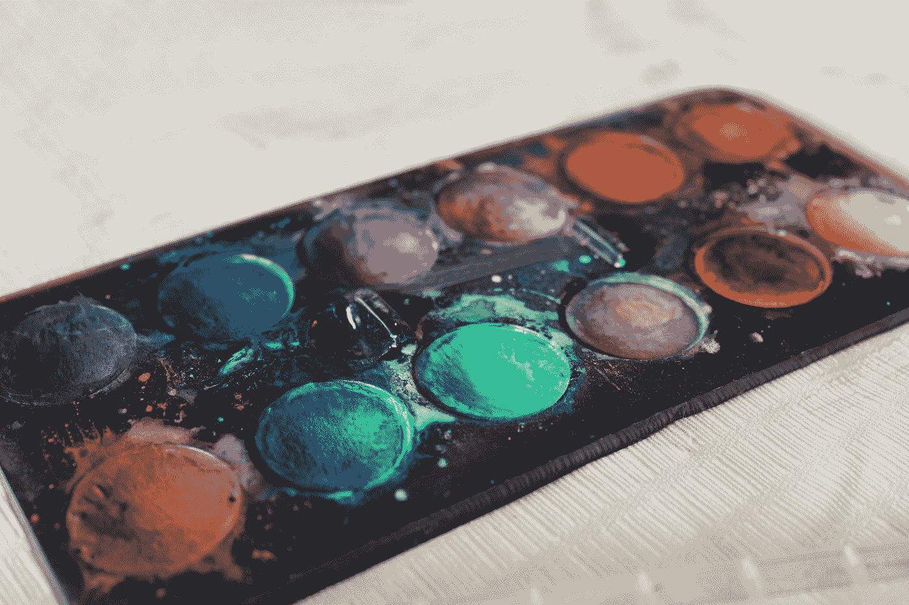

# 谷歌 Fuchsia 是 Android 的替代品吗？

> 原文：<https://betterprogramming.pub/google-fuchsia-androids-replacement-code-in-mobile-5ebafe8eb11a>

## 谷歌一直在做这个实验，每个人都想知道这是怎么回事

莎伦·麦卡琴在 [Unsplash](https://unsplash.com/) 上拍摄的照片。

在过去的 8-10 年里，移动市场一直由我们都很熟悉的两个品牌主导:Android 和 iOS。正如我们倾向于对待技术进步一样，我们总是认为我们今天知道的事情永远不会结束，但谷歌已经开始有了不同的想法。自 2016 年 8 月以来，谷歌一直在研究它最初称为“实验”的东西，即谷歌 Fuchsia。有人认为这可能是 Android 的末日。在这篇文章中，我将向你解释这个新的操作系统。

谷歌 Fuchsia 开发者的[入门](https://fuchsia.dev/fuchsia-src/getting_started)指南以一个奇怪的短语开始，这个短语有一个有趣的上下文:“粉色+紫色== Fuchsia(一个新的操作系统)。”

乍一看，这个短语只不过是颜色的定义和这个产品是一个操作系统的明确声明。但不仅仅是这样。粉色是苹果第一个面向对象的微内核操作系统，而紫色是苹果用于 iPhone 的第一个代号。我的第一个观察是…为什么这么多提到苹果？

# 微内核操作系统

这里首先突出的一个词是 Fuchsia 是一个微内核操作系统。内核是任何计算机的核心，是控制一切的基础程序。这里的“微”指的是非常小规模的东西。通过成为一个微内核，Fuchsia 将能够在任何类型的设备上运行，从传统的计算机或手机到物联网设备，如你的冰箱或微波炉。

# Fuchsia 可以跨设备工作

考虑到上述观点，我们可以认为谷歌可以使用这个操作系统，以便在所有设备上拥有相同的基础。也许我们现在很难注意到它，但是你的手机和电脑上运行的操作系统是不同的。即使你有一台 Mac 和一台 iPhone，UI 可能看起来很相似，但核心是不同的。

现在另一个问题出现了:如果我们没有注意到，跨设备使用相同的操作系统有什么好处？嗯，如果你有相同的操作系统，你只需要创建一个应用程序，唯一需要改变的是用户界面。但这不得不带来一些额外的考虑。例如，输入设备不尽相同，手机没有物理键盘，计算机并不总是支持触摸手势，一些芯片如 GPS 或加速度计可能不在某些计算机中，等等。这将是谷歌需要努力的方向。

詹·西奥多在 [Unsplash](https://unsplash.com?utm_source=medium&utm_medium=referral) 上拍摄的照片。

# 在 2020 年使用紫红色

目前有几个设备支持 Fuchsia。例如，它可以用在宏碁 Switch 12、英特尔 NUC 或[谷歌 Pixelbook](https://www.amazon.com/gp/product/B07YMGQYP6/ref=as_li_tl?ie=UTF8&camp=1789&creative=9325&creativeASIN=B07YMGQYP6&linkCode=as2&tag=evana06-20&linkId=fc7f76e8aa951f7870743749efa60a29) 上。这是一个目前只有在遵循开发指南[后自己构建才可用的特性。现在还没有任何东西可以买到使用紫红色的。](https://fuchsia.dev/fuchsia-src/getting_started)

文档中有一些突出的内容:

1.  建造过程被称为铺路。
2.  您需要一台主机和一台目标机。换句话说，你需要在电脑上构建，然后传输到目标设备上。
3.  可以在 Linux 和 Mac OS X 中使用。

# 为 Fuchsia 编程

Fuchsia 特别有趣的一点是，您可以在 Xcode 11 中构建它。它将运行几种语言的应用程序:Java，Swift，Dart。到目前为止，移动平台只有一种特定的本地语言，但 Fuchsia 似乎将支持几种语言。

所以这是谷歌 Fuchsia 的总结。谷歌还没有澄清任何事情，但技术变化如此之快。让我知道你的想法。你认为它会成功吗？

下次见！