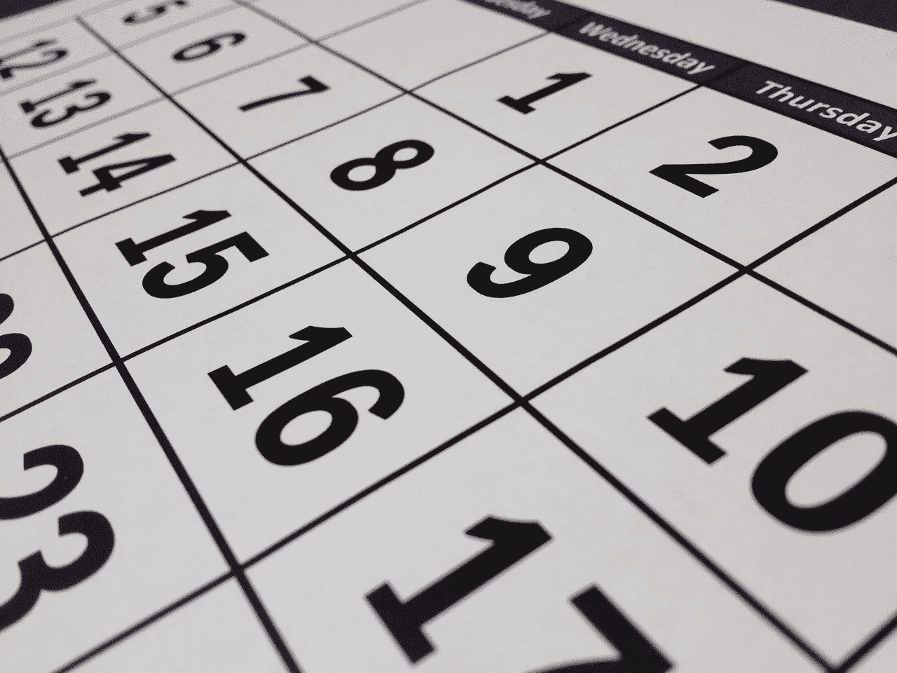

# Gostradamus:围棋中更好的日期时间

> 原文：<https://betterprogramming.pub/gostradamus-better-datetimes-in-go-2c17fe8a4a29>

## 因为日期在每种语言中都很难



图片由 Pixaby 上的[tiger ly 713](https://pixabay.com/users/tigerlily713-194784/?utm_source=link-attribution&utm_medium=referral&utm_campaign=image&utm_content=660670)提供

在 Go 中使用`time`包很难。我认为许多围棋程序员也是这么看的。

与其他语言相比，解析时间、替换一个`time.Time`对象的天数以及其他操作都不自然。

例如，将一个`string`解析成一个`time.Time`对象，如下所示:

```
import "time"parsed, err := time.Parse(
    "02.01.2006 15:04:05", 
    "09.04.2020 11:49:54",
)
```

而替换当前`time`的那天物体看起来是这样的:

`time`封装提供了所有需要的功能，但是仍然需要对封装本身有太多的了解才能得到一个纤薄的解决方案。

所以我编写了[Gostradamus:Go 中更好的日期时间](https://github.com/bykof/gostradamus)来简化`dateTime`处理和解析/格式化。

让我们以上面的例子为例，在 Gostradamus 中实现它们:

```
import "github.com/bykof/gostradamus"parsed, err := gostradamus.Parse(
    "09.04.2020 11:49:54",
    "DD.MM.YYYY HH:mm:ss",
)
```

很简单吧？也是解析日期和时间的一种非常常见的方式。在这里您可以找到所有的[解析标记](https://github.com/bykof/gostradamus#token-table)。

Gostradamus 的第二个例子是这样的:

在围棋中与 s 合作从来没有这么容易。你可以在 [Github 自述文件](https://github.com/bykof/gostradamus#basic-usage)中查找一些特性，或者在 [go.dev 参考文件](https://pkg.go.dev/github.com/bykof/gostradamus?tab=doc)中查找所有特性。它也完全兼容`time.Time`和[可以从它和](https://github.com/bykof/gostradamus#conversion-between-timetime-and-gostradamusdatetime)进行解析。

我希望我的新包裹能帮到你很多。如果您想改进或添加功能，请随意贡献。

# 奖金

Gostradamus 还提供了一种处理时区的简单方法。所有可能的时区都保存在[常量](https://github.com/bykof/gostradamus/blob/master/timezone_constants.go)中，因此您可以轻松地从一个时区转换到另一个时区:

```
import "github.com/bykof/gostradamus"
dateTime := gostradamus.Now()
dateTime = dateTime.InTimeZone(gostradamus.AmericaNewYork)
```

移位、天花板或地板也不是问题:

```
import "github.com/bykof/gostradamus"
dateTime := gostradamus.Now()
dateTime = dateTime.ShiftDays(-14).CeilMonth()
```

# 后续步骤

该计划的下一步将是提供支持和实施`timedelta` s，人们实际上可以用一个减去另一个来获得中间经过的时间:

```
dateTime := gostradamus.Now()
... // some computation
gostradamus.Now().Difference(dateTime).Seconds()
```