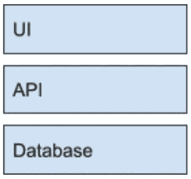
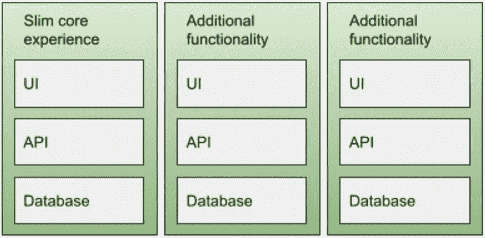
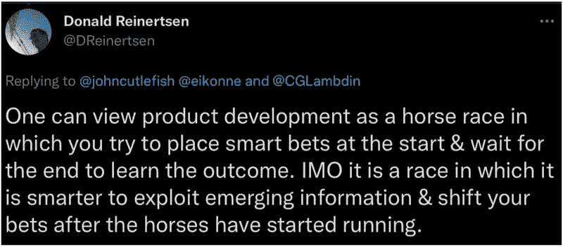
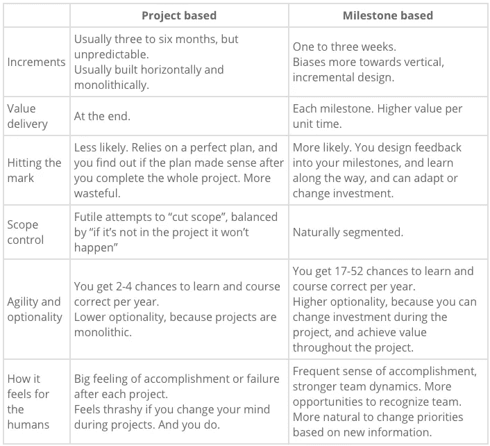

# 伟大的工程团队关注里程碑而不是项目

> 原文：<https://betterprogramming.pub/great-engineering-teams-focus-on-milestones-instead-of-projects-4687c4eb5d87>

## 里程碑:产品开发挑战的惊喜解决方案


在 [Unsplash](https://unsplash.com?utm_source=medium&utm_medium=referral) 上拍摄的 [ThisisEngineering RAEng](https://unsplash.com/@thisisengineering?utm_source=medium&utm_medium=referral)

工程中许多罪恶的根源是我们对项目的关注。

大多数工程组织专注于交付项目。相反，他们应该关注里程碑。

管理项目很难。公司竭尽全力做好这件事。不下棋，换跳棋。里程碑是一个更容易的游戏，你会得到更好的结果。

在这篇文章中，我描述了:

1.  我建议你采用一种特殊风格的里程碑。
2.  为什么人类不擅长项目？
3.  为什么我们非常擅长里程碑？
4.  基于里程碑的交付使一切变得更好的无数方式。
5.  如何切换到基于里程碑的交付？

# 拿起这些里程碑，把它们推到一边

我用了一个特殊版本的[里程碑](https://en.wikipedia.org/wiki/Milestone)，推荐你也这样做。这些里程碑具有以下特性:

1.  小。里程碑是一周或三周的工作，不会更多。一个或多个里程碑构成一个项目。
2.  高质量。每当你完成一个里程碑，让事情比开始时更好。代码库和用户体验不应该降级。一个例外是，如果你正在做一个一次性的原型。随着时间的推移，这将保持您交付价值的能力。当你完成一个里程碑时，它应该以某种方式发布。您可以选择不对所有客户发布，但是应该以某种定义的方式完成。
3.  可以理解。选择传达您所交付价值的里程碑名称。公司里的任何非工程师都应该理解里程碑的作用。我喜欢使用“[方法]提供的[价值]”。这与工程和业务的其余部分都有联系。例如:“通过实现 ElasticSearch 来加速列表页面上的搜索结果”。业务人员了解价值部分。工程团队会从方法部分理解我们在做什么。
4.  有价值。每个里程碑都有价值。如果你正在做一个有很多里程碑的项目，你应该能够中途停止。即使你没有完成所有的里程碑，你也应该已经交付了价值。

对于最后一块，值可以是

1.  顾客价值
2.  商业价值，或者
3.  信息。

里程碑的这些属性的缩写是 SHUV。

为什么要使用里程碑？好吧，让我们从谈论为什么不是项目开始。

# 人类在项目管理方面很糟糕

我在项目管理方面有很多经验:

*   我管理项目已经有几十年了。
*   我运行过跨许多团队和项目的程序。
*   我学过项目管理理论。而且，
*   我设计并编写了项目管理软件。

项目管理是令人着迷的。它给人一种控制非常混乱的过程的错觉。

项目管理似乎很有价值。你确实需要某种结构。您确实希望考虑风险、审查进度并跟踪依赖性。

项目管理的一个更好的替代方案是里程碑管理。你所做的就是“用里程碑取代所有关于项目的讨论”

让我解释一下为什么这个简单的改变是可取的。

# 工程师通常不擅长增量设计

工程师倾向于以整体的方式设计和排序工作。有经验的工程师知道如何增量工作。但是工程组织的重心是朝向水平层的设计。


以下是您的工程团队将如何设计典型功能。这假设有一个前端和后端部分的工作。

*   与你正在处理的文档或设计文档进行对话。设计师提供模型。
*   在前端和后端工程师之间就 API 的外观达成一致。
*   后端工程师开始在 API 上工作。他们设计数据模型，创建 CRUD 操作，然后添加有趣的业务逻辑。为 it 打造新的服务。
*   前端工程师开始构建 UI。他们通过模仿来构建它，为每个事物创建组件。一页一页地做。模拟后端，直到它可用，然后连接它。
*   解决前端和后端之间不可避免的问题。

全栈工程师通常会以相同的水平设计方式构建东西。

这种做法有什么问题？

1.  根本不是增量。
2.  所有的价值都是在最后交付的。

我们稍后将讨论一种更好的方法。

# 设计师也不擅长增量设计

设计师在增量交付方面也面临类似的挑战。要想设计好某样东西，你必须考虑最终状态。因此，设计师将生产代表您正在努力实现的最终状态的工件。

这是必要的。设计师需要做的工作是思考最终状态。但是这进一步使你的交付偏向于整体。这是个陷阱！

# 产品经理考虑长期的最终目标

类似地，产品经理从最终状态的角度考虑问题。他们想要向客户交付一种能力，因此他们可能不会考虑实现这种能力的途径。所以他们加入了偏向整体交付的人群。

# 有效的项目评估几乎不存在

我们的领域因不可靠的估计而臭名昭著。糟糕的是，#NoEstimates 阵营中的许多人认为你根本不应该估计 T1。

这是有争议的，因为理解增加一项能力的成本是很重要的。如果你不能算出成本，你试图算出最有价值的工作(价值/成本)是不可能的。

问题是我们渴望不必要的精确。我们不需要知道准确的估计来确保工程关注最重要的工作。进行精确估算的成本是一种浪费。它甚至不会产生你想要的结果。你不需要假装这个专题会在 6 月 20 日完成。无论如何，这个日期肯定是不正确的。

里程碑降低了汇总高级评估的复杂性。他们给出了一个对大多数决策足够好的简写，没有严格估计的开销。

偶尔，我看到人们在严格的评估下成功。但是它很少是系统性的——通常是一个人擅长它。它依赖于他们。如果他们去度假一周，没有人能够养活他们的模型，它崩溃了。虽然这是一项伟大的技能，但对我来说，这是证明规则的例外。请这样想:如果二十个人中有一个人能够在高度复杂的情况下进行评估，那么有多少人能够在不太复杂的情况下更加成功呢？

# 项目通常对人们不利

项目交付可能感觉像是一件苦差事。通常你会为一个不现实的目标工作数月。或者目标可能一直在变化。你工作了几个月来交付一些东西，却发现它没有达到目标。

这些是疾病的症状:项目是疾病背后的恶魔。

# 人类实际上非常擅长里程碑管理

项目和里程碑的区别就像杂耍三个球和六个球的区别。玩六个球需要更多的技巧。大多数人可以在二十四小时内学会玩三个球。学会玩六个球可能需要几年或几十年的时间。

项目管理比项目管理难多了。项目管理比里程碑管理难多了。为什么不玩最简单的游戏，尤其是当结果可以好得多的时候。让我们列举所有那些方法。

# 估计一至三周的工作很容易

一到三周的时间足够短，人们可以对范围进行推理。他们可以估计需要做多少工作，而且相当准确。一家公司发现他们的团队有大约 97%能够达到他们对这种规模项目的估计:


他被要求匿名。

这符合我的经验。设定目标的最佳时机是一周到三周。人类只是在这种规模的工作中做得更好。而且他们在评估如此复杂的工作时更加准确。

# 将项目分解成里程碑可以让您塑造项目

当人们分解一个项目时，他们通常会把它分解成技术任务。一些更有经验的团队可能会把它分解成用户故事。

如果你首先将项目分解成一系列里程碑，你将获得更大的价值。项目是一个或多个里程碑的列表。您的项目高级计划是要交付的里程碑的有序列表。

这更有价值，因为人类可以更好地推理里程碑列表，而不是技术任务列表。并且列表更加灵活。与之相反的是一系列技术任务。他们会巩固你的方法，使改变计划变得很困难。

用户故事虽然比技术任务好得多，但也更难推理，原因很简单，因为你可能有很多用户故事。

里程碑位于合适的高度，你可以玩它们。

有许多方法可以交付一项功能。产品交付最未被开发的一个方面是你分解工作的顺序和方式。时间最有价值的用途之一是考虑多种方法来完成一个项目。

我喜欢让团队想出三种不同的方法来给项目排序。我要求他们讨论权衡，选择最好的一个。

要考虑的权衡包括:

*   客户什么时候会接触到你的作品？向前移动可以更早地提供信息。在成功的项目中，你会看到一个普遍的模式，那就是早期的客户反馈，随后随着时间的推移增加客户联系。
*   你会学到什么信息，什么时候？你可能会在早期完成更有风险的里程碑，探索你不太有信心的领域。或者你可以做一个里程碑，明确地测试早期的一些假设。
*   什么时候事情会完全整合？有经验的工程师会从一根钢丝开始，并保持它在所有的点上工作。对依赖于后来的合并工作的排序持怀疑态度。
*   你给未来的自己多少选择余地？让我们转向新的优先事项的排序可能非常有价值。如果你能够对一个项目进行排序，使得项目的价值在接近结束时逐渐减少，那么你就可以通过不实现那些不太有价值的东西来保持项目的精益。随着时间的推移，这也可以减少技术债务。只要确定你在早期交付的东西实际上是有价值的，当你只交付一部分的时候。

例如，假设您的项目是创建一个 Slack bot，它在客户的 Slack 频道中显示来自您的应用程序的图表。这里有两种不同的方法可以分解这个项目:


权衡:

*   第二个细分让团队对问题空间有了更直接的理解。狗食是这个的强项。
*   第一次故障有更早的客户联系，但不是以客户可能想要的形式。
*   第二次分解在开始时创建了一个钢丝。整合风险更低。
*   第二次分解在开始时做了更窄的切片。它保留了更多的可选性，因为它可能证明您不需要其他图表类型，并且您可以转移到其他项目。还要注意第二次分解是如何更容易地导致变化的——将反馈整合到项目计划中。

# 里程碑鼓励探索和执行项目的分离

里程碑有助于将交付成果分为两类:

1.  执行。可以分解的工作，以及
2.  探索。有很多未知数，不能分解的工作。

这允许你将购买*能力*和购买*信息*分开。

我们使用的里程碑定义的一个好处是，每个里程碑都交付价值。一些项目不能被分解成一组完整的里程碑。这种情况发生在对项目还不够了解的时候。太完美了！因为里程碑想要传递的价值是*信息*。

交付信息的项目交付价值。比如说，假设你要为客户打造一个东西。这项新功能依赖于一项贵公司无人熟悉的技术。您采取的方法在很大程度上取决于未知的技术细节。

在这种情况下，您可以让团队进行调查。里程碑的可交付成果可以是演示文稿，也可以是原型。团队还应该致力于交付三种不同的方式，它们将对未来的里程碑进行排序，以交付该功能。

当面临对交付信息的里程碑进行优先级排序时，产品经理可以做出理性的选择:这些信息值得团队花费几周的时间吗？

# 里程碑自然会鼓励垂直的、增量的设计

之前我们给出了一个团队构建软件的典型方式的例子:水平方式。它看起来像这样:



里程碑倾向于鼓励交付的更多垂直切片。看起来不一样，更像这样:



当一个团队使用里程碑交付一个特性时，我们将采取的方法与我们之前描述的非常不同。

*   你将有一个对话或设计文档。也许设计师提供了模型。
*   你会想到完整的特性，以及该特性的第一个里程碑。如果特性足够复杂，你就有了一个完整的技术设计。如果你能增量地做它，你只是设计下一个里程碑。
*   设计者有一个针对最终状态的设计，但也必须只针对里程碑进行设计。
*   您将关注第一个里程碑，它有一个您可以构建的、将提供价值的特性的狭义子集。
*   前端和后端工程师一起构建里程碑。
*   后端工程师可能不会构建完整的 API。他们构建出里程碑所必需的东西。他们设计数据模型，创建 CRUD 操作，然后添加有趣的业务逻辑。为 it 打造新的服务。但是他们忽略了不必要的部分。
*   前端工程师开始构建 UI。他们工作的原型比最终状态更苗条，所以他们构建了一个更苗条的特征。他们为每样东西创造组件。如果没有完成，他们可能会模拟几天对后端 API 的调用，但当他们完成时，他们应该能够迅速提供反馈，并与后端工程师一起迭代。
*   他们一路演示他们的工作，在里程碑结束时，有一套完整的工作可以一起演示。

正如您所注意到的，这并没有什么不同，只是前端和后端工程师更加紧密地合作，并一起交付里程碑。他们更同步。

尽管这样做的好处看起来很微妙，但它们很重要。增量设计导致在每一个里程碑之后交付价值的工作。不是每三到六个月交付一大块不可靠的价值，而是每一到三周交付一次价值，如果你没有达到目标就学习和调整。您必须投资于学习和适应，以利用增量设计，但回报是巨大的。

# 如何分解项目里程碑

当你处理里程碑时，只分解当前的里程碑。用用户故事代替技术任务。垂直切片可以是分形的，也可以在里程碑内向下扩展。您可能会发现可以删除、推迟或更改的用户情景。

# 具有里程碑的优先级已经足够好了

当划分优先级时，您将根据里程碑的数量(对于执行项目)对特性的成本有一个粗略的感觉。您可能不需要像您认为的那样精确来区分特性的优先级。

但是里程碑的一个好处是，你可以在你的优先顺序上有所创新。例如，您可能会看到一个项目，并决定您可以完成里程碑的前半部分，并交付该项目的大部分价值。这种规划上的流动性是我们在产品开发中错过的主要事情之一。

正如产品开发流程的[原则](https://www.amazon.com/gp/product/1935401009/ref=as_li_tl?ie=UTF8&camp=1789&creative=9325&creativeASIN=1935401009&linkCode=as2&tag=rubick-20&linkId=39ba093d846944abfd771cf91a87c209)(我最喜欢的关于产品开发的书籍之一)的作者唐纳德·赖纳森[所说](https://twitter.com/DReinertsen/status/1465741548981682182):



# 当团队始终交付价值时，他们就会茁壮成长

每隔几周就向企业交付价值的团队感觉很棒。他们不断取得成就。当你向世界传递价值时，工作才会有意义。人们会产生动力感和自信心，这有助于将团队团结在一起，并培养相互批评和改进的能力。

# 里程碑是敏捷的，因为变化是自然的

有了里程碑，每一到三周你就有了自然的落脚点。这意味着团队可以改变他们的优先级，这样做不会感觉像鞭打。因为交付了一些价值，所以不会觉得你的工作被浪费了。对于项目来说，优先级的改变感觉就像扔掉工作一样，而且会令人沮丧。有了里程碑，你通常可以完成你正在做的事情。

有些情况下，你会想要停止一个里程碑:如果事情真的很紧急。但是如果你这样做，你就是在有意识地选择放弃工作。而且发生的可能性更小，因为里程碑的终点更有可能近在咫尺。

# 里程碑使工程看起来很好，并且它建立信任

一个不断交付小单位价值的团队会赢得周围人的信任。你看到的是稳定的价值流，而不是每三到六个月一个巨大的东西。看到一个团队不断地向客户学习并适应，这是令人欣慰的。当一个副总裁看到一个团队评估自己的工作，并做后续工作，使他们的产品令人惊叹，这激发了信心，往往导致团队更高的自主权。

我曾见过对工程持怀疑态度的销售团队，当他们看到向客户发布的一系列里程碑时，他们的态度发生了转变。这可能不合理，但是工作流总是感觉更高的速度，并导致工程做得很好的感觉。

里程碑也是谈论产品、设计和工程之间的事情的一个很好的高度。接下来的几个里程碑是什么？我们对他们感觉如何？我们关心什么？因为它们本质上给了产品更多的选择，它可以改善产品和工程的合作方式。

使用里程碑还意味着向客户交付更稳定的价值流。如果你担心产品变化太频繁，记住里程碑不一定要交付给每个人。您可以将它们交付给一部分客户，并使用特性标志来阻止它们并批量交付。即使你这样做了，里程碑方法仍然是优越的。

# 管理里程碑是较轻的重量

管理里程碑通常比管理项目需要更少的流程。作为项目计划，你最多每周需要几个要点。你不需要笨重的工件和工具。你不需要甘特图。您可以跟踪您的依赖性和风险，并且可能应该这样做。但是您可以根据情况的复杂性和风险来调整里程碑管理的投资金额。

# 基于项目的交付与基于里程碑的交付



# 如何切换到基于里程碑的交付

切换到基于里程碑的交付并不特别复杂。你只是开始报告里程碑，而不是项目。

我通常每周汇报一次，让每个工程经理汇报他们当前里程碑的状态。更新是以 tweet 的形式(为了约束写作，保持简洁)。我要求对里程碑完成时间的最新估计，新识别的风险，以及对项目状态的客观评估。

当每一个里程碑完成时，把它当作一个学习和庆祝的机会。这是回顾和团队对话的好时机。

您通常需要项目级别的计划以及里程碑计划。例如，复杂项目可能需要项目级的技术计划。重要的是要有一个好的方法来决定是否要做更详细的长期规划。

有时，您将需要项目级别的规划。例如，你可能有一些事情要在一个会议上完成。在这种情况下，您可能需要对几个即将到来的里程碑进行评估，并管理这些即将到来的里程碑的风险。即使在这种情况下，里程碑也是有用的，因为如果你偏离了轨道，它们可以给你一个早期警告。

# 结论

一如既往，我喜欢收到关于我写作的反馈。让我知道你的想法——有什么共鸣，你有什么疑问。当然，让我知道你实现里程碑的经验。

另外，你可以关注的另一件事是结果，而不是项目。我赞成这一点，但这是一个更难实现的改变，所以我认为这是一种更先进的技术。对于习惯于项目的公司来说，走向里程碑并不是一个巨大的变化。走向结果可能最终会更好，但更难做到。

```
**Want to Know More About the Author?**If you’re interested in receiving future posts, please [subscribe](https://www.rubick.com/subscribe/). Also, the latest version of this post will always be available [here](https://www.rubick.com/milestones-not-projects/).This whole article owes a huge debt to [Jim Shore](https://www.jamesshore.com/). He introduced the concept of a Minimum Marketable Feature to New Relic. It was the inspiration for this whole post. He has a lot of experience in this realm and the second edition of his book, [The Art of Agile Development](https://www.jamesshore.com/v2/books/aoad2), has just come out. Donald Reinertsen’s tweet is included in this article, and his book on [product development](https://www.amazon.com/gp/product/1935401009) is a master course in the principles behind product development. I’d also like to thank [anonymous VPE] who shared his study on project estimation with me and let me include it here.
```