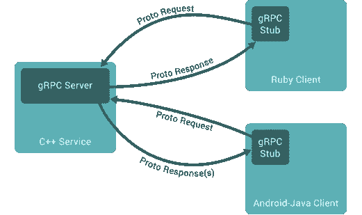

# 用 Go 和 Java 构建超快速 gRPC APIs

> 原文：<https://betterprogramming.pub/grpc-fieldmask-only-request-for-needed-data-build-super-fast-apis-example-with-golang-and-8953089e88a3>

## [gRPC]字段掩码—仅请求所需的数据


带 Java 服务器的 gRPC(客户端)和带字段掩码的 Go 客户端示例

# gRPC 是什么？

gRPC 不是 Google 远程过程调用:-D

gRPC 代表 gRPC 远程过程调用，最初由 Google 开发。

它是一个开源、高性能的远程过程调用(RPC)框架，可以在任何地方运行。

它有效地允许客户端应用程序直接调用位于不同数据中心的不同机器上的服务器应用程序上的方法，该方法以不同的编程语言编写，就像是本地方法一样，这使得我们更容易创建分布式应用程序和服务。



gRPC 通信示例

gRPC 使用 HTTP/2 协议进行传输，协议缓冲区作为接口定义语言(IDL)。

它还提供诸如身份验证、双向流和流量控制、阻塞或非阻塞绑定以及取消和超时等功能。

## 什么是 FieldMask？

字段掩码是 ProtoBuf 的一个简单但非常强大的概念。它有助于使 API 更加健壮，服务实现更加高效。

它类似于我们可以在 REST APIs 中使用的 JSON API 规范的*稀疏字段集*。

客户端可以使用 FieldMask 来指定它们需要从服务器获取的资源数据成员的列表，而不是获取整个资源对象，这可能很大并且会增加网络成本/延迟，此外，服务器可能需要时间来构建整个资源对象(它可能从不同的位置获取数据)。

# 这个故事的用例

我们将创建一个用户消息/资源，其中将有用户的基本信息和地址。我们将为问候用户和获取随机用户创建 gRPC APIs。

在获取随机用户 API 时，我们将使用`FieldMask`来不获取用户的`Address`(在实时用例中，地址可能存储在不同的表/数据库/位置中)。

我们将创建`proto`文件，用 Java 实现服务器，用 Go 实现客户端。

## 先决条件

*   Java 8+
*   Go 1.16+(可选，仅当您想要在 Go 中创建客户端时)
*   格雷尔还是梅文

## 原型文件

gRPC 服务是使用协议缓冲区定义的。

协议缓冲区是 Google 的语言中立、平台中立、可扩展的机制，用于以向前兼容和向后兼容的方式序列化结构化数据。它很像 JSON，只不过它更小更快，并且生成本机语言绑定。

我们将为用例定义协议缓冲区。我们将定义*用户消息协议*和*问候用户服务协议*。现在让我们创建一个名为 *user_proto* 的目录，并在这里创建我们的 proto 文件。它看起来会像这样:

*   `user_message.proto`

```
syntax = "proto3";

package com.grpc.example;

option java_multiple_files = true;
option java_package = "com.grpc.example.greet.model";
option go_package = "./pb";import "google/protobuf/timestamp.proto";

message User {
  string firstName = 1;
  optional string middleName = 2;
  optional string lastName = 3;
  optional uint32 age = 4;
  repeated UserAddress address = 5;
  google.protobuf.Timestamp currentTime = 6;
}

message UserAddress {
  string addressLine1 = 1;
  optional string addressLine2 = 2;
  string city = 3;
  string country = 4;
  uint32 pincode = 5;
  enum ADDRESS_TYPE {
    *BOTH* = 0;
    *PERMANENT* = 1;
    *CURRENT* = 2;
  }
}
```

*   `greet_user_service.proto`

```
syntax = "proto3";

package com.grpc.example;

option java_multiple_files = true;
option java_package = "com.grpc.example.greet.service";
option go_package = "./pb";import "user_message.proto";
import "google/protobuf/field_mask.proto";

message GreetUserRequest {
    User user = 1;
}

message GreetUserResponse {
  string greetMessage = 1;
}

message GetRandomUserRequest {
  google.protobuf.FieldMask field_mask = 1;
}

message GetRandomUserResponse {
  User user = 1;
}

service GreetUserService {
  rpc GreetUser(GreetUserRequest) returns (GreetUserResponse) {};
  rpc GetRandomUser(GetRandomUserRequest) returns (GetRandomUserResponse) {};
}
```

我们可以看到在`GetRandomUserRequest`中，我们增加了`field_mask`作为参数。

## 服务器端实现(带 Gradle 的 Java)

让我们创建一个简单的 Gradle 应用程序，并将其导入我们的 IDE。为此我将使用 IntelliJ IDEA。

让我们在`build.gradle`文件中做些改变，添加 gRPC 和 protobuf 支持。我们将添加一些依赖项、protobuf 插件和生成 proto 文件的类实现的指令。

我们将添加以下依赖项:

```
implementation group: 'io.grpc', name: 'grpc-all', version: '1.45.0'implementation group: 'com.google.protobuf', name: 'protobuf-java', version: '3.15.0'implementation group: 'javax.annotation', name: 'javax.annotation-api', version: '1.3.2'
```

我们将添加以下插件:

```
id "com.google.protobuf" version "0.8.18"
```

我们将为原型文件和类生成添加以下指令:

```
protobuf **{** protoc **{** artifact = 'com.google.protobuf:protoc:3.15.0'
    **}** plugins **{** grpc **{** artifact = 'io.grpc:protoc-gen-grpc-java:1.45.0'
        **}
    }** generateProtoTasks **{** all()*.plugins **{** grpc **{}
        }
    }
}** sourceSets **{** main **{** java **{** srcDirs 'build/generated/source/proto/main/grpc'
            srcDirs 'build/generated/source/proto/main/java'
        **}
    }
}**
```

我们现在将在`src/main` 中创建一个名为`proto`的目录，并将我们的协议缓冲文件复制到这个目录中。这是因为我们的`sourceSet`默认配置是从这个位置读取 proto 文件，我们可以根据需要更改它。

现在让我们尝试构建我们的项目。它应该在`build.gradle`的`sourceSets`中提到的包中创建原型文件的存根。

我们应该创建我们的`GreetingService.java`类实现，它将扩展自动生成的`GreetUserServiceGrpc.GreetUserServiceImplBase.java`类，并用我们自己的实现覆盖`greetUser`和`getRandomUser`方法。

它应该看起来像这样:

```
public class GreetingService extends GreetUserServiceGrpc.GreetUserServiceImplBase {

    @Override
    public void greetUser(GreetUserRequest request, StreamObserver<GreetUserResponse> responseObserver) {
        User user = request.getUser();
        String greetMessage = createGreetMessage(user);
        GreetUserResponse response = GreetUserResponse.*newBuilder*().setGreetMessage(greetMessage).build();
        responseObserver.onNext(response);
        responseObserver.onCompleted();
    }

    private String createGreetMessage(User user) {
        StringBuilder stringBuilder = new StringBuilder();
        stringBuilder.append("Hello, ")
                .append(user.getFirstName())
                .append(user.hasMiddleName() ? " "+user.getMiddleName() : "")
                .append(user.hasLastName() ? " "+user.getLastName() : "")
                .append("!");
        if(user.getAddressCount() > 0) {
            stringBuilder.append("\nI hope things are good in ")
                    .append(user.getAddress(0).getCity())
                    .append(", ")
                    .append(user.getAddress(0).getCountry());
        }
        return stringBuilder.toString();
    }

    @Override
    public void getRandomUser(GetRandomUserRequest request, StreamObserver<GetRandomUserResponse> responseObserver) {

        User user = User.*newBuilder*().setFirstName("John").setLastName("Doe").setAge(26).build();

        for (String s : request.getFieldMask().getPathsList()) {
            if(s.equalsIgnoreCase("address")) {
                UserAddress userAddress = UserAddress.*newBuilder*()
                        .setAddressLine1("BR 15")
                        .setCity("PN")
                        .setCountry("IN")
                        .build();
                user = user.toBuilder().addAddress(userAddress).build();
            }
        }

        User.Builder resUserBuilder = User.*newBuilder*();

        FieldMaskUtil.*merge*(request.getFieldMask(), user, resUserBuilder);

        GetRandomUserResponse response = GetRandomUserResponse.*newBuilder*().setUser(resUserBuilder).build();
        responseObserver.onNext(response);
        responseObserver.onCompleted();
    }
}
```

我们可以在`getRandomUser`方法实现中看到，我们使用字段掩码首先检查是否需要地址字段，然后使用`FieldMaskUtil.merge`创建一个只包含被请求数据的对象。

我们现在应该创建我们的`GreetingServer.java`类，并编写启动 gRPC 服务器的代码。它应该看起来像这样:

```
public class GreetingServer {

    private final int port;
    private final Server server;

    public GreetingServer(int port) {
        this(ServerBuilder.*forPort*(port), port);
    }

    public GreetingServer(ServerBuilder serverBuilder, int port) {
        this.port = port;
        GreetingService greetingService = new GreetingService();

        server = serverBuilder.addService(greetingService).build();
    }

    public void start() throws IOException {
        server.start();
        System.*out*.println("Server Started!!!");
        Runtime.*getRuntime*().addShutdownHook(new Thread() {
            @Override
            public void run() {
                try {
                    GreetingServer.this.stop();
                } catch (InterruptedException e) {
                    e.printStackTrace();
                }
            }
        });
    }

    public void stop() throws InterruptedException {
        if(server != null) {
            server.shutdown().awaitTermination(30, TimeUnit.*SECONDS*);
        }
    }

    public void blockTillShutdown() throws InterruptedException {
        if(server!=null) {
            server.awaitTermination();
        }
    }

    public static void main(String[] args) throws InterruptedException, IOException {
        GreetingServer greetingServer = new GreetingServer(9090);
        greetingServer.start();
        greetingServer.blockTillShutdown();
    }

}
```

它将在 *9090* 端口启动我们的服务器。请点击[这里的官方文档链接](https://grpc.io/docs/languages/java/quickstart/)了解更多关于用 Java 开发 gRPC 的细节。

我们现在可以编写客户端代码来使用这个 API。

## 客户端实现(GoLang)

让我们创建一个名为`grpc-fieldmask-example-go`的简单 Go 应用程序，并在我们的 IDE 中打开它。为此，我将使用 Visual Studio 代码。

我们先安装协议缓冲编译器，[点击这里了解更多详情](https://grpc.io/docs/protoc-installation/)。

```
brew install protobufprotoc --version #please ensure if compiler version is 3+
```

现在，我们应该使用以下命令为 Go 安装协议编译器插件:

```
go install google.golang.org/protobuf/cmd/protoc-gen-go@v1.28go install google.golang.org/grpc/cmd/protoc-gen-go-grpc@v1.2export PATH="$PATH:**$(**go env GOPATH**)**/bin"
```

首先，我们将创建一个`proto`目录，并将原型文件复制到这里(类似于我们在 Java 中所做的)

下一步是从原型文件创建存根，为此我们将使用以下命令:

```
protoc --proto_path=proto proto/*.proto --go_out=. --go-grpc_out=.
```

它将创建一个包/目录调用`pb`并在这个包中生成存根。我们已经在原型文件中定义了这个包名。

我们现在将创建我们的主 go 文件，在这里我们将编写 gRPC 客户机代码，并向运行在 Java 中的服务器发出请求。它看起来会像这样:

```
package mainimport (
        "context"
        "flag"
        "fmt"
        "log"
        "time""grpc-fieldmask-example-go/pb""google.golang.org/grpc"
        "google.golang.org/protobuf/types/known/fieldmaskpb"
)var (
        addr = flag.String("addr", "localhost:9090", "the address to connect to")
)func main() {
        fmt.Println("main method")
        serverAddress := flag.String("address", "localhost:9090", "the server address")
        flag.Parse()
        log.Printf("Connecting to %s", *serverAddress)conn, err := grpc.Dial(*serverAddress, grpc.WithInsecure())
        if err != nil {
                log.Fatalf("error while connecting: %v", err)
        }
        defer conn.Close()client := pb.NewGreetUserServiceClient(conn)ctx, cancel := context.WithTimeout(context.Background(), time.Second)
        defer cancel()callGreetUser(client, ctx)callRandomUser(client, ctx)}func callGreetUser(client pb.GreetUserServiceClient, ctx context.Context) {
        lastName := flag.String("lastName", "Doe", "last name of user")
        var age uint32 = 26user := pb.User{FirstName: "John", LastName: lastName, Age: &age}req := pb.GreetUserRequest{User: &user}r, err := client.GreetUser(ctx, &req)if err != nil {
                log.Fatalf("could not greet: %v", err)
        }log.Printf("Response From Server - Greeting : %s", r.GetGreetMessage())
}func callRandomUser(client pb.GreetUserServiceClient, ctx context.Context) {var paths []string = []string{"firstName", "lastName", "age"}field_mask := fieldmaskpb.FieldMask{Paths: paths}req := pb.GetRandomUserRequest{FieldMask: &field_mask}r, err := client.GetRandomUser(ctx, &req)if err != nil {
                log.Fatalf("could not get random user : %v", err)
        }log.Printf("Response From Server - Random User : %s", r.GetUser())}
```

现在让我们执行下面的命令来创建一个`module`,并添加我们的应用程序的所有缺失的依赖项:

```
go mod init grpc-fieldmask-example-gogo mod tidy
```

现在一切都完成了。当您使用以下命令执行这个 go 代码时，它应该向我们的 Java 服务器发出一个 API 请求，该服务器应该正在运行，并在我们的控制台中打印一个响应:

```
go run main.go
```

尝试使用[]字符串数组中的不同字段，它应该会反映在输出中。

作为奖励，我将在下面分享用 Java 编写的相同的客户端代码

```
public class GreetClient {

    private final ManagedChannel managedChannel;
    private final GreetUserServiceGrpc.GreetUserServiceBlockingStub blockingStub;

    public GreetClient(String host, int port) {
        managedChannel = ManagedChannelBuilder.*forAddress*(host, port).usePlaintext().build();
        blockingStub = GreetUserServiceGrpc.*newBlockingStub*(managedChannel);
    }

    public void shutdown() throws InterruptedException {
        managedChannel.shutdown().awaitTermination(30, TimeUnit.*SECONDS*);
    }

    public String getGreetingMessage(User user) {
        GreetUserRequest greetUserRequest = GreetUserRequest.*newBuilder*().setUser(user).build();
        GreetUserResponse greetUserResponse = GreetUserResponse.*getDefaultInstance*();

        greetUserResponse = blockingStub.greetUser(greetUserRequest);

        return greetUserResponse.getGreetMessage();
    }

    public User getRandomUser() {
        FieldMask fieldMask = FieldMask.*newBuilder*()
                .addPaths("firstName")
                .addPaths("lastName")
                .addPaths("age")
                .build();

        GetRandomUserRequest getRandomUserRequest = GetRandomUserRequest.*newBuilder*().setFieldMask(fieldMask).build();

        GetRandomUserResponse getRandomUserResponse = blockingStub.getRandomUser(getRandomUserRequest);
        return getRandomUserResponse.getUser();
    }

    public static void main(String[] args) {
        GreetClient greetClient = new GreetClient("localhost",9090);

        User user = User.*newBuilder*()
                .setFirstName("John")
                .setLastName("Doe")                .addAddress(UserAddress.*newBuilder*().setCity("PN").setCountry("IN").build())
                .build();
        System.*out*.println("Response Greeting Message : "+greetClient.getGreetingMessage(user));

        User randomUser = greetClient.getRandomUser();

        System.*out*.println("Response User : "+randomUser);

        try {
            greetClient.shutdown();
        } catch (InterruptedException e) {
            e.printStackTrace();
        }

    }

}
```

# 结论

我们刚刚使用 Java 和 Go 生成并使用了一个 gRPC API。此外，我们还学习了如何编写 proto 文件、生成存根以及在 Java 和 Go 中使用它们。

我们还使用了重要特性之一的`FieldMask`，如果使用正确，它可以显著提高系统性能并节省一些成本。

你可以在[这个 GitHub 库这里](https://github.com/kumarprabhashanand/grpc-fieldmask-sample)找到这个例子的代码。