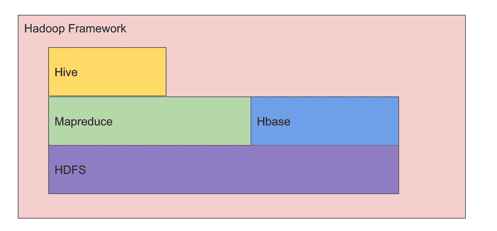

# Hadoop vs HDFS vs h base vs Hive

> 原文：<https://betterprogramming.pub/hadoop-vs-hdfs-vs-hbase-vs-hive-ddfffd45d222>

## 有什么区别？

在 [Unsplash](https://unsplash.com/s/photos/files?utm_source=unsplash&utm_medium=referral&utm_content=creditCopyText) 上由[杯子先生/杨奇煜·巴拉](https://unsplash.com/@iammrcup?utm_source=unsplash&utm_medium=referral&utm_content=creditCopyText)拍摄的照片

随着技术日新月异，越来越多的数据不断产生。

根据[最新的全球数据圈](https://www.seagate.com/our-story/data-age-2025/)，预计到 2025 年，全世界产生的数据量将增长到 175 兆字节。

公司现在需要改进软件来管理这些海量数据。他们一直在寻找处理和存储数据的方法，并将数据分布在不同的服务器上，以便能够加以利用。

在本文中，我们将讨论一个特定的数据管理工具系列，这些工具在讨论时经常被混淆和互换使用。今天我们将讨论 Hadoop、HDFS、HBase 和 Hive，以及它们如何帮助我们处理和存储大量数据。

# Hadoop

当提到几种不同的技术时，Hadoop 通常被用作一个总括术语。但是，Hadoop 也是一个特定的软件框架。它使用户能够轻松管理分布式计算和存储。它通过将文档划分到几个存储中，将块划分到一个机器集群中。

为了实现容错，Hadoop 在集群上复制这些存储。然后，它通过将一个作业分成几个较小的独立任务来执行分布式处理。然后，该任务在计算机集群上并行运行。

Hadoop 通过集群服务对大型数据集进行分布式处理，从而在多台机器上同时工作。为了在 Hadoop 上处理任何数据，我们将讨论几个服务:

*   `HDFS` : HDFS，或 Hadoop 分布式文件系统，是一个主从拓扑，有两个守护进程在运行:`DataNode`和`NameNode`。稍后将详细介绍。
*   `MapReduce`:这是一种在分布式集群上并行处理你的大数据的算法。`MapReduce`然后可以将这些数据组合成结果。
*   `YARN`:`YARN`的作用是将源码管理、作业监控、调度任务划分到单独的守护进程中。它可以超越仅仅几千个节点。这是因为`YARN`联盟允许一个用户通过多个集群进入一个大集群。我们可以在一个更大的任务中使用许多独立的集群，通过一个更大规模的系统来实现。

# HDFS

如上所述，HDFS 是运行在两个守护进程上的主-从拓扑结构— `DataNode`和`NameNode`。

name 节点存储元数据，所有数据都存储在`DataNode`中。此外，如果您的`NameNode`出现故障，并且您没有任何备份，那么您的整个 Hadoop 实例将无法访问。这有点像在遍历链表时丢失指针。如果你不知道你的数据下一步存储在哪里，你就无法得到它。

另一方面，T7 是数据实际存储的地方。如果任何特定的`DataNode`出现故障，这应该没问题，因为`NameNode`通常会跨数据节点管理相同数据块的多个实例(这在某种程度上取决于配置)。

使用 Hadoop 分布式文件系统，您可以在服务器上写一次数据，然后多次读取。HDFS 是处理大量急需数据的绝佳选择。

原因是 HDFS 与`NameNode`和`DataNodes`在硬件集群的商品上合作。事实上，这是 Hadoop 流行的主要原因之一。

事实上，你可以在便宜的硬件上运行 HDFS，并且很容易横向扩展(这是指购买更多的机器来处理数据)，这使得它成为一个非常受欢迎的选择。以前，大多数公司依赖垂直扩展(购买通常昂贵但可以单独处理更多数据的服务器)。这是昂贵的，并且有更多的计算限制。

HDFS 和 Hadoop 与 MapReduce 等其他基础层组件相结合，使得各种规模和能力的企业无需购买昂贵的设备即可扩展其数据处理能力。

# HBase

HDFS 和 Hadoop 在某种程度上是相同的，我们可以理解开发者互换使用这些术语。

但是，HBase 就大不一样了。

HBase 是一个开源的、面向列的数据库，构建在 Hadoop 文件系统之上。这通常是人们更熟悉的一层，因为它更类似于典型的数据库。

它是水平可扩展的。HBase 的数据模型类似于 Google 的大表设计。它不仅提供对大量非结构化数据的快速随机访问，还利用了 HDFS 提供的同等容错能力。

HBase 是 Hadoop 生态系统的一部分，为 Hadoop 文件系统中的数据提供实时读写访问。出于同样的原因，许多大公司将 HBase 用于其日常职能。例如，Pinterest 与 38 个 HBase 集群合作，每秒执行大约[500 万次操作](https://www.dezyre.com/article/overview-of-hbase-architecture-and-its-components/295)！

更重要的是，HBase 为一百万条记录中的单行访问提供了更低的延迟。为了工作，HBase 在内部使用哈希表，然后提供对索引 HDFS 文件的随机访问。

# 储备

虽然 Hadoop 具有很强的可扩展性、可靠性，并且非常适合提取数据，但它的学习曲线太陡，无法实现成本效益和时间效益。另一个很好的替代品是基于 MapReduce 的 Apache Hive。

Hive 是一个数据仓库软件，允许用户快速轻松地编写类似 SQL 的查询来从 Hadoop 中提取数据。

这个开源框架的主要目的是处理和存储海量数据。在 Hadoop 的情况下，您可以使用 MapReduce Java API 实现 SQL 查询。在 Apache Hive 的情况下，您可以轻松地绕过 Java，简单地使用类似 SQL 的查询来访问数据。

Apache Hive 的工作很简单。它将用 HiveQL 编写的输入程序翻译成一个或多个 Java a MapReduce 和 Spark 作业。

然后，它将数据组织到 HDFS 表中，并在集群上运行作业以产生结果。Hive 是一种将结构应用于大量非结构化数据，然后对其执行基于 SQL 的查询的简单方法。因为它使用熟悉 JDBC (Java 数据库连接)的接口，所以可以很容易地与传统的数据中心技术集成。

蜂巢的一些最重要的组成部分是:

*   **MetaStore:** 这是存储配置单元表的模式。Hive Metastore 主要用于保存关于仓库中分区和表的所有信息。默认情况下，它运行与配置单元服务相同的进程。
*   **SerDe:** SerDe 或串行器/解串器是一个向配置单元给出关于如何处理记录的指令的函数

# 这些东西是不一样的——但是它们一起工作

我们已经讨论了 Hadoop、Hive、HBase 和 HDFS。所有这些开源工具和软件都旨在帮助处理和存储大数据，并从中获得有用的见解。

他们也经常互换使用，尽管他们都扮演着非常不同的角色。

总而言之，Hadoop 是一个文件存储框架，它反过来使用 HDFS 作为主-从拓扑来存储 Hadoop 环境中的文件。

HBase 然后位于 HDFS 之上，作为一个基于列的分布式数据库系统，像谷歌的大表一样构建——这对于随机访问 Hadoop 文件非常好。另一方面，Hive 提供了一个基于 Hadoop 的类似 SQL 的接口来绕过 JAVA 编码。

希望这有助于澄清一些差异！