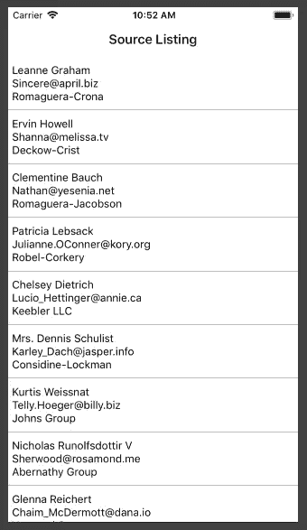

# 在 React Native 中处理 API

> 原文：<https://betterprogramming.pub/handling-api-like-a-boss-in-react-native-364abd92dc3d>

照片由[詹汀·杜恩博斯](https://unsplash.com/@jantined?utm_source=unsplash&utm_medium=referral&utm_content=creditCopyText)在 [Unsplash](https://unsplash.com/?utm_source=unsplash&utm_medium=referral&utm_content=creditCopyText) 拍摄

如果你做过任何有一系列元素的项目，比如名字、地址、图像、视频等等。，那么你很可能见过术语 *API* 。

API 是应用程序编程接口的首字母缩写，它是一个软件中介，允许两个应用程序相互通信。每次你使用像脸书这样的应用程序，发送即时消息或在手机上查看天气，你都在使用一个 API。

# API 是如何工作的？

想象一下，你坐在餐馆的一张桌子旁，有一份菜单可供选择。厨房是“系统”的一部分，它将为你的订单做准备。缺少的是将您的订单传达给厨房并将您的食物送回您餐桌的关键环节。

这就是服务员，或者 API 的用武之地。服务员是信使(或 API)，接受你的请求并告诉厨房(系统)做什么。

然后服务员会把回答反馈给你——在这种情况下，就是食物。

# 你必须知道的基本术语:

如果你熟悉 JavaScript 和 ES6，那么你一定熟悉 f [etch](https://developers.google.com/web/updates/2015/03/introduction-to-fetch) 。

fetch 是一个为 React Native 设计的出色的网络 API，但是因为它相对较新，所以在使用它时需要注意一些事情。

**承诺:**承诺表示异步操作的最终结果。它是一个占位符，成功的结果值或失败的原因将在其中具体化。它要么给你一个回应，要么给你一个错误，即拒绝。

# 在 React Native 中集成 API:

在 React Native 中，我们可以使用 Fetch 来满足我们的需求。您可以简单地通过 Fetch 调用 URL，并根据需要向服务器发出请求。

**React Native 中的生命周期方法。**有几种生命周期方法可以反应原生。在本文中，我们将使用其中的三种生命周期方法；`constructor`、`componentDidMount`和`Render`。

我假设你知道状态和构造函数，以及它们在 React Native 中的用法。如果没有，请在这里浏览基础知识[，然后回到这里享受处理 API 的乐趣。](https://reactjs.org/docs/state-and-lifecycle.html)

 [## 反应导航初学者(高级版-3)

### 几个月前我开始和 react native 一起工作，我必须说这是一个从全职…

medium.com](https://medium.com/@sudhirKr/react-native-navigating-between-the-screens-and-code-structure-for-beginners-6b815ee8f79) 

# 第一步

在这里，我创建了两个状态。一个是`boolean`状态，另一个是`array`状态。

加载状态是针对加载程序映像的，它会一直显示，直到在后端进行 API 调用并获取数据。

Datasource 是一个空数组，所有的 JSON 值都将添加到这个数组中；稍后在我们的代码中使用。

# 第二步

一旦构造器部分完成，我们将继续我们在这里要做的部分——从 API 获取数据用于列表。

我们现在将使用`componentDidMount`方法，因为我希望在应用程序开始时调用 API。

作为一个 URL，我使用了一个虚拟的 API，你可以通过谷歌很容易地找到它。

我用 Fetch 调用 URL，然后它返回一个带有`then`和`catch`的承诺。类似于`try`和`catch`。

来自 API 的响应是 JSON 的形式，它被获取，然后被设置成我们已经创建的状态。

查看说明这一点的代码:

# 最后一步

现在，最后一部分——使用我们在 React 本地项目中获取的数据。

我们将在清单中使用 React Native 的`FlatList`组件，因为这是建议的并且易于实现。在我们的`render`函数中，我们将把代码写成:

组件要求一个源、一个键和需要呈现的内容。

我们将使用 datasource 作为内容源，id 值作为键，我们需要的视图将在`renderItem`方法中呈现。

我们希望一个人的名字，电子邮件 id，和该人所属的公司简单列表。

这是代码。

您可以添加样式和更多元素。您可以根据需要添加任意数量的，并且存在于数组 JSON 中。

我将在这里为您提供完整的代码片段。检查一下，像老板一样统治 API！

现在，请不要只是复制和粘贴代码——这会破坏本文中的所有工作。

一旦你完成了编码部分，这就是你看到的屏幕。

使用 React Native FlatList 和 JSON API 列出详细信息

# 结论

我们了解了什么是 API，以及它是如何工作的。我们学习了`FlatList`以及如何在 React Native 中使用它。我们学习了 React Native 中使用的各种生命周期方法。

现在是时候走出去，在你的应用程序中列出一切，从你的未来计划到你最喜欢的目的地。

请随时留下任何反馈。