# 如何用 Node.js、AWS Kinesis、AWS S3、AWS 雅典娜处理大数据

> 原文：<https://betterprogramming.pub/handling-big-data-with-node-js-aws-kinesis-aws-s3-and-aws-athena-a7e5757b25f5>

## 构建一个在 AWS S3 中管理和存储数据的 Node.js 应用程序


来源:[https://www . pexels . com/photo/red-lights-in-line-on-black-surface-158826/](https://www.pexels.com/photo/red-lights-in-line-on-black-surface-158826/)

假设我们试图构建一个接收持续数据流的应用程序。这些数据将是大量的，需要被存储，不会改变，并且需要在以后被查询，例如，网络分析，物联网信号，或者一个投票应用。AWS 提供了许多工具来实现这样的用例。

在本教程中，我们将研究如何构建一个简单的应用程序，该应用程序从 [Node.js](https://nodejs.org/en/) 服务器接收数据，将其存储到 [AWS S3](https://aws.amazon.com/s3/) ，并使用 [AWS Athena](https://aws.amazon.com/athena/?whats-new-cards.sort-by=item.additionalFields.postDateTime&whats-new-cards.sort-order=desc) 启用 SQL 查询。我们的数据管道看起来像这样:


# 第一步。创建 AWS S3 存储桶

在你的 AWS 管理控制台，前往亚马逊 S3，并点击创建桶。输入存储桶名称，然后继续创建此存储桶。我们将在后面的过程中使用这个铲斗。

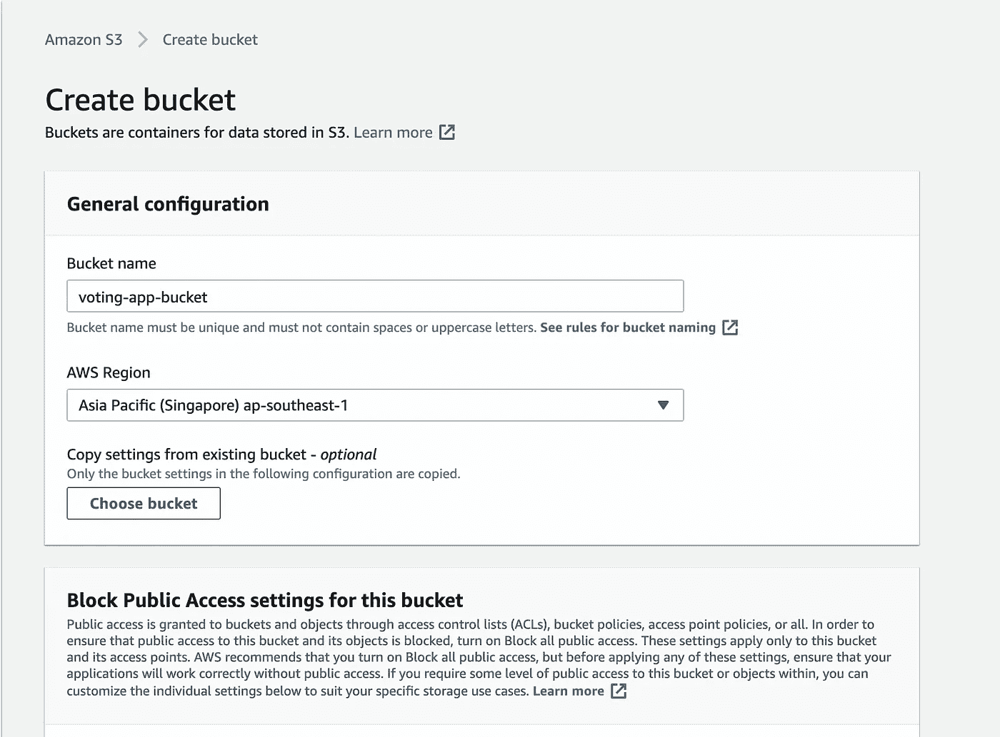

# **第二步。创建一个 AWS Kinesis 数据流**

在你的 AWS 管理控制台中，前往 [Amazon Kinesis](https://aws.amazon.com/kinesis/) ，并进入数据流选项卡。然后点击“创建数据流”

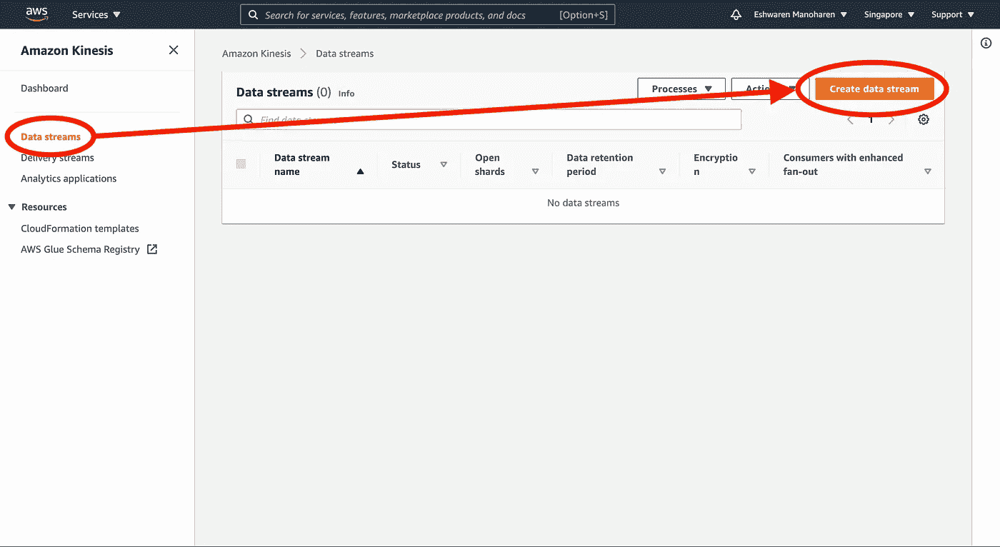

接下来，输入您的流的名称。我们要用`voting-app`。您可以在这里写任何东西，这个名称将在后面的 Node.js 应用程序中使用。在“数据流容量”下，您可以在“打开碎片数”下输入 1在同一个页面上，你会看到 Shard estimator，以防你想计算你需要多少个 Shard。你可以随时编辑这个数字，所以我们现在用 1。

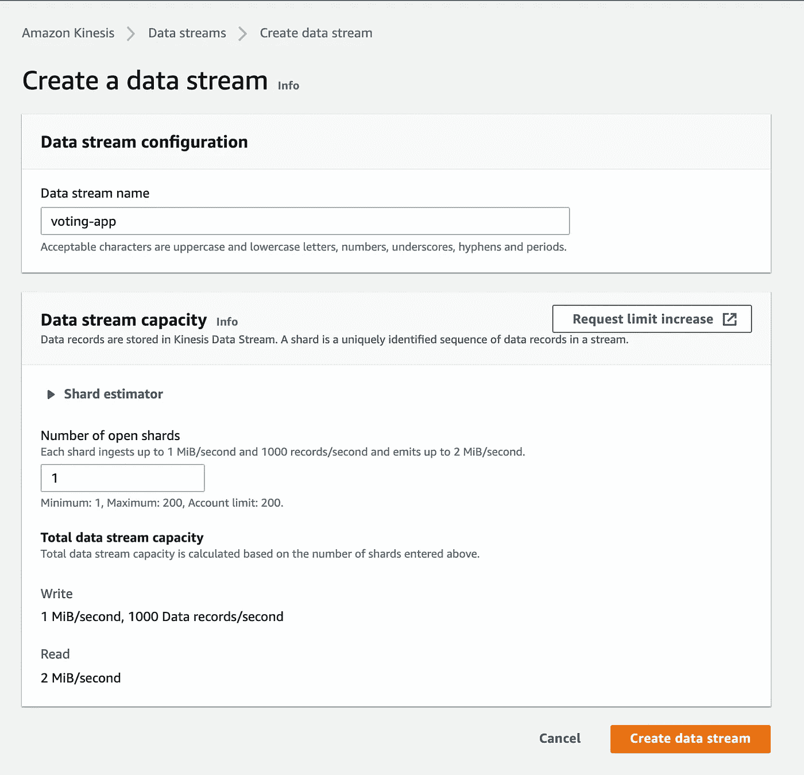

数据流创建完成后，点击“处理交付流”

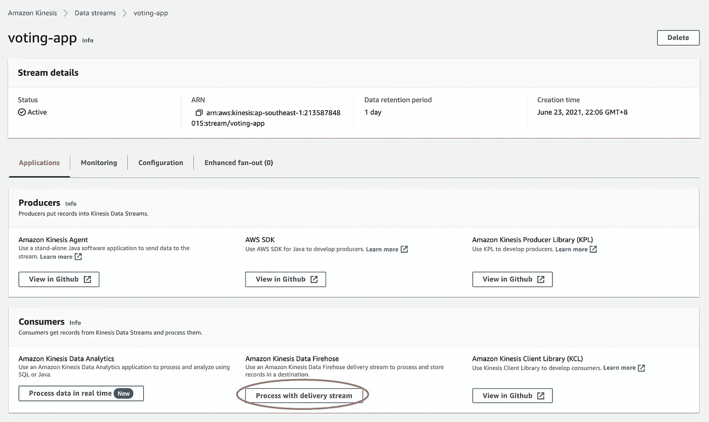

# 第三步。创建 AWS 数据消防水带交付流

在下一个屏幕(New delivery system)中，添加一个交付流名称，并选择我们之前创建的数据流。交付流将允许我们(简单地说)从数据流中提取数据，并将其存储在 S3。添加完这两个字段后，单击下一步。

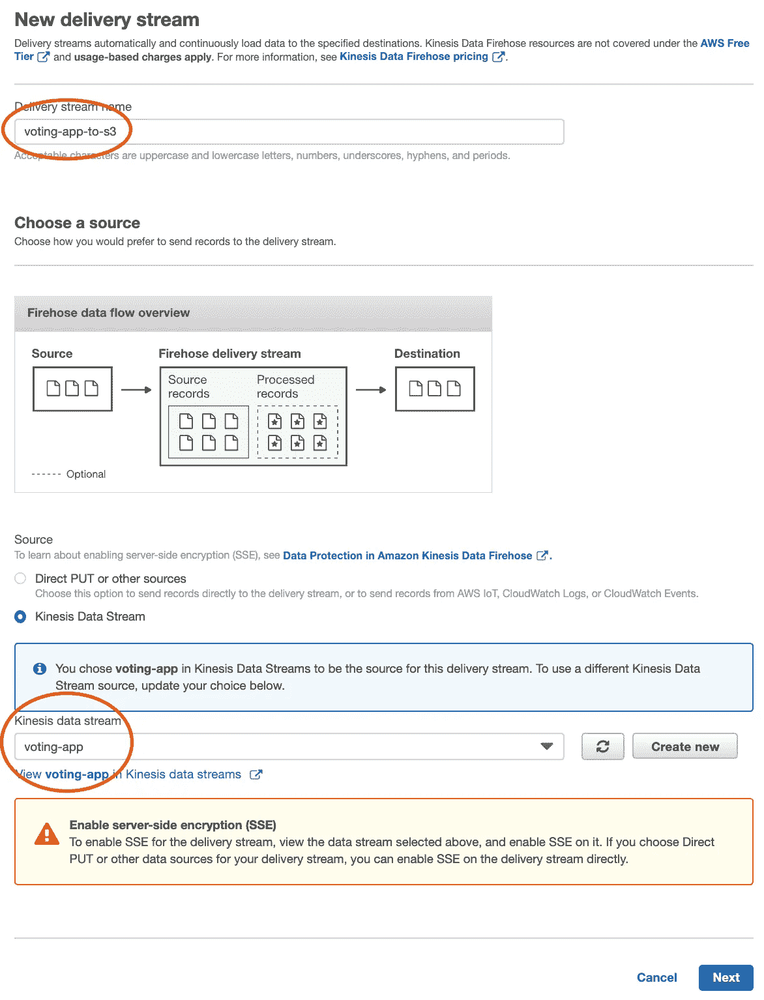

在下一页上，为“转换记录格式”选择 Enabled，并在 Output format 下选择 Apache Parquet。众所周知，Apache Parquet 的查询效率比 JSON 高。

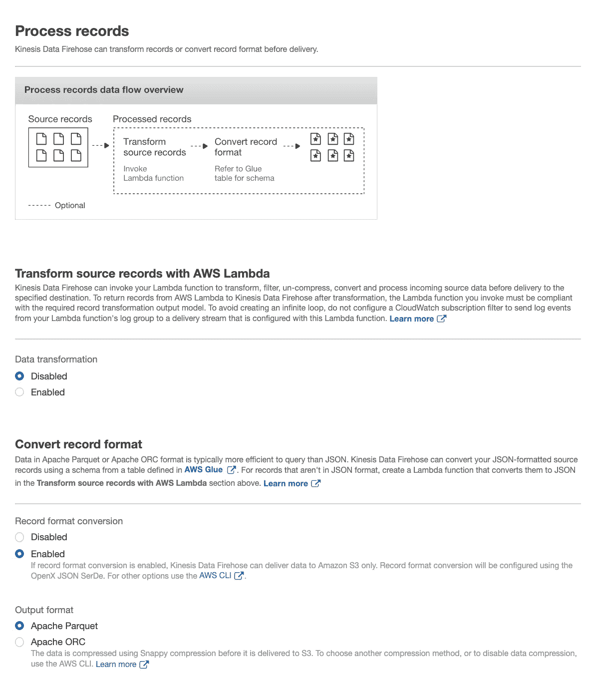

为了将我们的 JSON 数据转换成 Parquet，我们将使用 AWS Glue。我们将在下一步中这样做。现在点击“在 AWS Glue 中手动创建一个新表格”这将打开一个新标签。

**不要关闭当前标签页。**

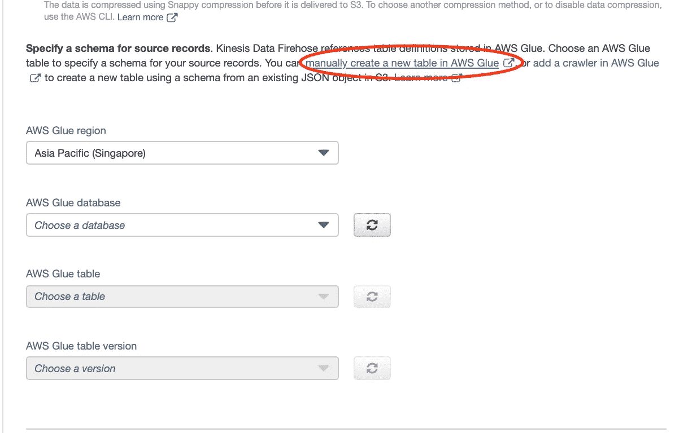

# 第四步。创建 AWS 粘合表和数据库

在新打开的选项卡中，我们将创建一个表和一个数据库。输入一个表名，然后单击添加数据库。在弹出模式中，输入数据库名称。然后选择那个数据库。单击下一步继续。

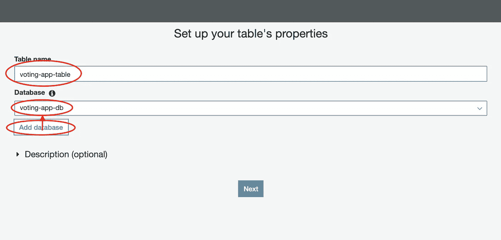

在下一页，确保选择 S3，然后选择我们在步骤 1 中创建的桶。你可以点击右边的小文件夹图标来选择你的 S3 桶。单击下一步继续。


选择下一页的拼花地板。单击下一步。


在这个页面上，我们为我们的数据添加模式。让我们假设每条记录的数据如下例所示:

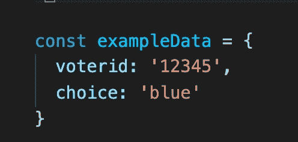

所以我们有两列，都是字符串。单击“添加列”来添加我们的两个列。

一旦我们添加了这两列，我们应该会看到类似这样的内容:


单击下一步继续。**跳过添加分区索引**。

下一页是我们表格的摘要—单击 Finish。

现在回到我们之前的选项卡。单击 refresh 按钮，选择我们刚刚在上面创建的 Glue 数据库和 Glue 表。单击下一步继续。

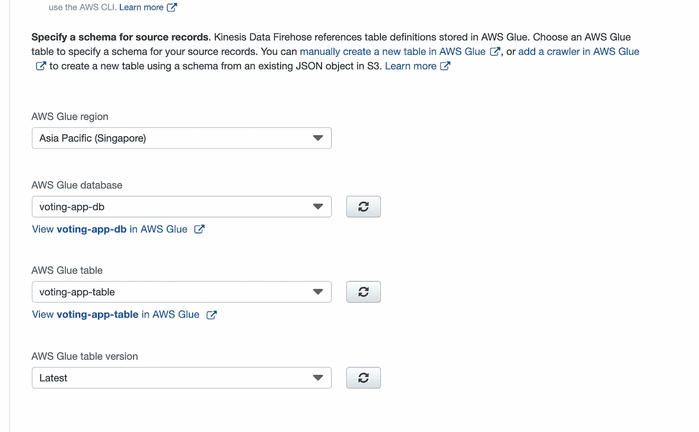

在下一页，选择我们之前创建的同一个 S3 存储区，然后单击 next 继续。

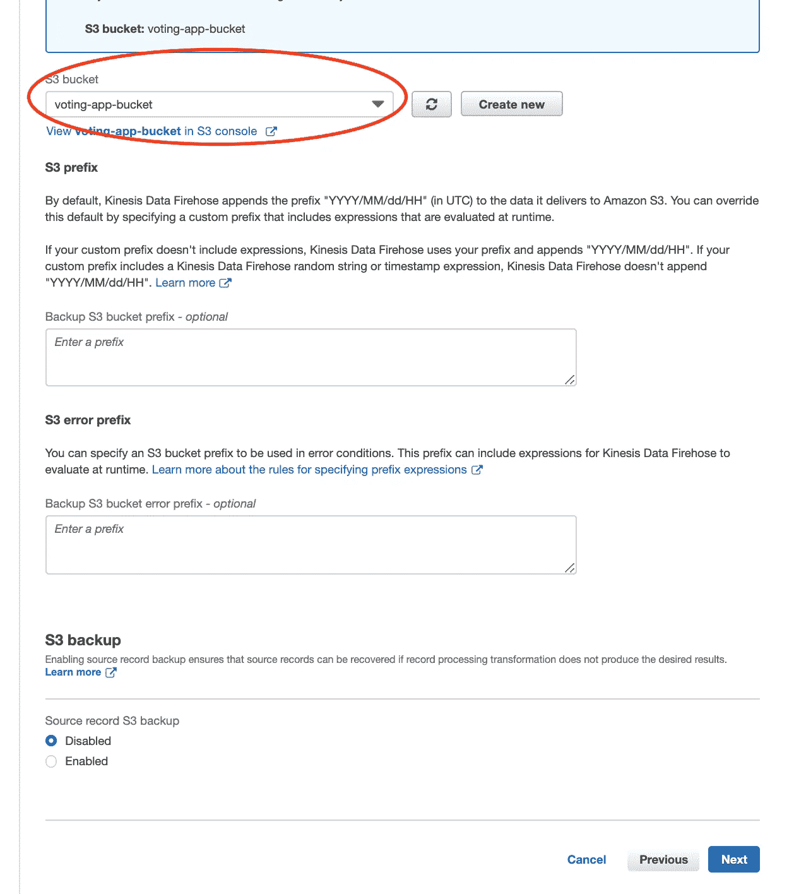

在下一页，我们将确定缓冲区大小和缓冲区间隔。一旦满足这些条件中的任何一个，就会触发记录传送。我选择 128MB 的缓冲区大小和 60 秒的缓冲区间隔。单击下一步继续。在下一个摘要页面上，单击“创建交付流”

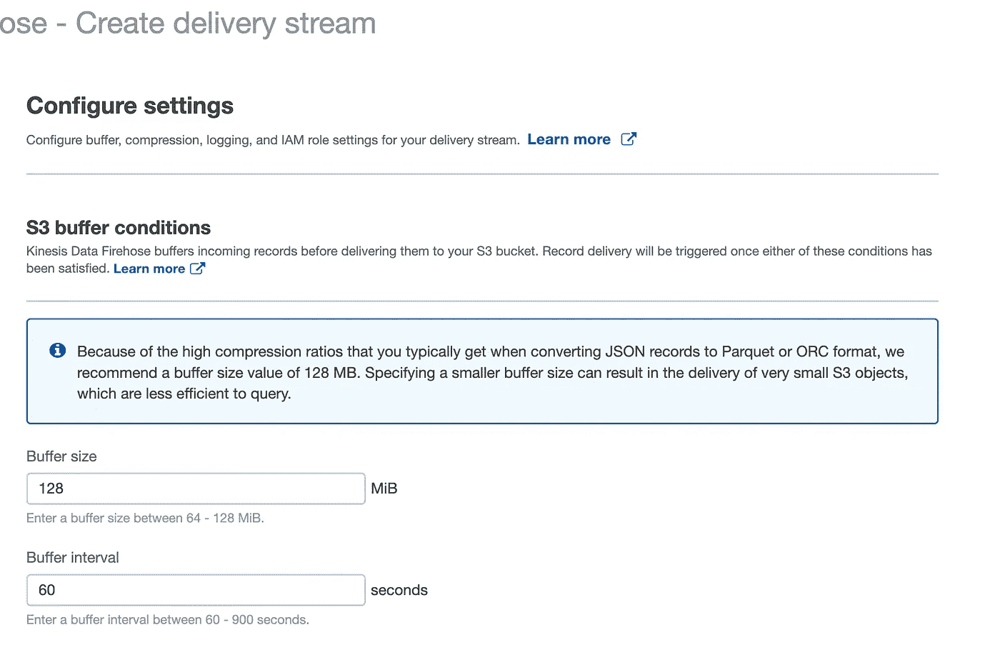

你将来到这个页面，这意味着你已经成功地创建了你的交付流。


# 第五步。为 AWS SDK 创建 AWS 凭据

接下来，我们必须创建用户凭证，以便在 Node.js 应用程序中运行 AWS SDK。在管理控制台中，转到 IAM。

创建一个具有编程访问权限的用户，并为 Kinesis、S3 和雅典娜附加策略。

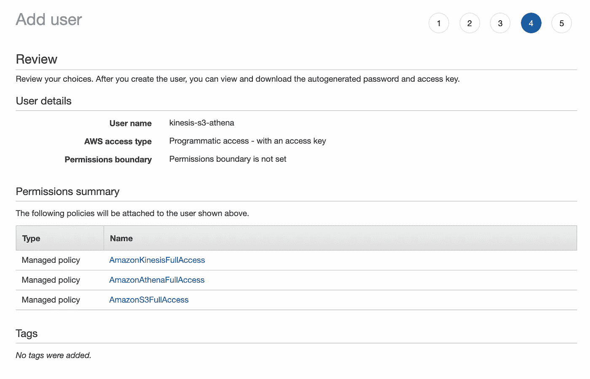

保存该用户并确保保留凭据。

# 第六步。向 AWS Kinesis 数据流发送数据

让我们假设您有一个 Node.js 应用程序。例如，您可能有一个带有 POST route 的 Express 应用程序，它接收要发送到流的数据。

要向我们的 Kinesis 数据流添加数据，我们必须首先安装 AWS SDK。您可以使用以下方法为您的应用程序实现这一点:

```
npm install aws-sdk
```

[](https://github.com/aws/aws-sdk-js) [## aws/aws-sdk-js

### 浏览器和 Node.js 中的 AWS SDK for JavaScript。通过在…上创建帐户，为 aws/aws-sdk-js 开发做出贡献

github.com](https://github.com/aws/aws-sdk-js) 

在我们的应用程序中，我们只需要创建一个新的 Kinesis 实例并调用`putRecord`方法。下面是 Node.js 中向数据流添加数据的一个简单示例。

您可以多次运行上面的代码(无论您喜欢哪种方式)。我建议使用`setInterval`并向流发送一堆测试数据。

如果您已经成功地将数据发送到流，您将会看到如下所示的日志:

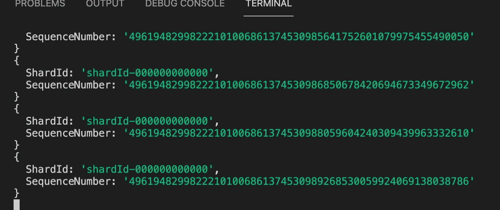

**等待几分钟。**

您可以检查数据是否已经发送到您的 S3 存储桶。您将看到一个以当前年份为名称的文件夹。继续点击文件夹，您会看到一个`.parquet`文件。

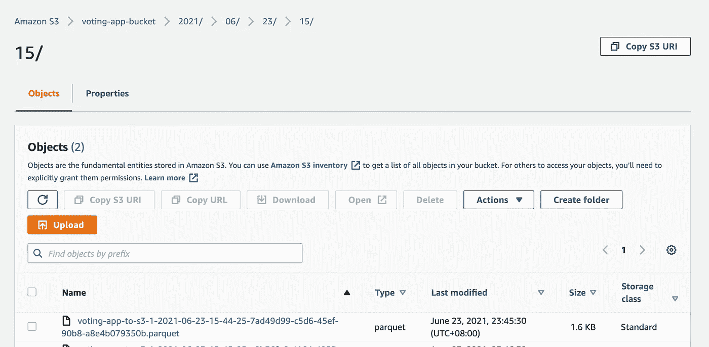

如果您想下载并检查这个文件，您可以使用 VS 代码扩展。

[](https://marketplace.visualstudio.com/items?itemName=dvirtz.parquet-viewer) [## 拼花地板-查看器- Visual Studio 市场

### 将 Apache Parquet 文件视为 JSON。当打开一个拼花文件时，文件的 JSON 表示将打开…

marketplace.visualstudio.com](https://marketplace.visualstudio.com/items?itemName=dvirtz.parquet-viewer) 

# 第七步。使用 AWS Athena 查询数据

现在我们已经发送了一些测试数据，我们可以使用 AWS Athena 查询这些数据。但是在此之前，我们必须创建另一个 S3 存储桶来存储 Athena 的结果。前往您的管理控制台，并前往 AWS S3。创建一个名为`voting-app-result`的存储桶。


前往您的管理控制台并访问 AWS Athena。

我们要做的第一件事是设置查询结果位置。单击 Settings 并添加我们在上面创建的 bucket 作为结果位置。单击保存并退出设置。

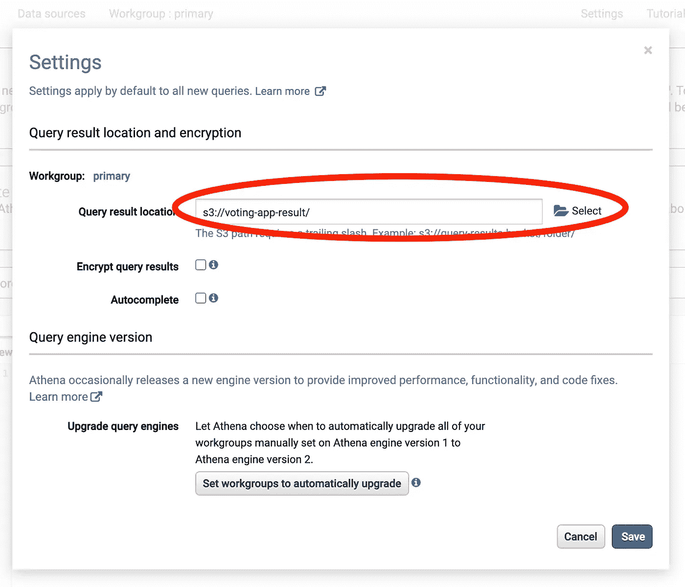

接下来，确保数据库设置为我们之前创建的数据库。


现在我们准备好查询我们的数据。在“表格”下，单击表格名称旁边的三个垂直点图标，然后单击“预览结果”

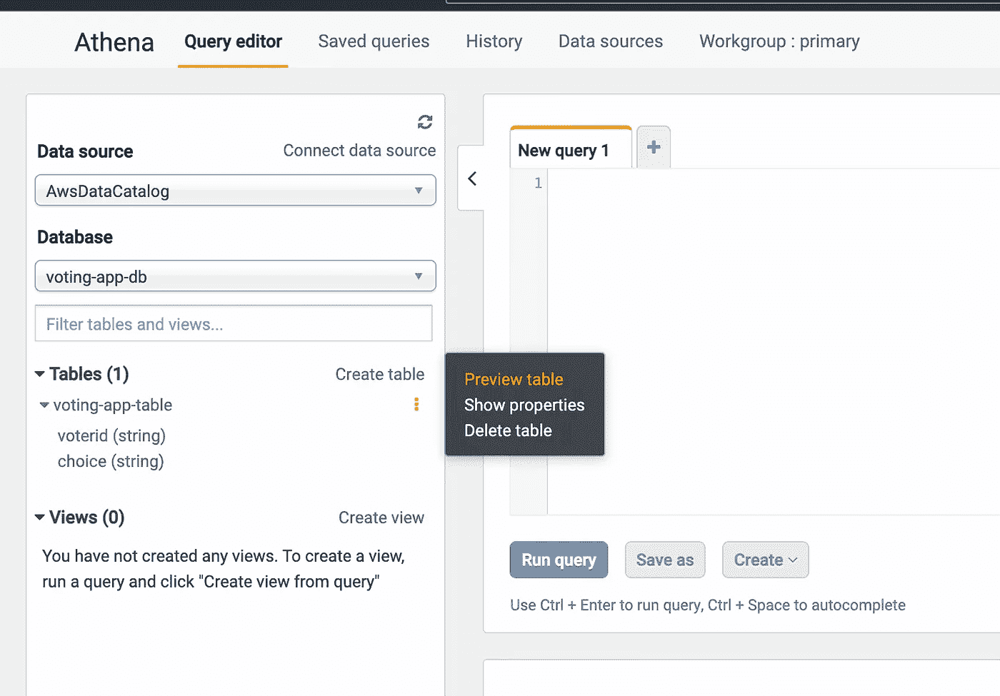

您将在编辑器中看到 SQL 查询，数据将在底部加载。

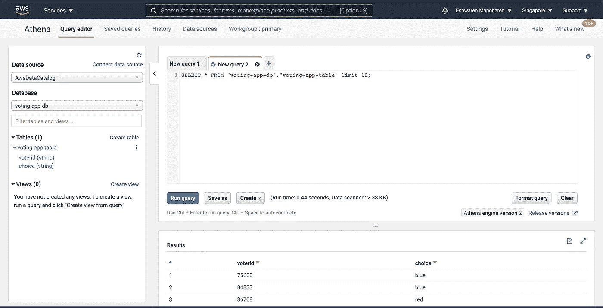

让我们试着统计一下每个`choice`我们得到了多少票。我们可以使用下面的查询来获得这些数据:

```
SELECT choice, count(choice) AS count
FROM "voting-app-db"."voting-app-table"
GROUP BY choice
```


# 第八步。用 Node.js 查询 Athena

接下来，我们将使用 Node.js 进行类似的查询。通常，您可以通过 GET route 或在后台进程中实现这一点。

下面是一些示例代码。我们使用 Lodash 和 Async 库来构建一些助手函数。此代码已根据以下源代码进行了修改:

[](https://www.npmjs.com/package/lodash) [## 洛达什

### Lodash 模块化实用程序。

www.npmjs.com](https://www.npmjs.com/package/lodash) [](https://www.npmjs.com/package/async) [## 异步ˌ非同步(asynchronous)

### 异步代码的高阶函数和常见模式

www.npmjs.com](https://www.npmjs.com/package/async) 

基于:[https://docs . AWS . Amazon . com/code-samples/latest/catalog/JavaScript-Athena-index . js . html](https://docs.aws.amazon.com/code-samples/latest/catalog/javascript-athena-index.js.html)

您将在控制台日志中看到您的数据。


# 仅此而已！我们完了。

享受数据带来的乐趣。如果您想了解 AWS 数据架构的其他部分，请留下您的评论。