# matplotlib 和 Seaborn 中方便的数据可视化功能可加速您的 EDA

> 原文：<https://betterprogramming.pub/handy-data-visualization-functions-in-matplotlib-seaborn-to-speed-up-your-eda-241ba0a9c47d>

## 这些功能让你不用浪费时间去做普通的格式化和设置

照片由[布雷克·惠勒](https://unsplash.com/@blakesox?utm_source=unsplash&utm_medium=referral&utm_content=creditCopyText)在 [Unsplash](https://unsplash.com/search/photos/houses?utm_source=unsplash&utm_medium=referral&utm_content=creditCopyText) 拍摄

当我看到一个新的数据集并想在确定模型策略之前做一些 EDA(探索性数据分析)时，我发现自己正在经历一个相当可预测的例程。随着时间的推移，我开始依赖一些方便的功能，这些功能让我不用浪费时间去做`matplotlib.pyplot`需要的普通格式化和设置。我想我应该将这些内容传递给数据科学社区，以防对其他人有所帮助。这些代码块对应于 Jupyter 笔记本中的单元格，但不一定与那个环境绑定。

您可以在这个 [GitHub 资源库](https://github.com/manukalia/handy_data_viz_functions)的 Jupyter 笔记本中找到所有这些代码。

为了便于演示，我将从获取一个可通过 Sklearn 获得的数据集开始，即加利福尼亚房价数据集。这恰好是一个适合回归类型问题的数据集，但是我下面描述的图形函数同样适用于类别和面向分类的练习，无论是原样还是稍加修改。如果使用绘图功能，当然应该使用已经设置好的数据框架，忽略这个特定的数据集。

一、基本进口:

图 1 …基本进口

接下来，获取演示数据集并将其粘贴到熊猫数据帧中。在这个关于加州房价的 Sklearn 数据集中有 20648 个观察值。八个特性列位于`dataset.data`结构中。

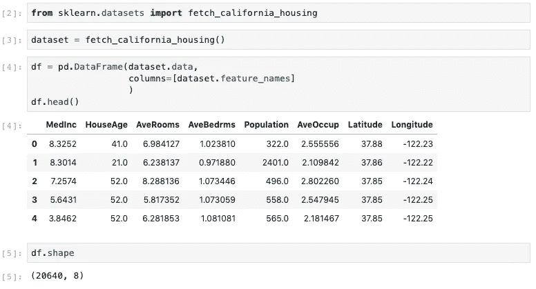

图 2 …获取数据集

最后，创建位于`dataset.target`结构中的目标列`price`(价格为$000，000)。它恰好被放在一个多级列索引中，所以我需要将它展平到一个级别，如下所示。为了确保万无一失，我还验证了没有空值。

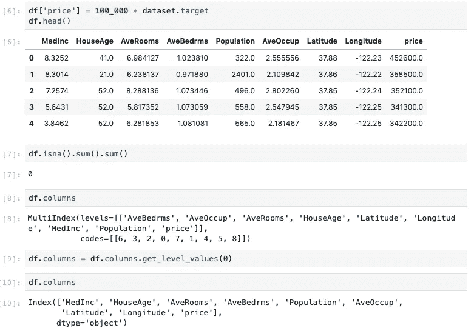

图 3 …创建一个目标变量列

这个数据集中没有任何非数字列，但是经常会有大量的数据清理、二进制化、检查数据类型等工作要做。但这不是这篇文章的重点，所以让我们假设这些都已经完成了。

现在我们准备做一些情节！让我们先快速看一下皮尔逊相关系数。在热图上可视化是完成这项任务的一种很好的方式，我讨厌看普通关联热图中多余的一半，所以让我们也用一个白色的上三角形遮住一半。下面是定义的代码，随后是带有适当参数的函数调用，以将热图图像标记并保存为 JPEG 文件:

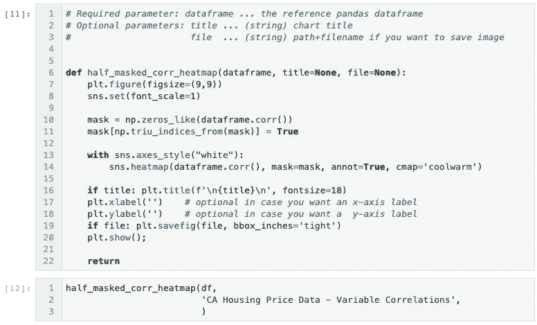

图 4 …半屏蔽关联热图函数和函数调用

图 5 …半屏蔽关联热图输出

正如你所看到的，图像右上方的三角形被遮住了。它只是所显示的左下半部分的镜像。我选择了色彩图`coolwarm`,它有一个很好的相反的光谱，代表两个相反的极端，中间有一个中性色。请注意，每个皮尔逊相关系数都有注释，可以很容易地关闭，Seaborn font-scale 设置为`1`，这是最小的字体设置。

我经常希望看到潜在特征与特定目标变量之间的相关性，因此需要 Seaborn 热图的变体。

图 6 …与目标变量的相关性—函数和函数调用

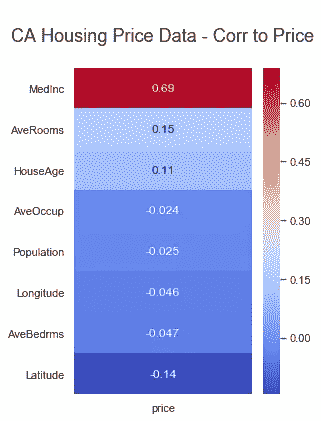

图 7……与目标变量的相关性——输出

看起来可能有一些值得探索的关联。有什么明显的线性关系出现吗？典型的下一步是快速调查每个潜在特征变量与目标的散点图。所以我用下面的函数。注意，在第 22 行，我为散点图的点指定了一个七种颜色的序列。对于功能列表中的每个子情节，该函数在颜色列表中连续循环。随意用你喜欢的颜色，想用多少就用多少。

对于这个特定的 CA 房价数据集，我创建了输入参数`feature_cols`，它由数据帧*中除目标变量`price`之外的所有列组成。当调用该函数时，我将输出图像保存到一个. jpg 文件中，并且我指定了三个子图，因为该数据集中有八个要素。尝试看看你更喜欢哪一个。该函数默认为图中每行一个子图。*

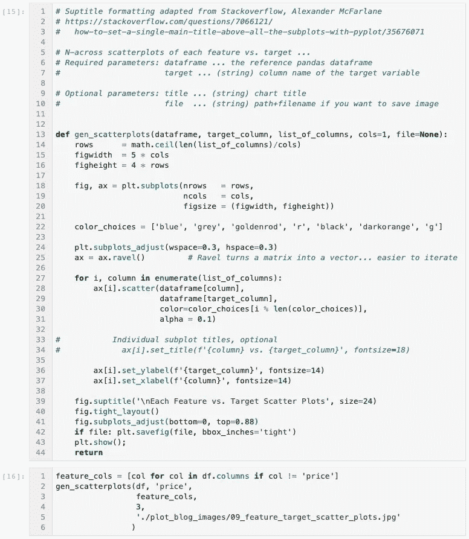

图 8 …生成所有特征与目标散点图生成函数和调用

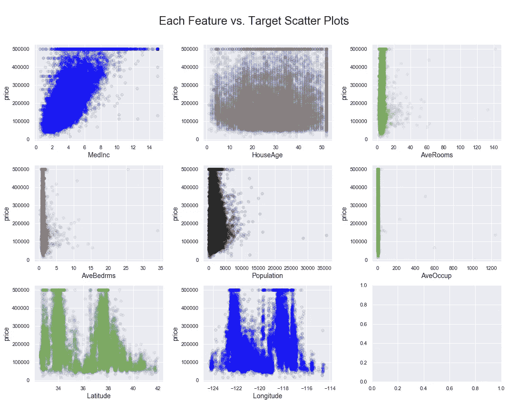

图 9 …特征与目标散点图输出

但是变量观测值是什么样的呢？事物看起来是正态分布的吗？只有 statsmodels 常规测试才能给你一个明确的答案，但目视检查总是一个好主意。进入`generate histograms` 功能:

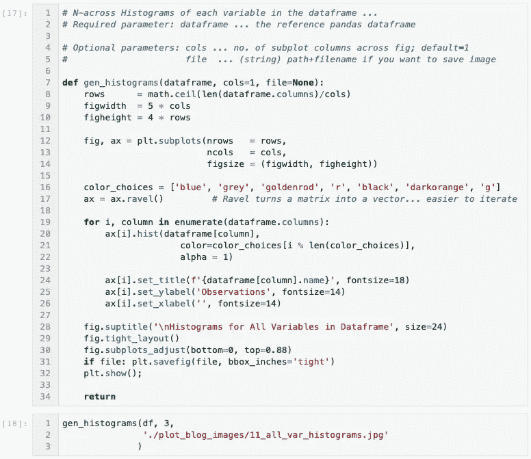

图 10 …所有变量直方图生成函数

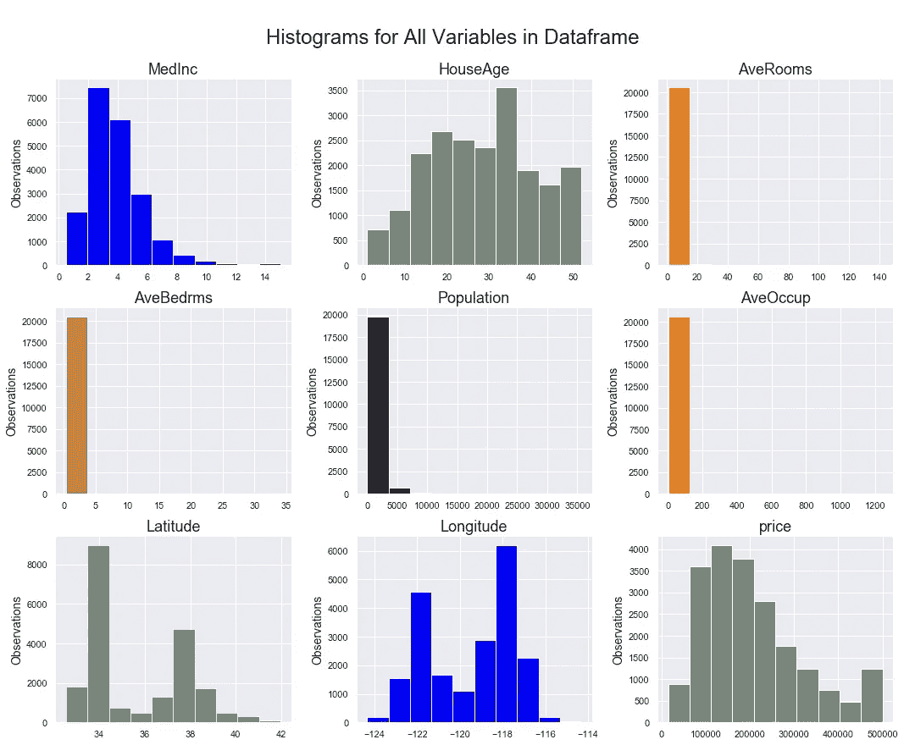

图 11 …所有变量直方图输出

但是每个变量的传播呢？离群值？别担心，有一个`boxplots`函数可以解决这个问题！

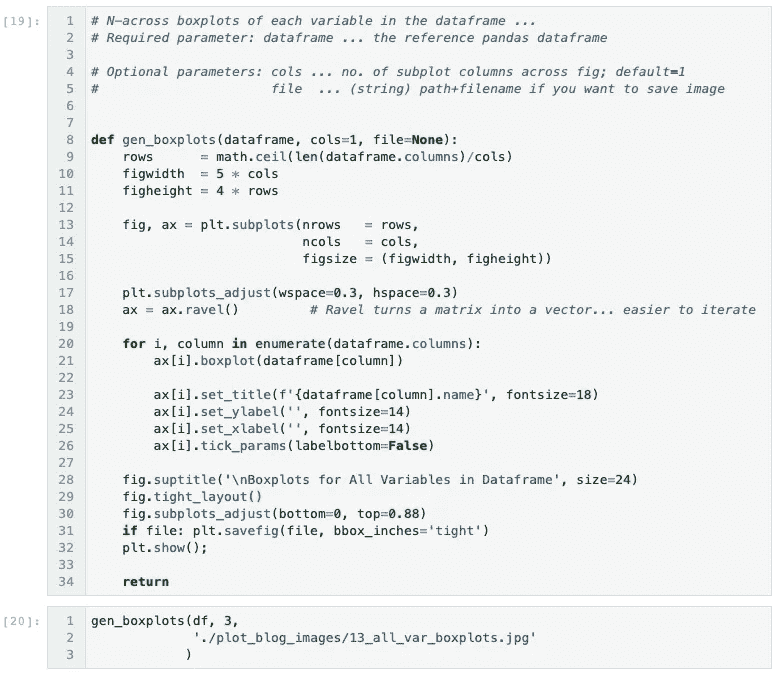

图 12 …所有变量箱线图生成器函数

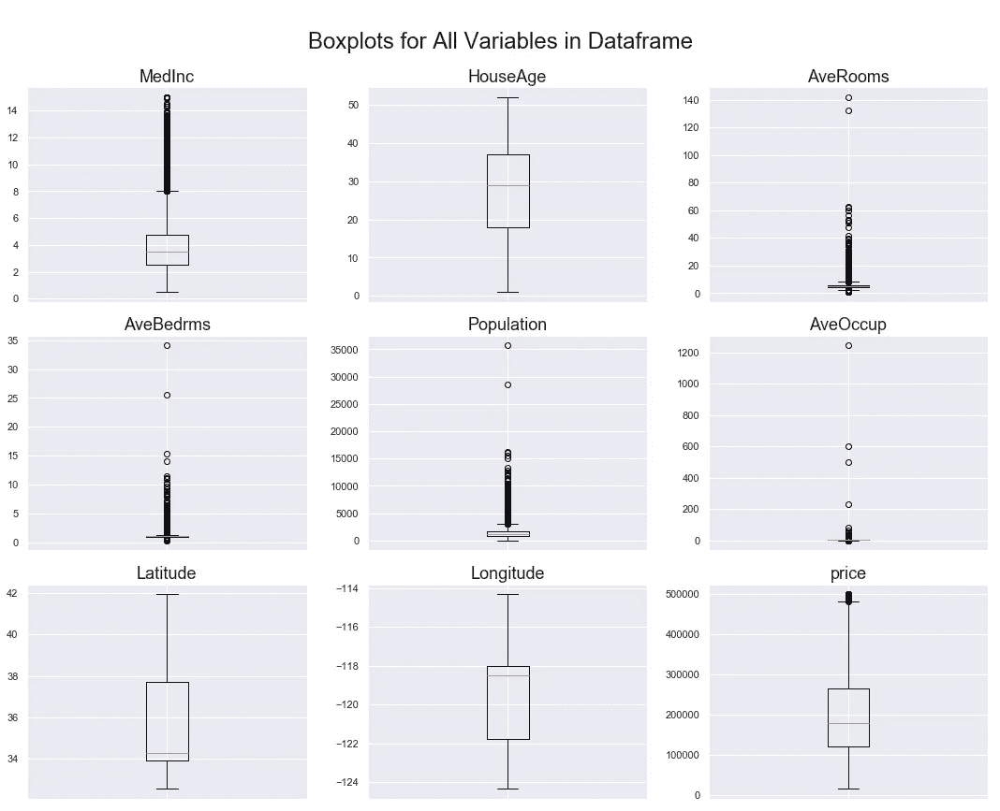

图 13 …所有变量箱线图输出

我将在这里包括的最后一对函数更适合于可能是时间序列(日期-时间)索引的数据集。我将把这些折线图函数应用于我们当前的 CA 房价数据集，而不是为了演示而导入或创建一个全新的数据集。想象一下，索引是一个日期时间范围，而不仅仅是整数。

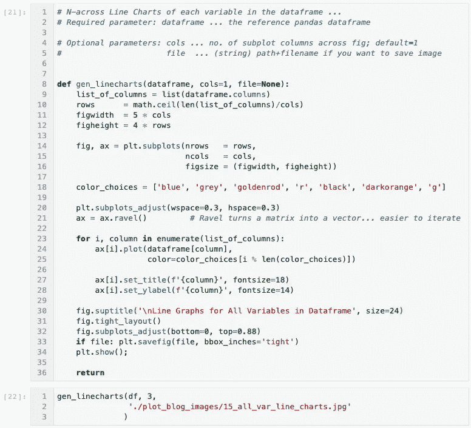

图 14 …所有变量折线图生成器函数

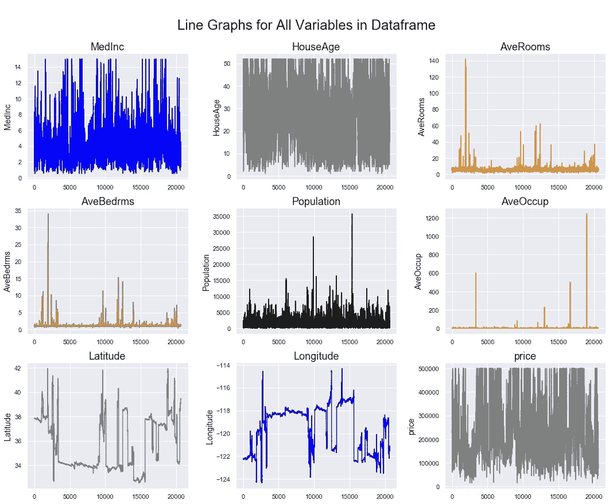

图 15 …所有变量折线图输出

根据您拥有的数据量和时间尺度的粒度，您可以在上面看到，趋势可能会消失在大量的可视化数据中。推进目视检查/ EDA 的一种方法是对折线图应用滚动平均值。在下面的函数中，用户将滚动平均值中的周期数指定为输入参数之一。在本例中，我选择了 150 个周期作为输入，使图表更加清晰。您可以想象，如果这是一个由 30 个月的每小时观察值组成的数据集，一个方便的一周滚动平均值将是 168 个周期，因此这个示例与我过去采用的方法非常接近。

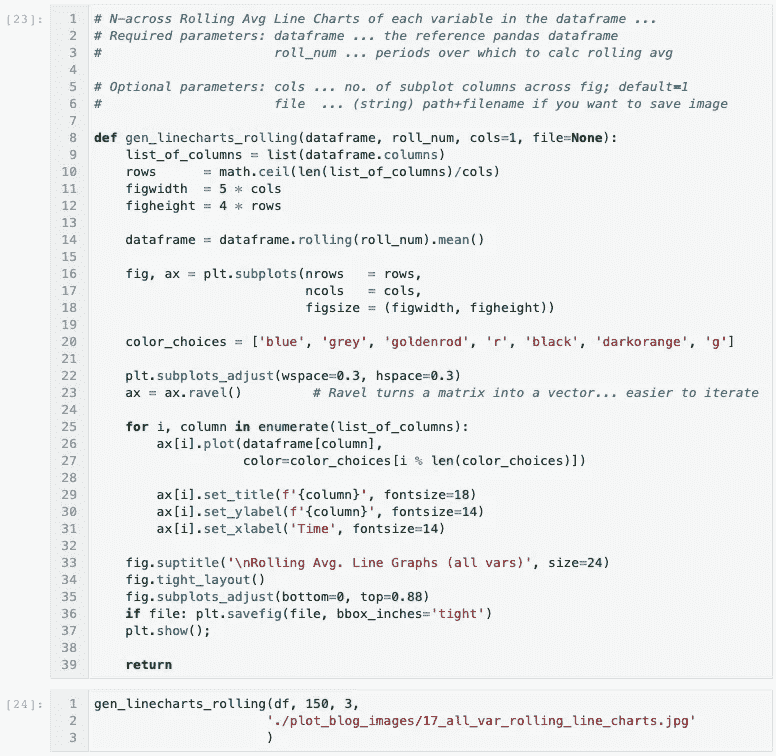

图 16 …所有变量滚动平均值。折线图功能

图 17 …所有变量滚动平均折线图输出

如您所见，matplotlib 确实提供了对可视化格式的良好控制，但人们可能会在格式化命令上花费太多时间，而在数据科学上花费的时间不够。我希望这些函数是有用的快捷方式，可以作为您自己定制函数的基础。我将这些函数作为 python 代码留在 Jupyter 笔记本单元格中，而不是创建一个新的类对象，因为我认为它们的效用在于它们的快速可定制性，而不是它们对于每种可能的数据可视化场景的健壮性。快乐的爱丁！