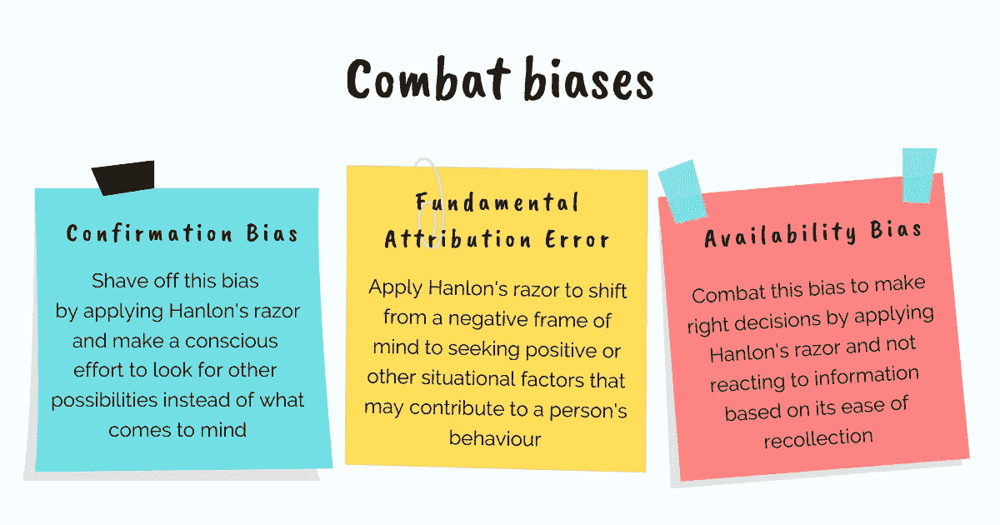
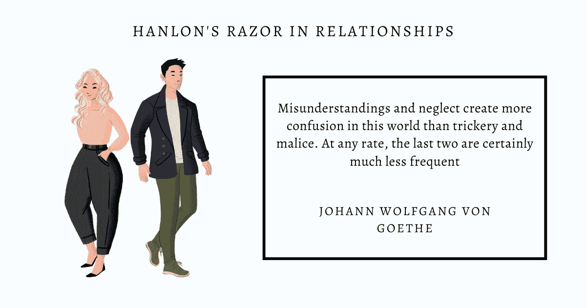

# 汉伦剃刀:如何减少评判，建立更好的关系

> 原文：<https://betterprogramming.pub/hanlons-razor-d43a2fc5f5b4>

## 主动的、交流的关系对每个人都更好

图片来源:作者

我们人类渴望一个完美有序的世界，尽管事情按预期发展的可能性相当小。当不止一个人参与到这个等式中时，可预测性会进一步恶化。

当事情不如预期时，我们该怎么办？我们的头脑不是好奇并试图从这种情况中学习，而是假设最坏的可能性。根据我们如何看待事件的展开，我们在头脑中产生一种解释并创造出符合我们信念的故事。

作为一个物种，我们也非常独特地将两个完全不相关的故事联系起来，并在不存在的事件中寻找模式。我们倾向于解释与我们相关的每一个事件，这造成了对现实的扭曲。当事情不顺利时，它让我们假设负面的意图，即使结果可能与我们完全无关。

你的老板取消你的一对一会议可能会被理解为他们阻止你成长的邪恶意图。一个更合理的解释可能是，他们在最后一刻被召集参加了一个紧急会议。另一名员工拒绝提供帮助，可以被认为是他们逃避知识分享的恶劣态度。另一个可能的解释是他们现在太忙了，没时间帮忙。

超越我们的个人叙事，从另一个人的角度想象情况，并在每一个行为中摆脱中心地位，采取更中性的语气，这需要在评估这种情况时利用汉隆剃刀作为心理模型。

汉隆剃刀的原理是罗伯特·j·汉隆发明的。它指出:

永远不要把可以用愚蠢来充分解释的事情归咎于恶意

随着时间的推移，我开发了自己版本的 Hanlon 剃刀，我发现它与我的工作和生活更加相关:

*“永远不要把可以用无知、无能、疏忽、误解、懒惰或其他可能的原因充分解释的不良意图归咎于他人。”*

将汉伦剃刀作为一个心理模型，可以让我们更好地沟通，并通过表现出理解另一个人及其行为的意图来建立更好的关系，而不是生活在我们的假设中。

# 如果我们不使用汉伦剃刀会发生什么

另一个人出于恶意的潜在假设会关闭所有可能的交流。消极陷阱会阻止我们向他人伸出援手。它会让我们远离他人，避免交流和合作，并忽略可能对我们有益的机会。

人类的独特之处在于，在他们的头脑中，负面经历的情感负担比正面结果要持久得多。这种心态也会导致过度思考，这对我们的健康和整体福祉是有害的。

如果不在适当的时候使用我们工具箱中的汉伦剃刀，我们可能会因为关注错误的事情而浪费时间和精力。

《汉隆剃刀》让人们的思维发生了转变，从在戏剧《三角关系》中扮演迫害者的角色，将过错归咎于他人，转变为花点时间，退后一步，思考其他可能性。

# 用汉伦剃刀对抗认知偏见

图片来源:作者

我们的认知偏见决定了我们如何感知周围的世界，以及我们如何行动、做出决定和做出判断。

通过生活在基于我们如何从自己的角度看待事物的主观现实中，我们可能会提供不合逻辑的论点，做出不准确的判断，并做出非理性的决定。

汉伦剃刀是克服这些偏见的有力工具。

## 基本归因错误又称对应偏差

基本归因错误是在解释其他人的行为时过分强调个性而低估情境因素的倾向。它也被描述为“人们的所作所为反映了他们是谁。”

因为我们通过他人的行为来判断他人，所以当他人的行为不符合我们的预期、不符合我们期望的结果或者不符合我们的是非观时，这种偏见就会显现出来。

在这种情况下，人们的自然倾向是把他们的行为归因于他们的个性，而不去考虑其他可能影响他们行为的因素。

你可能会很快判断你的同事没有参加你的聚会，因为他们嫉妒你的晋升，而没有意识到他们被个人紧急事件耽搁了。你可能会认为不邀请你参加重要会议的老板麻木不仁、冷漠无情，却不知道会议出于其他原因要求限制观众。

在这样的时刻使用汉伦剃刀可以帮助我们从消极的心态转变到寻找积极的或其他可能的原因，这些原因可能有助于这种行为。

## 确认偏差

确认偏见是所有人类中最深刻的偏见，在这种偏见中，我们寻求证实我们信念的证据，并驳斥所有与信念相矛盾的数据和论点。

对正确的渴望粉碎了寻找客观真理的意图。当面对挑战我们个人叙事的信息时，我们努力寻找方法拒绝与我们的信念相矛盾的证据，我们寻找强化我们观点的信息。

如果你认为你的老板有偏见，你会寻找证据来合理化你的观点，丢弃任何与你的信念不一致的数据。

汉伦剃刀是一个伟大的原则，可以通过有意识地努力寻找其他可能性和扩展你的思维来消除这种偏见。

## 可用性偏差

可用性偏差是一种启发式方法，根据我们能回忆起的信息，我们应用思维捷径将一个事件与我们过去的经历联系起来。我们形成观点，评估选择，甚至根据我们最近的经历来做决定。

自然地，这种偏见使我们依赖于我们容易获得的信息，似乎忽略了其他难以记住或难以回忆的事实或数据点。

在绩效评估周期中，人们倾向于通过回忆脑海中浮现的数据点，根据他们最近的互动来提供反馈。这种反馈偏向于最近发生的事情，而不是某人不久前做的事情。

最近错过的交付截止日期将比所有其他按时完成的成功交付更有分量。

抵制工作中的这种偏见对于做出正确的决定至关重要，因为不要根据容易回忆的信息做出反应。

通过应用汉伦剃刀，可以进一步探索由可用性偏差产生的消极心态，以采用更好的思维实践。

# 工作中的汉隆剃刀

图片来源:作者

心智模型为我们提供了一个强大的框架，通过简化复杂性来扩展我们的思维，帮助我们形成新的联系来塑造我们的理解和寻求新的机会。

在工作中应用心智模型非常有用，因为它们能让我们扩大自己的能力范围，做出更好的决定。

工作中有多种情况会导致愤怒和沮丧。如果处理不好，它们会成为压力、焦虑和其他相关健康问题的来源。这就是像汉隆剃刀这样的心理模型来拯救我们的地方。

通过在工作中应用汉伦剃刀，我们可以在愤怒和沮丧的时刻抓住自己，并质疑我们的感觉是否合理。当你怀疑某人有不法行为时，问这些有力的问题:

*   为什么我会有这种感觉？
*   我有什么数据来证明对方的行为是出于不良意图？
*   还有其他他们这样做的例子吗？
*   我跟他们说过这件事吗？
*   我不正确的概率是多少？
*   我当时会不会有偏见？
*   还有什么其他可能的原因使他们这样做？

> “一个叫做汉伦剃刀的智慧建议我们‘永远不要把可以用愚蠢来充分解释的事情归因于恶意’对此，我要补充一个更笨拙但更准确的推论:“永远不要把在复杂的互动系统中遵循激励的适度理性的个人所能解释的事情归因于恶意或愚蠢。”人们在没有中央协调的情况下，按照自己的最大利益行事，仍然可以创造出在某些人看来是阴谋或无知瘟疫的明显证据。”—道格拉斯·W·哈伯德，《风险管理的失败》

当你被拒绝晋升，另一个同事不同意你的建议，一个团队成员拒绝提供帮助，或者另一个团队没有按时完成他们的工作，影响了你的交付时间表或项目范围的变化，你可以选择简单的路线:指责他人，并将他们标记为难相处的人。

但是如果你应用汉隆剃刀，问这些问题会怎么样呢？你可能会把自己从精神痛苦中拯救出来，而是带着理解的好奇心和让事情变得更好的愿望来处理问题。

# 人际关系中的汉隆剃刀

图片来源:作者

伤害最深的人是我们最信任的人。

当你的朋友无视你的电话，不回电话，你的配偶在你的生日聚会上迟到，或者你的孩子拒绝合作，你可能会觉得被自己的人冤枉了。

人们可能会很容易假设他们并没有把你的最佳利益放在心上，正如他们的行动所表明的那样(基本归因错误)，你周围的数据验证了你的假设(确认偏差)，这可能不是他们第一次这样做(可用性偏差)。

在这些时刻，运用汉伦剃刀可以让你从假设坏意图转移到探索其他的、可供选择的观点。当你带着理解而不是责备的愿望接近对方时，这可能会加强你们的关系。

敞开心扉去寻求其他的观点会让你的视角从消极的心态转变为积极的心态，从停止交流转变为积极参与，从责备他人转变为共同寻找解决方案。

# 如何决定何时使用汉龙剃须刀

汉隆剃刀与另一个心理模型奥卡姆剃刀相似，奥卡姆剃刀认为“问题最简单的解决方案通常是正确的。”两者都是启发性的，剔除假设，支持简单性。

这些剃刀并不总是适用的，在采用它们并使它们成为你思维实践的一部分之前，理解它们的局限性是很重要的。

汉隆剃刀虽然有用，但不适用于有恶意的人。虽然很少，但有些人确实有伤害他人的欲望。

在开始的时候，很难将一些看起来不好但纯粹是情境性的事情与那些意图伤害、破坏或造成损害的事情区分开来。

保持警惕需要通过提出以下问题来仔细评估形势:

*   这个人是什么来历？他们以前这样做过吗？
*   他们伤害你的动机是什么？
*   与试图更好地了解情况相反，假设负面意图并关闭它们的成本是什么？
*   如果你从汉隆剃刀开始，然后如果你找到相反的证据，改变你的观点，会出什么问题呢？

汉隆剃刀是一个非常强大的心智模型，可以应用于我们第一本能是消极的每一种情况。假设不良意图会阻止我们建立更好的关系，分享我们的观点，并实现机会。考虑无知、无能、疏忽、误解、懒惰或其他可能的原因可以使我们学习、成功和成长。

如何看待采用汉隆剃刀作为思维练习？

图片来源:作者