# 2021 年我的 Haskell VS 代码设置

> 原文：<https://betterprogramming.pub/haskell-vs-code-setup-in-2021-6267cc991551>

## 使用调试、自动完成和其他 Haskell 特性来启动您的 IDE


只是一个随机的哈斯克尔迷因(来源:[https://habr.com/en/post/441350/](https://habr.com/en/post/441350/)

最近开始学习 Haskell。在涉猎一门新语言时，你要做的第一件事就是开发环境配置。我喜欢 VS 代码，主要从事这方面的工作。因此，在我的学习过程中，我毫不怀疑我将使用哪个编辑器。

我做的第一件事是快速搜索 Medium 上的文章，这将帮助我配置编辑器。Matthew Doig 的用 VS 代码设置 Haskell 是一个很好的起点，但是有点过时了。因此，我决定写一些类似的东西，但有更多的最新信息。

另一点我想预先说明一下，我用的是 macOS，所以键盘快捷键和其他东西都是在 MAC OS 上测试的。它在您的笔记本电脑或个人电脑上可能会有所不同。

所以，主要问题是默认情况下 VS 代码没有显示出支持 Haskell 的迹象。然而，只要遵循几个简单的步骤，这个问题就很容易解决。

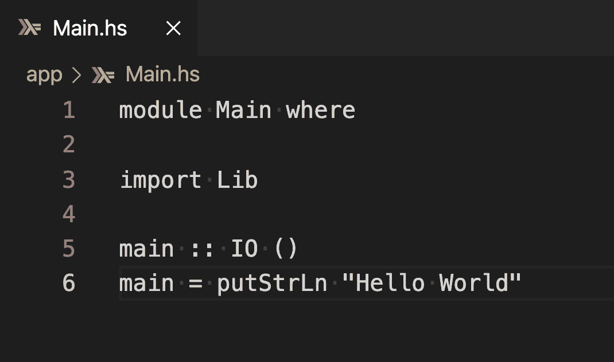

初出茅庐的 Haskeller 首先看到的是缺乏语法突出

好吧，那我们就从这里开始吧。

# 步骤 0。让你自己 VS 代码

转到 [VS 代码主页](https://code.visualstudio.com/)并为您选择的操作系统下载安装程序。

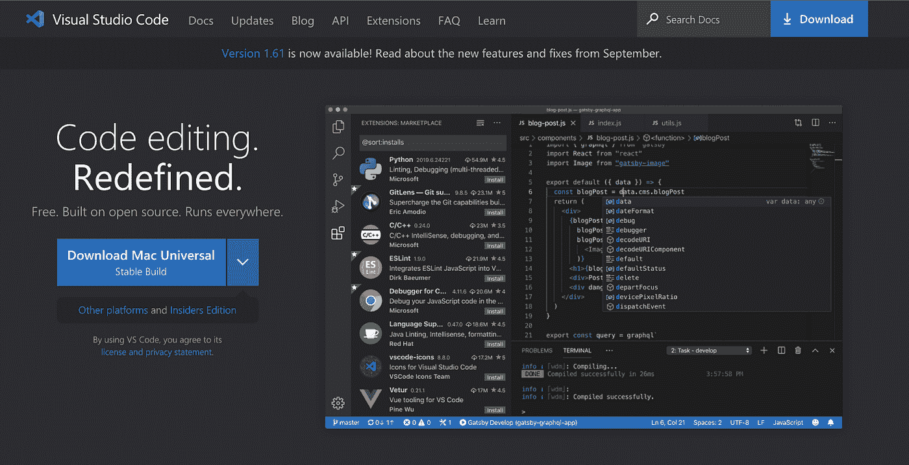

是的，就像这样简单

从现在开始，我假设您已经安装了 VS 代码，所以让我们继续实际配置它:)

# 第一步。GHCUp It

> [GHCup](https://www.haskell.org/ghcup/) 是通用语言 [Haskell](https://www.haskell.org/) 的安装程序。

GHCup 是安装启动 Haskell 之旅所需的一切的最简单方法:编译器、打包和分发系统等等。听起来很棒，我们应该试试吗？毫无疑问。

在 VS 代码内部或者作为独立程序打开终端，并在其中运行以下命令:

```
$ curl --proto '=https' --tlsv1.2 -sSf https://get-ghcup.haskell.org | sh
```


只要按下回车键

该程序将询问您是否想要将所有需要的内容添加到您的`.zshrc`或其他 shell 配置文件中。我更喜欢附加选项，尽管您可以自由选择:


之后，GHCup 会提出安装 [Haskell 语言服务器](https://haskell-language-server.readthedocs.io/en/latest/)和[栈](https://docs.haskellstack.org/en/stable/README/)。这两个以后肯定会派上用场，所以答案是**“是”**:

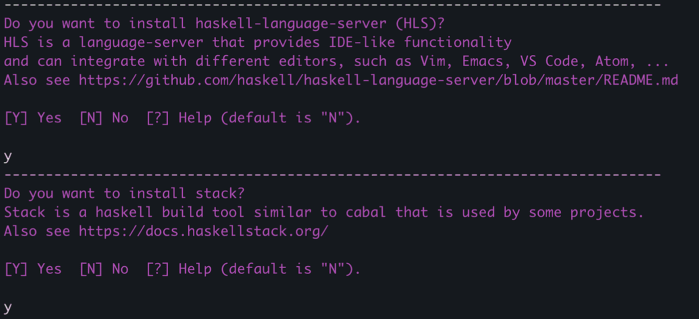

一旦我们选择了我们需要的所有选项，安装过程应该开始:


按下**进入**继续，等待整个过程完成。只是一个建议:给自己拿杯茶，因为这可能需要一段时间。

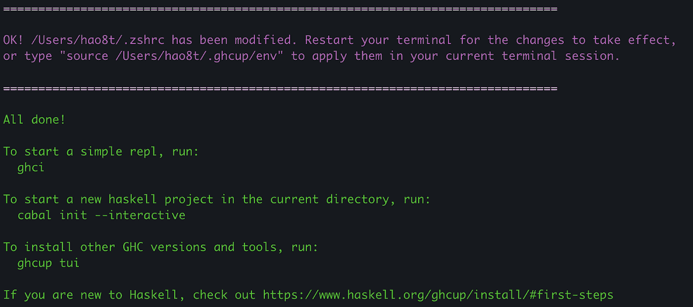

太好了，我们都准备好了。现在让我们配置我们的 VS 代码。我们需要为此创建一个新项目。对于这个目标，我更喜欢使用**堆栈**。因此，打开终端窗口并键入以下命令:

```
$ stack new vscode-haskell-config
$ cd vscode-haskell-config
$ stack setup
```

# 第二步。语法突出显示

我们想从文本编辑器或 IDE 中得到的第一件东西是彩色代码。通过安装专用的扩展，很容易实现这一点:


此外，可能需要重新加载编辑器，所以要注意。安装完成后，你一开始看到的`app/Main.hs` 应该是这样的，这取决于你的配色方案:

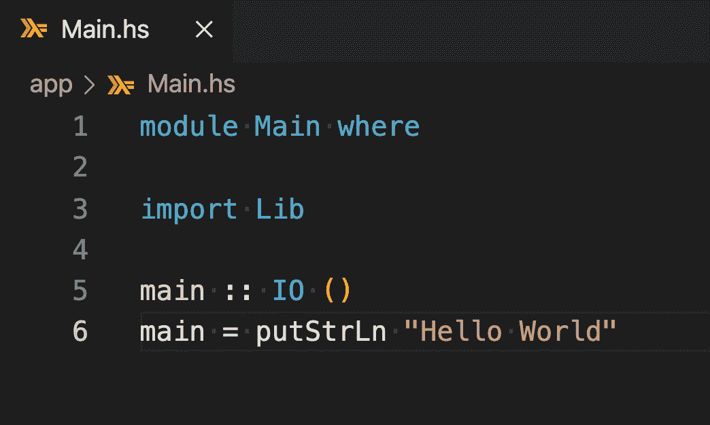

啊，现在好多了

这无疑是一个进步，但离 IDE 的功能还差得很远。在上一节中，我们已经添加了 **Haskell 语言服务器(HLS)** ，在 VS 代码中启用它的功能会很好。

# 第三步。泵与代码上升

配置 **HLS** 的过程真的很复杂，除了它不是。你需要遵循两个简单的步骤来实现它:

̶̶̶1̶̶̶.̶̶̶̶̶̶i̶̶̶n̶̶̶s̶̶̶t̶̶̶a̶̶̶l̶̶̶l̶̶̶̶̶̶h̶̶̶a̶̶̶s̶̶̶k̶̶̶e̶̶̶l̶̶̶l̶̶̶̶̶̶s̶̶̶y̶̶̶n̶̶̶t̶̶̶a̶̶̶x̶̶̶̶̶̶h̶̶̶i̶̶̶g̶̶̶h̶̶̶l̶̶̶i̶̶̶g̶̶̶h̶̶̶t̶̶̶i̶̶̶n̶̶̶g̶̶̶̶̶̶e̶̶̶x̶̶̶t̶̶̶e̶̶̶n̶̶̶s̶̶̶i̶̶̶o̶̶̶n̶̶̶.̶̶̶̶̶̶w̶̶̶a̶̶̶i̶̶̶t̶̶̶̶̶̶a̶̶̶̶̶̶s̶̶̶e̶̶̶c̶̶̶…̶̶̶̶̶̶w̶̶̶e̶̶̶̶̶̶f̶̶̶i̶̶̶n̶̶̶i̶̶̶s̶̶̶h̶̶̶e̶̶̶d̶̶̶̶̶̶i̶̶̶t̶̶̶̶̶̶j̶̶̶u̶̶̶s̶̶̶t̶̶̶̶̶̶a̶̶̶̶̶̶f̶̶̶e̶̶̶w̶̶̶̶̶̶m̶̶̶i̶̶̶n̶̶̶u̶̶̶t̶̶̶e̶̶̶s̶̶̶̶̶̶a̶̶̶g̶̶̶o̶̶̶…̶̶̶̶̶̶c̶̶̶o̶̶̶o̶̶̶l̶̶̶,̶̶̶̶̶̶h̶̶̶u̶̶̶h̶̶̶？̶̶̶̶̶̶t̶̶̶h̶̶̶u̶̶̶s̶̶̶,̶̶̶̶̶̶t̶̶̶h̶̶̶e̶̶̶̶̶̶s̶̶̶i̶̶̶n̶̶̶g̶̶̶l̶̶̶e̶̶̶̶̶̶s̶̶̶t̶̶̶e̶̶̶p̶̶̶̶̶̶l̶̶̶e̶̶̶f̶̶̶t̶̶̶.̶̶̶

1.安装 HLS 支持扩展:


点击**“安装”**按钮，等待编辑器完成剩下的魔术。给你。安装后，我们的目标 IDE 在我们的`app/Main.hs`中显示一条红色曲线:

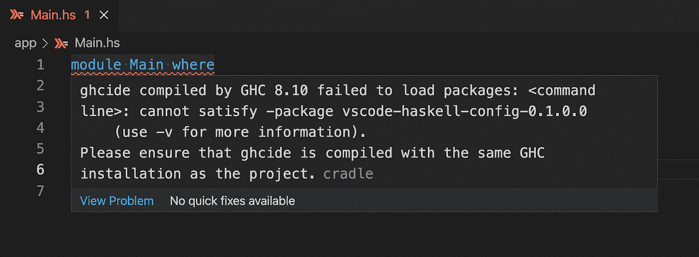

它还活着！

要解决这个问题，我们需要进入终端中的项目目录，并键入以下命令:

```
$ stack clean --full
$ stack build
```

现在一切都应该是彩色的了:

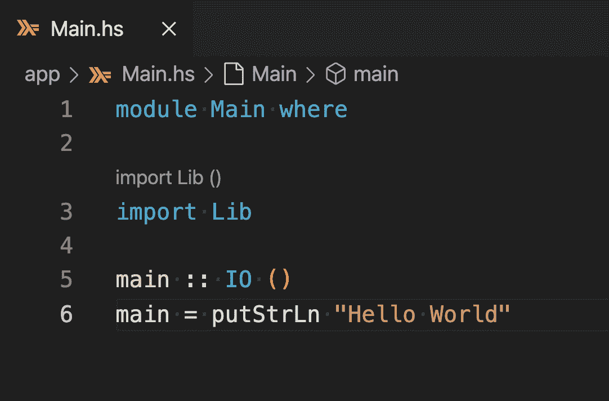

HLS 是一个非常有用的工具。它为我们的 VS 代码(和我们，ofc)提供了:

*   悬停时的类型信息和文档


太棒了，对吧？

*   自动完成

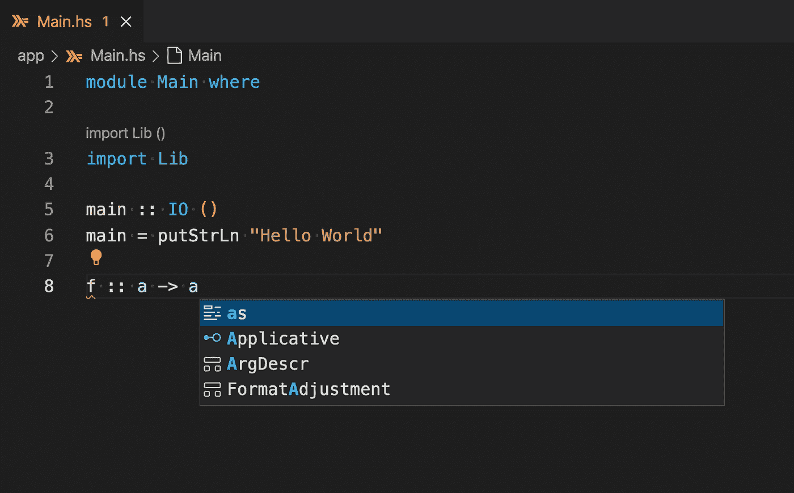

虽然不太理想

*   来自`[hlint](https://github.com/ndmitchell/hlint)`的重构和代码风格建议


免费的熟练同行评审员:)

*   IDE 有望带来的其他便利特性

# 有代码格式化吗？

这是个很好的问题。实际上， **HLS** 为你提供了那些能力，虽然我没有故意告诉你。有几个缺省的格式提供程序叫做**或 moru**。我强烈建议你把它们都尝一尝，选择一个能满足你的需求和口味的。

尽管如此，我个人的偏好是**布列塔尼**。这是我的文章，因此，如果期望在这里看到一些不同的东西，你就不走运了:)

因此，我将展示如何轻松地将格式提供者更改为 **Brittany** 。

为此，在键盘上按下此组合键`Cmd + ,`或点击**代码- >首选项- >设置**:


为方便起见，仅举一个例子

准备好了吗？很好，继续前进。现在在设置的搜索栏中输入 **"Haskell"** ，并找到**"格式提供者"**部分，在那里你会看到**或**被选中:

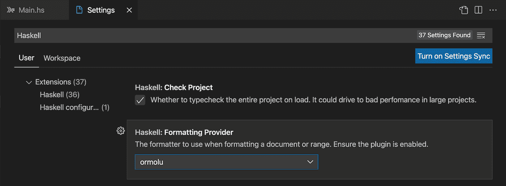

仅为了方便起见，请举例说明(2)

现在，让我们实际上选择一个不同的，这是**布列塔尼**:


一个布列塔尼格式化他们，可以这么说

好吧，如果我们想确保它实际工作，因为我们不相信那些花哨的编辑？首先，我们需要添加一些代码来查看实际的格式化。

让我们打开`./src/Lib.hs`文件，因为我们将在那里放置我们全新的函数。你可以删除文件的全部内容，不用担心。

> 请重新输入有这些不一致的例子，因为我们会自动格式化它。

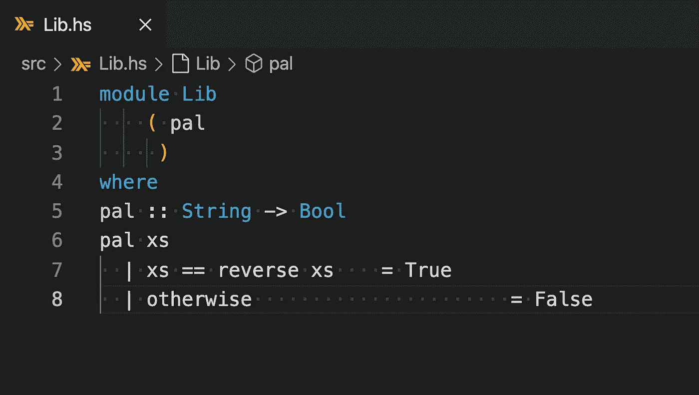

"之前"

等等……我们到底该如何使用格式化程序呢？按下`Opt + Shift + F`，布列塔尼会做重物。

请不要担心，如果你不明白发生了什么，重点是测试自动格式化。好像工作的挺好的:)

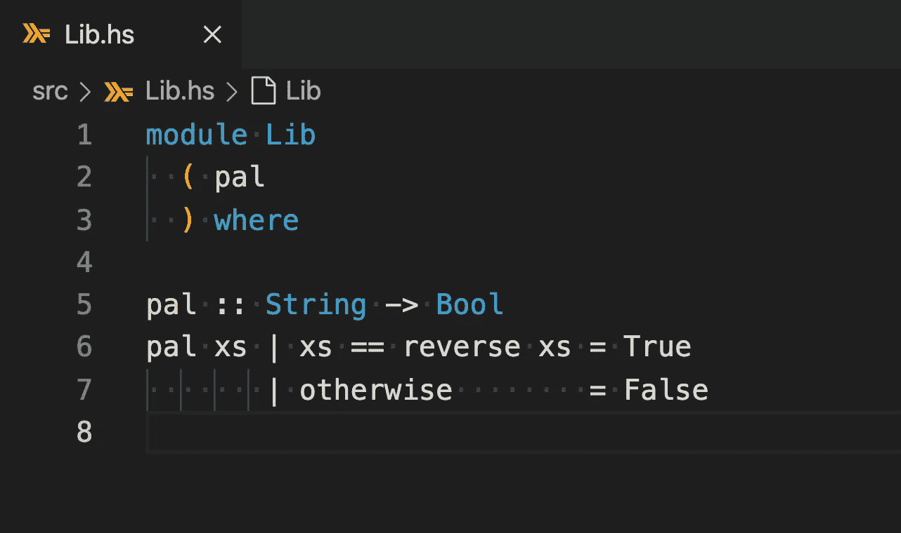

"之后"

# Haskell 代码调试

尽管有这样的想法，如果 Haskell 代码按预期编译，调试功能可能是有用的。遗憾的是， **HLS** 似乎没有带调试器(至少截至 2021 年 11 月。)

幸运的是，这个“弱点”很容易通过安装另一个很酷的扩展来解决。


你刚刚安装它吗？太棒了。我们差不多可以开始调试了。在实际开始之前，我们必须 a)添加测试和 b)配置调试器。

## a)添加测试

如果我们试图在没有任何测试的情况下运行调试器，它会退出并说“测试套件尚未实现”。

这正是我们从跑步中得到的东西

```
$ stack test
```

我们可以在`test/Spec.hs`中观察到这个字符串:


啊，给你

好吧，好吧。似乎我们只需要实现一些测试。听起来很合理。

为此，我们将使用 [QuckCheck](https://hackage.haskell.org/package/QuickCheck) 。这是一个很棒的库，允许我们做一些基于属性的测试。我们将只为`pal`函数编写一个测试，因为我们需要测试调试器，而不是编写一个合适的测试套件。

首先，让我们将`QuickCheck`添加到我们的项目中。转到`package.yaml`，在`tests`部分找到`dependencies`小节。随意添加库作为依赖项:

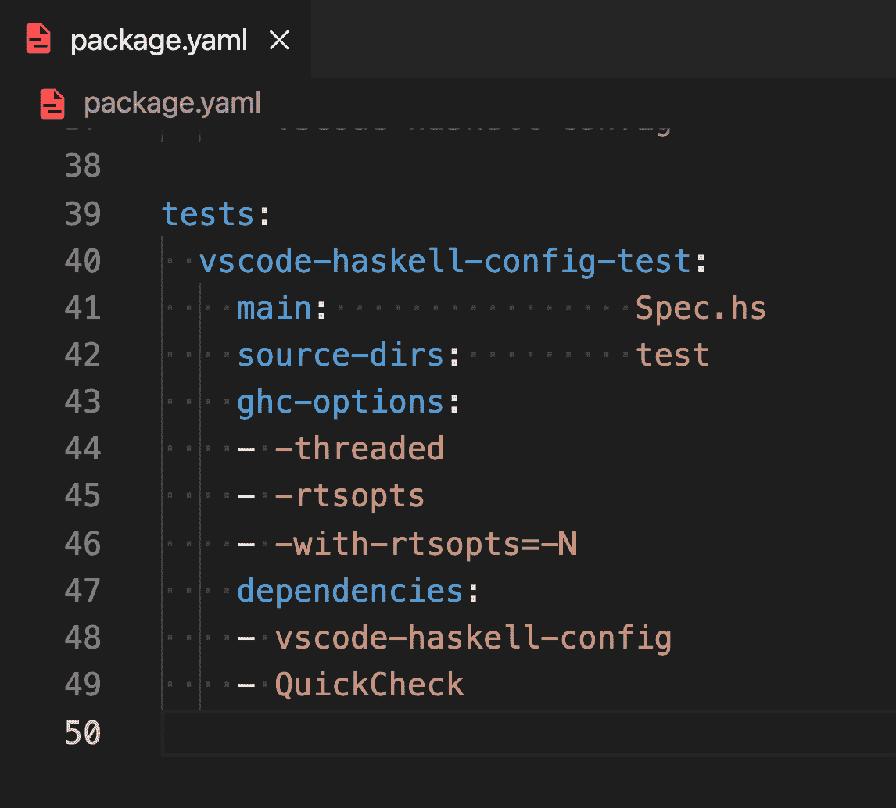

见第 49 行，补充？package.yaml 现在看起来更大了

无聊的部分几乎结束了，我们即将进入基于属性的测试的可怕世界。请再次打开`./test/Spec.hs`文件。开始时需要决定的重要事情是:要测试什么？因为我们没有太多的选项，只需导入`pal`:)

```
import Lib (pal)
```

下一步是添加另一个导入，这次是 QuickCheck。在这之后，你的`Spec.hs`有以下内容:

```
import Test.QuickCheck
import Lib (pal)
```

让我们编写我们的第一个属性测试。我们将它命名为`prop_reverseInvariant`，它检查应用于反向回文的`pal`函数是否也应该返回`True`。

```
import Test.QuickCheck
import Lib (pal)prop_reverseInvariant :: String -> Bool
prop_reverseInvariant text = pal text == pal (reverse text)
```

用**布列塔尼**格式化后，文件内容如下:

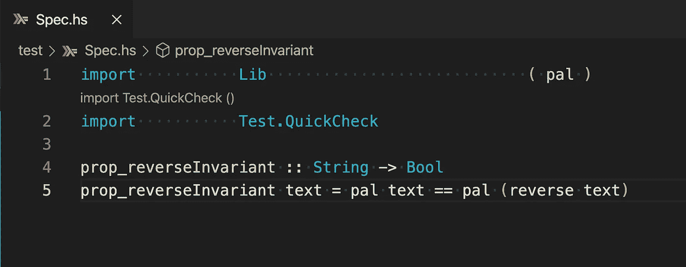

不是咩咩…一点也不差

**注。**您可能遇到过以下问题:

```
Warning: Installation path /Users/<username>/.local/bin not found on the PATH environment variable.
```

要解决这个问题，您需要做的就是将它添加到您的`.zshrc`或其他 shell 配置文件中:

```
export PATH=$PATH:~/.local/bin
```

## b)配置调试器

在 VS 代码中选择**“运行和调试”**侧边栏按钮:


播放按钮上有个小窃听器的那个

下一步是什么？我们需要首先创建一个`launch.json`文件，以便配置与“IDE 应该如何运行我们的调试器”相关的所有内容为此，请单击“创建一个 launch . JSON’文件。在下拉菜单中选择`haskell-debug-adapter`:


恭喜，带有各自配置的`.vscode`目录被创建在项目的根目录下。但是…我们感兴趣的是实际运行调试器，而不是做那些无聊的事情。请耐心等待:)

在`test/Spec.hs`文件中添加几行:

```
main :: IO ()
main = do
  quickCheck prop_reverseInvariant
```

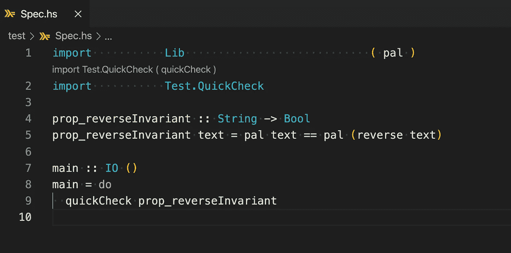

Spec.hs 现在看起来足够接近这个了

在第 9 行插入一个断点，用`haskell(stack)` 选项运行调试器。确保它实际上停止了执行，因为这是重点:)

# 拥有一个配置好的 IDE 的 Haskell 之旅

当我们谈论为 Haskell 设置 VS 代码时，这就是大部分了。现在，您已经拥有了所有的语法突出显示和 IDE 功能，以及调试代码的工具。

开发中可能还有其他有用的东西，比如 [ghcid](https://github.com/ndmitchell/ghcid) 。尽管它与 VS 代码没有关系，因此，您可以自己随意探索这些工具:)

你还在等什么？享受学习 Haskell 的乐趣吧！:)

**UPD。**我在 LinkedIn 和 Reddit 上收到了一些反馈，我认为这些反馈相当有用，但我不想邀功。

你可能会在`[r/haskell](https://www.reddit.com/r/haskell/comments/r4j1y8/haskell_vs_code_setup_in_2021/)` 线程上发现一些有趣的评论。看看这个。

我想补充的另一点是由[Ramon Soto mathie sen](https://www.linkedin.com/in/ramonsotomathiesen/)(非常感谢)在 LinkedIn 上概述的，关于`-with-rtsopts=-N -qg` GHC 国旗。这个[粘贴](https://paste.tomsmeding.com/vSQYan1j)可能会让你更清楚为什么你可能需要添加那个。