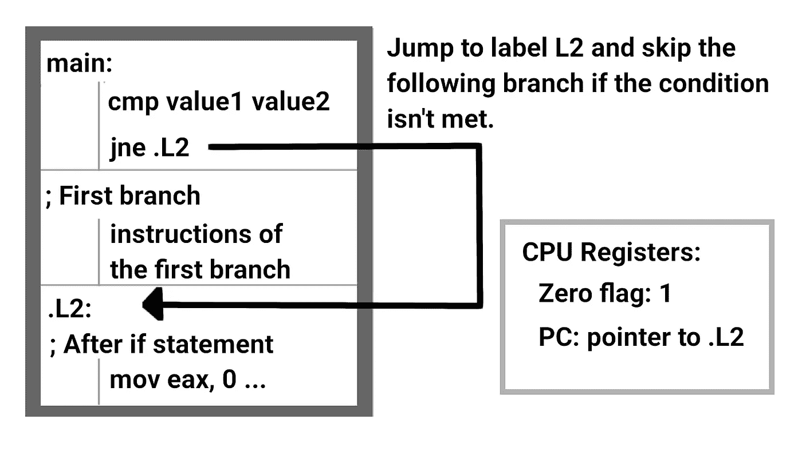
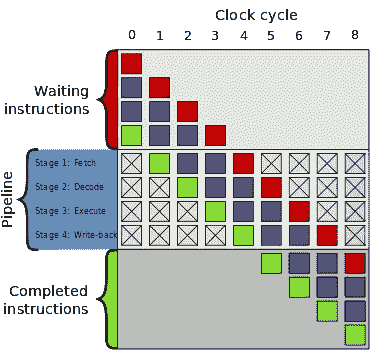

# 下面是 CPU 处理 If 语句和分支的方式

> 原文：<https://betterprogramming.pub/heres-how-the-cpu-handles-if-statements-and-branching-95cfd42af9c>

## 了解不喜欢陈述的原因以及它们实际上是如何工作的。剧透:他们没那么糟糕


照片由 [Unsplash](https://unsplash.com?utm_source=medium&utm_medium=referral) 上的 [Onur Binay](https://unsplash.com/@onurbinay?utm_source=medium&utm_medium=referral) 拍摄

最近，在软件开发社区中，似乎有一场反对 if 语句和[分支](https://en.wikipedia.org/wiki/Branch_(computer_science))编程的圣战正在进行。分支在于通过切换到另一个指令序列来改变程序的控制流。我们都熟悉的最简单的例子是 if 语句的使用:

Python 中的 If 语句示例

现在，分支和 if 语句是编程的主要部分，并且从那时起就存在了。然而，几十年来，他们获得了一个坏名声；无数的 YouTube 视频、博客帖子和文章都在谈论为什么你应该像躲避瘟疫一样避免使用它们。正因为如此，我想大多数人鄙视分支只是因为他们听说它不好，而不是真正知道他们在说什么。

在这篇文章中，我将解释为什么以及什么时候这种实践被认为是低效的。我还将提供一些适合分支的替代方案和上下文。

# If 语句如何工作

我相信你们都知道 if 语句在高层是如何表现的:如果满足某个条件，执行某个确定的指令分支；否则，执行另一个分支。但是 CPU 实际上是如何看到它们的呢？让我们以这个简单的 C 代码片段为例:

c 语言中的 If 语句示例。

如果不考虑最终的编译器优化，这就是使用[编译器资源管理器](https://godbolt.org/)编译成汇编的样子。如果你不熟悉汇编，不要担心，我会解释一切。

你不必理解你看到的一切，但是你可能已经注意到了`cmp` 和`jne`指令在控制流中的作用。`cmp`通过减去给定的参数来检查它们是否相等。如果结果为零，则将[零标志](https://en.wikipedia.org/wiki/Zero_flag) CPU [寄存器](https://en.wikipedia.org/wiki/Status_register)(处理器的临时内存)设置为 0；如果结果不为零，则将零标志设置为 1。简而言之，零标志寄存器存储前一个操作的结果是否为 0。

```
10 == 10 --> 10 - 10 = 0 --> zero flag is set to 0
5 == 10  --> 5 - 10 != 0 --> zero flag is set to 1
```

这个操作是由 CPU 中嵌入的[逻辑门电路](https://en.wikipedia.org/wiki/Logic_gate)执行的，你不需要知道它是如何工作的。不过，如果你感兴趣的话，[这里有](https://www.youtube.com/playlist?list=PLowKtXNTBypGqImE405J2565dvjafglHU)本食者的一个绝对伟大的指南。

如果零标志为 0，`jne`指令跳转(切换代码执行)到指定标签；否则，什么也不做。为了更清楚，你可以把`jne`理解为“如果不相等就跳转”，因为如果先前比较的值不相等，零标志被设置为 0。

像`jne`这样的跳转指令会改变 CPU 的[程序计数器寄存器](https://en.wikipedia.org/wiki/Program_counter) (PC)，该寄存器存储一个指向当前要执行的指令的指针。通过更改其值，您可以有效地切换到由新值确定的另一个指令分支。



“jne”指令的基本说明。

在多个条件的情况下，相应地创建一组对应的标签。下面是可供选择的多个分支的另一个 C 代码示例:

编译器资源管理器生成的程序集:

到目前为止，您应该已经明白了:if 语句被翻译成一系列比较和跳转到标签的指令。在这个片段中有一个新的指令:`jmp`。它表示无条件跳转到标签，这意味着不检查任何条件，并且总是发生分支切换。

# 不喜欢背后的原因

下一步是认识到是什么让分支如此令人讨厌。您可能已经注意到，如果第一个`if`的条件得到满足，那么后面的所有分支都会被跳过。第一个问题来了:可能有很多未使用的代码占用了内存空间。在我展示的例子中，没有太多指令，但是想象一下一个更复杂的程序会产生多少指令。另外，在每个分支中可能会有许多不必要的重复代码。

反对 if 语句的另一个要点是跳转指令对执行速度的影响。许多现代 CPU 实现了[流水线架构](https://en.wikipedia.org/wiki/Instruction_pipelining)，这意味着每条指令都必须经过流水线的不同阶段，也称为[指令周期](https://en.wikipedia.org/wiki/Instruction_cycle)。这个过程包括三个主要步骤:

*   **获取阶段**。从程序计数器寄存器指示的存储器地址中取出下一条指令，并存储在[指令寄存器](https://en.wikipedia.org/wiki/Instruction_register)中。
*   **解码阶段**。存储在前述寄存器中的指令的[操作码](https://en.wikipedia.org/wiki/Opcode)由[二进制解码器](https://en.wikipedia.org/wiki/Binary_decoder)解码。在这个阶段，处理器根据给定的指令决定它应该做什么。
*   **执行阶段**。直到现在，CPU 才真正使用其嵌入式电路来执行操作，例如算术逻辑单元( [ALU](https://en.wikipedia.org/wiki/Arithmetic_logic_unit) )。如果需要的话，这种操作的结果最终会存储在内存或寄存器中。

在现代处理器上，流水线的每个阶段都可以并行使用，允许同时评估多个操作。为了清楚起见，这里有一个来自[维基百科](https://en.wikipedia.org/wiki/Instruction_pipelining#Illustrated_example)的漂亮插图(每个彩色方框代表一个正在执行的独立指令):



通用 4 级流水线；彩色方框代表相互独立的指令。([来源](https://en.wikipedia.org/wiki/File:Pipeline,_4_stage.svg))

拥有多个分支的问题是，CPU 不知道它接下来应该获取什么指令，直到它实际到达它们。目前有缓解技术，如[分支预测](https://en.wikipedia.org/wiki/Branch_predictor)，但它们并不完美。出于这个原因，最好直接按照执行的顺序来处理所有的机器指令。

另一个关键点是更高效的[缓存](https://en.wikipedia.org/wiki/Cache_(computing))，特别是指令缓存。这是一种时间优化技术，包括从较慢的主内存(RAM)中一次加载多条指令，并将它们存储在访问速度较快的位置(缓存)。问题是，只有连续的内存片可以同时缓存，这意味着指令必须已经处于正确的执行顺序，这个过程才能带来任何优势。由于分支改变了控制流，它也抵消了缓存的好处。

最后，在一长串 if-else 语句中，true 条件可能在最后，或者甚至可能没有任何有效条件。这将导致浪费大量时间来检查错误的条件。

## 分支优化

在继续讨论优化方法之前，我觉得有必要提一下，现代编译器相当擅长它们的工作，并且自动实现了[运行时和内存节省技术](https://en.wikipedia.org/wiki/Optimizing_compiler)。尽管如此，不幸的是它们并不完美。这就是好的编码实践有用的地方，允许编译器以最佳状态执行它的任务。此外，您甚至可能没有使用编译器。对于 Python 或 JavaScript 这样的解释器来说，如果不全面分析代码，就很难推断出你在做什么。

分支完全多余的第一个上下文是布尔求值。这似乎是一个明显错误的方法，但实际上在一些代码库中可以看到。

布尔评估。

在这种情况下，通常最好将表达式求值为布尔值。

在下面的代码片段中，您可以看到使用数学可以删除分支的情况。因为 false 布尔条件的计算结果为 0，所以将第二个数字乘以 0，然后将结果加到第一个数字上，就可以很好地完成这项工作。

数学评估。

使用编译器资源管理器为这两个函数生成的程序集具有相同的指令数，但后者实际上没有分支。

数学评估汇编。

另一种优化技术是通过首先执行最有可能为真的来重新排序条件检查。这种方法会导致跳过整个块的悬空指令。

有序条件。

作为最后一项优化技术，我想谈谈用表格替代 if 语句。简而言之，表是一种结构，比如数组或哈希映射，用于交换内存以大幅提高运行时速度性能。这是一个相当广泛的话题，所以我不会在本文中涉及。不过，我强烈建议您看看我关于查找表和散列表的文章。

## If 语句并不总是坏的

到目前为止，我只谈了反对使用 if-else 语句的理由。但是，请注意，它们本身并不坏:它们只是开发人员工具箱中的众多工具之一。就像你不会用锤子而不是螺丝刀来敲螺丝一样，你应该在编程中使用正确的算法来解决正确的问题。

就代码的清晰性和可读性而言，If 语句是一个很好的选择。它们类似自然语言的语法使它们成为易于维护和复杂条件下的一个有价值的工具。

此外，在某些情况下，分支即使不是唯一可能的方法，也是最有效的方法。想象一下，编写一个数学表达式来检查两个字符串是否相等并且长度超过 8 个字符，例如登录表单中的密码。

此外，不要愚蠢地试图通过使用 for 和 while 循环来避免分支。这两者都是通过比较和跳转到标签指令来实现的，您可以从下面的编译器资源管理器洞察中看到:

for 循环为空。

空 for 循环的程序集。

最后，您应该考虑我上面提到的关于自动编译器优化的内容。他们通常擅长把一般的代码变成高效的机器指令，所以不用太担心。此外，并不是每个应用领域都需要绝对关键的效率，这就需要工程师。

## 结论

总结一下，如果声明在过去的几十年里名声不好。事实上，if-else 语句是初学者首先遇到的控制流操作符，因为它们是最简单的。这意味着他们开始在任何地方使用它们，当他们被告知不要这样做时，他们并不真正明白为什么。通过这篇文章，我希望澄清关于不惜一切代价避免分支的误解。

毕竟，if 语句和许多其他语句一样，只是程序员工具箱中的一个工具。

> 工具只是工具，本身没有好坏之分。如何正确使用它取决于用户。

感谢阅读。如果你喜欢你所读到的，看看下面这个故事:

[](/get-rid-of-excessive-if-else-statements-with-lookup-and-hash-tables-c7dbed808996) [## 用查找表和哈希表去掉过多的 If-Else 语句

### 在所有专业代码库中使用的代码性能实践。通过这些简单的例子学习使用它们。

better 编程. pub](/get-rid-of-excessive-if-else-statements-with-lookup-and-hash-tables-c7dbed808996) 

感谢阅读！