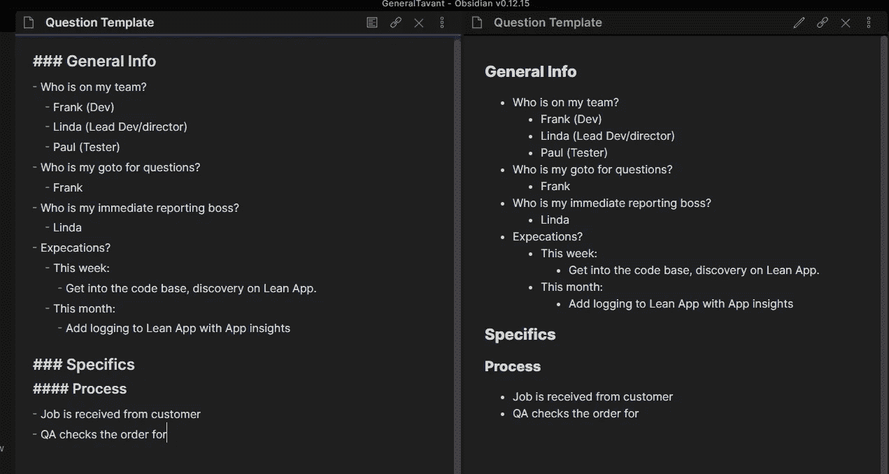

# 以下是如何作为一名新员工迅速进入公司的方法

> 原文：<https://betterprogramming.pub/heres-how-to-hit-the-ground-running-as-a-new-hire-in-a-company-4a59cbbcbf24>

## 在被一家新公司雇佣后，你会被这种“新鲜感”淹没。以下是你如何坚持完成任务的方法

来自作者电脑的截图。

# 1.笔记

不要害怕记笔记——大量的笔记。我一直在使用一款我最近了解到的名为[黑曜石](https://obsidian.md/)的应用，我非常喜欢它。你可以使用任何你想要的东西:MS Word，One Note，Notepad++，VS Code，任何真正的东西。

## 一般问题:

*   谁在我的团队里？(队友数量、头衔、职责)
*   在开始提问时，谁是我的首选？
*   我的期望是什么？这周我需要完成什么？这个月？—这可能不是一个直接要问的问题，但心中有一个想法是很好的。一般的期望应该在招聘过程中讨论，但是具体的、以项目为导向的期望总是应该尽早知道。

## 个人模板

你无疑会在一开始与各种队友、HR、主管/经理/领导进行无数次对话；你说吧。以下是我在每次谈话中尝试回答的模板/问卷。

*   我在和谁说话(姓名、职务、职责)
*   他们在解释什么(新流程、概述)
*   我学到了什么？(开始时，像“更多地了解一个人”这样简单的回答是可以接受的)

## 流程模板

在任何情况下，我都不可能在一两天之内了解完整的情况。你会不断地添加、更新、纠正一个误解，并且通常会增加这个列表。这将需要你与不同的人进行多次交谈，并随着时间的推移不断学习。

这上面没有魔法列表。基本上，你要开始列出流程的顺序——“首先我们得到这个，然后我们做这个，然后这个部门做这个……”

# 2.平衡这一切

当你被雇佣的时候，你的工作是有报酬的。这项工作的一部分需要了解业务，但主要是你需要快速做出贡献。要做到这一点，你不会有六个月的时间去了解每个角色和部门的所有细节。实际上，你可能最多只有一两天时间，然后你就需要开始交付了。由于你对业务缺乏了解，最初的交付可能会很差，那么你是如何做到这两点的呢？你在教育上一次投资一点点。

## 20%规则

我是谷歌 20%法则的忠实粉丝。一言以蔽之，员工应该花 20%的时间探索新概念，从事不会立即产生任何实际优势的项目，但这项工作在未来将会卓有成效。许多谷歌产品都是这个创新时代的产物。假设你可以每天抽出一个半小时的时间，问一些关于公司流程的问题，甚至可以在某个员工工作的 30 分钟里和他们坐在一起。在这种情况下，你会相对较快地了解全局。

不是每个人都有每天花几个小时开始学习过程的奢侈，所以这可能是你分散花费的一些时间，每天必须工作一个小时左右。

## 意识到时间

现在，你首先要做的是学习。你越快实现这一点，你就会过得越好。几乎每一次你学习的时候，你都不得不占用别人的时间，通过交谈、电子邮件、发信息等等。设置一个计时器，这样如果可以的话，你就不会整天烦别人。很可能他们有工作要完成，他们花在和你解释事情上的时间正在从他们身上消失。展开你的人脉和资源。限制自己每天最多和一个人在一起 20 或 30 分钟，除非有特殊情况。

# 3.优先考虑你需要学习的东西

如果你对软件开发感兴趣，那么你可能会一直紧跟在技术的后面——你必须这样。你应该不停地学习。不过，我想说的是，当你被一家新公司聘用时，头三至六个月你的首要责任是学习他们的系统。一旦你记下了这些，你就可以重新开始学习新的技术、编程语言——无论你想要什么。无论你做什么，

> 不要试图一次学会所有的东西——优先考虑你的教育！

如果你仍然在晚上学习新的框架，在白天学习新的商业原则，然后在正常工作时间学习新的代码，你会精疲力尽。老实说，在最初的几个月，你必须做出积极的决定，避开你周围新的闪亮的技术，专注于雇佣你的新公司。如果你这样做了，你会比大多数人处于更有利的地位。

# 为什么要花这个时间？

这些年来，我和几种不同风格的人共事过。有非常有天赋的开发者，也有非常一般的。我是一名项目经理，专门与外部客户打交道，与了解业务和不了解业务的团队成员一起工作。我可以自信地说，那些对业务了如指掌的人是不可或缺的。他们中的许多人在技能组合上属于“一般”类别，但他们是团队中的关键人物。你应该一直努力提高自己的技能，但是对业务的了解通常会带来巨大的回报。

## 客户的信心

了解业务的另一个好处是你灌输给客户的信心。当然，理解计费是如何工作的可能不是你的责任，但是如果你理解了，这是一个额外的收获。对客户来说，一个像这样的回答，“我真的不知道财务部门是如何处理的；我不得不问他们“没什么用，但能够回答同样的问题，”他们通常会在每月的某一天寄出所有账单，我相信是 15 号，但我可以与他们核实一下”将永远鼓励客户。如果你没有这方面的知识，这并不是一件坏事，但绝对是一种帮助。

## 界定新项目的范围

当你为即将到来的项目收集需求时，最好对业务有一个基本的工作知识。我曾经和这样的人一起工作过，他们觉得，“知道所有事情的来龙去脉并不是我们的责任——我们只需要写代码或者回答诸如此类的问题。”这有时是一种危险的心态。关于软件，如果你不理解你正在创建的东西的全部含义，你很有可能会出错，或者更糟，破坏你甚至不知道存在的东西。

# 最后一句话:了解你的行业

花时间去了解你公司的内部运作——这是一种投资。股息将很快收回。你会比那些没有全局观念的人更有优势。

# 资源

 [## Obsidian:一个关于本地降价文件的知识库。

### 人类的大脑是非线性的:我们总是从一个想法跳到另一个想法。你的第二个大脑应该是一样的。在…

obsidian.md](https://obsidian.md/)  [## 谷歌表示，它仍然坚持 20%原则来寻找大创意，你应该完全照搬…

### 这是一个关于世界上第四大公司的故事，也是一个你应该从中复制的简单习惯，无论如何…

www.inc.com](https://www.inc.com/bill-murphy-jr/google-says-it-still-uses-20-percent-rule-you-should-totally-copy-it.html)