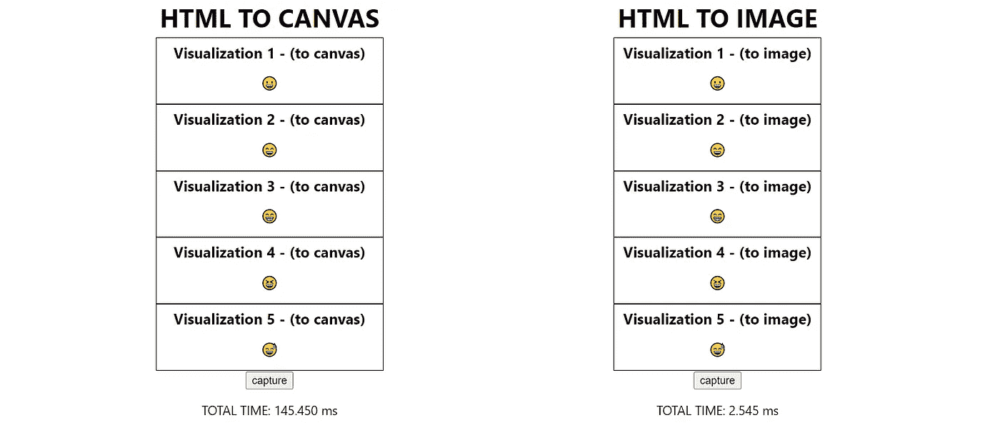

# 这就是我在 React 应用中用 html-to-image 替换 html2canvas 的原因

> 原文：<https://betterprogramming.pub/heres-why-i-m-replacing-html2canvas-with-html-to-image-in-our-react-app-d8da0b85eadf>

## 将 React 组件捕获为图像的两个库的比较


卢克·切瑟在 [Unsplash](https://unsplash.com/s/photos/graphs?utm_source=unsplash&utm_medium=referral&utm_content=creditCopyText) 上拍摄的照片。

我最近[写了一篇关于将 React 组件捕获为图像的文章](https://javascript.plainenglish.io/export-react-components-as-images-15168b73b0eb)，并在 Reddit 上分享了这篇文章。一位 redditor 评论说，虽然这个库很强大，但他们使用了另一个他们认为性能更好的库:

> “我最终使用的一个类似的库是 [html-to-image](https://www.npmjs.com/package/html-to-image) 。快得多，不仅可以将组件转换为画布，还可以直接转换为 png/blob/svg。”

我们在应用程序的另一部分使用`[html2canvas](https://www.npmjs.com/package/html2canvas)`,我们需要下载多个可视化的独立图像，压缩它们，然后下载它们。它工作得很好，但我不得不说性能会变得相当慢。我从未听说过`html-to-image`，但我想我应该去看看！

在试用之后，我认为它是`html2canvas`的一个很好的轻量级替代品。在本文中，我们将介绍它是如何工作的，然后创建一个 React 应用程序来并排比较这两个库。

首先，安装软件包。与`html2canvas`不同，它没有依赖关系:

```
npm i html-to-image
```

接下来，在组件中导入它:

```
import * as htmlToImage from 'html-to-image';
```

然后，您可以编写一个函数，从 React 应用程序中获取一个 DOM 元素，并将其转换为您指定的格式。为了简洁起见，我们将只在我们将要构建的应用程序中使用`png`格式:

在 NPM 文档中，提供的示例使用`download`来处理下载。但是在本文中，我们将使用上一篇文章中的`saveAs`函数。

在撰写本文时，下面是我在比较这两个库时使用的三个关键点(KPI)的值:解压缩大小、文件总数和依赖项。

## html 到图像

*   解压缩后的大小:183 kB
*   文件总数:66
*   依赖项:0

## html2canvas

*   未封装的大小:2.96 MB
*   文件总数:476
*   依赖关系:1

如您所见，`html2canvas`在解压缩大小(大约大 16 倍)和文件总数(大约大 7 倍)方面要大得多。它也有一个依赖项，而`html-to-image`没有。一个依赖性并不值得注意，但它比你需要担心的`html-to-image`多了一个依赖性。

较小的尺寸和缺乏依赖性对于试图保持他们的包较小并且没有无关库的开发人员来说是个好兆头。更小的捆绑包意味着更快的反应应用，更少的库意味着更少的潜在兼容性问题。

撇开规格不谈，就实际性能而言，这两个库如何比较？`html-to-image`真的是更快的库吗？为了自己看，让我们构建一个 React 应用程序，并排比较我们的库。首先，安装`html2canvas`:

```
npm i html2canvas
```

接下来，让我们为`html2canvas`创建一个组件:

我使用`[performance.now()](https://stackoverflow.com/questions/313893/how-to-measure-time-taken-by-a-function-to-execute)`在函数开始时记录时间，然后在函数结束时再次记录时间。开始时间和结束时间之差表示函数完成任务所需的时间，以毫秒为单位。我们在`html-to-image`组件中实现了类似的逻辑:

对于这两个组件，`saveAs`是在[上一篇文章](https://javascript.plainenglish.io/export-react-components-as-images-15168b73b0eb)中使用的函数，用于下载我们新创建的图像。为简洁起见，我将不包括它(或`Visualization.js`)的代码。然而，本文的所有代码都可以在 [GitHub](https://github.com/macro6461/html-to-image-demo) 上找到。

最后，您将需要种子数据。`visualizations.js`是在我们的应用程序中可以看到的`Visualization`对象的数组。见下文:

在设置了在各自的组件中捕获和下载 React 组件的函数之后，我能够看到`html-to-image`实际上是任务的更快的库。见下文:



肉眼几乎察觉不到性能上的差异，但是如果你看看两个库处理和下载五个可视化效果的毫秒数，`html2canvas`要慢 57 倍。事实上，在连续进行十次这种测试后，差距就更加明显了。


性能的平均差异是 86.3985 毫秒。这意味着平均而言，`html-to-image`比`html2canvas`快了将近 71 倍！

*注意:虽然数据集只包含 10 个比较，但是两个库确实在相同的应用程序中使用相同的可视化在相同的时间段内执行。请随意进行更多的比较并分享您的结果！*

为什么会这样？一个很大的原因是`html-to-image`不需要先将元素转换成画布。从一个元素生成一个画布需要时间——这个时间`html-to-image`不会发生。`html-to-image`还可以通过其内置的`[toCanvas(](https://www.npmjs.com/package/html-to-image#toCanvas))`函数，灵活地将捕获的 DOM 元素转换成画布。

# 摘要

虽然`html2canvas`是一个健壮的库，但如果只是简单地将 React 组件导出为图像，可能会有些矫枉过正。与`html-to-image`相比，它的安装量更大，并且需要依赖第三方。撇开规格不谈，`html2canvas`的运行时间比`html-to-image`慢(71 倍)。我计划在我们的 SaaS 中用`html-to-image`替换`html2canvas`(等待团队审查和批准)，因为它能完成我们需要的，而且速度更快。

你对提到的两个图书馆有不同的体验吗？你更喜欢哪个，为什么？请在评论中告诉我你的想法！

本文附带的代码可以在 [GitHub](https://github.com/macro6461/html-to-image-demo) 上找到。

在此 *将你的免费中级会员升级为付费会员，每月只需 5 美元，你就可以获得数以千计作家的无限量无广告故事。这是一个附属链接，你的会员资格的一部分帮助我为我创造的内容获得奖励。谢谢大家！*

# 参考

[](https://github.com/macro6461/html-to-image-demo) [## macro6461/html 到图像演示

### 在 GitHub 上创建一个帐户，为 macro6461/html-to-image-demo 开发做出贡献。

github.com](https://github.com/macro6461/html-to-image-demo) [](https://javascript.plainenglish.io/export-react-components-as-images-15168b73b0eb) [## 现在可以将 React 组件导出为图像

### 使用 html2canvas

javascript.plainenglish.io](https://javascript.plainenglish.io/export-react-components-as-images-15168b73b0eb) [](https://www.npmjs.com/package/html-to-image) [## html 到图像

### 使用 HTML5 canvas 和 SVG 从 DOM 节点生成图像。

www.npmjs.com](https://www.npmjs.com/package/html-to-image) [](https://stackoverflow.com/questions/313893/how-to-measure-time-taken-by-a-function-to-execute) [## 如何测量函数执行所用的时间

### 我需要得到以毫秒为单位的执行时间。我最初是在 2008 年提出这个问题的。公认的答案是…

stackoverflow.com](https://stackoverflow.com/questions/313893/how-to-measure-time-taken-by-a-function-to-execute)