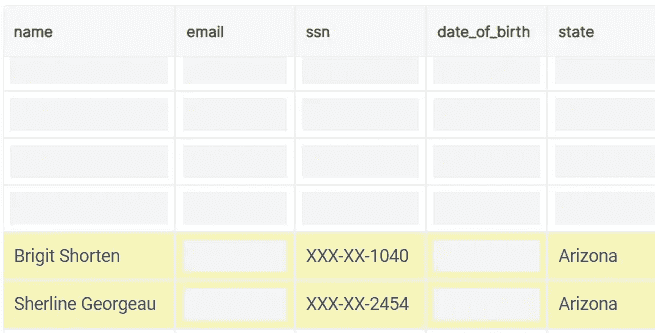

# 数据隐私 API 如何抽象和简化隐私和合规性

> 原文：<https://betterprogramming.pub/how-a-data-privacy-api-abstracts-and-simplifies-privacy-and-compliance-7f9fac01e5a0>

## 数据隐私和合规很难！让数据隐私 API 帮上忙

图片来自 [istockphoto](https://www.istockphoto.com/photo/dog-tug-of-war-gm146869830-7251455)

在隐私和合规的世界里航行不是一项简单的任务。一方面，我们看到一个越来越注重隐私的世界。另一方面，我们看到许多危及用户隐私的应用程序。在这场拉锯战中，你能对人们的敏感个人数据做些什么的格局在不断变化。

就像一场拔河比赛，界限不断被划定。例如，[通用数据保护条例(GDPR)](https://gdpr.eu/what-is-gdpr/) 适用于由多个国家(欧盟)组成的欧洲主要地区，每个国家都有自己的一套数据隐私法律。在美国，加利福尼亚州等个别州已经颁布了类似[加利福尼亚州消费者隐私法(CCPA)](https://oag.ca.gov/privacy/ccpa) 的立法，这些立法直接影响了这些州的数据隐私和合规性要求。

那么，作为一名软件开发人员，你是如何在这个不断变化和固有困难的领域取得成功的呢？简而言之，你需要一个数据隐私 API，能够跟上近乎恒定的变化，所以你不需要从头开始写所有的逻辑。在这篇文章中，我们将看看数据隐私 API——特别是“什么”、“为什么”、“如何”和“谁”

# 什么是数据隐私 API？

当谈论一般数据时，一些公司将隐私和安全作为同义词使用。在我们的上下文中，当我们讨论数据隐私 API 时，隐私和安全是两个完全不同的概念，我们关注的是隐私。

数据隐私不仅仅是加密；它还涉及确保数据具有对被访问数据有意义的治理和访问控制。像 RBAC 这样的传统模型很适合授予对端点或 API 的访问权限。但是，在大多数情况下，单靠 RBAC 不足以进行数据治理，而且往往过于粗糙，不符合数据隐私法。

# 为什么需要数据隐私 API？

让我们从显而易见的开始:隐私和遵从是很难的。构建一个能够有效保护数据隐私并满足法规遵从性要求的应用程序并非易事。这种努力需要大量的开销，而且自己做也会有很多风险。通过将敏感的客户数据隔离在您的应用程序之外并使用数据隐私 API 来利用这些数据来避免这些风险不是很好吗？

数据隐私 API 就是这么做的:它抽象并简化了隐私和合规性的核心功能，因此您不需要自己动手。

# 少即是多

通过将数据隔离在核心基础设施之外，您的应用程序拥有不太敏感的数据。这降低了应用程序开发的风险，并给你更多的自由来关注你的核心能力。此外，由于您可以更少地担心保存敏感数据的合规性风险和技术方面，因此您可以更快地进行创新并加快上市时间。这是可能的，因为数据隐私 API 使用数据最小化原则:您只检索您需要的数据——不检索您不需要的数据。

# 现在简单，以后灵活

通过数据隐私 API 简化数据治理为新市场带来了机遇，如欧盟，其数据隐私法规比您目前可能开展业务的美国等市场更严格。数据隐私 API 简化并扩展了您满足数据隐私要求的能力，为解决您的企业可能进入的任何新市场的隐私和合规性问题提供了灵活性。

# 保护

像税收一样，监管似乎只会扩大。一再发生的高调数据泄露事件证明了数据隐私和合规性的重要性。违规是何时发生，而不是是否发生，因此最大限度地减少您的应用程序持有的敏感数据量(使用令牌化等技术，如下所述)是减少您未来责任的关键。毕竟，如果数据泄露不危及姓名和生日等敏感数据，而只是不可利用的令牌，那么对您和监管机构来说就没那么重要了。

# 数据隐私 API 如何抽象和简化隐私和合规性？

我们这个大问题的答案因供应商而异。然而，在高层次上，一个有效的数据隐私 API 至少应该涵盖核心功能，如数据治理、与可信第三方的集成和令牌化。

# 数据治理

数据治理通过确保只有必要的数据用于特定的功能，并且没有用户拥有对敏感数据的过度广泛的访问权限，对数据访问进行细粒度的控制。这种方法将风险降至最低，通常通过 RBAC 和 ABAC 的组合来实现。一个好的数据隐私 API 通过精心设计的默认配置和广泛的可定制性来促进数据治理。

# 与可信第三方的集成

一个好的数据隐私 API 提供了控制和保护进出需要敏感数据访问的第三方服务的数据流的能力。这些数据传输给外部各方的方式会极大地影响您遵守数据隐私法规的能力。

例如，让我们假设你正在建立一个在线服务，帮助用户获得犯罪背景调查证明信的认证副本。一方面，您需要存储每个用户的敏感信息，比如他们的姓名、地址和驾照号码。当他们向背景调查机构提交申请和付款时，您需要将您的个人身份信息(PII)与用户提交的信用卡信息结合起来进行付款。

以符合法规的方式将这些不同的来源和敏感信息拼接在一起可能会非常复杂，并且充满失误。我们需要一个数据隐私 API 来管理敏感数据的转发。其结果是确保敏感数据与您的应用程序之间的任何传输都是安全的，从而降低您的风险。

当然，数据隐私 API 实现这种集成的能力取决于数据隐私中一个基本特性的存在:标记化。

# 标记化

标记化是一种非算法的数据混淆方法，它将明文敏感数据交换为没有可利用价值的密文标记。它允许您将敏感数据值的替代(引用)添加到您的应用程序和基础结构中。敏感数据值在您的应用程序和基础架构之外受到保护，并通过去毒化过程进行访问(需要授权)。

通过用令牌取代敏感数据在系统中可能停留的许多地方，令牌化提高了任何应用程序、网站或后端基础架构部署的数据隐私。如果令牌化的值被暴露——无论是通过未经授权的服务器访问还是无意中的日志记录——它们对于那些没有授权访问数据隐私 API 的人来说没有任何实际的用处。

# 谁提供了一个好的数据隐私 API？

在数据隐私 API 领域，很少有著名的供应商。一个特别突出的例子是 [Skyflow](https://www.skyflow.com/) 。Skyflow Data Privacy Vault 提供的不仅仅是我们上面提到的三种功能，但它似乎很好地涵盖了这些不可协商的功能。

例如，假设您有一个必须遵守 GDPR 的客户支持团队，因此他们需要适当的数据治理。为了完成工作，团队需要访问“客户”表中的一些数据——但肯定不是全部。有了 Skyflow，您可以使用基于策略的访问控制来限制从请求中返回的数据。您的客户支持团队只能看到他们需要的东西。

要了解这一点为何如此重要，请考虑 GDPR 第 25 条:*中的这一要求……仅处理每个特定处理目的所需的个人数据。*“从上面的例子中我们可以看出，根据访问数据的角色，Skyflow 使完全或部分编辑数据变得更加容易，有助于您遵守法规。你可以在 Skyflow 的[数据治理演示应用](https://governance-demo.skyflow.app/)中看到更多这样的例子。

Skyflow 遵循标准的 REST API 方法，使用 GET 和 POST 请求来[存储和检索标记化的数据](https://www.skyflow.com/post/demystifying-tokenization-what-every-engineer-should-know)。在您的应用程序中，您存储中间数据表示—令牌—使用 API 在真正需要时检索敏感数据。这种方法减轻了存储敏感数据的大部分合规负担。这样，如果发生违规，只有令牌存储在您的应用程序中。

值得注意的是，Skyflow 使用自己的令牌化功能将您的应用程序与第三方连接凭据隔离开来。例如，您可以配置与 [Plaid](https://www.skyflow.com/post/skyflow-partners-with-plaid-to-help-developers-build-fast-and-protect-financial-data-privacy) 等服务的连接，Skyflow 将动态标记敏感数据，您可以存储这些数据或对其进行去令牌化，以便在您的应用程序中使用。这简化了连接管理，极大地简化了开发人员的任务。

# 结论

我们前面说过，值得再说一遍:数据隐私和合规很难！你生活在一个有许多移动部件、规则和可塑边界的世界，它们会随着时间而改变。数据隐私 API 抽象并简化了在这个世界中试图竞争和遵从的复杂性。

如果您的应用程序要保持相关性并服务于尽可能大的市场，您将需要一个数据隐私 API，它可以轻松安全地满足(甚至可能超过)您的法规遵从性和隐私要求。