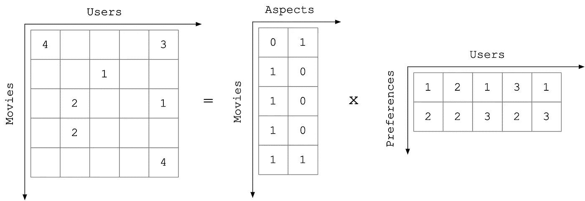

# 埃隆·马斯克推特中的算法将如何确定真相

> 原文：<https://betterprogramming.pub/how-algorithms-in-elon-musks-twitter-will-determine-truth-c1a025caa45a>

## 仔细看看 Community Notes 算法，它应该使 Twitter 成为最准确的信息来源

克劳迪奥·施瓦兹在 [Unsplash](https://unsplash.com?utm_source=medium&utm_medium=referral) 上的照片

2022 年 10 月 27 日，埃隆·马斯克(Elon Musk)以 440 亿美元的巨额完成了对 Twitter 的收购。大约有 2.4 亿的每日活跃货币化用户 [(Q2/2022)](https://www.statista.com/statistics/970920/monetizable-daily-active-twitter-users-worldwide/) ，这相当于每个用户约 183 美元。

收购之后发生的事情无疑可以用争议来形容:三名高管立即被解雇，一周后，一半的员工被[裁掉](https://en.wikipedia.org/wiki/Twitter#Acquisition_by_Elon_Musk)。每月 8 美元的付费模式被引入，随后被滥用。一个假冒礼来公司制药公司的虚假账户发布了一条推文，声称他们将制造胰岛素，导致该公司股票暴跌，估计市值损失 140 亿美元。这可能不是我们在通往新 Twitter 的路上听到的最后一件事。

Twitter 新主人的目标之一是成为*“世界上最准确的信息来源”:*

这项工作的核心基石应该是 ***社区笔记*** 。

但这到底是什么？在这个故事中，我们仔细看看社区笔记。更具体地说，我们将探索底层算法，探索我们将得到什么样的结果。我们的目标是让人们一窥 Twitter 未来将如何向我们呈现信息。

# 社区笔记

社区笔记的起源可以追溯到马斯克时代之前。2021 年 1 月，正式推出了“观鸟”( T0 )( T1 ),作为一种以社区为基础的方法来对抗错误信息。其核心思想是在推特上显示注释。问题是，只有当足够多的人从不同的角度认为这些笔记有帮助时，它们才会被显示。快进到 2022 年 11 月。Birdwatch 现在被称为 Community Notes，预计将在 Twitter 的未来发挥至关重要的作用。该计划旨在通过将贡献给社区注释的数据公开来实现透明和可见。代码可以在 [GitHub](https://github.com/twitter/communitynotes) 上找到，还有一篇描述[方法论](https://github.com/twitter/communitynotes/blob/main/birdwatch_paper_2022_10_27.pdf)的论文。

该论文进一步详述了社区笔记背后的基本原理:社交网络的一个关键挑战是误导性的主张在网络中传播时是如何被放大的。信息的快速传播使得事实审查员很难跟上。假设是，社区策划的解决方案，尽管来自非专家，也能有所帮助。然而，这要求出现的笔记对不同的用户群有广泛的吸引力。为了实现这一点，使用了基于*矩阵分解*的算法。该算法将确定显示哪些笔记，不显示哪些笔记。该论文的作者将该算法与其他识别合意音符的方法进行了对比。在野外测试该算法导致了有趣的行为:当该算法在一条推文中添加注释时，一条推文被分享的可能性降低了，这凸显了影响信息传播的力量。

## 矩阵分解算法

让我们学习更多关于矩阵分解算法(MF)的知识:MF 用于[推荐系统](https://en.wikipedia.org/wiki/Matrix_factorization_(recommender_systems))。这些系统试图预测用户对一件商品的*评分*或*偏好*。通常情况下，您已经收集了大量用户数据，现在想要了解底层模式，以便您可以提出建议。从算法上来说，MF 背后的思想是在一个低维的潜在空间中表示用户和项目。它在 2006 年网飞奖挑战期间广为人知，当时西蒙·芬克在一篇博客文章中报告了它的有效性。这篇博文值得一读，即使以今天的标准来看。网飞提供了 1 亿英镑！)来自 50 万用户的 17，000 部电影的评级(从 1 到 5)，问题是用户将如何对给定的电影进行评级。

为了理解 MF 背后的概念，考虑一个大的、稀疏填充的矩阵(列是用户，行是电影)，填充评级或空的以防我们不知道。如果我们有每个用户对每部电影的所有可能的评级，我们将有 17.000 x 500.000 = 8.5 亿个条目。我们没有全部，但我们稍后会谈到这一点。如果我们现在假设每部电影都是不同方面(动作、恐怖等)的合成。)并且每个用户对这些方面都有偏好，我们可以假设大矩阵(电影/用户)实际上是两个较低维度矩阵(电影/方面和偏好/用户)的点积:

矩阵分解:大的电影/用户矩阵由两个较小的电影/方面和偏好/用户矩阵创建

如果我们有这样的矩阵，我们就可以预测一个用户对某部电影的评价，方法是将电影的各个方面乘以用户的偏好，然后求和。

基于现有矩阵的计算将是直接的。但是我们如何从大电影/用户矩阵中确定这些矩阵呢？尤其是考虑到我们有缺失的价值观？回想一下，我们有一个稀疏矩阵，85 亿个条目中只有 1 亿个。幸运的是，我们可以将此视为机器学习问题:我们初始化电影/方面和偏好/用户矩阵，预测电影/用户矩阵，并可以确定这两者之间的误差。这也适用于缺少值的情况。这给了我们一个最小化的目标函数，我们可以应用[梯度下降](https://en.wikipedia.org/wiki/Gradient_descent):我们取增量，乘以学习率，更新电影/特征和偏好/用户矩阵，重复直到收敛。然后我们得到了允许我们预测的矩阵。通过调整矩阵的大小，我们可以控制在我们的模型中可以捕获的个性化的数量。

如果你对代码的外观更感兴趣，有几个包可以做到这一点，比如这个 [Python 实现](https://github.com/gbolmier/funk-svd)。

## Twitter 对矩阵分解的理解

对于社区笔记，MF 算法用于识别对具有不同观点的评价者有吸引力的笔记。回头看看网飞的例子，这将是一部我们大多数人都能认同的*电影？*-优化类型。

回到技术层面:更准确地说，Community Notes 中的算法是对 MF 算法的一种改进。除了矩阵的预测值，还有三个额外的修正因子。这些来源于评价者对注释“有帮助”与“无帮助”进行评价的总体可能性，以及基于用户和注释的校正因子，以增加算法的准确性。与上面的网飞示例相比，本文中报告的训练数据集为 7，088 条注释和 124，241 个评级，因此明显较小。

现在，在这个技术间奏曲之后，出现了一个有价值的问题:*在一天结束的时候，这些音符有多吸引人？*这篇论文展示了他们调查中的几个例子，我想在图 4 和图 5 中展示一下，图 4 显示了笔记对聚会偏好的感知有用性，图 5 也使用了不同的算法。从算法上来说，矩阵分解能够提供所有类别中最有用的注释，所以这可能是我们能得到的最合适的注释。然而，当看实际数字时，仍然存在巨大的差异:

*   极有帮助:42%的人支持民主党，23 %的人支持共和党
*   多少有些帮助:37%支持民主党，26 %支持共和党
*   有点无益:民主党 5%,共和党 11%
*   极其无益:民主党 6%，共和党 19 %

我认为这很好地说明了两个被认为是分裂的群体之间潜在的友好性。

## 重现结果

如果你有美国的 IP 地址，你可以从 Birdwatch 的[数据下载](https://twitter.com/i/birdwatch/download-data)页面下载数据。您将需要笔记、评级和笔记状态历史记录。如果你没有美国 IP，我发现这个来自罗伯特·汉森的[线程](https://twitter.com/RSnake/status/1581372752585375745?s=20&t=OvcbKqem4Ic5gLIvIwI8Qw)非常有用，它分享了原始数据的链接，你可以用它直接下载数据。在这个故事的下面是一个关于可访问性的附加注释。

从那里，它是克隆回购，设置环境，复制文件和执行代码。在我的 M1 Macbook 上，一切只需要几秒钟。你最终会得到一个给每个音符打分的`scoredNotes.tsv`。虽然整个过程可能看起来很基本——三个文件进入，一个文件退出我认为重要的是思考一下这里可能发生的事情:最大的社交媒体网站之一正在开放其百宝箱，并使公众能够复制他们的结果，这是一个非常值得称赞的努力。

然而，有一点是错误的，当重新运行代码时，我得到了**不同的**结果。这只适用于所有音符中的一小部分，但在模型中似乎存在一些随机性。请参见下面关于再现性的技术说明。

## 我们能找到什么？

复制了算法的工作原理后，我们可以开始探索一下 Community Notes 过去做了什么。我做了一个[小型 EDA 脚本](https://gist.github.com/straussmaximilian/55f10f615e0f7049bbd43f00dcb64f65)，它加载数据并给出一些汇总统计数据。我用 spaCy 提取关键词，用 urllib 提取 URL，看看 tweets 是不是引用的东西。我为每个类别绘制了**前 10 个**关键词和 URL。

有用/需要更多评价/无用类别的前 10 个单词。

**顶词:**顶词可以提供一个有见地的角度。有用的笔记似乎包含与事实(事实、主张、叙述)和潜在证据或来源(图像、照片、视频、文章)相关的词语。另一方面，没有帮助的笔记也有证据方面(证据，事实)，但似乎更负面的内涵(谎言，错误)。

有帮助/需要更多评级/无帮助类别的前 10 个 URL。

热门网址:关于网址的有趣之处在于，它们可以让我们了解在 Twitter 内部被接受为真理来源的更高权威是什么。有趣的是，很多 URL 似乎都引用了 Twitter。对于有用的注释，新闻网站(路透社、美联社、纽约时报)是最突出的。它们比维基百科或事实核查网站 Snopes 更常见。对于没有帮助的注释，维基百科也排名很高。作为补充说明，维基百科列出了他们认为哪些[来源](https://en.wikipedia.org/wiki/Wikipedia:Reliable_sources/Perennial_sources)的可信度。

随着语言模型的进步和不断扩大的社区笔记数据集，我看到了有趣的可能性。现在我们看到了一些有用笔记的成分:我们能建立一个机器学习模型来帮助我们写下令人愉快的笔记吗？这可能会使事实检查方面自动化。

## 讨论

应用于 Twitter 笔记的 MF 算法确实是一个强大的算法，能够显示有用的笔记。在假新闻的时代，每一个减轻这一点的步骤都是非常受欢迎的。不管技术上可以实现什么，对一些群体来说，在感知有用性方面仍有很大差距。我认为这并不令人惊讶，因为在当前的环境下，这些群体之间已经存在明显的分歧。我发现有趣的是，传统的新闻来源，如路透社经常出现在有用的笔记中，表明它们是有效信息的来源。随着国际化程度的提高和数据的增多，观察 Community Notes 的发展趋势将会非常有趣。也许有了先进的模型，令人愉快的笔记可以自动生成，这可能是一种有趣的事实核查。

让我们再缩小一点，从更大的角度来看:这个算法在让 Twitter *成为世界上最准确的信息来源*的目标中能发挥什么作用？令人愉快的笔记能等同于准确的信息吗？真相有时候不是很难受吗？

我们可以从速度的问题来研究这个问题:我个人喜欢在维基百科上阅读时事——这当然不是最快的，但我得到了所有的背景信息来看待事情。然而，维基百科很慢，你很可能在那里找不到最新消息。另一方面，Twitter 速度很快。而且我确实喜欢获得关于最新研究文章的信息。然而，原则上，一个快速的地方同时也是获取准确信息的地方似乎有点矛盾。总是需要一些时间，从不同的角度去提取真相。这现在变得非常重要，这肯定是一个贯穿始终的问题，技术工具可能只有这么多帮助。

关于这个话题，有一句话我觉得很贴切。这归功于生活在大约 2500 年前(公元前 460-400 年)的雅典历史学家修昔底德:

> 庸俗者在探索真理时毫不费力，欣然接受手边的第一个故事。

*我目前正在探索这种形式，以分享更多的数据科学思想，并从算法的角度讨论话题。你有什么改进的建议吗，或者你有一个我应该调查的话题吗？让我知道！如果你喜欢中等并且正在考虑成为会员，可以随意使用* [*我的推荐链接*](https://medium.com/@straussmaximilian/membership) *。谢谢！*

# 附录:

## 关于可达性的评论

从美国境外访问社区注释页面

目前，Community Notes 非常以美国为中心。如上所述，尽管他们自己表示可以公开访问，但当从美国境外访问时，Twitter 页面会被屏蔽..这在研究设计中也是显而易见的——从上面，我们可以看到验证是在美国特定类别的群组中进行的，如政党偏好。

# 技术限制

在测试代码时，我注意到在同一个数据集上第二次执行它时，我在训练期间有了不同的损失。这让我很好奇。会不会是评级结果没有确定性？快速浏览后，我看到 Community Notes 模型中矩阵分解的基类`BiasedMatrixFactorization`使用该`xavier_uniform`进行初始化。这将引入随机性，因为初始值是从分布中提取的。虽然原则上您可以传递随机状态以使结果可重现，但这在 PyTorch 中目前是不可能的，并且自 2020 年以来一直是一个[公开的问题。](https://github.com/pytorch/pytorch/issues/43411)虽然我不确定这是造成差异的原因，但可能是其中之一。比较我的两次跑步，其中一次多了一个音符，对于 11 次，标签`CURRENTLY_RATED_HELPFUL`变了。相对于本次预测中的 16，238 个条目，这并不算多；尽管如此，结果应该是可重复的，即使是对剩下的 11 个。