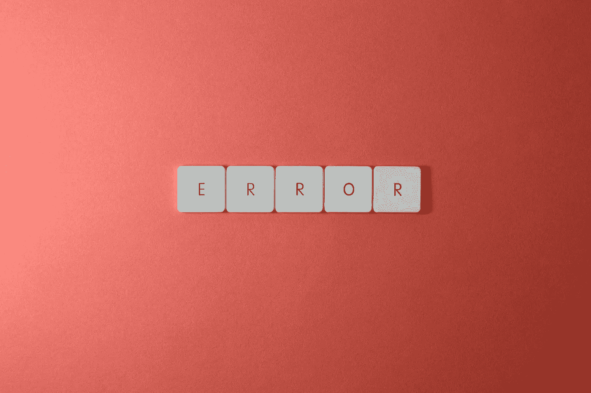

# 如何以及在哪里处理异常，同时维护一个优秀的 API

> 原文：<https://betterprogramming.pub/how-and-where-to-handle-exceptions-while-maintaining-a-great-api-e3df6c084746>

## 为什么我更喜欢通过结果模式的无异常方法

异常处理并不容易。可以在错误的地方做，可以用错误的方式做，甚至可以完全忘记。

在这个问题上，我们能做的最好的帮助我们的开发者伙伴的事情就是尽可能的设计我们的 API。

通过结果模式的无异常方法是朝着这个方向迈出的一步。

在本文中，我将指导您解决我在生产行业工作中多次遇到的一个典型的软件问题。我将提供一些简单的例子，分享我的想法，并解释为什么我更喜欢这个用例中的无异常方法。

我经常不得不在工作中处理实际的硬件。

*   打开/关闭阀门
*   开关继电器
*   从温度传感器检索值
*   移动致动器
*   …

# 制造商的 DLL

所有这些昂贵的硬件都从制造商那里以 DLL 的形式附带了一个软件。

假设我们想测量环境压力，买了一些昂贵的压力传感器。制造商为我们提供的驱动程序具有以下特点:

对于大多数制造商的 dll 来说，API 不是很方便。为了实际调查当前的环境压力，我们必须

1.  呼叫`Init()`
2.  呼叫`StartMeasurement()`
3.  打电话给`StopMeasurement()`
4.  呼叫`GetPressure()`

## 不要重复自己！

因为我们不希望在我们的解决方案中重复调用，所以我们将引入一个新的类，它包装了制造商的驱动程序，为我们提供了一个方便的服务。

让我们通过连续多次轮询压力来测试我们的服务:

当然:只要我们运行应用程序，我们就会得到一个未处理的异常:

> 未处理的异常—系统。异常:“传感器连接中断。”

## 我们做错了什么？

我们只是从另一个应用层调用了一个方法，没有任何异常处理。

驱动程序类是我们不知道的第三方代码。然而，我们在没有任何安全网的情况下越过了边界。我们只是假设该方法将按预期工作。

> 总是处理应用程序边界上的异常！

这包括:

*   硬件调用与通信协议无关
*   网络请求或任何依赖于互联网的东西
*   外部代码，未知的、未记录的或未测试的。

## 经典解决方案

既然我们已经发现了这个问题，那么让我们来实现它的经典解决方案:在我们的服务中实现一个 try-catch 权利:

当然，这是可行的。所有的例外都会被我们的`catch`吞噬。如果出错，我们只需返回一个`double.NaN`。我们现在无一例外！

但是也有一些瑕疵。让我们从用户的角度来看我们服务的 API。对于 API，我只是指我们的方法`GetPressure()`；它的名称、返回类型和输入参数。因为用户只能看到这些。

*   用户没有办法知道该方法是否抛出异常。他没有办法决定是否必须在不查看的情况下将该方法调用放入`try/catch`中。太糟糕了。
*   用户无法知道该方法是否成功。即使方法运行时没有异常，他也必须检查是否得到了有效的数字或`double.NaN`。那也很糟糕。

## 尝试模式

让我们进一步调整我们的服务，看看我们是否能消除这些缺陷:

我们的方法现在通过一个 out 变量返回压力。现在该方法的返回值是一个指示该方法成功或失败的`bool`。我们还将我们方法的名称从`GetPressure`调整为`TryGetPressure`。

我们刚刚实现了 Try 模式。

## 那样我们赢得了什么？

以`Try`开头的方法名是无异常的！这是 Try 模式中最重要的部分。

仅仅通过读取方法的名称，我们服务的用户就已经知道他在调用它时不需要处理任何异常。这听起来微不足道，但却是 API 设计的重要组成部分:

> 如果你让用户知道期待什么，他会以正确的方式去做。

另一个缺陷也被消除了:用户可以简单地检查返回的`bool`标志，看看方法调用是否成功。当方法已经返回`false`时，他根本不需要查看压力值。

但是在我看来有一些新的缺陷:

*   我不喜欢 out 变量的语法。许多干净的代码先知会立即签署。这只是令人困惑——每个人都期望方法的输出在它的名字的左边，而突然在输入之间有了输入？仅仅因为我们能，并不意味着我们应该。不要用你的语言提供的所有语法来混淆你的代码。保持简单！
*   我们只有一个二进制的结果。但是大多数时候，我们希望为我们方法的用户提供更多的信息。考虑我们的方法可能失败的所有原因:服务无法连接到传感器？服务已连接到传感器，但连接丢失？传感器返回一个值，但这个值不可信。用户可能想用不同的方式来处理这些情况。在某些情况下，他可能会安排重试，在其他情况下，他可能只是显示一个描述性的错误消息。

## 结果模式

为了解决这些缺陷，让我们进一步调整我们的服务:

在这个版本中，我们不返回一个`bool`，而是返回一个`Result<double>`类型的完整的`object`。

在深入研究类型`Result`之前，先看看我们服务的新用法:

如果您回顾一下 API 及其用法，您会注意到:

你得到的不是一个`double`，而是一个`Result<double>`。你不得不考虑如果手术失败了你会怎么做。只要使用`Result<double>`你就知道可能会有问题。如果我只是在方法中抛出一个异常，你不会注意到吧？这就是结果模式的最大好处。

> 一个好的 API 迫使用户正确使用它！这使得几乎不可能忘记错误处理。

## 结果对象

结果对象只包含您感兴趣的实际值以及您需要的任何附加信息——错误原因、成功原因、类似`IsFailed`的帮助方法——要有创意！

这种模式并不新鲜；很经典。结果模式有许多可用的库，因此您甚至不必实现自己的`Result`类！

我的。NET 示例使用了伟大的项目 [FluentResults](https://github.com/altmann/FluentResults) 。

# 结论

为了消化，我将重复我的介绍:

异常处理并不容易。可以在错误的地方做，可以用错误的方式做，甚至可以完全忘记。

在这个问题上，我们能做的最好的帮助我们的开发者伙伴的事情就是尽可能的设计我们的 API。

通过结果模式的无异常方法是朝着这个方向迈出的一步。

感谢阅读！