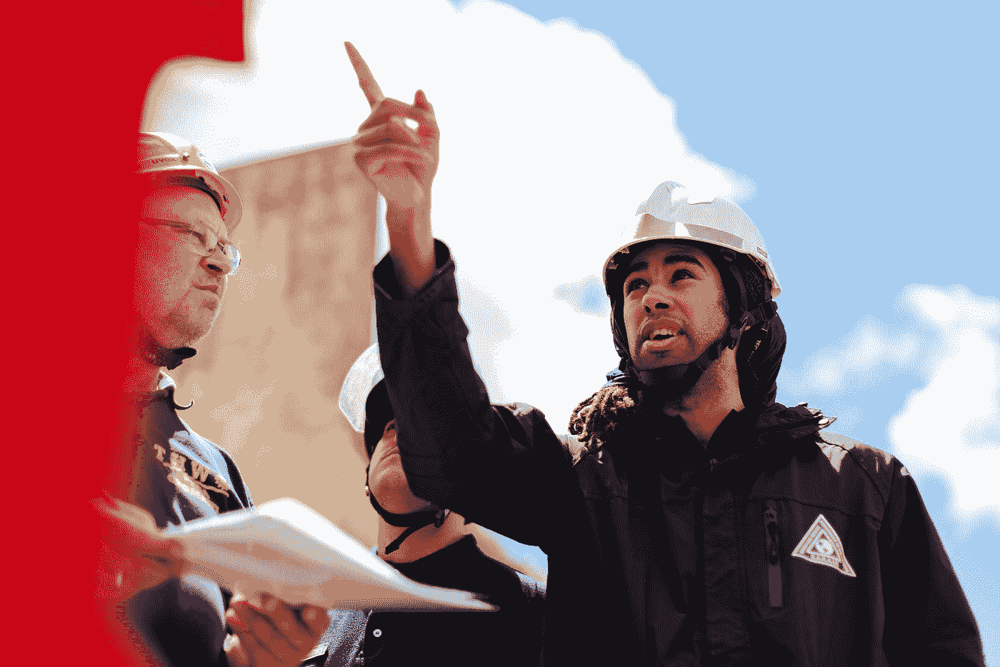
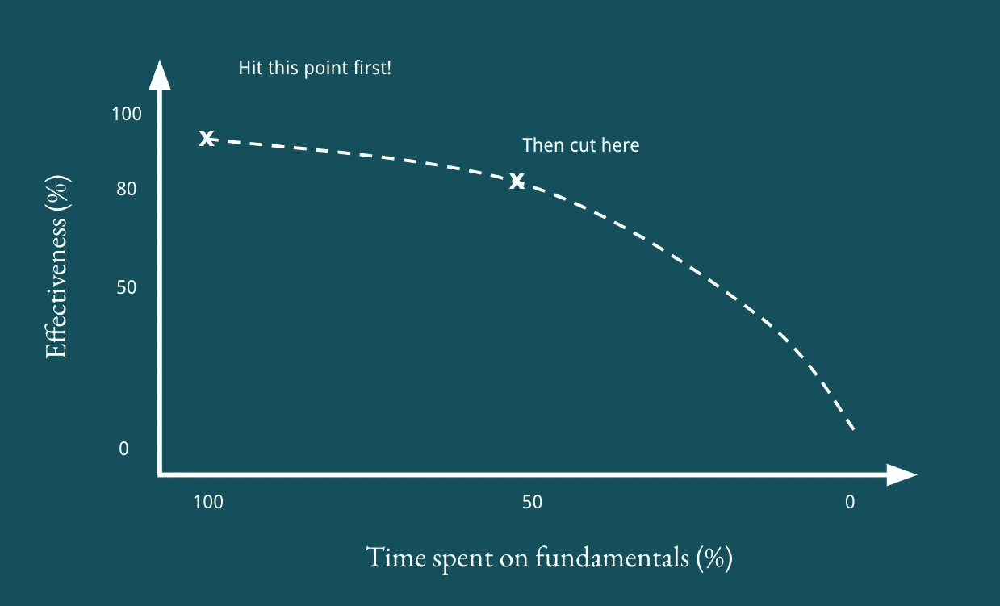

# 如何成长为一名(软件)工程经理

> 原文：<https://betterprogramming.pub/how-do-you-grow-as-a-software-engineering-manager-33a05873693>

## 在公司阶梯之外茁壮成长的秘诀

在 [Unsplash](https://unsplash.com?utm_source=medium&utm_medium=referral) 上拍摄的 [ThisisEngineering RAEng](https://unsplash.com/@thisisengineering?utm_source=medium&utm_medium=referral)

当与我的朋友、同事和同行讨论他们作为工程师、经理、副总裁或首席技术官的旅程时，一个惊人的观察结果总是存在:旅程有很大的多样性。

我故意用了“旅程”这个词，而不是“职业”，因为我更喜欢这个框架。我发现把进步描绘成一个“职业阶梯”特别有局限性，在这个阶梯上，你必须勾选方框才能爬到下一级。梯子是一种可能的方式来形象化这一旅程，但是我鼓励每个人去思考他们的旅程应该是什么。

我认为“梯子”概念的主要问题有两个。首先，它表明职位越高越好(类似于我一直觉得糟糕的类似组织考虑)。第二，它表明旅程是戏剧性的线性。为了表达其他一些批评，它还暗示了一种“越快越好”的形式，对我来说甚至更糟；这意味着你可以到达最后一级台阶(是的，“终点”，我的朋友们)。

尽管如此，我们都希望在各自的旅程中取得进步。因此，当回顾我自己以及我与同事、同事和朋友的所有精彩对话时，我认为将我的一些想法写在纸上会有所帮助，以解释我将如何亲自阐明工程经理的旅程会是什么样子。

# 旅程如何开始(对我们大多数人来说)和不同

请允许我从一个微不足道的观察开始。我知道很少有人毕业后马上就开始了 EM 之旅。据我所知，没有学校开设“工程管理”专业。

经过快速研究，这些选项似乎极其有限，而且几乎与软件行业无关。在没有经验的情况下，不可能开始我们的 EM 之旅，这意味着在我们的职业旅程中有一个过渡期，在这一点上，我们决定成为一名工程经理(大多数情况下是在做了几年软件工程师之后)。

各个公司的职责差别很大。那么同一家公司的不同团队的 EMs 花费时间的方式也会有很大的不同。为了详尽起见，同一个团队中的 EM 可能不得不在每个季度花费不同的时间。

就我而言，在撰写本文时，这代表了我在三家不同的公司直接或间接领导十几个不同的团队(取决于你如何计算)的 32 个季度。其中一些季度主要关注“塑造流程”，而在其他一些季度，我将大部分时间花在雇佣或构建下一代推荐系统的原型上(就像我作为软件工程师会做的那样)，或者写论文。

当然，除了这些不断变化的关注点之外，你还会从 EM 那里得到其他所有更基本的活动:设计评审、提供反馈、帮助每个人成长、解决潜在的冲突，以及巩固与我的产品同行的愿景。每家公司和新兴市场都有自己的基本面清单，但这至少是我工作过的公司的预期——我认为这可以作为所有公司的合理标准。

# 旅程的下一步是什么？

在所有这些可能的活动中，你如何成长呢？因为不同公司之间的术语可能不同，并且因为两个 em 之间的旅程可能不同——高级经理、主管、高级团队领导、工程主管等。—我从现在开始用虚构的标题“超级 EM”。

那么，从“工程经理”到“超级工程经理”的转变是什么样子的呢？如前所述，我认为这个问题没有，也不应该有唯一的答案。我发现在我周围讨论这个话题时，一个无处不在的答案似乎是“你需要成为管理经理”，这很烦人(阅读:无聊)仅仅这一句话就不必要地模糊了预期(“管理经理”→“也许[超级经理]”)和最终可能发生的事情(“超级经理”→“也许[管理经理]”)之间的因果关系。

我的看法是，我认为这听起来微不足道，你需要成为一名优秀的经理，才能继续迈向“超级经理”的旅程，如果这是你所追求的，无论这对你意味着什么。没有必要成为一个“完美”的管理者，去抓住每一个可能的维度(技术领导力、人员领导力等等)。)我见过一些领导者在领导他们的直属团队时表现得“还行”，但在更大的团队中却表现得令人难以置信。

我也注意到了相反的情况——这也是为什么我认为这是一个旅程的问题，而不是爬楼梯的问题。如果你想继续走这条新兴市场之路(探索完全不同的角色同样有效)，有一套基本原则需要完全内化。如果没有别的，这就是“工程阶梯”的作用:识别组织所重视的那套基本原则。然而，我认为更重要的是理解内省过程背后的基本原理。

# “被动有效性”的状态

我在脑海中描绘了以下基本假设:如果我将 100%的时间用于基本的 EM 任务，比如说，以 95%的速度掌握它们，那么如果我将专注于这些基本任务的时间减少到 50%，有效性不会下降到 50%，但可能会下降到 80%。

你没看错:从绝对意义上来说，我确实认为我现在是一个比我旅程早期更糟糕的“团队经理”,因为我经常需要花相当多的时间不与我的团队密切合作——或者不如以前那样密切。现在，如果我注意到需要我注意的事情，我知道我可以依靠一些基本技能来迅速提供必要的支持。我知道，如果我把 100%的注意力重新分配到团队经历中的一个问题上，我应该会感觉完全有效，因为这就是我在某个时候的工作方式。

但我认为，我们需要先经历那个顶点，然后再决定有意识地减速。如果你不知道一辆车能开多快，那么当你想开得更快时，你最好看看你能不能开得更快。我称这种状态为“被动有效性”，在这种状态下，我们在大约一半的时间里有 80%的效率

# 如何利用这些额外的时间呢？

由于强大的基本面，新获得的空闲时间将决定你旅程的下一步。一般来说，这可以包括其他 50%中没有包括的任何东西。有相当多的可能选择。仅举几个例子:

*   建立一个新的团队、分支机构或办公室(或改进现有的)
*   建立新流程。政策(或改进现有政策)
*   设定一个新的目标、方向或策略(我的观点是，大多数时候，它主要是“完善、改进、删除一个现有的”)
*   推动或支持一个更大项目的执行(你可以提供技术专长、组织支持，或者两者兼而有之)
*   利用你的团队，强化专业知识并产生更大的影响(你能通过与你的团队一起发展更深层次的专业知识来“压榨柠檬”吗？)
*   尝试不同的角色(你的组织缺少产品/ SRE /数据领导者吗？)

你能想象一下，如果你能在一半的时间内保证你 80%的 EM 任务，并把足够的时间投入到上述任务中，就好像这是你的主要职责一样？这个新出现的机会是我个人对如何在 EM 旅程中前进的看法。那么我们需要回答两个问题:

*   如何达到这种“被动有效”的状态？
*   如何在上面的列表中选择最相关的项目？

如果你同意我的观点，问我这些问题，我认为有一个特质可以回答这两个问题。以我个人的经验来看，这是一种分析性思维，它让我能够做出许多深思熟虑的决定，以确定优先考虑什么，以及我需要采取哪些行动来做出决定，否则我将不得不盲目地做出决定。既然我们在这里，我可以用这篇文章的其余部分来分享我是如何应对这两个挑战的。

# 如何达到这种“被动有效”的状态？

对于这个第一个问题，我一直谨记在心，我不想建立完美的团队，而是高绩效的团队。我不需要那份设计文件包含“我自己会提出的所有细节”，我不需要所有的流程都完美无缺，我不需要所有的 JIRA 门票看起来像“我希望的那样”，我不需要周期时间或其他变量在一天之内。

首先要明确，这是建立 EM 肌肉的一个很好的方法，理解这意味着设计可扩展的和可靠的架构，跟踪和改进交付周期，提高质量和工程卓越性，进行有效的计划会议，等等。与我的团队一起工作是发展基本技能的一个很好的方式(给予足够的指导，提供反馈，评估个人和团队的表现，等等)。)

但随着我一个季度又一个季度地增长肌肉，这就像作为 F1 车手驾驶 F1 赛车一样:你对赛道了如指掌，以至于你不需要用眼睛就能知道哪里该转弯、哪里该刹车以及如何刹车等等。(看看[法拉利与维特尔和莱克勒克的蒙眼挑战！](https://www.youtube.com/watch?v=TTiROVymsRc))这些飞行员可以一边开车一边喝咖啡，也许不是 200 英里每小时，但也许是 160 英里每小时。

在这里，一旦你完全掌握了你的 EM 轨道，你就不会花时间喝咖啡，而是探索你旅程的下一步。达到这种熟练程度可能是高度相关的；简单来说，这可能取决于你得到的车和你要比赛的赛道。但不变的是，如果你需要一个更好的引擎，不同的轮胎，更多的燃料，更多(或更少)的进站，更好的刹车等等，你需要分析你必须欣赏什么。

一旦你达到令人满意的状态，这就是你对赛车和赛道的了解，这将使你可以盲目驾驶，同时如果出现需要你注意的突然变化，你可以继续依靠你积累的专业知识做出快速反应，就像 F1 比赛中天气条件变化时一样。

总结第一部分，我相信一个好的分析判断可以让我们确定需要巩固的基础；然后，巩固这些基本原则将允许我们以后达到一种“被动有效性”的状态——只用我们 50%的注意力就完成 80%的工作。

# 如何确定旅程中最相关的下一步？

接下来，回想起来，为了确定用那 50%的时间做什么，答案对我来说也相对简单:观察、分析、探索。通过与我的同事、组织其他部门的同事、我的团队以及我们的一些业务领导交谈，我获得了描绘我可以在我们的组织中改进的前景所需的所有信息。然后，由我来确定我认为能给公司带来巨大好处并符合我的兴趣的事情。

大多数可能的计划，无论其规模和复杂性如何，只要有适当的关注和投入，都是可以实现的:这就是为什么释放 50%的带宽将是有帮助的。

我认为同样值得分享的是，我不认为这些最具变革性的计划一定是最复杂的，因为我们通常会想到“复杂性”对痛点和机会的准确诊断可以揭示，与正确的人安排适当的会议(或正确的架构或软件组件)，以正确的方式执行，可以帮助广泛的团队实现对组织至关重要的目标。

如果我们设想的旅程(经常在一些“梯子”中说明)鼓励实施复杂的解决方案而不是解决复杂的问题，这些“低努力、高影响”的机会往往会被忽略。另一个想法:我们都抱怨无效的会议；因此，每个人都应该有足够的机会来帮助改进其中至少一项。

第二个结论与第一个没有什么不同:出色的分析判断让我们能够识别潜力最大的未开发机会，当我们能够将这些机会与我们的利益联系起来时，我们就踏上了下一步旅程的正轨。但是，当然，这只有在我们能够投入足够的时间投资自己的情况下才有可能。哦，另一个花费 50%的时间来超越你的 EM 轨迹的方法当然是写作。