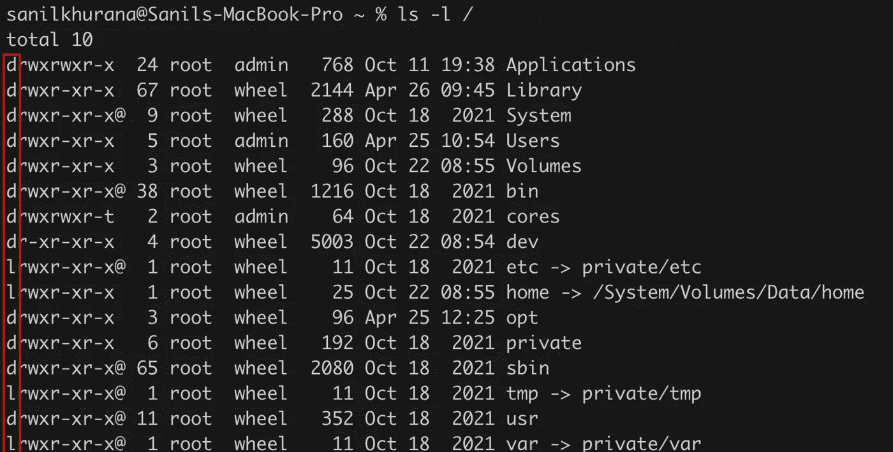
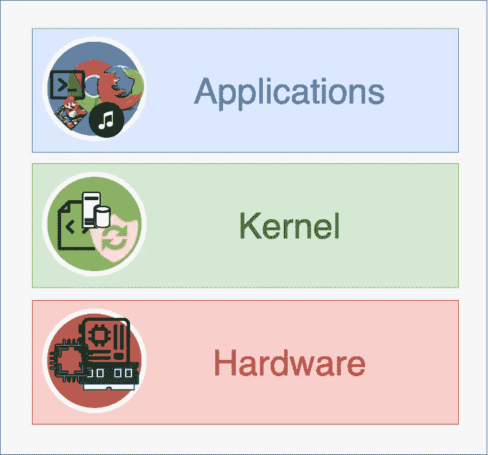
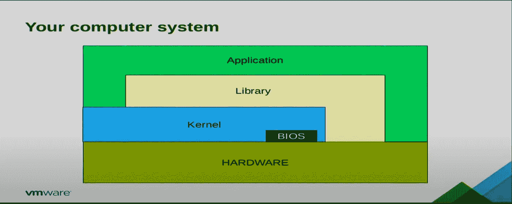
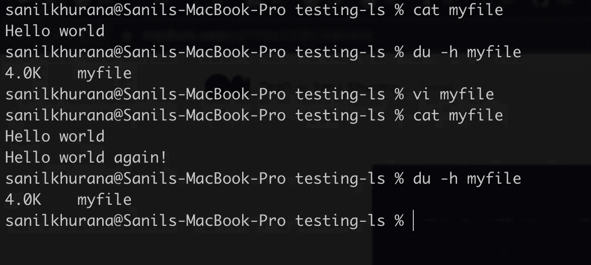

# “ls”是如何工作的？

> 原文：<https://betterprogramming.pub/how-does-ls-work-14fdc2b85308>

## 我探索了 Unix 中最有用和“过度设计”的命令之一背后的代码


[来自壁纸 flare](https://www.wallpaperflare.com/linux-tux-simple-minimalism-wallpaper-gjzim)

# 为什么我想谈论 ls？

我认为探索一点 Linux 代码和它在内部是如何工作的会很有趣。我觉得我对操作系统的了解相当有限，所以我认为深入代码并试图理解它会推动我真正理解一些基础知识，如内核、inodes、信号等。如果你也有同感，那就继续吧！

不过，快速前言，我可能会谈到的大部分代码都是用 C 编写的，如果你不懂 C，那也没关系。只要你对指针和结构之类的概念有了基本的理解，你还是应该能够理解所写的内容。如果你对 C、指针或结构一无所知，不要担心。继续讲下去，你应该能理解我将要讲的大部分内容。

让我们先快速讨论一下代码和目录结构。只有一个 5500 多行代码文件实现了`ls`、`ls.c`。该文件是 GNU coreutils 包的一部分，它只是一个包含其他常用工具的包，如`cd`、`cat`、`copy`等。

如果你真的很好奇，这里的[是源代码。如果没有，那么继续读下去，获得一个删节版。但是在我们继续之前，让我们讨论几个 Linux 概念。](https://github.com/coreutils/coreutils/blob/master/src/ls.c)

# 了解一些先决条件

## 信息节点

信息节点是关于文件的元数据。它们本质上告诉操作系统文件的所有者、所有者的`groupID`、文件拥有的权限、文件大小、文件在磁盘上的存储位置等等。`ls`命令的大部分输出来自 inode 信息！

然而，它们完全独立于文件名。因此，您可以重命名一个文件，它仍然具有相同的 inode。

我们可以使用带有`-i`选项的`ls`命令来查看文件的索引节点号。


我们会多谈一点关于 inode 的内容，但是现在，我们知道 Linux 创建了这些元数据对象来存储关于文件的数据，其中文件的数据存储在磁盘中，并且它们可以通过 inode 编号唯一地标识。

## 不同的文件类型

如果您还不知道，Linux 中的每个文件都有特定的类型。这实际上是运行`ls -l`时第一位代表的内容。



你可能已经猜到了，`d`的意思是目录。

对于像`ls`这样的常规文件，该位是不设置的。


除此之外，还有使用`l`字母的链接，使用`c`字母的字符特殊文件，以及相当多的文件类型。我现在不会一一介绍，但我知道有很多类型。

## 核心

我想我们都曾在教育或职业生涯中读到或听到过“内核”这个词。我个人总是听到流行但模糊的描述，比如“硬件和软件之间的接口”我们可能也见过这样的图表:


我相信这些都是非常宽泛的想法，至少对我来说，这并没有描述内核，留给我的问题比答案还多，我们为什么需要内核？应用程序可以直接与硬件交互吗？内核是做什么的？它提供了什么样的接口？它对内存、CPU 或其他硬件有多少访问权限？中间还有其他层吗？

所以，我花了一些时间试图理解内核和它真正的含义。这是我解释它的机会。

把操作系统想象成三层。顶部是用户进程。这些是网络浏览器、应用程序、你的网络服务器等。


这下面是内核。这包含了大量与硬件直接交互的代码，比如设备驱动、内存管理、权限等等。所以当你执行一个没有`sudo`的命令，而这个命令需要 sudo 时，得到的回应是你不能这么做，这就是内核。尽管它的大部分细节通常对美国软件工程师是隐藏的。


内核下面是硬件。这是物理内存、磁盘、CPU、网卡等。，在你的系统里。



对于涉及硬件的操作，进程可以对内核进行系统调用。


例如，一个进程必须读取磁盘上的一个文件，并对内核进行系统调用。内核获得关于进程的信息，例如，哪个用户执行了进程，哪个用户创建了可执行文件，等等。，并决定要做什么。

如果它觉得一切正常，它会创建一个文件描述符并将其返回给进程。

你们中的一些人可能会说，你从来没有编写过任何进行系统调用的代码。这很正常。大多数现代编程语言都在内核之上构建了一个接口，使得大多数操作变得更加容易。这一抽象层做了很多工作，比如错误处理、日志记录、管理文件描述符、管理内存(这一层没有自动垃圾收集！)，等等。比如[这个](https://github.com/python/cpython/blob/main/Modules/_io/_iomodule.c)就是 Python 的`open`函数的来源。

绕过内核，让进程直接与硬件对话是可能的，尽管这通常并不简单，甚至对大多数来说也不是必需的。我发现了一些绕过内核的例子，但是这些看起来真的是小众用例。

例如，[这篇来自 Cloudflare](https://blog.cloudflare.com/kernel-bypass/) 的帖子谈到了他们如何绕过内核来实现更高的网络性能。

BIOS，我们听到的另一个流行词，是直接与硬件交互的东西。另一方面，BIOS 是主板的一部分，它的功能非常有限。它为主板提供基本的输入和输出，并在引导过程中提供帮助。应用程序根本不会与 BIOS 交互。

我发现 Steven Rostedt (他是 Linux 内核的开发者之一)的这个演讲对理解这些概念非常有帮助。我认为这张来自演讲的图表很好地总结了这一点:



如果你想更深入地研究这个问题，我建议你去看看这个演讲。

## 系统调用

系统调用是 Linux 内核的接口。就像我们的服务向用户公开 REST API 接口一样


系统调用为 Linux 内核提供了一个接口。


为了更多地了解这些系统调用，让我们写一点代码吧！这里你可能会问的第一个问题是，选择哪种语言？

答案有点复杂，但是我们先来了解一下在 C 中是怎么做的，然后我们再花点时间思考一下如何在其他语言中执行同样的操作。

现在，让我们试验一下`stat`系统调用。这个调用非常简单。它接受一个文件路径，并返回关于该文件的一系列信息。现在，我们将打印两个返回值，即文件的所有者和文件的字节大小。

输出是可以预测的，如下所示:

```
uid = 765
filesize = 11
```

回到我们关于语言的讨论，我们能用 Python 或 NodeJS 写同样的程序吗？

这些语言在内部调用相同的系统调用，因为您只能使用这些系统调用来与硬件交互。例如，在这里查看一些 NodeJS 代码，您可以看到它是如何开始文件路径的。他们围绕这些系统调用做了更多的工作，为开发人员提供了一个更简单的接口，但是在幕后，他们正在进行内核提供的相同的系统调用。

## 科里蒂尔斯

GNU coreutils 是一个安装在每个 Linux 发行版中的通用工具包。这些提供了像`cat`、`ls`、`copy`等命令。

在内部，这些命令对 Linux 内核进行多次系统调用，并进行大量的格式化、颜色、错误处理等。

## 什么是目录？

就像 Linux 中的其他东西一样，目录也是文件。

但与常规文件不同，目录链接到它们包含的文件。这些数据是如何在内核中被抽象出来的(下一篇关于探索 Linux 内核源代码的文章？！)，但我们并不关心他们是如何存储这些信息的。我们只关心如何检索这些信息。

[为此，我们把系统称为](https://pubs.opengroup.org/onlinepubs/7908799/xsh/readdir.html) `[readdir](https://pubs.opengroup.org/onlinepubs/7908799/xsh/readdir.html)` [。](https://pubs.opengroup.org/onlinepubs/7908799/xsh/readdir.html) `readdir`允许我们读取目录中的文件。这实际上非常简单，我们调用`readdir`，并且在每次调用时，它都返回给我们一堆关于目录中的单个文件的信息。我们需要一直循环调用它，直到它返回 NULL，此时它已经遍历了目录中的所有文件。

让我们通过一些简单的代码来看看它是如何工作的:

这是输出结果:


所以目录只是关于它们存储的文件的数据。

## 斯达

`stat`是一个常见的系统调用，用于获取文件的 inode 信息。它返回了很多信息，我们一个一个来了解文件在 Linux 中是如何表示的。

这是由`stat`系统调用返回的所有数据。

```
dev_t  st_dev;
mode_t  st_mode;                 
nlink_t  st_nlink;               
uid_t  st_uid;
gid_t  st_gid;
dev_t  st_rdev;
off_t  st_size;
blkcnt_t st_blocks;
blksize_t st_blksize;
```

您可以在`stat`命令中使用`-x`标志来查看详细输出。


再次提醒一下，`stat`命令不同于`stat`系统调用。`stat`命令是一个用 C 编写的有用的包装器(在 GNU coreutils 中打包成一个命令),它调用`stat`系统调用。所以这个命令并没有显示出`stat`系统调用的全部输出。我用 C 写了一些简单的代码来执行`stat`系统调用并打印其输出。

这是我得到的输出:


我知道这很多，但是别担心，大部分都不重要。像`st_id`(用户 ID 的缩写)、`st_guid`(组 ID 的缩写)、`st_size`(以字节为单位的文件大小)这样的字段应该已经很明显了。我只是想展示一个例子，说明进行系统调用是多么容易。

# 浏览代码流

代码很长。就是 5500+线，也不好看。

不用说，试图涵盖所有内容是不可能的，所以我尽力绘制出总的流程，并将所有的复杂性都隐藏起来。

如果你真的想花时间去理解`ls`的全部代码，在我看来，唯一的方法就是[检查代码](https://github.com/coreutils/coreutils/blob/master/src/ls.c)。

如果你想要节略版，看看我下面画的流程图。

对于经历过这种情况的人，完全免责声明——这是一种极端的过度简化，但这张图片应该让你对一切是如何工作的有一个大致的了解。


# 结论

你们中的一些人可能已经注意到，这篇文章主要是关于理解 Linux，而不是关于`ls`，这就是我的学习过程。事实上，这是我一开始的目标！

总的来说，Linux 和操作系统是巨大的。如果没有找到一个有趣的部分来探索，通过看书和看讲座来深入覆盖它们是很困难的(也是很无聊的)。所以，我选择了一些感觉非常有趣和有挑战性的东西，并跟随它到它带领我去的任何地方，我知道在我理解`ls`之前我会学习很多关于 Linux 的东西。

# 旁注

## 过度工程化

在结束这篇文章之前，我想展示我在一个流行的 GNU 项目中发现的一段引文:

> `*ls*`命令是 coreutils 中最复杂的实用程序。丰富的功能，如格式控制、颜色支持、模式过滤和排序与信号处理程序、哈希表、 [obstacks](http://www.gnu.org/software/libc/manual/html_node/Obstacks.html) 、[接口模式](https://www.emacswiki.org/emacs/DiredMode)、缓存和访问控制交织在一起，提供了一个多功能的工具。
> 
> —[http://www . maizure . org/projects/decoded-GNU-coreutils/ls . html](http://www.maizure.org/projects/decoded-gnu-coreutils/ls.html)

我真的很喜欢这句话，因为我是在埋头于`ls.c`源代码时读到这句话的。如果我还没有提到，它有 5500+行长！很多都是关于颜色、格式、过滤等等。很高兴发现我不是唯一一个认为代码有点长的人！

## 你的文件有漏洞吗？

先说我写的打印 stat 输出的 C 程序。这是我运行它时得到的输出:


这是该文件包含的内容:


但是我上面附上的截图有一点很诡异。试试看能不能找到不一致的地方。

如果你还没找到，我们来做个小实验。我会更改文件的内容，然后再次运行我的代码。


用旧内容和新内容运行`du -h`也揭示了一些有趣的事情:



如果你还没想明白，运行`du`时文件大小好像没有变化。另外，`stat`命令显示了`st_size`的不同值，但`st_blocks`的值保持不变！`st_blocks`显示块计数始终保持为 8，结果为 4096 字节([由于历史原因，无论](https://unix.stackexchange.com/questions/521151/why-is-st-blocks-always-reported-in-512-byte-blocks) `[st_blksize](https://unix.stackexchange.com/questions/521151/why-is-st-blocks-always-reported-in-512-byte-blocks)`的值如何，Linux 中的块大小始终为 512)，因此文件占用的字节似乎没有变化！

然而，为什么会发生这种情况呢？

让我们快速浏览一下这里发生了什么。当您想要在硬盘或固态硬盘上存储数据时，您可以将数据存储在“块”上块是文件系统中数据存储的最小单位。它本质上是建立在物理硬件之上的抽象概念。当操作系统想要写入或读取数据时，它实际上是在读取或写入数据块。所以当你想读一个文件时，操作系统会找到文件所在的块，然后一个一个地捡起这些块。

像`ext4`这样的文件系统不能在一个块中存储多个文件。但是单个文件可以存储在多个块中。这意味着如果你创建一个只有一个字符的文件，它仍然占用一个块。对于我的系统，块大小是 4096 字节或 4KB。该文件总是占用磁盘中 4KB 的空间。我创建的任何文件，即使只包含一个字符，也总是会占用至少一个块。该块是保留的，不能用于任何其他文件，因此即使包含单个字符的文件也仍然会占用磁盘上 4KB 的空间。

这是我在探索其他东西时进入的一个有趣的小侧道，但它对我来说很有趣，很新，所以我想我也可以在这里添加它。