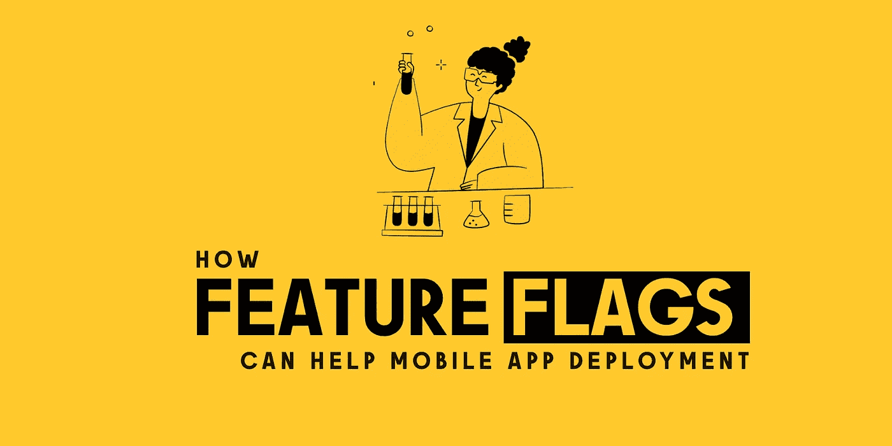

# 使用此功能标记 Swift 库提高您的 iOS 应用程序部署速度

> 原文：<https://betterprogramming.pub/how-feature-flags-can-help-speed-up-your-ios-app-deployment-580f1e0138d3>

## 功能标志通过允许软件功能在任何时候切换，彻底改变了移动开发

现代移动开发进展迅速；在我们的团队中，我们每两周发布一次 iOS 应用的新版本。

如果你足够幸运，生活在团队扩张的时刻，你也会看到一切都开始放缓的确切时刻，因为你有许多正在进行的东西还没有准备好投入生产。

这是一个典型的扩展问题，你需要重新思考你和你的团队如何执行日常工作*(如果你正在经历这种转变，你真的应该看看 Gergely Orosz 的* [*【大规模移动应用】*](https://www.mobileatscale.com/)*。*

*伟大的功能需要时间来构建。如何让团队高效工作——自由试验——同时保持应用程序处于可发布状态？*

*Feature Flags 是您可以用来更好地处理团队存储库中流量增长的策略之一。*

# *什么是功能标志？*

*一些人称之为“特性切换”，一些其他的“特性开关”或“特性控制”。所有这些都是特性管理解决方案的名称，它使开发人员或产品经理能够在不部署新代码的情况下更改产品的功能。*

*你可以把一个特性标志看作是你的代码中的一个决策*停止点*，它可以改变你的产品的行为。您可以选择允许开发人员/测试人员/产品团队在运行时调整这些值。*

> *"(……)特性标记对于实验就像机器学习对于人工智能一样，没有第一个就没有第二个"[*just eat Tech Blog*](https://tech.justeattakeaway.com/2019/11/26/a-smart-feature-flagging-system-for-ios/)*

# *常见场景*

*特性标志对于移动开发团队的许多典型场景都很有帮助。*

## *避免持久的分支*

*在这种环境下，您可以让开发人员在他们的代码中合并，而不需要处理持久的分支*(每个开发人员都讨厌每次都解决令人厌烦的合并冲突，持续几天，或者更糟，持续几周)*。*

> *特性标志允许**让你的 MRs small &保持专注，主分支可以*持续更新*，你可以无忧无虑地发布每夜构建(*)** 。*

## *降低风险*

*即使有最好的开发人员和严格的测试技术，错误还是会发生。*

*想象一下:在几个月的工作进展之后，你的团队刚刚发布了一个令人惊奇的新特性，你被邀请让你的用户来试用它。不幸的是，事情并没有像你想象的那样发展，你发现了一个意想不到的错误。现在，您可以部署 hot fix 或恢复该功能。*

*然而，部署移动应用程序并不容易，因为对于 web 应用程序或网站来说，应用程序审查可能需要等待 1-2 天。这太可怕了，因为你有失去用户的风险。你必须马上做点什么！
通过远程控制标志，您可以暂时禁用该功能，同时慢慢发布热修复程序。*

## *A/B 测试*

*功能标志可用于为多组用户激活不同的体验。例如，您可以将您的用户群划分为几个部分，并衡量转化绩效，以选择更高的产品转化率、参与度、增长率、订阅率或收入。*

## *产品活动/早期访问*

*产品和营销团队可以在准备就绪时远程安全地部署功能。他们可以向一组精英用户或新用户授予对某个功能的访问权限，以提高参与度。*

# *我们的发展方案*

*在我们的团队中，我们使用特性标记来控制进行中的特性，这样我们就可以继续构建和测试它们，而不会在它们准备好之前将它们暴露给最终用户。合并请求简短而集中，即使尚未完成，也会进入主分支。显然，在一切准备就绪之前，它们是默认禁用的，但是团队可以继续标准的发布周期。*

*为了让它变得轻松，在 iOS 团队中，我们开发了一个名为 [RealFlags](https://github.com/immobiliare/RealFlags) 的内部开源库来轻松处理功能标志。该库背后的想法是使用新的 Swift 语言特性的最佳功能，在多个提供者上创建一个**强大的抽象层**，您可以使用它来设置您的实验实验室。RealFlags 与 Swift 相伴而生，我们用来制作它的绝大多数核心概念都在当前的主要 5.x 中引入。*

*在下面的帖子中，我将根据我们的经验，用代码示例和建议来描述架构和核心引擎。*我要感谢启发了下面工作的几个开源库:*[*just eat 的 JustTweak*](https://github.com/justeat/JustTweak) *，Yahoo 的*[*Override*](https://github.com/yahoo/Override)*和 Ross Butler 的*[*FeatureFlags*](https://github.com/rwbutler/FeatureFlags)*。**

* [## github-immobiliare/real flags:swift sauce 中的❇️功能标记框架(支持动态数据…

### RealFlags 使得在代码库中配置特性标志变得很容易。它专为 Swift 而设计，提供了一个简单而…

github.com](https://github.com/immobiliare/RealFlags) 

# 你想从特征标志中得到什么

正如我在文章开头所说的，移动开发进展很快；产品*仍在发展*，约束改变了，你的代码很容易变成你需要重构的遗留代码。

我们的新 Swift 应用程序诞生不到 4 年，但在此期间，我们重写了几个部分:功能标志帮助我们使这一过程循序渐进。事实上，我们以对最终用户透明的方式从旧的实现转移到新的实现。

但是产品不仅仅是技术问题*(一些开发者倾向于忘记它)*。作为一个持续的实验，你的产品团队会引入新的特性，通过 A/B 测试启用/禁用现有的特性，等等。

所以特征标志引擎必须满足*和*这些要求:

*   **很简单** —目标是尽可能隐藏复杂性。您的团队必须能够轻松地定义和管理功能标志。事实上，你应该间接鼓励开发者使用它们。
*   这是一个关口 —它必须充当未完成功能的关口。开发人员/质量保证人员/产品必须能够测试他们开发过程正在进行，而发布周期可以不间断地继续。
*   **它鼓励良好的习惯** —标志必须是自描述的，并且易于组织:你可能以许多不同的特征标志结束。在混乱中迷路的可能性很高，你肯定不想浪费时间去寻找旗子在哪里以及它意味着什么。图书馆本身应该号召好习惯。
*   **很抽象** —当您的产品团队决定将所有服务转移到其他地方时，您不希望依赖特定的服务，而只是浪费时间和资源从头开始重写。第三方 SDK 不在你的团队控制之下，支持多个特性标志提供者是不同的。
*   **它支持不同数据类型**——通常一个特征标志只是一个布尔值，但是你需要使用 Int、Float、String 或者你自己的结构、枚举或者类！您应该能够轻松地保存和设置它们。
*   **特性标志是可发现的** —为了简化您的开发工作并允许 qa/product 使用标志，您应该准备一个很好的用户界面来浏览和更改值。

当你需要选择如何组织你的标志以及如何查询值时，RealFlags 就像一个编排库。

# 介绍

RealFlags 提供了一个简单的 UI 来交互和修改您的标志。功能标志被组织在集合中；您可以使用自己的标准来定义集合。一旦完成，你可以在你的应用程序中添加一些隐藏的菜单部分，并告诉浏览器显示它们。

下面你可以看到 RealFlags 菜单，它非常适合我们的开发者工具菜单。仅当应用程序在调试中运行或从试飞安装中运行时，此部分仍然可见。

您可以使用以下代码来显示您的调试菜单，以呈现应用程序的功能标志

我们有不同的旗帜，我们选择按照竞赛区域来组织它们，最终收集的是专用于遥控的旗帜。

在撰写本文时，RealFlag 的最新版本是 1 . 2 . 0；你可以通过 CocoaPods 或 SPM 使用它([更多信息](https://github.com/immobiliare/RealFlags#installation))。

# 设置

是时候设置您的堆栈了；现在，您已经准备好创建您的第一个收藏了。假设你想为用户的实验特性创建一个部分。

我们称之为`UserExperiments`:在这个部分中，产品团队可以启用或禁用一些惊人的功能。使用 [Firebase 远程配置](https://firebase.google.com/products/remote-config?gclid=CjwKCAiA866PBhAYEiwANkIneKXiDQpTt25Nr-5kQdFylYUMTRO0QouOrgAajsbt9HJG5fRz6yVujBoCysMQAvD_BwE&gclsrc=aw.ds)也可以远程控制一些标志。

作为一个好习惯，RealFlags 允许你声明集合的蓝图(一个集合是一个符合`FlagCollectionProtocol`的结构)包括内部标志。虽然您可以创建集合的集合，但为了清晰起见，我强烈建议避免这样做。

特征标志只是一个由`@Flag`装饰器包装的变量。从技术上讲，它是一个[属性包装器](https://github.com/apple/swift-evolution/blob/master/proposals/0258-property-wrappers.md)，定义了标志的所有属性和元数据。简而言之，属性包装器是一种通用数据结构，它封装了对属性的读/写访问，同时添加了一些额外的行为来增强其语义，同时避免代码重复。

假设您想要创建一个`enableSSON`标志，允许用户使用单点登录来登录应用程序。
默认情况下，该标志关闭:

`allowsSSOn`是一个`Bool`标志，默认为`false` (RealFlags 支持 Int、String、Data、Date、URL、Dictionary、JSON 和[所有数据类型符合](https://github.com/immobiliare/RealFlags/blob/main/documentation/introduction.md#12--flag-supported-data-types) `[Codable](https://github.com/immobiliare/RealFlags/blob/main/documentation/introduction.md#12--flag-supported-data-types)`)其中。

`description`字段用于描述浏览器中的标志，所以填写时要小心。我们还指定了`key`:它表示字符串 RealFlags 将使用它来查询每个数据提供者*(您可以根据需要配置它***)*。您还可以设置[更多配置参数](https://github.com/immobiliare/RealFlags/blob/main/documentation/introduction.md#11-flag-annotation)。*

*数据提供者只是数据的来源；当您查询一个标志的值时，RealFlags 查询—按顺序—每个提供者都获得那个键的值。第一个用非零值响应的对象用该值停止链。如果没有数据提供者能够响应(或者您没有定义任何提供者)，那么将返回`default`值。*

# *加载收藏*

*因为上面的代码只是我们集合的蓝图，现在我们需要加载它。`FlagsLoader`是一个[泛型感知的](https://docs.swift.org/swift-book/LanguageGuide/Generics.html)类，负责读取(通过[镜像](https://www.avanderlee.com/swift/reflection-how-mirror-works/))集合的结构。*

*通常，您会使用单个加载器来处理单个集合。当您实例化一个加载器时，您还将指定—按顺序—您想要用来查询每个标志的值的数据提供者*(注意:当您想要获得一个标志的值时，您仍然可以为每个标志排除一些数据提供者或者查询一个特定的数据提供者类型)。**

*实际上，您可以选择两个不同的数据提供者(但是您可以根据需要轻松地创建自己的数据提供者):*

*   *这是一个可写的提供者。它允许您只需提供文件目的地的 URL，就可以在沙箱中本地加载和设置值。*
*   *`FirebaseRemoteProvider`:只读提供者；允许您直接从 Firebase 的预配置会话中获取值(记住:您的 Firebase 必须在调用该提供程序之前通过`FirebaseApp.configure()`进行配置)。*

*我们的`FFService`是应用程序中的一个简单的助手类，它保存任何加载器的值:*

*init 中数据提供程序的顺序定义了查询优先级。获取标志时，引擎将按顺序检查提供者链，并从第一个拥有该标志的配置中选取标志。*

# *查询值*

*现在，您可以通过调用 userExpsLoader 来查询用户实验特性:感谢 [DynamicMemberLookup](/dynamic-member-lookup-in-swift-67e1c7e76fe1) 。Xcode 会自动完成集合定义的每个标志。只是魔法！*

*一旦被调用，RealFlags 将检查每个数据提供者内部的`allowsSSON`(“sson”)的有效值，首先在 RemoteConfig 中查找，然后在应用程序内部本地查找。*

*有时，您可能希望获得特定提供者内部的标志值。在这种情况下，您可以参考*预计值。W* e 将通过忽略在我们的加载程序中具有更高优先级的 Firebase 来获得`LocalProvider`的值:*

*使用投影值，您可以更精确地查询您的标志。*

*正如我们所说，我们可能有嵌套集合:*

*但是，`boomFeature`查询的键是什么？如果不为标志指定`key`，变量名称的 snake_case 版本将与变量本身的路径组合在一起。在这种情况下，查询的`key`是`secrets/boom_feature`。*

# *设置值*

*`LocalProvider`是一个可写数据提供者的例子:这意味着你可以改变一个标志值，它在应用程序启动之间保持不变。*

*因为我们为不同的国家维护了几个目标应用程序，所以我们使用了`setValue()`来保存一个定义的蓝图文件，同时在一个条件 init 中更改默认值:*

*您可以使用 setValue()函数来设置特征标志的默认值，而无需复制蓝图文件(并更改`default`属性)。*

# *计算标志*

*有时，您可能需要创建一个特性标志，其中的值是需要动态评估的其他标志或运行时值的组合。*

*这是一个使用`computedValue`的完美例子，它是[在查询任何数据提供者之前调用的回调](https://github.com/immobiliare/RealFlags/blob/main/documentation/introduction.md#14-computed-flag)函数。在这里返回一个非零值会停止这个链。*

*我们的建议是限制这种模式的使用，以保持代码的可读性。我们引入它来处理我们应用程序中的几个边缘情况。*

*rememberLogin 仅在 IT 区域设置和 SSON 处于活动状态时才处于活动状态*

# *显示浏览器*

*我们开始查看特征标志浏览器。但是我们还没说怎么表现出来。这很简单:*

*呈现 FlagsController 很简单；您需要传递您使用过的每个 FlagLoader，并希望在 UI 中列出。*

# *结论*

*在这篇文章中，我展示了 [RealFlags](https://github.com/immobiliare/RealFlags) 如何在添加一个抽象而灵活的特性标记方法方面提供巨大的帮助。*

*目前，我们正在旗舰产品中使用它；如果你想做出贡献，提供额外的功能或提供商，请查看 Github 项目页面！**