# 作为一名独立开发者，我如何在 4 年内建立起一个社交网络

> 原文：<https://betterprogramming.pub/how-i-built-a-social-network-in-4-years-as-a-solo-developer-4af70fb2d4c8>

## 对我旅程的幕后观察

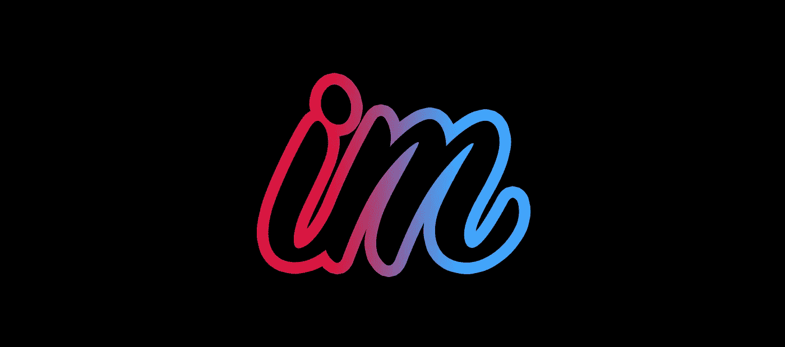

沉浸式社区——内容创作者的社交媒体平台

这是一个故事，一个完整的曝光，关于我的个人开发项目，[沉浸式社区](https://immersive.community)——一个面向内容创作者的社交媒体平台，我在 2018 年初开始着手，在 2022 年完成。我希望它能为那些正在开始一个大项目或者正在建设一个大项目并且需要继续前进的人提供指导。

# 这个想法

早在 2018 年初，微弱的声音开始出现。人们开始对网络和社交媒体的总体状况发表意见。一些人对脸书及其用户隐私政策不满；其他人抱怨 YouTube 和它的赚钱方式，而其他人则反对他们表达意见的平台，比如 Medium.com。

但是所有这些的替代品会是什么样的呢？

# Solo-Dev 项目——创造中的历史

构建社交媒体平台的想法来自于让内容创作者能够以个人身份创建内容、参与他们的社区并为内容创建过程做出贡献的愿望。他们还可以在一个地方将自己的努力货币化。

这个平台应该是免费使用的，任何人都可以加入。创作者投入时间到他们的工作中，教育和娱乐世界各地的人们，也应该能够从他们喜欢做的事情中谋生。

这些能解决我们今天在网上面临的所有问题吗？不，但这是一种选择，这才是最重要的。这是一颗种子，随着时间的推移，可以变成美丽的东西。

作为一名技术人员，我也想知道一个人能否完成所有这些工作。一个人能否迎接挑战，提供一个人们喜欢使用的健壮的企业级平台？如果可以，需要什么来提供这样一个系统？

老实说，我不知道这些问题的答案，但我决定接受挑战。

在 2018 年的早期，我有大约六年的软件开发工作经验，主要是后端。NET 和一些 WPF 在前端。我也一直住在东京，我搬到那里不到三年，加班是常态。承担额外工作的想法是不合理的。

如果它想被尽可能多的人使用，这个平台就需要是一个网站。由于几乎没有 web 开发经验，这些似乎都无法实现。

事实上，这似乎是不可能的，这正是为什么我决定开始越早越好。所有这些会是对时间的巨大浪费吗？只有时间能证明一切，但我越早开始，就能越早找到答案。

然后，2018 年 2 月 1 日，我开始计划。

# 2018 年—计划

我决定做的第一件事是告诉自己——认为这不容易是对本世纪的轻描淡写。我以前从来没有做过这样的事情，所以我真的不知道自己在做什么。

这意味着在这件事完成之前，没有爱好或任何类似的生活。全职加班，然后回家做这个项目将成为新的标准。我会在某个时候休假旅行吗？是的，但是我将不得不在假期的大部分时间里工作。

如果说我从之前的经历中学到了什么，那就是有条不紊决定着你项目的成败，让你保持在正轨上。你前期准备和设计的越多，你以后需要做的试错工作就越少。

思考和计划比构建更容易，花费的时间也更少，所以我在计划阶段做的越多，我在实际开发阶段需要发现的就越少，这需要更多的时间。

我没有资源，只能用规划设计来弥补。我也知道当我陷入困境时，web 是我应该去的地方，但是我决定不在这个项目中询问关于堆栈溢出的新问题。

这个决定背后的原因很简单。看到这里有很多东西要学，如果我去请人解决我所有的问题，我不会获得任何经验。这个项目越深入，就会变得越困难，而且我也没有获得任何独自解决这个问题的经验。

因此，我决定只在网上搜索已经存在的答案，而不是提出新的问题来解决我的问题。一旦项目完成，我可以再次参与堆栈溢出，但这是这个特定开发目标的禁区。

我会利用 [OOAD](https://en.wikipedia.org/wiki/Object-oriented_analysis_and_design) 方法来设计我想要构建的系统。系统会告诉我每个部分如何工作，以及它如何与系统的其他部分交互。此外，我将提取业务规则，稍后用代码实现。

产品评论的早期注释

然后我开始记笔记，并意识到有两个要点我必须关注:

*   项目设计
*   技术堆栈

因为我知道一天只有 24 个小时，而且大部分时间我会花在工作或旅行上，所以我必须小心地优化我的时间。

# 项目设计

对于项目设计部分，我决定看看哪些产品已经运行良好，并以此作为灵感来最大限度地利用我的时间。

很明显，这个系统需要快速并且每个人都可以访问，因为我没有时间为多个平台写代码，所以网络就是答案。

然后我转向了设计。苹果以其广为人知的设计实践而闻名，是灵感的直接来源。接下来，我转向 Pinterest，认为这是最简单可行的设计，而且效果很好。我的决定背后的想法是一句老话。

> “内容为王。”——比尔·盖茨，1996 年。

这给了我一个想法，尽可能多地删除不必要的设计细节，专注于呈现内容。如果你想一想，人们会因为你的网站有一个很好的设计而来一次，但除非你有好的内容，否则他们不会回来。

这有助于减少设计前端所需的时间。

系统本身必须简单。每个用户都应该能够创建和拥有自己的社区。其他用户应该能够作为成员加入，并写文章为这个社区贡献内容。这一功能将受到维基百科的启发，在那里许多用户可以编辑同一篇文章。

如果许多人一起讨论某个话题，这告诉我们，我们手边的是一个社区，因此，应该与其他部分分开。

就功能而言，用户需要能够像维基百科那样撰写常规文章并连接它们，还需要评论，这需要不同类型的文章。因此，常规文章将被称为“兴趣”，本质上是事实性和信息性的，任何人都可以编辑它们。另一方面，“评论”将基于每个兴趣，只有评论的作者可以编辑它。

简而言之，人们可以合作写一部电影，比如说“黑客帝国”，并随时编辑那篇文章。他们可以在文章中添加任何他们想要的事实信息。

然后，每个用户可以写他们自己的电影评论。自然，最初的文章会显示这部电影的所有评论列表。

我很清楚，我还必须添加两个更重要的特性。第一个将是每个社区的文章搜索选项。另一个功能是推荐，当用户滚动到文章末尾时，就会根据他们的喜好得到推荐。

每个用户也应该能够张贴简短的更新或“活动”到他们的个人资料，这将作为脸书的一面墙。这是我在开始考虑可以用来实际交付项目的技术之前所做的基本概述。

# 技术堆栈

我关注的第二件事是技术堆栈。因为我已经决定要建立一个基于 web 的项目，所以我决定写下当时最常用的所有流行的现代技术。然后，我会选择那些技术上与我在职业生涯中已经使用的技术最接近的技术，尽可能少花时间学习新技术。

此外，在这个阶段引导我思考最多的想法是做出设计决策，要求我编写尽可能少的代码，从而节省时间。

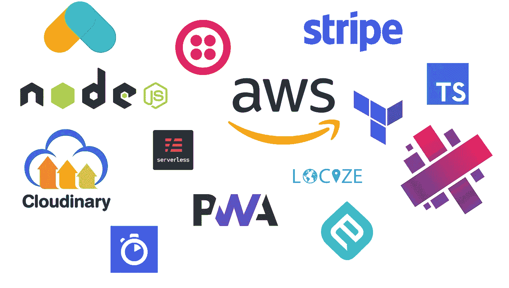

沉浸式社区技术堆栈

经过广泛的研究，我选定了以下主要技术:

*   [节点 j](https://nodejs.org/en/)
*   [PWA](https://web.dev/progressive-web-apps/)
*   [无服务器](https://en.wikipedia.org/wiki/Serverless_computing)
*   [奥雷利亚 JS](https://aurelia.io/)
*   [AWS 认知到](https://aws.amazon.com/cognito)
*   [AWS AppSync](https://aws.amazon.com/appsync/)
*   [AWS DynamoDB](https://aws.amazon.com/dynamodb)
*   [AWS Kinesis](https://aws.amazon.com/kinesis)
*   [AWS Cloudfront](https://aws.amazon.com/cloudfront)+[S3](https://aws.amazon.com/s3)
*   [地形](https://www.terraform.io)

此外，通过选择 SaaS 服务，我将进一步节省时间，因为我不需要自己实现这些功能。我决定的服务如下:

*   [云淡风轻](https://cloudinary.com)
*   [内嵌](https://embed.ly)
*   [阿尔戈利亚](https://www.algolia.com)
*   [建议](https://www.recombee.com)
*   [定位](https://locize.com)
*   [特维利奥](https://www.twilio.com)
*   [条纹](https://stripe.com)

这些是我必须尽快学会的主要技术，甚至在开始这个项目之前。其他的一切都需要在这个过程中学习。

此时，我开始学习新技术。对于最主要和最重要的，我开始阅读以下书籍:

*   [行动中的亚马逊网络服务](https://www.manning.com/books/amazon-web-services-in-action)
*   [AWS 上的无服务器架构](https://www.manning.com/books/serverless-architectures-on-aws)
*   [奥雷利亚在行动](https://www.manning.com/books/aurelia-in-action)
*   [什么是 WebPack](https://survivejs.com/webpack/what-is-webpack)
*   [认知开发指南](https://docs.amazonaws.cn/en_us/cognito/latest/developerguide/cognito-dg.pdf)
*   [CloudFront 开发指南](https://docs.amazonaws.cn/en_us/AmazonCloudFront/latest/DeveloperGuide/AmazonCloudFront_DevGuide.pdf)
*   [DynamoDb 开发指南](https://docs.aws.amazon.com/amazondynamodb/latest/developerguide/dynamodb-dg.pdf)
*   [带 AppSync 的无服务器 GraphQL】](https://www.amazon.com/Serverless-GraphQL-Amazons-AppSync-API-University/dp/1717110703)
*   [Terraform 启动并运行](https://www.terraformupandrunning.com)
*   [渐进式网络应用](https://www.manning.com/books/progressive-web-apps)

我决定白天做我的全职工作，但是晚上也是公平的。当我回家的时候，我可以一直学习到睡觉。就睡眠而言，我会把它减少到六个小时，以便有更多的时间学习。

我最初预测我只需要一年的时间来建立这个项目。然后，在学习新技术近一年后，2018 年 12 月，我刚刚完成了主要的阅读材料，同时编写了零行代码。

# 发展开始了

2018 年 12 月，我终于开始开发了。我设置了 Visual Studio 代码，并开始构建我的开发环境。

从第一天起，我就清楚地意识到，我无法维护如此大型项目所需的所有服务器。不仅仅是从技术角度，还有预算方面。因此，我必须找到一个解决办法。

幸运的是，我以 DevOps 和后端基础设施的无服务器方法的形式找到了解决方案。甚至在这些方法像今天这样广泛使用之前，我就很清楚，如果我们可以用代码简洁地描述一些东西，我们也可以自动化它，节省时间和资源。

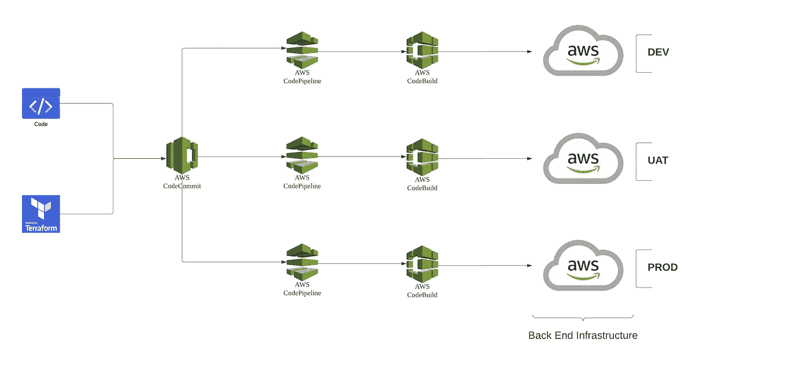

后端基础架构的 CI/CD 管道

使用 DevOps，我可以统一和自动化前端和后端开发，而使用 Serverless，我可以消除对服务器维护的需求，并降低运营成本。

这一理念显然符合我的想法，我决定的第一件事是用 Terraform 建立一个 CI/CD 管道。

设计包括三个分支:开发、UAT 和生产。我每天都要工作，当工作完成后，我会在 AWS CodeCommit 中向开发分支提交变更，这将触发 AWS CodeBuild 来构建我的项目。

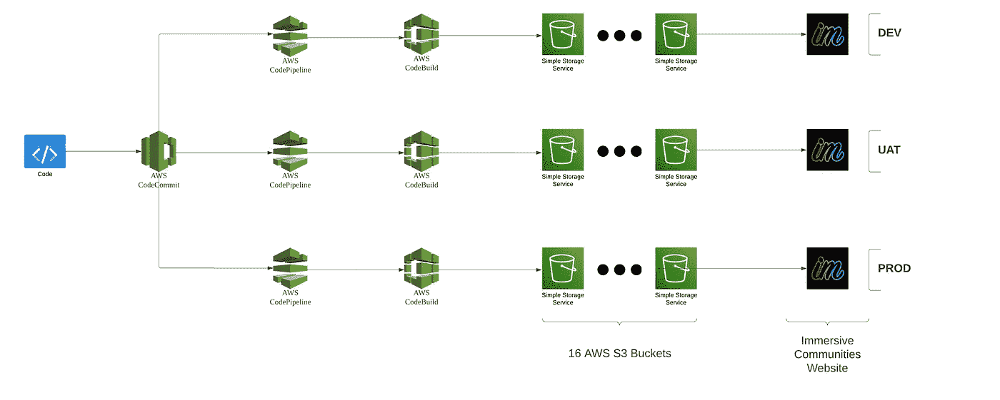

沉浸式社区前端的 CI/CD 管道

我会在仓库中保存一个 Terraform 可执行文件，供 macOS、本地测试和 Linux 在 CodeBuild 上构建。一旦构建过程开始，Terraform 可执行文件将在 CodeBuild 中被调用，它将获取 Terraform 代码文件，从而在 AWS 上构建我的基础设施。

然后，所有这些部分都必须连接起来并实现自动化，我使用 AWS 的代码管道做到了这一点，每次提交时，它都会将代码从 CodeCommit 转移到 CodeBuild。这将帮助我保持代码和基础设施的同步。每当我准备向前推进时，我会将 UAT 或 UAT 的开发分支合并到生产部门，以同步我的其他环境。

# 2019 年-新冠肺炎热播

一旦我完成了后端的 CI/CD 管道，我会转而在本地建立实际的网站，开始开发前端。

设置前端的第一步是创建一个基于 Aurelia 的项目。使用 Aurelia 和 not React(过去是，现在仍然是 JavaScript 框架最流行的选择)背后的决定是因为 [MVVM](https://en.wikipedia.org/wiki/Model%E2%80%93view%E2%80%93viewmodel) 模式。

MVVM 模式在我体验过的 WPF 桌面应用中被广泛使用。因此，学习 React 要比简单地建立在我已经知道的基础上花费更多的时间。

另一方面，使用 Aurelia 而不使用 Angular 或 Vue 的决定是基于 Aurelia 背后的哲学，即让框架离开你的方式。换句话说，奥雷利亚没有奥雷利亚。使用 Aurelia 开发时，您使用的是 HTML、JavaScript 和 CSS，以及一些附加功能，如数据绑定到属性。我对这些已经很熟悉了。

因此，这是最终决定。接下来，从静态类型化的 C#世界来看，我决定使用[类型脚本](https://en.wikipedia.org/wiki/TypeScript)而不是 JavaScript。

接下来是 WebPack。很明显，需要将应用程序分成几个块，以方便延迟加载。因为我已经知道应用程序中会有许多功能，所以必须将其构建为能够按需加载部件的 SPA。否则，用户体验将是不可接受的。

为了更容易处理 WebPack 配置，我添加了[中微子。JS](https://neutrinojs.org) 到 mix 并使用它的 fluent 接口来设置 WebPack。

众所周知，即使在 2019 年，移动网络浏览也在增长。为了适应现代网络，开发方法定义如下:

*   [移动优先](https://xd.adobe.com/ideas/process/ui-design/what-is-mobile-first-design/)
*   [离线——第一次](https://offlinefirst.org)

这得益于两项主要技术:[顺风 CSS](https://tailwindcss.com) 和 PWA。谈到样式，为了进一步简化系统，我添加了 Tailwind CSS。这被证明是我做的最好的决定之一，因为它默认是移动优先的。而且，它是基于效用的。因此，它具有很高的可重用性，这正是我所寻找的。

此外，由于我试图提供类似本机的体验，但没有时间构建本机应用程序，我决定退而求其次——一个可以直接从浏览器安装并离线工作的应用程序。

这就是渐进式网络应用程序(PWA)的目标，但手动设置太容易出错，也太耗时。因此，我决定使用 [Google WorkBox](https://developer.chrome.com/docs/workbox) ，它内置了服务人员安装、离线和缓存功能。

一旦建立了核心，就该在网上兜一圈了。很明显，任何人在任何时候都可以访问这个网站，停机不属于现代系统，所以我决定用下面的方法来设置这个系统。

首先，HTML 和 JS 文件将由 AWS S3 存储桶提供。AWS CloudFront CDN 网络将使其在全球范围内实现低延迟。

在这种情况下，我还决定使用[无服务器框架](https://www.serverless.com)，因为设置 [AWS Lambda](https://aws.amazon.com/lambda) 函数比使用 Terraform 更容易。因此，我引入了一项新技术，我不得不小心翼翼。

设置完成后，我购买了 AWS Route 53 中的域(用于测试)和生产域。[https://immersive . community](https://immersive.community)。

这个名字背后的想法来自一个类似命名的基于社区的网络— [Mighty Networks](https://www.mightynetworks.com) 。我决定用“身临其境”这个词，因为在那个时候，它在谷歌上开始成为热门话题。因为“immersive.networks”和“immersive.communities”已经有人用了，所以我选择了“immersive.community”

现在我已经启动了前端，是时候开始处理数据库了。尽管我过去习惯于基于 SQL 的关系数据库，但对于这个特定的项目来说，它们显然太慢了，所以我决定使用 NoSQL 数据库。我选择 AWS DynamoDB 是因为它的无服务器产品。

为了访问数据库，我选择了 AWS AppSync，这是一个托管的 GraphQL 实现，也是无服务器的。

# 多租户系统

此时，是时候开始解决我面临的最大问题之一了，即:

> 如何允许用户加入多个社区，但保持每个社区中的私有或受限数据相互分离？

解决这个问题最简单的方法是创建多个数据库，但是这有明显的局限性，因为在某些时候，我们会用完我们可以创建的数据库。事实证明，每个 AWS 帐户对您可以创建的资源数量都有限制，所以这不是一个可行的解决方案。

最后，我将通过为 DynamoDB 数据库中的每个条目分配一个 type 列来解决这个问题。每个用户都将其类型设置为“用户”，而每个社区都将被设置为“web”

然后，我会通过添加一个新行来指示用户已经加入了一个社区，其中该行的键被指定为“user#web_user#web”因为用户和社区名称是唯一的，所以这个键也是唯一的，所以用户不能多次加入社区。

如果我想执行一个只有在用户加入社区的情况下才能执行的操作，我会使用 AppSync 提供的管道函数，它允许您在 DynamoDB 中查询多行。然后，我会查询并检查用户是否是一个社区的成员，只有当他们是，允许用户执行的行动。

这解决了[多租户](https://en.wikipedia.org/wiki/Multitenancy)问题，但是要解决的最大问题之一就在眼前。

# 高可用性架构

企业级系统的构建考虑了容错和高可用性。这将允许用户继续使用该系统，即使其某些组件出现故障。如果我们想实现这样一个系统，我们应该考虑到冗余。

我的研究引导我找到了这种情况下的最佳解决方案，这是一个[主动-主动高度可用的](https://www.jscape.com/blog/active-active-vs-active-passive-high-availability-cluster)架构。原来 AWS 上的大部分服务已经是高可用了，AppSync 本身却不是。因此，我决定创建自己的实现。

网络没有解决这个问题，所以我必须建立自己的网络。我开始全球化思考。这意味着我的访问者将来自不同的地区，如果我将 AppSync 放在美国，那么亚洲的访问者将有更高的延迟。

我用下面的方法解决了延迟和高可用性问题。我决定在那时在所有可用的地区创建十个不同的 AppSync APIs。目前，原料药位于美国、亚洲和欧洲。

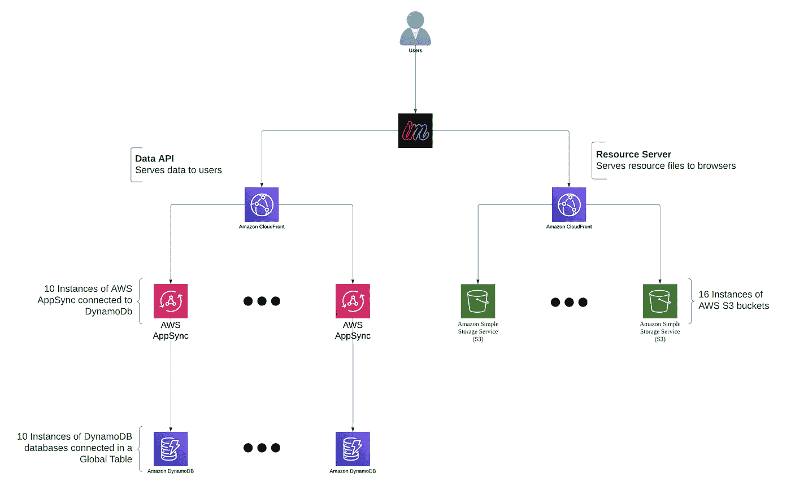

高可用性主动-主动架构

此外，每个 API 都需要连接到同一区域中相应的 DynamoDB 数据库。因此，我进一步创建了另外十个 DynamoDB 表。

幸运的是，DynamoDB 提供了一个全局表特性，可以在连接的 DynamoDB 表之间复制数据，并使它们保持同步。现在，无论用户在哪里写入数据库，不同地区的用户都可以在数据同步后读取相同的信息。

现在出现的问题是:

> 如何将用户路由到最近的 API？不仅如此，如果一个 API 失败了，我们如何立即将调用路由到下一个可用的 API？

解决方案以 CloudFront 和 [Lambda@Edge](https://aws.amazon.com/lambda/edge) 函数的形式出现。这是 CloudFront 的一个惊人特性，它可以在调用者所在的区域触发 Lambda@Edge 函数。应该清楚的是，如果我们知道用户在哪里，我们可以根据调用来自哪里来选择 Lambda@Edge 函数中的 API。

此外，我们还可以获得执行 Lambda@Edge 函数的区域，从而允许我们在同一区域选择 AppSync API。实现这个解决方案的第一步是通过 CloudFront 代理 AppSync 调用。因此，这些调用现在将直接发送到 CloudFront，而不是 AppSync。

然后，我从 Lambda@Edge 函数内的 CloudFront 参数中提取 HTTP 调用。一旦我从 CloudFront 参数中提取了区域和 AppSync 查询，我将对相应的 AppSync API 进行新的 HTTP 调用。当数据返回时，我会通过 Lambda@Edge 函数将其传回 CloudFront。然后，用户将获得所请求的数据。

但是我们还没有解决主动-主动需求。现在的目标是检测 API 何时不可用，并切换到不同的 API。我通过检查 AppSync 调用的结果解决了这个问题。如果不是 HTTP 200 响应，调用显然失败了。

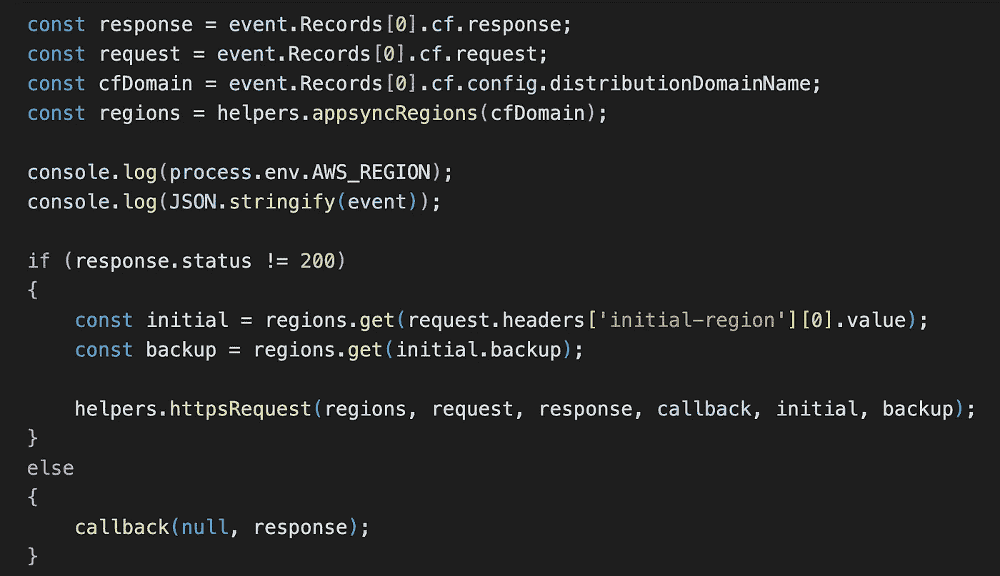

如果最初的请求失败，则执行另一个 HTTP 请求

然后，我会从所有可用区域的列表中选择另一个区域，然后调用该区域中的下一个 AppSync API。如果调用成功，我们返回结果；如果失败，我们尝试下一个区域，直到成功。如果最后一个区域也失败了，那么我们返回失败的结果。

这只是主动-主动高可用性架构的[循环](https://en.wikipedia.org/wiki/Round-robin_scheduling)实施。有了这个系统，我们实际上实现了以下三个功能:

*   全局低延迟
*   基于区域的负载平衡
*   主动-主动高可用性

很明显，平均而言，我们对每个全局用户都有较低的延迟，因为每个用户都将被路由到他调用 API 的最近区域。我们还有基于区域的负载平衡，因为用户将被路由到他们所在区域的多个 API。最后，我们有一个主动-主动的高可用性，因为即使它的一些 API 或数据库失败，系统也会保持正常工作，因为用户将被路由到下一个可用的 API。

仅仅处理 API 的高可用性实际上是不够的。我希望所有的资源都有它，包括 CloudFront 提供的 HTML 和 JavaScript 文件。

这次我使用了同样的方法，但是创建了 16 个 AWS S3 桶。每个存储桶将提供相同的文件，但位于不同的区域。

在这种情况下，当用户访问我们的网站时，浏览器对 HTML、JS、JSON 或图像文件进行多次 HTTP 调用。在这种情况下，Lambda@Edge 必须提取当前被调用的 URL。一旦有了 URL，我就必须确定这个文件的文件类型，并对该区域中相应的 S3 桶进行新的 HTTP 调用。

不用说，如果调用成功，我们将返回文件，而如果调用失败，我们将使用与以前相同的路由系统，因此也提供了一个主动-主动的高可用性系统。

现在有了这个系统，我们达到了另一个里程碑，为我们的企业级基础设施奠定了另一块基石。这是迄今为止最难开发的系统，花了三个月才完成。

事实证明，我们有更多的问题要解决，这个系统将再次证明是有用的。

# 动态 PWA 清单

PWA 是一项令人惊叹的网络技术，随着时间的推移，将被更多的网站使用，但回到 2019 年，事情才刚刚开始。由于我决定在一个单独的子域上为每个社区提供服务，所以我还想让用户能够安装带有适当标题和应用程序图标的品牌 PWA。

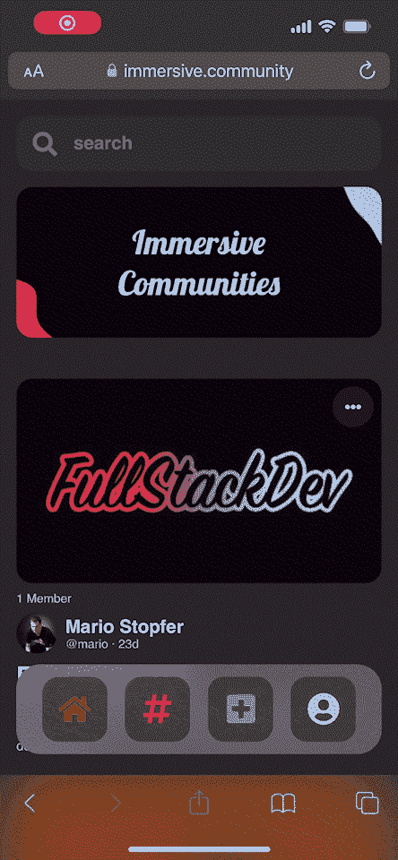

我们可以很容易地安装带有图标和标题的主应用程序

事实证明，定义了所有这些特性的 PWA 清单文件不能基于子域工作。它只能根据它所服务的域定义一组值。

事实上，我已经可以使用 CloudFront 和 Lambda@Edge 代理 HTTP 调用，这在这里也很方便。现在的目标是代理对 manifest.json 文件的每个调用。然后，根据呼叫来自哪个子域，获取相应的社区数据，如应用程序图标、标题等。然后我们会用这些值动态填充`manifest.json`。

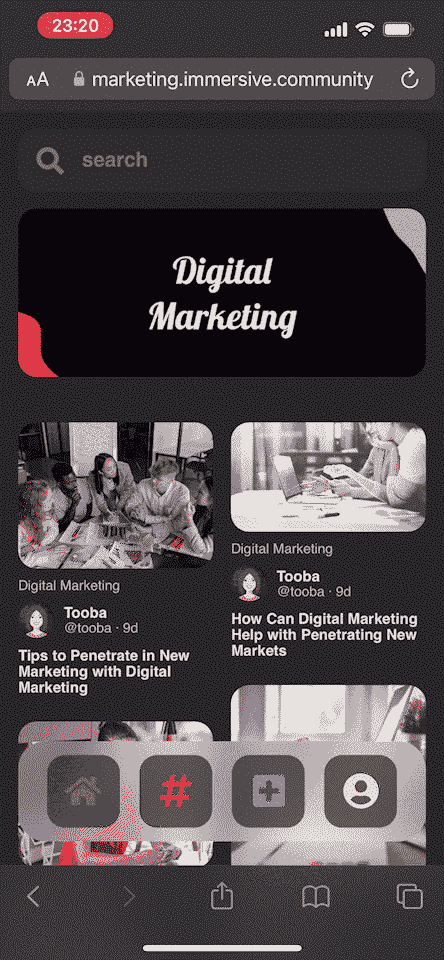

但是现在我们也可以安装一个带有图标和标题的子域

然后，该文件将被提供给浏览器，该社区将作为新的 PWA 应用程序安装在用户的设备上。

# 移动到前端

一旦我想出了这些关键的步骤，是时候开始前端工作了。根据前面基于子域的需求，我们还必须弄清楚如何基于子域加载不同的社区及其数据。这也需要加载不同的网站布局，这将在每个社区使用。

例如，主页需要列出所有可用的社区，而其他子域需要列出每个社区的文章。

不言而喻，要解决这个问题，我们不能简单地从零开始建立多个不同的网站。这是不可扩展的，所以我们需要尽可能多地重用控件和功能。这些特性将在这两种社区类型之间共享，然后仅在需要时加载。为了最大化代码的可重用性，我将所有控件定义为四种不同的类型:

*   成分
*   控制
*   页
*   团体

像`<button>`和`<input>`这样最小的定制 HTML 元素被定义为组件。然后我们可以在控件中重用这些组件，这些控件是这些较小元素的集合。例如，配置文件信息控件将显示用户的配置文件图像、用户名、关注者等。

然后，我们将能够在更高级别的元素中重用这些元素，在我们的例子中，这些元素是页面。每个页面代表一条路线，例如，趋势页面，在那里我们可以看到所有的活动，或者兴趣页面，在那里显示实际的文章文本。然后我会用这些小控件组成每一页。

最后，最高级别的元素将根据它们的类型在社区中定义。然后，每个 Community 元素将定义它需要的所有低级页面。Aurelia 路由器派上了用场，因为您可以动态加载路由。实现是通过以下方式处理的。

不管子域，当网站开始加载时，我们注册两个实现为 Aurelia 组件的主要分支。这些代表了两种不同的社区类型。然后，我定义了两种不同的 web 类型或布局:

*   主要的
*   文章

“main”类型表示当用户登陆主[https://immersive . community](https://immersive.community)页面时将加载的网站布局。这里，我们将显示所有带有相应控件的社区。

准备将为每个路线注册的页面元素

另一方面，一旦用户导航到一个子域，我们就需要加载一个不同的布局。换句话说，我们将加载文章和相应的特性和路径，而不是社区，例如，发布和编辑文章的能力。这将根据我们所在的社区类型启用或禁用某些路由。

我们的 Aurelia 和 WebPack 设置将 JavaScript 分成适当的块，这样就不会加载不需要的路径和功能，从而提高速度并节省带宽。

使用 WebPack 异步加载 JavaScript

一旦我们确定了我们所在的子域，我们将加载这个特定社区的社区和用户数据，从而成功地实现了这个解决方案。

# 砖石布局

我认为我们应该尽量使设计简单。因此，由于用户是为了内容而访问网站，我们将把重点放在显示内容上，而不是次要功能上。文章应该显示在列表中，但它们不应该看起来陈旧。因此，我决定每篇文章由以下内容组成:

*   封面照片
*   文章标题
*   文章类别
*   文章发布或编辑的日期
*   作者简介

我确保文章列表不会看起来陈旧的主要方法是确保用户可以为他们的文章选择每张封面照片的纵横比。灵感来自 Pinterest 如何显示其图钉，以便每篇文章都有不同的纵横比。这要求我实现砖石布局，这在 CSS Grid 或 FlexBox 中都不能开箱即用。

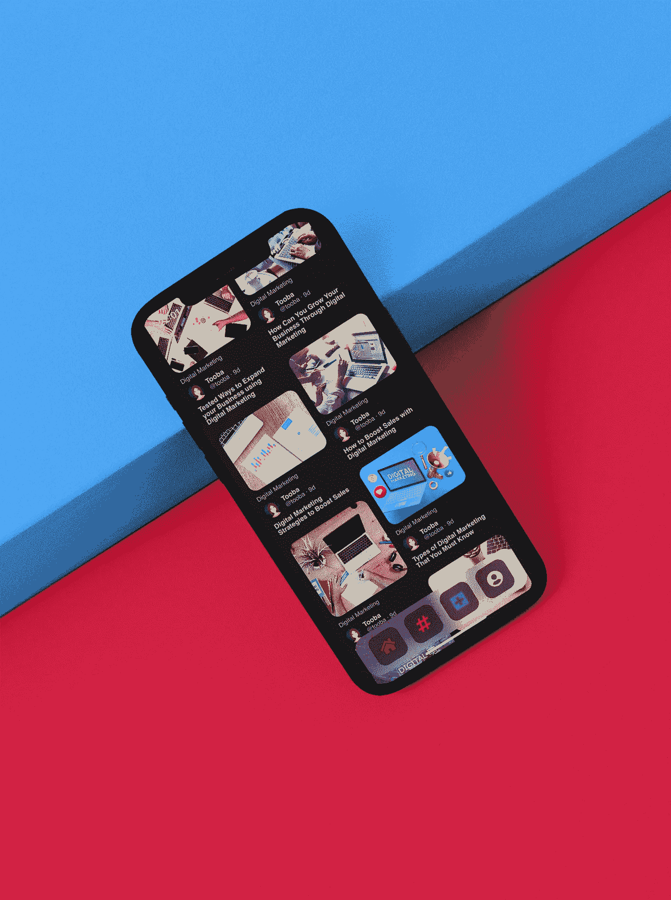

物品的砌筑布局

幸运的是，我尝试了几个有用的开源实现，并将其用于布局。我不得不添加一些改进，比如加载分页数据和随屏幕大小缩放。

然后…

2019 年 11 月，[新冠肺炎](https://en.wikipedia.org/wiki/COVID-19)的第一个征兆开始出现。世界很快陷入混乱，没有人知道发生了什么，但它将改变世界，以及我们如何以无人能想象的方式相互交流。

新冠肺炎将于 2019 年底爆发

不久之后，我们将开始在家工作。这将极大地影响我的发展进程，因为我再也不能去上班了。具有讽刺意味的是，当我得到我需要的休息时，世界崩溃了！

# 兴趣和评论

回到开发领域，撰写沉浸式社区文章背后的想法是基于协作的。为此，我使用维基百科作为合作的基础。此外，社区网站如[氨基应用](https://aminoapps.com/)和[Fandom.com](https://www.fandom.com)和博客网站[HubPages.com](https://discover.hubpages.com)也发挥了它们的作用。

作为一个人写博客可能是一个好的开始，但是我们可以通过让人们一起写文章来超越它。一旦我们在文本中添加超链接，将不同人写的这些文章连接起来，我们基本上就创建了一个社区，人们可以聚集在一起，从事他们感兴趣的话题。

我决定定义两种类型的文章，即，

*   兴趣
*   复习

兴趣将是短文，大约。5000 个字符长，他们会真实地描述一个人可能有任何特殊的兴趣。然后，每个人可以写一篇评论，对这一特殊兴趣进行评级。然后，主兴趣页面将引用为该特定兴趣撰写的所有评论。主要的区别是任何人都可以编辑兴趣，但只有撰写评论的人才能编辑它，从而为每篇文章添加个人风格。

在这里，我们之前决定使用 CloudFront 来代理 AppSync 调用，这反过来影响了我们。原来 [CloudFront 只支持最长 8192 字节的查询字符串](https://stackoverflow.com/questions/40089727/aws-cloudfront-signedurls-length)。因此，我们不能保存超过这个长度的数据。

关于每篇文章，每个兴趣都可以被喜欢和评论。因此，用户可以聚在一起讨论每篇文章将如何编写和编辑。此外，每个兴趣都可以添加到用户的个人资料页面，以便快速访问。

一旦这些特征都具备了，年底就到了。形势看起来不错，我确信这个项目将于明年完成。至少可以说，这个假设并不准确。

# 2020 年—全速前进

这一年或多或少开了个好头。经济仍有所增长，但过了一段时间后开始下滑。市场开始对疫情做出反应，价格开始上涨。2020 年初，我投入了大量工作，但没有一个真正可用的产品。还有很多工作要做，但我对结果很有信心，所以我继续努力。

在我的日常工作中，工作时间也延长了，我们必须比平时更快地到达最后期限。我不得不重新安排我的时间表，节省更多时间的唯一方法就是每晚只睡四个小时。

在东京地铁里等火车

我们的想法是在下午 6 点或 7 点前回家，然后直接投入到项目中。我可以工作到凌晨三四点，然后睡觉。然后，我必须在早上 7 点左右醒来，然后迅速去上班。当然，这并不是每天晚上都有足够的睡眠，但是我想我会在周末睡 12 个小时来弥补这段时间。我也为工作安排了所有的假期和公共假日。

新系统建立起来了，我按计划进行。

# 降价编辑

不言而喻，一个写文章的网站要有一个好用的文字编辑器。2020 年初，[降价](https://en.wikipedia.org/wiki/Markdown)成为一种非常流行的写作方式。我认为沉浸式社区必须支持开箱即用。

这不仅需要我写 Markdown，然后显示为 HTML 格式。 [Markdown-It](https://github.com/markdown-it/markdown-it) 库将用于将 Markdown 转换成 HTML。但是还有其他要求，因此我们应该显示的不同媒体的完整列表如下:

*   文本
*   图像
*   录像
*   使...嵌入

此外，图像和视频应该显示为滑块，用户可以像在 Instagram 上一样滑动图像。这需要混合使用 Markdown 和其他 HTML 元素。编辑器将被分成几个部分，有两种类型的输入，文本字段和媒体字段。编辑器中的每个字段都可以上下移动，使用 [Sortable.js](https://github.com/SortableJS/Sortable) 很容易实现。

对于输入字段，Markdown 字段非常简单，可以用一个`<textarea>`元素来创建。该编辑器还加载了[insolata Google 字体](https://fonts.google.com/specimen/Inconsolata)，它让输入的文本看起来像打字机。

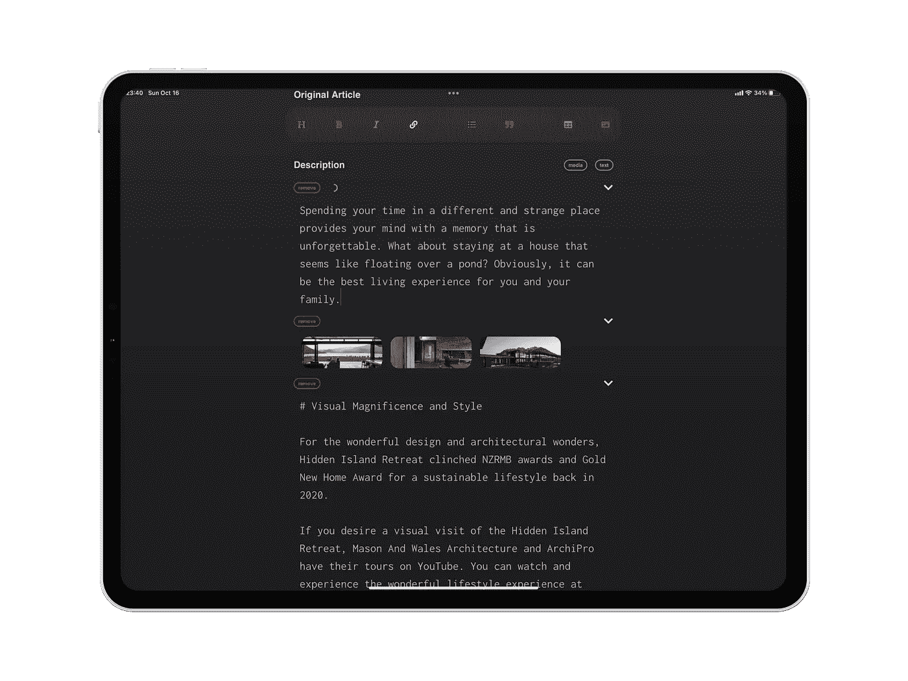

具有媒体输入元素的降价编辑器

此外，为了实际样式化文本，实现了一个 bar，它将向文本添加 Markdown。使用 [Mousetrap.js](https://github.com/ccampbell/mousetrap) 的键盘快捷键也是如此。现在我们可以使用`Control+B`等以`**` Markdown 标签的形式轻松添加粗体文本。在输入时，随着文本数量的增加，`<textarea>`元素自然会扩展，所以我使用了 [Autosize.js](https://github.com/jackmoore/autosize) 库来实现这个特性。

媒体字段将能够显示包含嵌入式网站的图像、视频或 iframes。媒体字段的类型将根据媒体本身进行切换。我使用了 [Swiper.js](https://swiperjs.com) 来实现图片之间的滑动。视频组件是使用 [Video.js](https://videojs.com) 库实现的。

当真正上传媒体的时候，问题就出现了。关于图像，很容易使用浏览器的[文件 API](https://developer.mozilla.org/en-US/docs/Web/API/File) 从你的设备中加载照片和视频。我接下来要做的是，首先把图片，可能是 HEIC 格式的，转换成 JPEG 格式。然后我会在把它们上传到后端之前压缩它们。幸运的是， [Heic-Convert](https://github.com/catdad-experiments/heic-convert) 和[Browser-Image-Compression](https://github.com/Donaldcwl/browser-image-compression)库很好地服务于这个目的。

另一个问题发生在我不得不选择正确的图片纵横比并在上传前进行裁剪的时候。这是使用 [Cropper 实现的。JS](https://fengyuanchen.github.io/cropperjs) 但是，不幸的是，它不能在 Safari 浏览器上开箱即用。我花了相当多的时间来设置适当的 CSS，使图像不会从容器中溢出。最终，用户可以轻松地从他们的设备中加载图像，放大和缩小，并在上传前进行裁剪。

一旦一切完成，媒体将被上传到 Cloudinary，一个管理媒体文件的服务。

然后是时候将所有这些放在一起，并以文章的形式显示给用户。我很幸运，Aurelia 有一个可以动态加载 HTML 的`<compose>`元素。因此，根据输入类型，我会加载 media 元素或 Markdown 元素，它们会被转换成 HTML。

这个 HTML 必须使用 CSS 样式，尤其是 HTML 表格，我会根据屏幕大小进行转换。在较大的屏幕上，表格将以常规的水平布局显示，而在较小的屏幕上，表格将以垂直布局显示。

这将需要一个事件驱动的方法来告诉我们屏幕尺寸何时以及如何变化。在这种情况下使用的最好的库是 [RxJs](https://rxjs.dev) ，它处理“resize”事件，我可以相应地格式化表格。

# 改善数据输入

然后我回到文章上。我不得不改变文章被保存到数据库的方式，因为在这种情况下，很多人可以同时修改文章。

然后，我会将新文章保存为初始文章类型，但是每篇文章的实际数据将保存为一个版本。然后，我将能够跟踪哪个用户以及何时修改了每篇文章。如果用户没有先加载最新版本，这阻止了我保存新版本。此外，如果某个更新不合适，它可以被禁用，以前的版本将再次可见。每篇文章的草稿将以同样的方式保存。

至于实际的数据输入，我决定将它实现为一个弹出窗口。弹出窗口不会简单地出现在屏幕上，而是从底部向上滑动。此外，还可以在弹出窗口内滑动。为此，我重用了 Swiper。Js 库，而所有其他动画都是使用 [Animate 完成的。CSS](https://animate.style) 库。

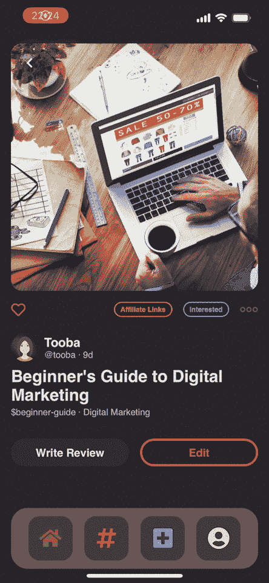

弹出式元素呈现几个特征

弹出窗口实现起来并不简单，因为它需要随屏幕大小缩放。因此，在较大的屏幕上，它将占用屏幕宽度的 50%，而在较小的屏幕上，它将占用宽度的 100%。

此外，在某些情况下，比如关注者列表，我实现了包含在弹出窗口中的滚动。这意味着我们滚动的列表不会停留在顶部，而是会在滚动时消失。我添加了进一步的样式，使背景变暗，并禁止在弹出窗口外滚动或点击。另一方面，文章编辑系统的预览弹出窗口随屏幕移动。

这是受苹果的快捷方式应用程序及其弹出窗口的启发，这也适用于元素上方的药丸按钮和标题。

# 导航栏

我实现的一个最重要的 UI 特性进一步受到了 iPhone 的启发:它的导航栏。我注意到几乎所有的移动应用程序都有一个相当基本的导航栏，带有简单的小图标，这与应用程序的整体设计并不相称。

我决定复制 iOS 栏，并在整个网站上使用。它不应该总是可见的，但当我们向下滚动时会消失，当我们向上滚动时会出现。当用户向下滚动时，我们假设他们对内容感兴趣，不会离开当前页面。因此，我们可以隐藏酒吧。另一方面，如果用户向上滚动，他们可能在寻找离开页面的方法，所以我们也可以再次显示滚动条。

工具栏上的四个按钮允许用户导航到网站的四个主要部分。主页按钮导航到每个社区的主页。趋势按钮导航到趋势页面，用户可以在该页面上看到其他用户发布的所有最近活动。下一个按钮是 Engage 按钮，它导航到社区提供的所有功能和设置的列表。最后,“个人资料”按钮将引导我们进入个人资料页面。

还需要考虑更大的屏幕，所以当在大屏幕上显示时，条移动到屏幕的右侧。它变得粘粘的，在那一点上哪儿也不动。

# 实时批处理

一旦前端最重要的工作完成，就该再次访问后端了。系统的这一部分将被证明是实现起来最复杂的部分之一，但最终也是非常重要的，并且还会使其他功能的实现变得非常容易。

在[面向对象编程](https://en.wikipedia.org/wiki/Object-oriented_programming)中，有一个[关注点分离](https://en.wikipedia.org/wiki/Separation_of_concerns)的概念，我们保持我们的功能简单，让它们只做一件事情，这是它们应该做的。

此外，[面向方面编程](https://en.wikipedia.org/wiki/Aspect-oriented_programming)的思想是关于关注点分离的，我们需要将业务逻辑从其他横切关注点中分离出来。例如，将用户保存到数据库自然应该伴随着在处理用户保存的同时进行日志记录。但是这两个特性的代码应该分开保存。

我决定全面应用这个推理，从 UI 中提取尽可能多的对用户不重要的特性，并将它们移到后端。在我们的例子中，我们主要关心的是将数据保存到数据库中，这涉及到社区、文章、评论、喜欢等等。

如果我们想跟踪一篇文章获得了多少赞，我们可以有一个过程来统计每篇文章的所有赞，并定期更新它们。因为我们在这里处理存储在数据库中的大量数据，并且潜在地大量数据不断流入数据库，所以我们将需要采用实时数据处理来处理这种情况。

使用 AWS Kinesis 实时汇总每个社区的新项目或已删除项目

我选择了 AWS Kinesis 来完成这个任务。Kinesis 可以接收大量实时数据，我们也可以编写 SQL 查询来近乎实时地查询和批处理这些数据。默认情况下，Kinesis 将批处理 60 秒的数据，或者批处理达到 5 MB，以先到者为准。

因此，在我们的例子中，我们将查询传入的数据、含义、新社区的创建、文章、用户、活动等的添加或删除。，并每分钟用新数据更新数据库。现在的问题是，我们如何首先将数据输入 Kinesis？

我们选择的数据库 DynamoDB 可以以 Lambda 函数的形式定义调用的触发器，无论何时数据被添加、删除或修改。然后我们会捕捉这些数据，并将其发送给 Kinesis 进行处理。

碰巧的是，我们早期的一个决策会使这个过程稍微难以实现，因为我们处理的不是一个数据库，而是十个数据库。因此，一旦添加了数据，Lambda 函数将被调用十次，而不是一次。然而，我们需要处理每一种情况，因为数据可能来自任何数据库，因为它们位于不同的地区。

我通过过滤掉复制的数据而不是用户添加到数据库中的原始数据来解决这个问题。“aws:rep:updateregion”列为我们提供了这些信息。我们可以确定我们处理的是插入区域中的数据还是复制的数据。

一旦这个问题解决了，我们将过滤新数据的添加或删除。此外，我们将根据数据类型过滤数据，这意味着我们正在处理代表社区、文章、评论等的数据。然后，我们收集这些数据，将其标记为“插入”或“删除”，并将其传递给 Kinesis。这些来自[领域驱动设计](https://en.wikipedia.org/wiki/Domain-driven_design)方法的想法被称为领域事件，允许我们确定发生了什么动作，并相应地更新我们的数据库。

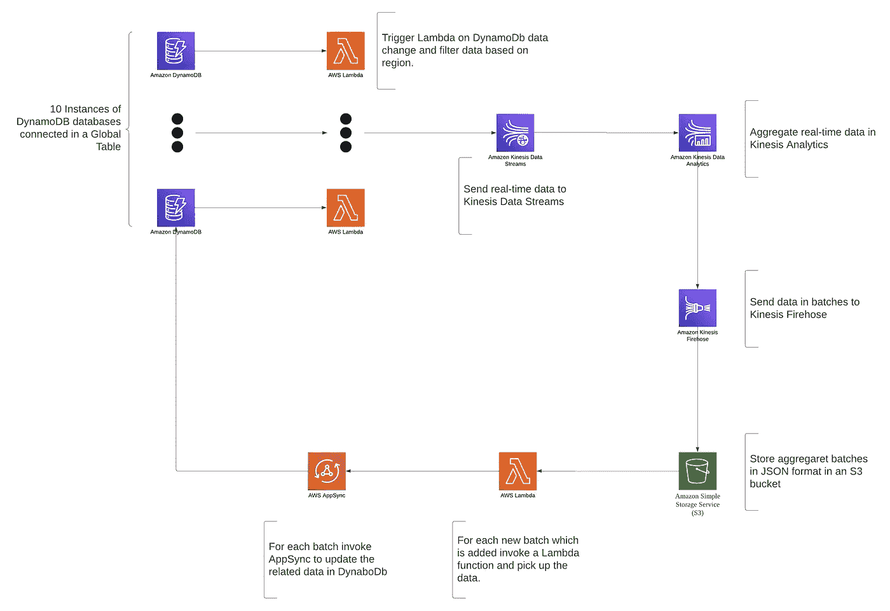

利用 AWS Kinesis 进行实时批量数据处理

然后我们将注意力转向运动。这里我们必须定义系统的三个主要部分

*   AWS Kinesis 数据流
*   AWS Kinesis 消防软管
*   AWS Kinesis 数据分析

Kinesis 流允许我们实时摄取大量数据。Kinesis 分析系统允许我们批量查询这些数据，并根据滚动时间窗口进行汇总。一旦数据被聚合，我们会将每个结果进一步推入 Kinesis Firehose，它可以处理大量数据并将其存储在目标服务中，在我们的例子中，目标服务是 JSON 格式的 S3 桶。

一旦数据到达 S3 桶，我们就触发另一个 Lambda 函数并处理这些数据来更新 DynamoDB 数据库。例如，如果五个人在最后一分钟喜欢某个兴趣，我们会在 JSON 文件中找到这个数据。然后，我们将更新该兴趣的 like 计数，并增加或减少 like 计数。在这种情况下，我们会为五个赞增加它。

使用这个系统，每个社区的统计数据将在一分钟内更新。

此外，当我们需要显示聚合数据时，我们不需要编写和执行复杂的查询，因为每个记录的确切结果都存储在 fast DynamoDB 数据库中，从而提高了每个记录的查询速度。这种改进基于数据局部性的思想

# 云雾缭绕

现在是时候开始实现第三方服务来处理我需要的特性了。我发现购买订阅比建立自己的订阅更容易。我实现的第一个服务是 Cloudinary，一个媒体管理服务。我在 Cloudinary 上设置了所有的预设，急切地为下面的响应屏幕断点转换图像。

*   576 像素
*   768 像素
*   992 像素
*   1200 像素

这些也将是在 Tailwind CSS 中设置的断点，我们的网站将符合手机、小平板电脑、大平板电脑和电脑显示器的不同屏幕尺寸。然后根据当前的屏幕大小，我们将使用`<image>`元素上的`scrcset`属性适当地调用 Cloudinary 中急切创建的图像。

这将帮助我们节省带宽，缩短在移动设备上加载图像的时间。

至于视频功能，在实现之后，我决定放弃它，因为 Cloudinary 的视频价格太贵了。因此，即使代码已经存在，这个特性目前还没有使用，但是以后可能会变得可用。这将需要我将来在 AWS 上建立一个自定义系统。

# Embed.ly

我决定使用 Embed.ly 来嵌入 Twitter、YouTube 等热门网站的内容。不幸的是，这并没有工作没有问题。因此，我不得不使用几种技术来手动删除网站上的脸书和 Twitter 脚本，因为它们会在多次加载后干扰嵌入的内容。

# 阿尔戈利亚

关于搜索，我选择了 Algolia，实现了对社区、活动、文章、用户的搜索。前端实现非常简单。

我创建了一个搜索栏，当点击它时，会隐藏应用程序的其余部分，当我们输入时，会显示我们当前浏览的特定子域的结果。一旦我们按下“Enter”，主页上的砌体显示符合查询的文章。我还必须实现分页，这将逐步加载结果，以模仿 Pinterest 的外观。

当我意识到没有办法搜索活动时，问题就来了，除非你将整个文本存储在 Algolia 中，这是我想避免的。因此，我决定只存储每个活动的相关标签，但问题是如何从每个活动中提取相关标签。

答案以 [AWS 翻译](https://aws.amazon.com/translate)和 [AWS 理解](https://aws.amazon.com/comprehend)的形式出现。由于要添加到数据库中的条目数量会很大，我们希望将这些数据添加到 Algolia 中，如果我们要单独添加每条记录，可能会使 API 过载。相反，我们希望实时、批量地处理它们。因此，我们将再次使用身势术作为解决方案。

在这种情况下，每次向数据库添加新项目都会触发一个 Lambda 函数，该函数会将数据发送到 Kinesis 数据流，后者又会将数据发送到 Kinesis Firehose(这次不需要分析)，并进一步将它们存储在 S3 桶中。

一旦数据被安全存储，我们将触发一个 Lambda 函数将其发送到 Algolia，但在此之前，我们需要处理这些数据。特别是，我们需要处理活动，从这些活动中，我们将使用 [markdown-remover](https://github.com/stiang/remove-markdown) 库删除 Markdown 文本。这样我们就只剩下明文了。一旦我们有了实际的文本，我们就可以继续提取将用于搜索的相关标签。

使用 AWS understand 服务可以很容易地做到这一点，但问题是它只支持某些语言。因此，如果用户用不支持的语言书写，我们将无法提取标签。在这种情况下，我们使用 AWS Translate 将文本翻译成英语。然后我们继续提取标签，然后我们将它们翻译回原始语言。

现在，我们按照计划将标签存储在 Algolia 中。

# Recombee

Pinterest 最重要的功能之一是它的推荐引擎。一旦用户点击一个大头针，他们会立即看到该大头针的全尺寸图像，而在图像下方，我们可以看到基于当前大头针的用户可能喜欢的推荐。

这是一个非常好的方法来增加用户留存率，让他们继续浏览网站。为了实现这个特性，在我的例子中，必须向用户显示类似的文章，我选择了 Recombee——一个推荐引擎 SaaS。

这次的实现比 Algolia 更容易，因为我重用了相同的原理。鉴于我们需要为用户创建的每个新项目推荐社区、文章和活动，我会使用 Kinesis 来批量处理这些项目，并将其发送给 Recombee。

推荐过程是基于视图的，这意味着每当用户看到一篇文章时，我们会发送该特定用户的视图以及要推荐的文章。

我们还可以根据用户与商品的交互方式，将其他动作分配给推荐商品。例如，编写一个新的兴趣将被映射到该兴趣的购物车中。如果用户喜欢某个兴趣，这会增加评分。如果用户加入一个社区，这将被映射到该社区的书签。

基于这些数据，Recombee 将为用户创建推荐。

在前端，我会得到用户当前正在阅读的文章，以及这篇特定文章和用户的推荐数据。这将显示在每篇文章的底部，作为一个分页圬工列表。这将给用户一个他们可能感兴趣的文章列表。

# 定位

看到网站如何从一开始就瞄准全球观众，我也必须实现本地化。对于最初的版本，我决定使用 10 种语言，并满足于 SaaS 服务——Locize——它是基于 [i18next 本地化框架](https://www.i18next.com)实现的。

我们需要根据数量来本地化单词，即单数或复数，并且必须本地化时间。我们显示每篇文章的创建时间或最后更新时间。

${'recommend' & t}可用于本地化元素

我选择了英语作为默认语言，并使用谷歌翻译将所有单词翻译成其他语言，如德语、日语等。同样，Aurelia 也支持本地化，这非常方便。完成所有翻译后，我将翻译后的 JSON 文件导入到应用程序中，并根据社区类型将它们分开，这样我们就不会加载不需要的文本。

Aurelia 允许我们使用自动翻译文本的模板和绑定。但是我也使用了值转换器，它会格式化时间来显示一篇文章写了多久，而不是显示一个实际的日期。此外，我还必须格式化数字；因此，我不会显示数字 1000，而是显示 1K。所有这些特性都是由诸如 [Numbro](https://github.com/BenjaminVanRyseghem/numbro) 和[time before](https://www.npmjs.com/package/javascript-time-ago)这样的库来处理的。

# 特维利奥

一个社区网站需要沟通，但不仅仅是在公共场合。这也需要私人交流。这意味着实时私人聊天也应该是我需要提供的东西。这项功能是使用 Twilio 可编程聊天服务实现的。

每个用户都可以与每个社区中的任何其他用户进行私人聊天。使用 Twilio 库，后端实现非常容易。关于前端，我决定基于 Instagram 设计聊天风格，因为它有一个干净简单的设计。

# 预渲染 SPA

我还选择了一个名为 [Prerender](https://prerender.io) 的服务来预呈现网站，使其对搜索引擎爬虫可用。在意识到价格可能是一个问题后，我决定自己构建预渲染系统。为此，我找到了一个名为[木偶师](https://github.com/puppeteer/puppeteer)的库，这是一个无头的 Chrome API。

这个库可以用来以编程方式加载网站，并返回一个生成的 HTML 和执行的 JavaScript，当时的搜索爬虫并没有这样做。该实现将在 Lambda 函数中加载 Puppeteer，该函数将加载一个网站，呈现它并返回 HTML。

我会使用 Lambda@Edge 来检测我的用户何时是爬虫，然后将它传递给预渲染 Lambda。这很简单，通过检测 CloudFront 参数中的“user-agent”属性就可以做到。原来 Lambda 加载不了木偶师库，因为太大了。

这并不是一个阻碍，因为我后来发现了 [chrome-aws-lambda](https://github.com/alixaxel/chrome-aws-lambda) 库。它完成了所有这些开箱即用的工作，而且会小得多，因为它只使用了我所需要的木偶核心。一旦系统完成，搜索引擎已经足够强大，并开始执行 JavaScript。因此，即使我完成了这个功能，我还是把它关掉了，让搜索引擎自己抓取我的网站。

# 种类

沉浸式社区的核心特征之一是其收入共享方案，用户分享 50%的会员订阅和广告收入。如前所述，我们需要让我们的创作者不仅能创作他们的内容，还能赚钱。现在的问题是如何实施这个系统。默认选择是 Stripe，所以我按如下方式操作。

我决定设计基于每个社区的收入分享系统。这样，用户可以创建几个社区，并根据每个社区赚取。每个社区的收入将来自两个来源。

*   成员订阅
*   自助广告

会员订阅是最容易实现的。我会为会员订阅创建三个价位——每月 5 美元、10 美元和 15 美元。每个社区的成员可以每月支持社区的所有者，作为回报，他们不会看到任何广告。

一个成员可以通过每月订阅来支持每个社区

广告系统是基于相同的月订阅，但范围在 100 美元到 1000 美元之间。想要在特定社区做广告的公司可以选择每月支付金额并设置广告横幅。

假设一个社区中有几个广告客户，那么每次页面加载或路径改变时，广告都会被随机选择。与其他广告商相比，广告商增加展示其广告的频率的方式是通过增加每月支付金额。

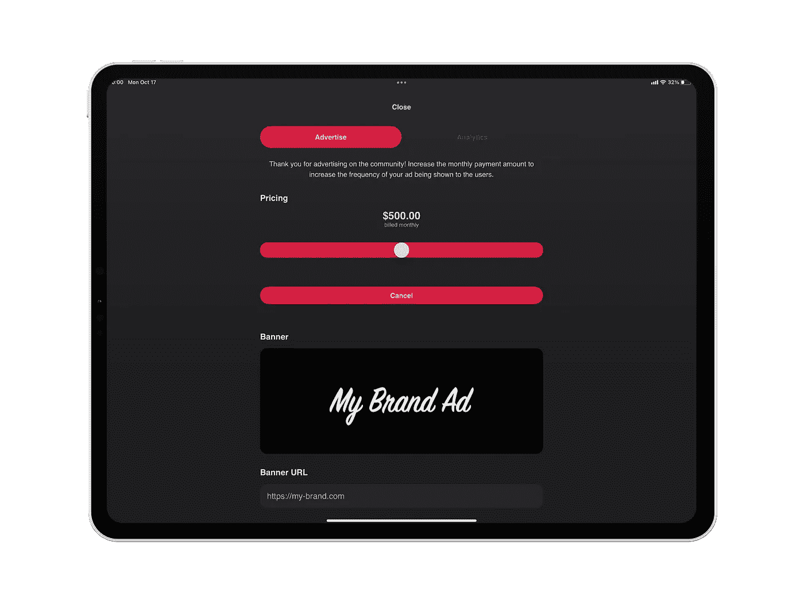

一家公司可以通过每月付费在每个社区宣传其品牌

我们还需要向广告商展示他们的广告表现如何，所以我再次使用 Kinesis 设置来测量浏览量和点击量。这个系统会像往常一样更新统计数据，然后我使用 Brite Charts 库来显示统计数据。

最重要的部分是实际的收入共享功能。这是通过[条带连接](https://stripe.com/connect)功能实现的。用户需要添加他们的银行账户并连接到 Stripe Express，然后系统将拥有发送支付所需的所有信息。

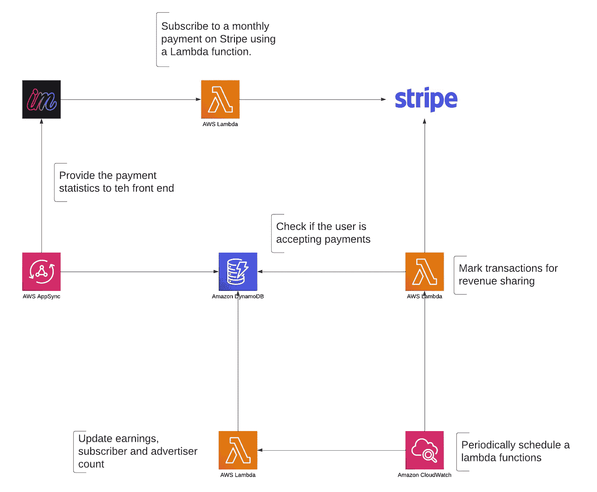

基于条带的收入共享系统

然后，我将有一个预定的 Lambda 系统，该系统将每天获取所有用户，更新交易，并确保每笔交易的 50%(无论是会员订阅还是广告支付)都转移到社区的所有者，在那里进行支付。

# AWS Cognito

最后一个必须实现的服务是 [Auth0](https://auth0.com) ，这将有助于用户认证。经过一番研究，我决定采用基于短信的无密码设置。看到我们现在处于一个移动优先的世界，放弃密码并基于每个人都已经拥有的东西——他们的手机——进行身份验证才是唯一有意义的。

事实证明，无密码认证的 Auth0 实现是次优的，因为它每次都会重定向到他们的网站，并且基于 URL 参数，这是我想要避免的。这个定价也不能适用于社交网络，所以我使用 AWS Cognito 构建了自己的实现。

Cognito 有可以连接到 Lambda 函数的触发器，这很方便，我用它来触发身份验证。Lambda 函数将用于在注册过程中收集用户数据。此时，用户只需要提供他们的电话号码和用户名来注册。

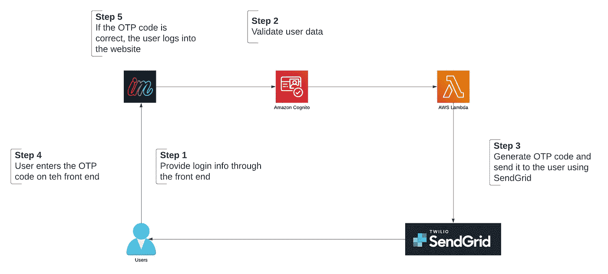

无密码登录过程

在登录过程中，Lambda 功能将收集用户的电话号码，并使用 [AWS SNS](https://aws.amazon.com/sns) 向用户发送包含验证码的短信。用户然后输入这个代码，通过 Cognito 进行验证，并被重定向到他的个人资料页面。

当然，一旦用户获得授权，验证数据被传回前端，我们就必须在存储之前对其进行加密。相同的授权数据在存储到后端之前会被加密。

此外，我们会在每次注册和登录时存储用户的 IP 地址。

后来发现用户不愿意透露他们的手机号码，所以我决定用电子邮件代替短信。当我想使用 [AWS SES](https://aws.amazon.com/ses) 时，出现了重复消息的问题，所以我改用 Twilio 的 [SendGrid](https://sendgrid.com) 向用户发送电子邮件。

随着这个系统的完成，一年过去了，而我两年前开始的项目还远未完成。除了继续工作并努力尽快完成之外，别无选择。我不知道最大的挑战还在后面。

# 2021 年——看不到尽头

这是所有事情都必须到位的时候，但是作为一个没有任何反馈的单独开发人员工作这么长时间会让你质疑项目的发展方向。

任何目前在同一个地方的开发人员可能会问自己的问题是:

> 即使看不到尽头，我怎样才能让自己保持动力，继续前进？

答案很简单。

你不应该质疑你的决定，不管你现在对这个项目感觉如何。你不能让你目前的情绪状态决定你将如何行动。你可能现在不想继续，但以后你可能会喜欢，如果你真的退出，你肯定会感觉很糟糕。

因此，如果你真的退出，你将不再拥有这个项目，所有的工作都将付之东流。唯一能做的就是不管发生什么都要继续前进。唯一要记住的是，每一个交付的功能，每一次键盘按键，都是让你更接近目标。

只是想混过去…

在这个项目中，我换了三次工作，每次都很投入，但即使我不得不去面试，我还是会回家，坐在办公桌后，继续我的项目。

如果你缺乏动力，你需要问自己的是:

> 如果你现在辞职，你会去哪里？辞职后，你唯一能走的路就是回到你来的地方。但你已经知道后面有什么了。你已经知道它是什么样的，你不喜欢它，这就是为什么你一开始就踏上了这个旅程。
> 
> 所以，你现在知道了一个事实，没有地方可以回去。你唯一能走的路，就是前进。前进的唯一方法就是继续工作。

这是我在这个项目中所有的动力。正如我已经说过的，要么那样，要么回到我已经在的地方，所以我决定继续前进。

# 管理系统

现在是时候开始整合和开始了。我决定实现管理系统，这将用于维护每个社区。每个社区所有者可以决定从他们的社区中删除内容。这意味着，如果用户的行为不符合行为准则，我们可以禁用广告、文章、活动并禁止用户。

每个社区的所有者也可以向其他用户授予管理权限。但是我们也需要让主社区的管理员能够管理所有其他社区。此外，这些管理员可以完全禁用所有社区的其他用户，甚至禁用社区。

为了让管理员更容易完成他们的工作，我引入了标记系统，每个项目都可以报告给管理员。用户现在可以在网站上报告他们认为不合适的任何事情。

每个用户的权限验证将在后端决定。我将创建一个 Lambda 函数，在每个 AppSync 调用中调用该函数来验证每个请求。

此外，前端将使用 Aurelia 提供的基于路由的授权。我将定义允许或不允许当前用户进入某一路线的规则。

例如，如果您被某个社区禁止，您将无法查看您的个人资料。但是如果用户没有登录，该系统也可以阻止用户导航到个人资料页面。相反，他们会被重定向到登录页面。

# 分析仪表板

另一个对用户有用的特性是分析仪表板页面。每个社区所有者都可以看到图表，准确显示他们的社区中发生了多少互动。对于这个特殊的例子，我将重用 Kinesis 聚合的数据，并使用 [Brite Charts](http://britecharts.github.io/britecharts) 库用图表显示它。

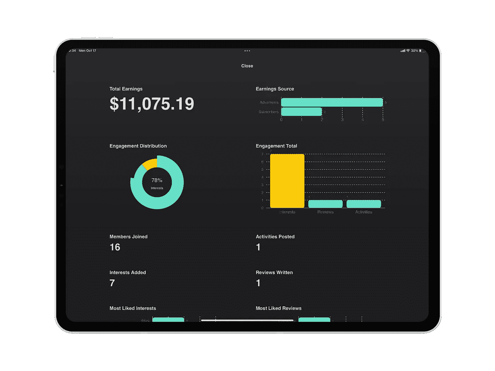

每个社区的所有者都可以访问社区统计信息页面

此外，我还会获取 Stripe 数据，并显示这个社区的订户、广告商和总收入的数量。

唯一需要解决的问题是响应式设计，即如何在小屏幕和大屏幕上显示图表。我再次使用 RxJs 来检测“resize”事件，并根据 Tailwind CSS 中定义的屏幕断点应用样式。

# 安全

路线图上还有一个额外的安全级别，我决定在我的 CloudFront 发行版之前实现一个 WAF。我使用了 AWS Marketplace 并订阅了 [Imperva WAF](https://www.imperva.com/resources/resource-library/datasheets/imperva-cloud-waf) 系统，该系统将代理我的流量，并确保只允许验证为安全的流量。

这个解决方案很容易实现，但是一旦第一个月过去了，账单就太多了。我断开了系统，决定依赖 CloudFront 默认提供的东西。

# 最后一刻的重新设计

在这一点上，我不得不开始审视我所做的一切，并解决仍然存在的小问题。许多东西仍然需要改进，但是最大的改变是 DynamoDB 数据库的设置。

事实证明，我最初的设置，不是我现在使用的那个，不能很好地扩展。这就是为什么我决定完全重新设计它，并开始使用“`#`”分隔符来表示记录标识符中的分支。

以前，我制作单独的记录，并使用 AppSync 管道来定位每个相关的记录，这是不可持续的。这也影响了 Kinesis 和第三方服务设置，如 Algolia 和 Recombee。

花了三个月的时间重新设计系统，使其完全正常工作。一旦这样做了，我就可以继续使用新功能了。

# 有记录以来最热的夏天

东京的夏天又热又潮湿。坚持你正在做的任何事情是一个相当大的挑战，尤其是在七月和八月。那段时间东京正在举办奥运会，8 月 7 日有消息称[创下了奥运会](https://www.9news.com/article/sports/olympics/hottest-temperatures-olympics-history/73-e459e14f-0887-477d-82c0-aee1296955bd)历史上的最高温。

东京破纪录的高温记录器

坐火车去上班不再有意义，因为天气会让我筋疲力尽，让我筋疲力尽，晚上无法工作。我意识到我不得不乘出租车去上班来节省更多的时间。这给了我更多的时间睡觉，并让我回家后不会太累而无法工作。

# 实时通知

PWA 是一项伟大的技术，它为我们提供了一种使用推送通知向用户发送通知的方式。我决定，这将是一个系统，也将是必要的，并继续实施。

通知系统将基于被跟踪的用户来实现。如果您正在关注某个用户，当他们创建新的活动或文章时，您需要得到通知。

目前，推送通知的唯一问题是，在撰写本文时，iOS 设备上的 Safari 浏览器仍不支持推送通知。我决定使用浏览器的[通知 API](https://developer.mozilla.org/en-US/docs/Web/API/notification) ，而不是原生推送通知。在后端，我会创建一个新的实例 [AWS API Gateway](https://aws.amazon.com/api-gateway) ，并设置它处理实时数据。

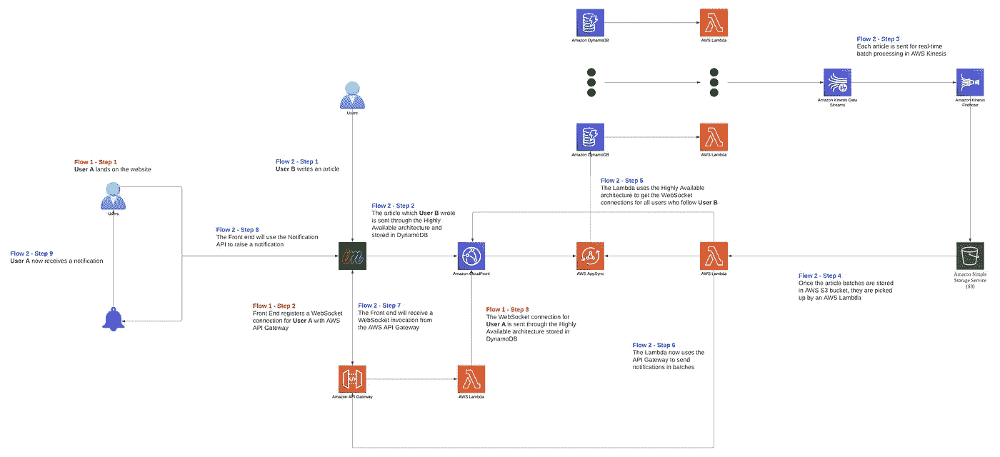

实时通知系统

在前端，我会使用 [WebSocket API](https://developer.mozilla.org/en-US/docs/Web/API/WebSockets_API) 连接到 API 网关。一旦被关注的用户发布了一篇新文章，这些数据就会被发送到 Kinesis。同样，使用批处理，我们获得所有关注作者的用户，然后使用 API 网关向前端发送通知。在前端，WebSocket 连接被触发，我们用它来调用浏览器的通知 API 并显示通知。

此外，当谈到用户可以在每篇文章上写的评论时，我们需要跟踪并向用户显示他们当前参与讨论的位置。我还实现了一个未读指示器，显示哪个评论区有用户尚未阅读的新评论。

当用户在调用 AppSync 调用时不使用 await 关键字加载应用程序时，将检查这一点。这将确保执行不会等待调用完成；相反，更重要的数据会首先加载。

一旦调用返回，我们将更新 UI 并向用户显示通知。

我还会使用弹出窗口的形式通知用户某个操作是否成功完成。例如，我会创建一个弹出消息，告诉用户文章更新是否失败。

# 前端验证

看到后端验证是如何完成的，我们必须通过在前端实现验证来给用户更快的反馈，从而给用户更好的体验。

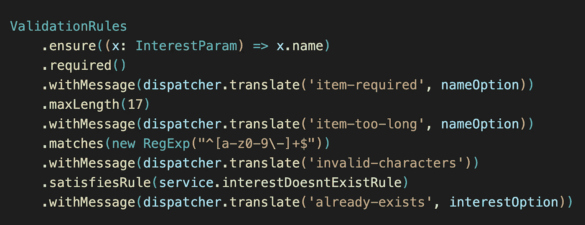

Aurelia 的流畅验证

幸运的是，Aurelia 有一个验证插件，并且用一个流体接口适当地实现了它。这使得创建业务规则变得非常容易，例如，可以限制用户在文章名称的`<input>`字段中输入的字符数。

我会使用 Aurelia 属性绑定系统来收集并在 UI 上显示验证消息。我需要把这与本地化系统，并确保信息显示在正确的语言。

# 完成工作

这一年剩下的时间包括处理一些小细节。它要求我创建像加载占位符这样的东西。我特别决定不希望将加载占位符显示为单独的屏幕元素。

相反，我希望向用户表明正在加载一个元素。这就是为什么我使用了正在加载的元素的轮廓，并给了它们一个透明的加载动画。这是受网飞手机应用程序的启发，其工作原理类似。

这时，年底到了，我现在正在做主页。该页面将只显示我们目前拥有的所有社区。幸运的是，我创建的基于组件的系统使得重用我编写的大部分代码变得很容易，所以任务很快就完成了。

这一年终于结束了，我对工作很满意。尽管这个项目还没有完成，我知道成功是在我的能力范围之内。

# 2022 年——最后一英里

今年将是最后一年。我不知道我是否会实现我想做的每一件事，但我知道无论发生什么，我都必须去做。我不希望像去年一样在夏天重复这项工作，因为很可能会比去年更热。

我的预测成真了，结果是[2022 年东京的夏季气温是最近 147 年来最高的！](https://www.bbc.com/news/world-asia-61990913)

# 登陆页面设计

我从设计登录页面开始。问题如下:

> 我希望我的用户在访问我的登录页面时有什么样的感觉？

我不想让用户觉得这是一个太严肃的网站，而是一个友好和合作的社区。

我注意到，最近，登录页面有插图，而不是真人的照片，所以沿着这条路走下去是有意义的。这就是为什么我决定买一套我在 [Adobe Stock](https://stock.adobe.com) 上买的插图。

登陆页面必须简单，还必须快速描述网站提供的一切。这必须本地化，所以我使用本地化功能来翻译所有显示的登录页面标题和字幕。

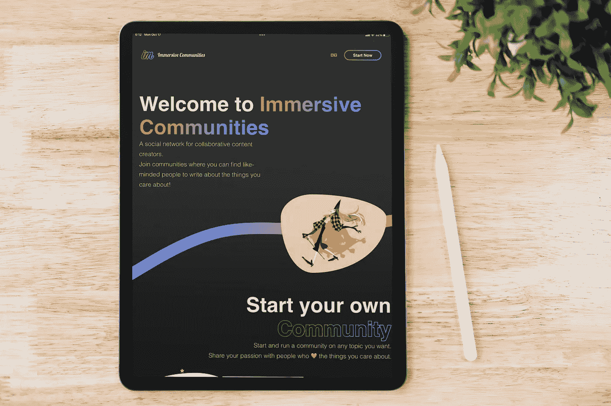

简单明了的登录页面

唯一需要克服的技术问题是在文本中引入颜色。幸运的是，我可以使用翻译定义中的样式特性，然后使用 Markdown 动态生成 HTML，它将显示在登录页面上。

所需的数据，如“隐私政策”和“使用条款”，是从网上购买的，并使用谷歌翻译翻译成多种语言。

# 期待意想不到的事情

现在是时候处理所有的细节了，所以我用剩下的时间来确保日志记录在后端的所有 Lambda 函数中都存在。这将帮助我确保如果发生问题，我会知道发生了什么。

当我写完的时候，乌克兰的[战争](https://en.wikipedia.org/wiki/2022_Russian_invasion_of_Ukraine)已经开始了。这再次增加了全球经济的不确定性，但我继续工作，并专注于最终目标。

由于没有保持 PWA 的最新实现，我必须确保所有的特性都工作正常，所以需要进一步开发来改进 JavaScript 和图像缓存。离线功能终于打开了，应用程序现在可以正常地作为离线应用程序运行了。

我还必须移动我在后端所做的更改，并将我在 AppSync 上所做的更改传播到其他地区。因为在开发期间这样做太麻烦了，所以从我开始开发以来，我没有对其他区域做任何更改。

环境也是如此。持续构建这三个环境会浪费太多时间，所以我最终将它们同步，并将代码转移到 UAT 和生产环境中。

最后，我必须实现[https://immersive . community](https://immersive.community)域，它必须在没有“www”子域的情况下工作，并正确地重定向到主页。

结束了，…或者是吗？

此时，我们正处于 2022 年 4 月 25 日的凌晨。我长达四年的项目终于结束了。我在网站上创建了第一个帖子，然后就睡觉了。我知道我终于成功了。我不仅完成了我计划要做的事情，而且在夏天到来之前就完成了。

# 最后的话

具有讽刺意味的是，我这次冒险的最后一句话是——这不是结束，而只是开始。现在系统上线了，需要创作的内容和品牌知名度需要的推广和广告将是一次全新的冒险。

但是我*实际上*从这个练习中学到了什么呢？

嗯，相当多。首先，我可以自信地说，我再也不会这样做了。我不是对结果不满意，恰恰相反，我很满意，但这是你一生中做一次的事情，试图超越自己来证明你可以做得更好是没有意义的。

我想知道作为一个单独的开发者，是否有可能构建一个企业级的系统，我已经证明了用我们所拥有的技术可以做到这一点。最重要的是，这是对每一个从事他们的副业项目或考虑开始一个项目的开发人员的声明。

我会向其他开发人员推荐这种方法吗？绝对的。不是因为这是做事情的最佳方式；它肯定不是。当你陷入困境时不寻求帮助当然不是解决问题的最快方法，但它会帮助你发现自己的极限。一旦你决定做这样的事情并获得成功，你会知道在那之后你决定做的其他事情会更容易实现。

我相信我的故事会激励你去完成你开始的事情，不管你感觉如何，即使你看不到你正在走的路的尽头，记住“回到那里”不是你想去的地方。

如果你觉得这个故事鼓舞人心，请订阅我的 [YouTube 频道](https://www.youtube.com/channel/UC9tQP1D4CVIMY6STjAomjvg),因为我将开始做一个高级的“全栈开发”编程课程，在那里我将详细介绍我用来构建沉浸式社区的所有技术。

我在这篇文章中没有触及的是哲学基础，我如何处理每个问题的理由，以及我用来分析和设计每个问题的解决方案的技术。这比简单地了解技术和如何使用它们更重要。我将在我的 YouTube 视频中深入探讨你如何处理一个问题——以及带你找到解决方案的思维过程。

对于开发人员来说，这将是一个很好的方式，他们可以从一个创建了真实世界系统并准备分享其知识的人那里学习编程。

YouTube 上见！感谢阅读。