# 我如何最终设法在本地调试我的谷歌云托管的 Alexa 技能

> 原文：<https://betterprogramming.pub/how-i-finally-managed-to-debug-my-google-cloud-hosted-alexa-skill-locally-b76c416e533a>

## 轻松调试你的 Alexa 技能的四个步骤

布鲁斯·马斯在 [Unsplash](https://unsplash.com/s/photos/laptop-success?utm_source=unsplash&utm_medium=referral&utm_content=creditCopyText) 上的照片

在我开发 Alexa 技能的过程中，我在开发 servlets 而不是 AWS lambda 函数时遇到了许多陷阱。我花了相当长的时间来解决这些问题，包括阅读许多不同的网站、博客帖子和观看 YouTube 视频。

因为我很想有一个可以查找这些东西的档案，所以我想肯定还有其他人会发现这些信息是有用的，所以我决定分享我的知识，希望有人会发现它是有帮助的。

# 为什么

2017 年，当我在开发我的第一个 Alexa 技能时，我使用简单的日志消息“调试”了我的代码，可能像许多初学者一样，当时对我来说这很好，但这比通常的调试更耗时，也不那么舒服。因此，一旦过程/软件变得更加复杂，能够真正调试代码就不错了。直到后来，我才开始思考如何做得更好，并找到了这种方法，现在我将详细解释这一点。

# 我已经有了 Alexa 技能

如果你已经有一个运行在谷歌应用引擎上的 Alexa 技能，只是想知道如何调试它，点击[这里](#0f71)。

# 目录:

*   [第一步——在亚马逊创造新技能](#8a56)
*   [第二步——在 IntelliJ 中设置 Java 项目](#0c0a)
*   [第三步——创建 Alexa 技能类别](##334a)
*   [第四步——完成一切并开始调试你的技能](#0f71)
*   [总结](#fe40)

# 让我们直接跳进来吧

您需要什么:

*   智能集成电路
*   JDK 8 岁或 11 岁以上
*   Apache Maven 3.8.4 以上
*   恩罗克([https://ngrok.com](https://ngrok.com/download))

该帐户必须已经设置:

*   亚马逊开发者账户——用于创建新的 Alexa 技能

# 第一步——在亚马逊创造一项新技能

打开[https://developer.amazon.com/alexa/console](https://developer.amazon.com/alexa/console)并创建一个新的 Alexa 技能:

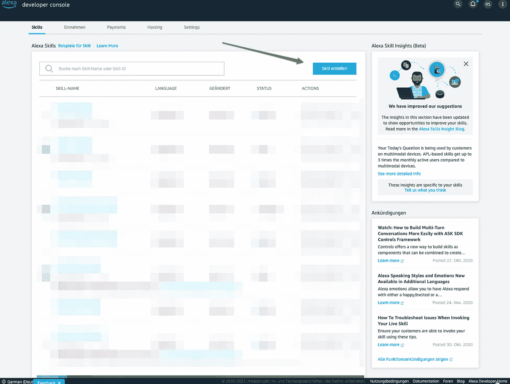

2010–2021 年，Amazon.com 公司及其子公司。保留所有权利。

提供一个名称，选择“Custom”作为您的技能类型，然后选择“Provision your own ”,因为我们将在本地计算机上“托管”该技能:

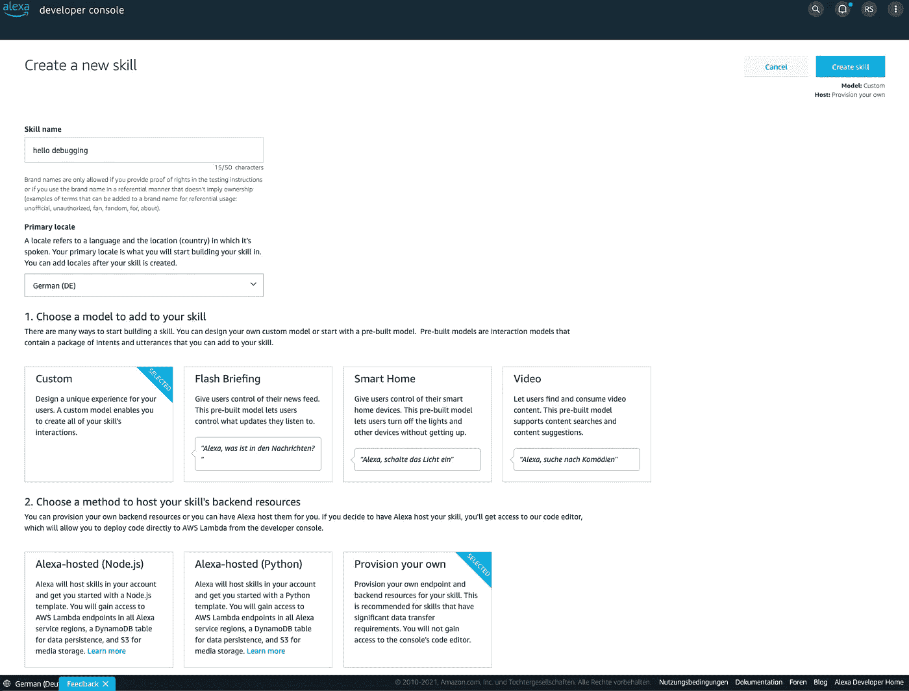

2010–2021 年，Amazon.com 公司及其子公司。保留所有权利。

点击创建，选择**从头开始**:

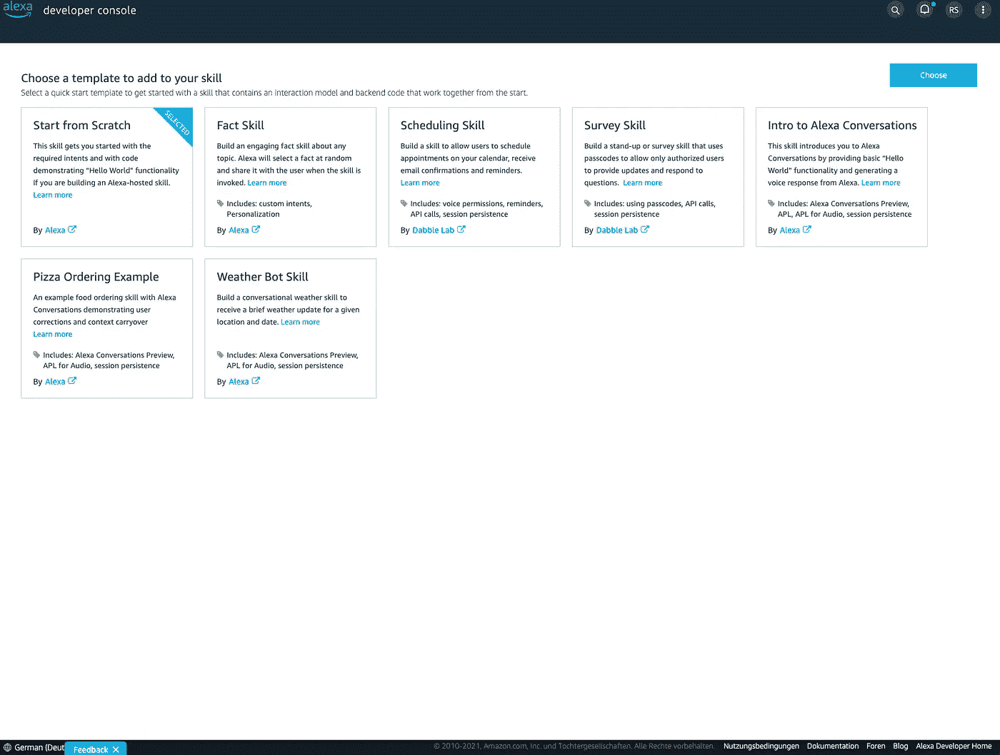

2010–2021 年，Amazon.com 公司及其子公司。保留所有权利。

技能创建完成后，点击“复制技能 ID”并保存该 ID 以备后用:

2010–2021 年，Amazon.com 公司及其子公司。保留所有权利。

现在打开技能，设置调用名为“hello debugging”。该调用名称用于通过模拟器或回显点启动技能，例如:

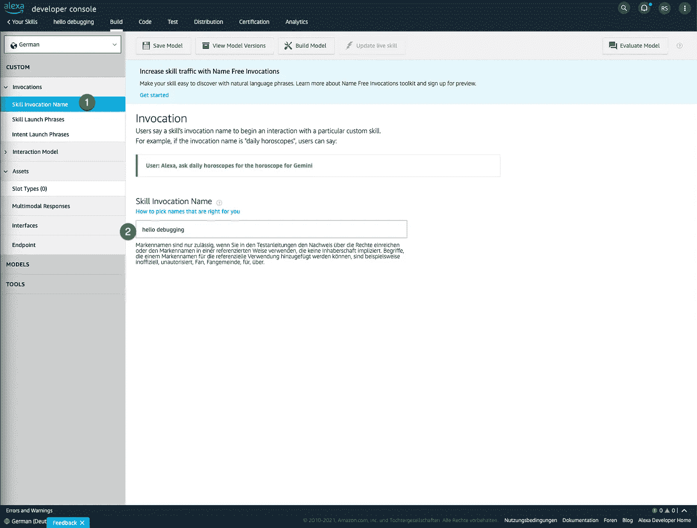

2010–2021 年，Amazon.com 公司及其子公司。保留所有权利。

点击“保存模型”并继续下一步。

# 步骤 2 —在 IntelliJ 中设置 Java 项目

为了能够调试某些东西，我们需要编写一些代码:-)因此我们只需在 IntelliJ 中创建一个新项目:

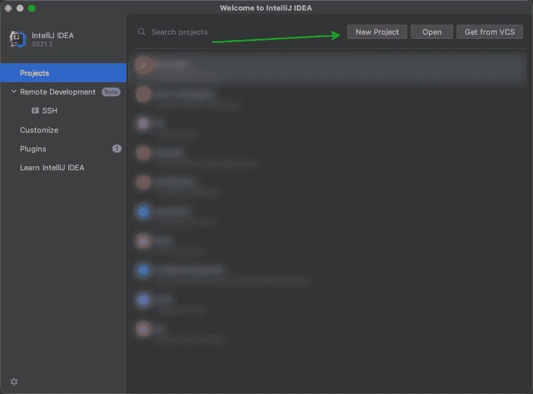

版权所有 2022 JetBrains s.r.o .，经许可使用。JetBrains IntelliJ 和 IntelliJ 徽标是 JetBrains s.r.o .的注册商标

选择“Java”并继续“下一步”:

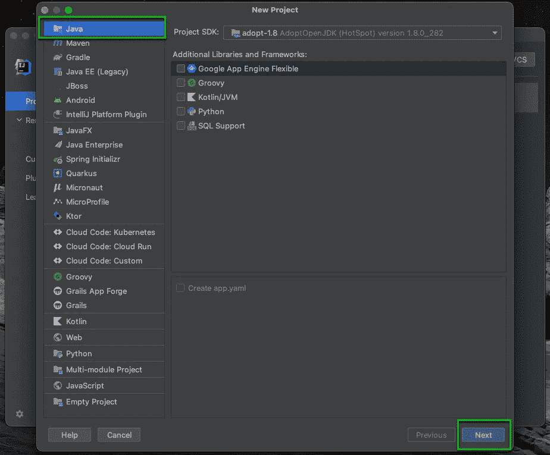

版权所有 2022 JetBrains s.r.o .，经许可使用。JetBrains IntelliJ 和 IntelliJ 徽标是 JetBrains s.r.o .的注册商标

也用“下一步”确认该步骤:

版权所有 2022 JetBrains s.r.o .，经许可使用。JetBrains IntelliJ 和 IntelliJ 徽标是 JetBrains s.r.o .的注册商标

现在选择“项目名称”和项目位置:

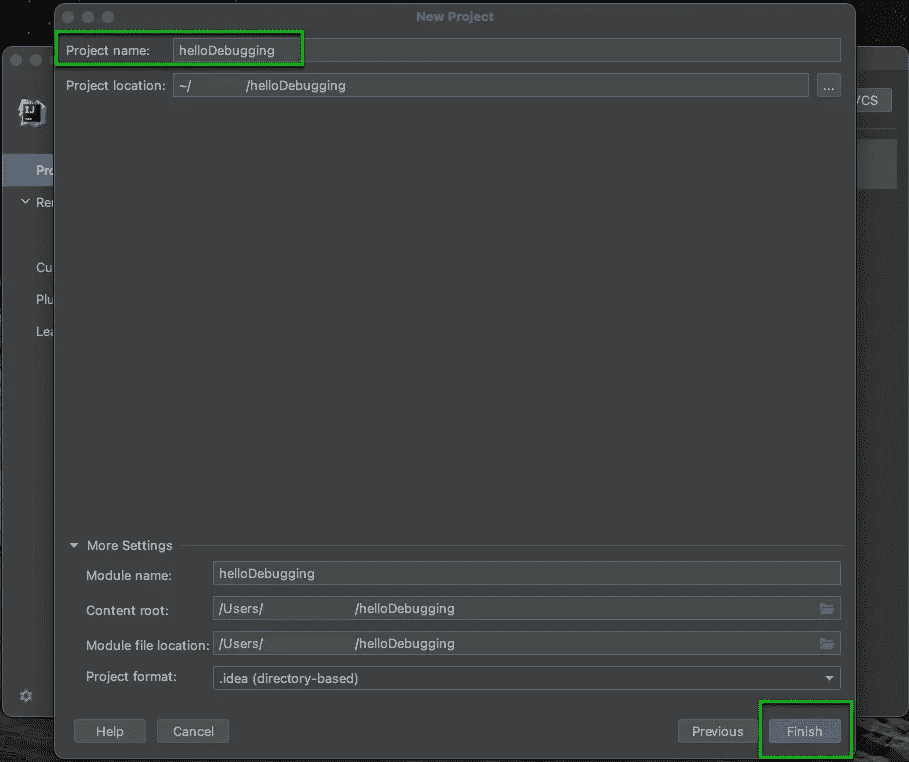

版权所有 2022 JetBrains s.r.o .，经许可使用。JetBrains IntelliJ 和 IntelliJ 徽标是 JetBrains s.r.o .的注册商标

当项目被创建并且主窗口被打开时，点击“IntelliJ IDEA-> Preferences-> Plugins”，并且安装来自 Google 的“云代码”插件:

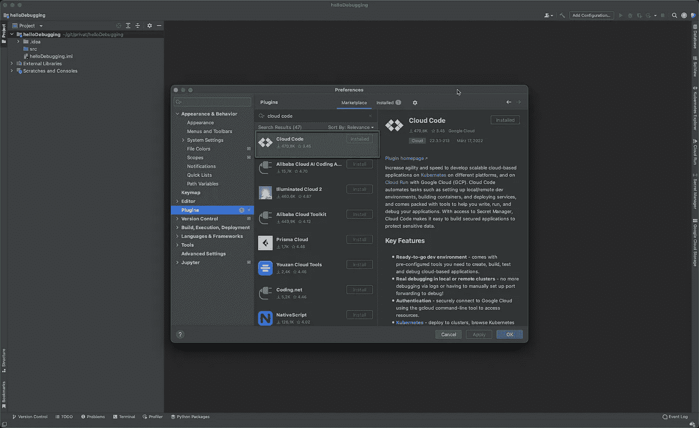

版权所有 2022 JetBrains s.r.o .，经许可使用。JetBrains IntelliJ 和 IntelliJ 徽标是 JetBrains s.r.o .的注册商标

安装完成后，我们继续将“Maven”和“Google App Engine Standard”添加到项目中:

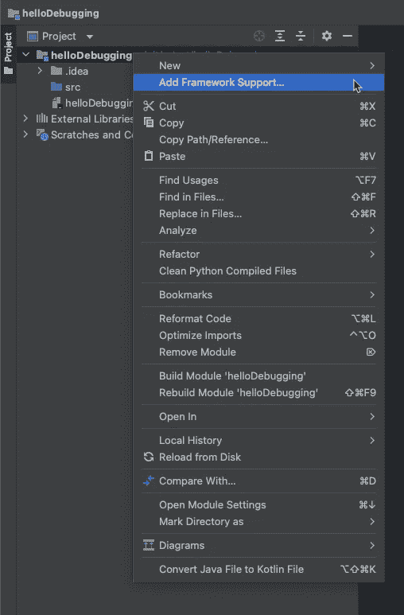

版权所有 2022 JetBrains s.r.o .，经许可使用。JetBrains IntelliJ 和 IntelliJ 徽标是 JetBrains s.r.o .的注册商标

确保选择了“Google App Engine Standard”和“Maven”。单击“确定”进行确认:

版权所有 2022 JetBrains s.r.o .，经许可使用。JetBrains IntelliJ 和 IntelliJ 徽标是 JetBrains s.r.o .的注册商标

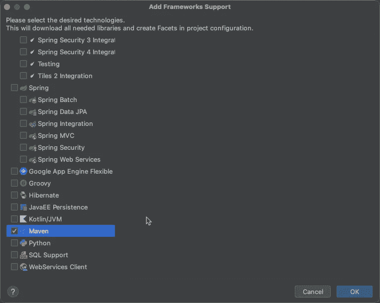

版权所有 2022 JetBrains s.r.o .，经许可使用。JetBrains IntelliJ 和 IntelliJ 徽标是 JetBrains s.r.o .的注册商标

此时，您可以看到一个“web”文件夹和一个“pom.xml”文件已经添加到项目中:

版权所有 2022 JetBrains s.r.o .，经许可使用。JetBrains IntelliJ 和 IntelliJ 徽标是 JetBrains s.r.o .的注册商标

让我们继续，通过 maven 添加一些依赖项，如 ask-sdk、javax.servlet-api 和 log4j-core。要添加这些依赖项和项目配置，只需用这个文件替换 pom.xml 内容。

如果您已经在 Google Cloud Platform 上创建了一个项目，您可以用您的项目 id 替换“您的项目 id ”,否则您可以在此处提供的文件中继续使用这个“虚拟”ID:

重新加载 maven 项目，以便应用更改:

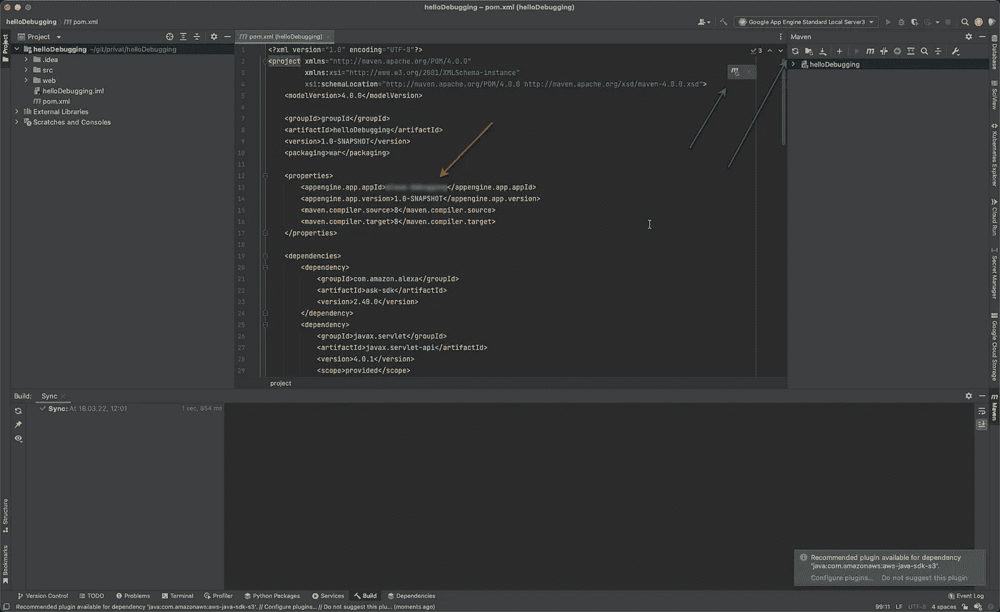

版权所有 2022 JetBrains s.r.o .，经许可使用。JetBrains IntelliJ 和 IntelliJ 徽标是 JetBrains s.r.o .的注册商标

更新完成后，我们可以继续使用`appengine-web.xml`文件，它包含应用引擎的某些配置属性。复制文件的内容:

并用先前保存的技能 ID 替换占位符“{您的技能 ID}”:

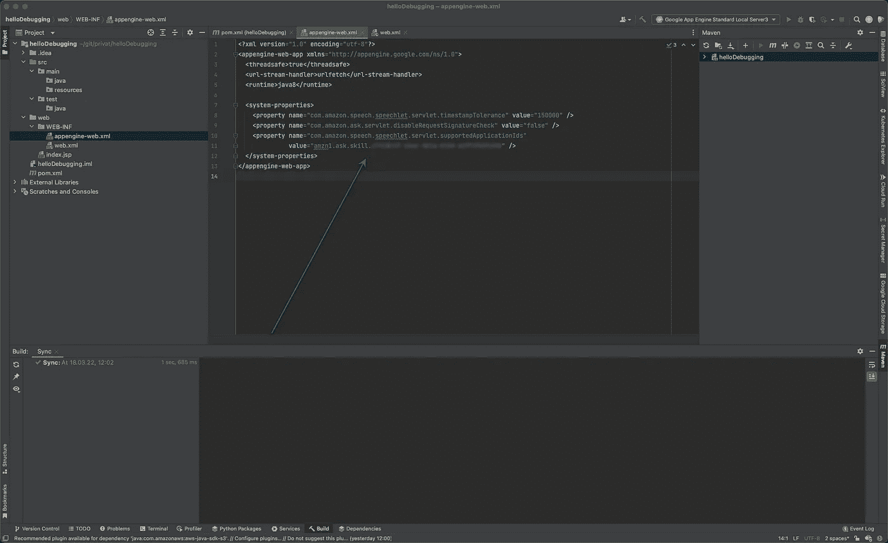

版权所有 2022 JetBrains s.r.o .，经许可使用。JetBrains IntelliJ 和 IntelliJ 徽标是 JetBrains s.r.o .的注册商标

我已经创建了一个`log4j2.xml`文件，其中包含了向`SYSTEM_OUT`记录消息的一些基本设置。只需复制内容并将其放置在`src/main/resources/log4j2.xml`:

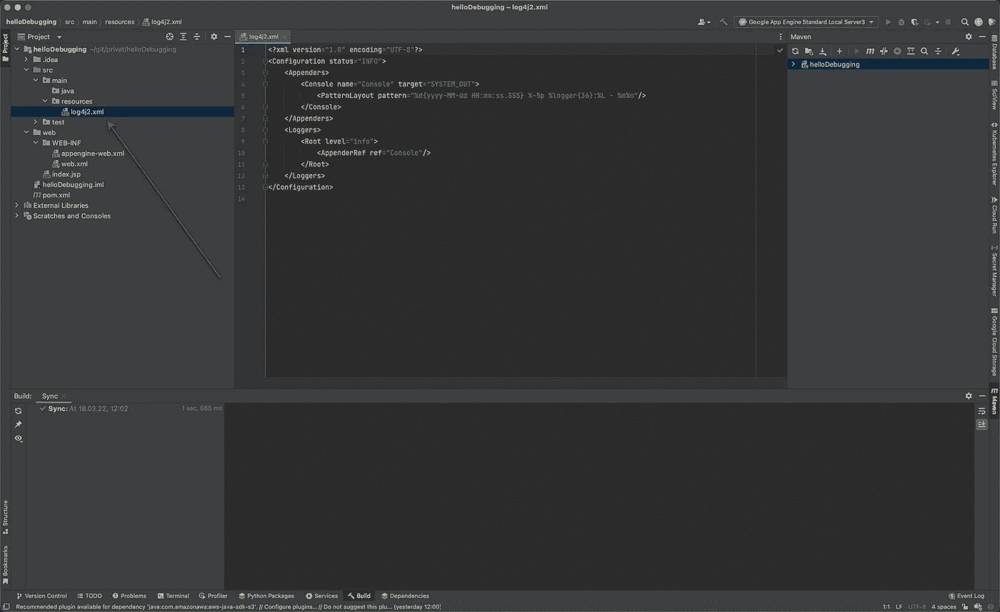

版权所有 2022 JetBrains s.r.o .，经许可使用。JetBrains IntelliJ 和 IntelliJ 徽标是 JetBrains s.r.o .的注册商标

有关如何配置记录器的更多信息，请参考 [log4j 手册](https://logging.apache.org/log4j/2.x/manual/)。

在所有这些步骤之后，我们检查我们是否已经正确地设置了一切。打开项目设置，检查“ **Facets** 是否包含这两个条目:

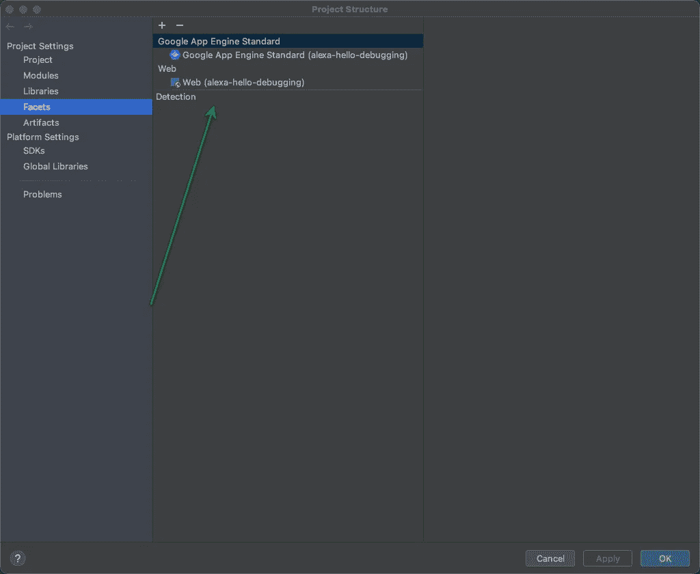

版权所有 2022 JetBrains s.r.o .，经许可使用。JetBrains IntelliJ 和 IntelliJ 徽标是 JetBrains s.r.o .的注册商标

如果没有，使用加号图标添加“Web”和“GAE 标准”方面。

接下来，让我们转到“工件”部分，检查“war”和“war exploded”工件是否是在项目构建时创建的。如果缺少一个，也可以使用加号图标添加它:

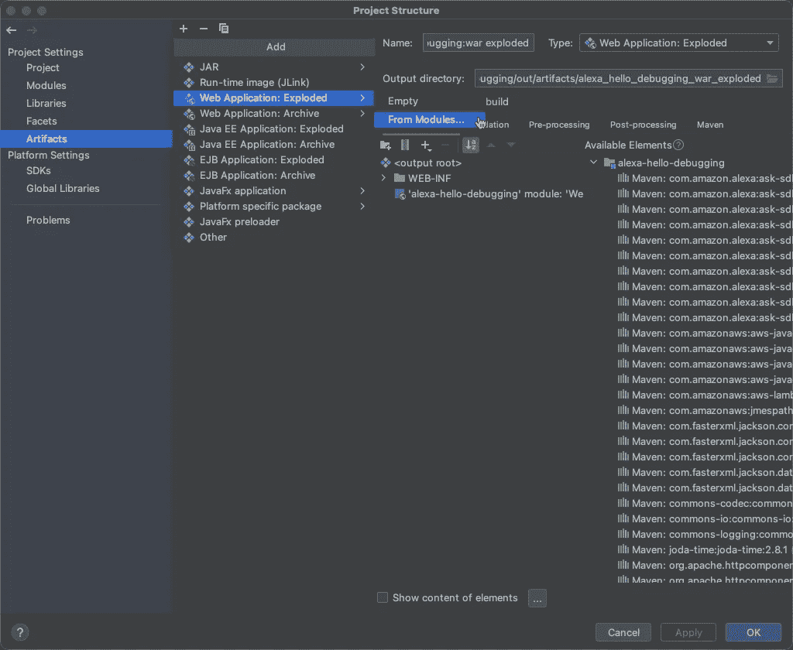

版权所有 2022 JetBrains s.r.o .，经许可使用。JetBrains IntelliJ 和 IntelliJ 徽标是 JetBrains s.r.o .的注册商标

确保两者都可用，并且“war exploded”工件包含在项目构建中:

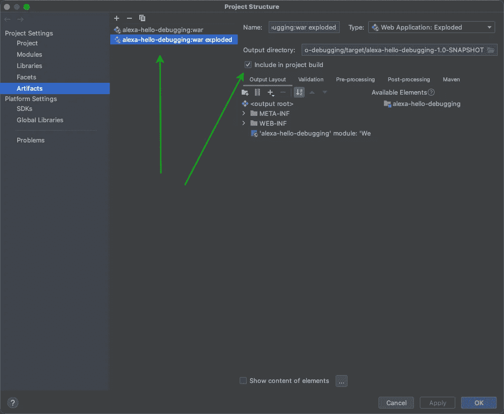

版权所有 2022 JetBrains s.r.o .，经许可使用。JetBrains IntelliJ 和 IntelliJ 徽标是 JetBrains s.r.o .的注册商标

# 步骤 3-创建 Alexa 技能类

首先，我们需要创建 handler 类，它只对启动请求进行一些基本的处理。让我们把它放在`src/main/java/handler/LaunchHandler.java`:

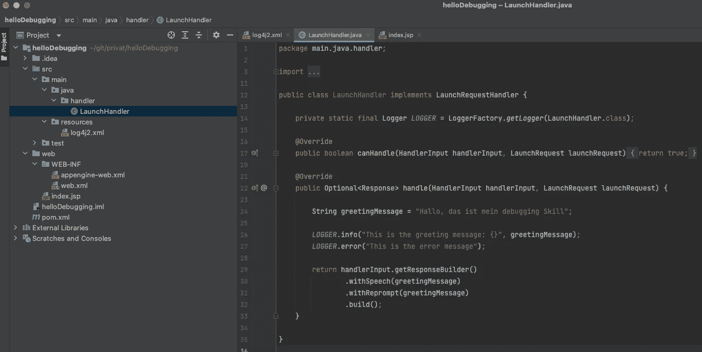

版权所有 2022 JetBrains s.r.o .，经许可使用。JetBrains IntelliJ 和 IntelliJ 徽标是 JetBrains s.r.o .的注册商标

接下来，我们需要创建应用程序的入口点，servlet 类。这个类扩展了 Amazon 的`SkillServlet`类，提供了处理程序以及其他一些重要的配置，比如技能 id。我们将添加之前创建的`LaunchHandler`以及我们的技能 id:

最后但同样重要的是，我们需要将我们的`AlexaServlet`类添加到`web.xml`文件中，以便我们能够调用我们的技能:

版权所有 2022 JetBrains s.r.o .，经许可使用。JetBrains IntelliJ 和 IntelliJ 徽标是 JetBrains s.r.o .的注册商标

基本上我们只是引用了`AlexaServlet`类，并告诉应用程序这个 servlet 可以通过这个 URL 到达:[http://localhost:8080/Alexa:](http://localhost:8080/alexa:)

现在，点击运行配置旁边的**调试**按钮，尝试构建并运行应用程序。如果一切顺利，我们应该看到服务器启动时没有任何问题:

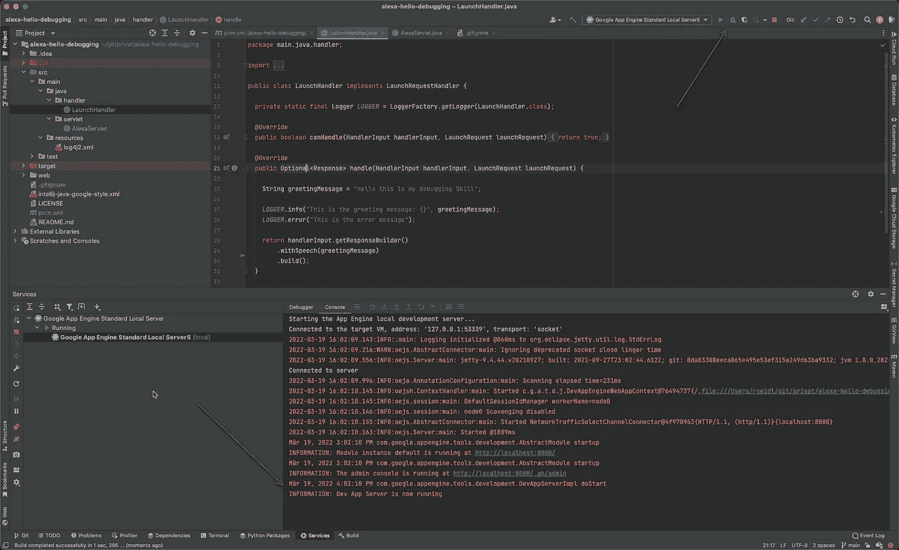

版权所有 2022 JetBrains s.r.o .，经许可使用。JetBrains IntelliJ 和 IntelliJ 徽标是 JetBrains s.r.o .的注册商标

# 第四步——完成一切，开始调试你的技能

现在打开一个终端，导航到您之前下载`**ngrok**`的位置，并执行这个命令:`./ngrok http 8080`

Ngrok 通过 8080 端口隧道连接到您的本地机器，并提供一个带有有效证书的公共 URL，以便我们可以将 Amazon 上的技能连接到我们的本地机器。继续复制 HTTPS 网址并粘贴到亚马逊:

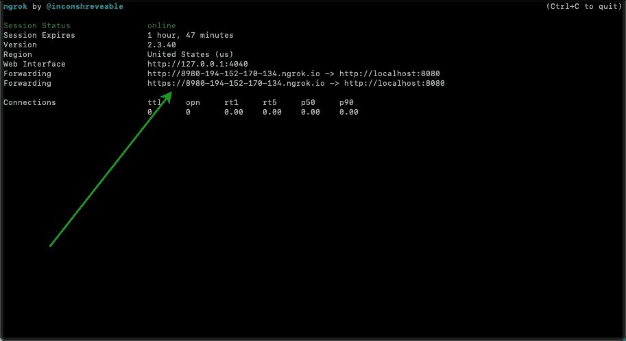

确保在 URL 末尾添加“/alexa ”,以便调用我们的`AlexaServlet`,并从下拉菜单中选择“我的开发端点是拥有通配符证书的域的子域”:

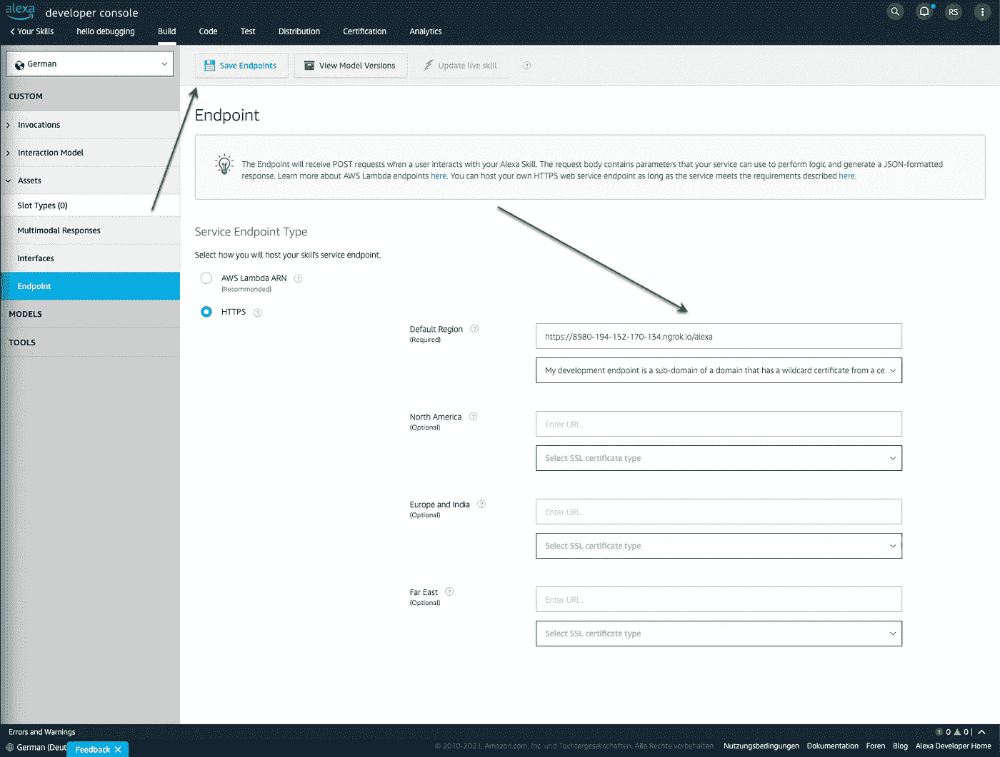

2010–2021 年，Amazon.com 公司及其子公司。保留所有权利。

现在，我们一直在等待的时刻终于到来了:我们可以设置一个断点，例如在我们的一个日志消息中:

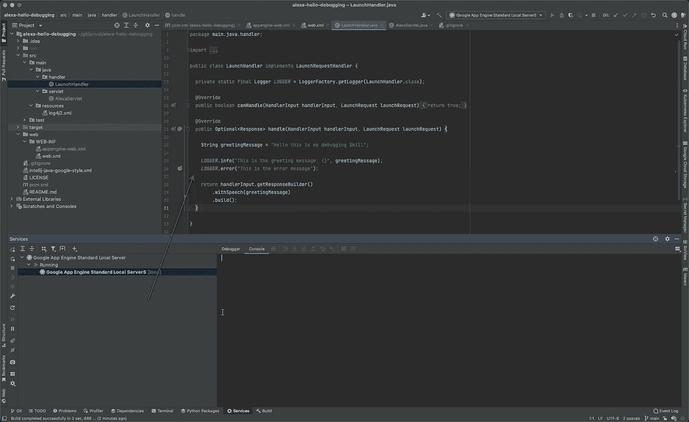

版权所有 2022 JetBrains s.r.o .，经许可使用。JetBrains IntelliJ 和 IntelliJ 徽标是 JetBrains s.r.o .的注册商标

如果你现在切换回浏览器并点击 alexa 开发者控制台中的“测试”标签，你可以根据技能的语言使用“你好调试”或“打开你好调试”来启动技能。此外，IntelliJ 现在应该用这个蓝色条表示断点是活动的:

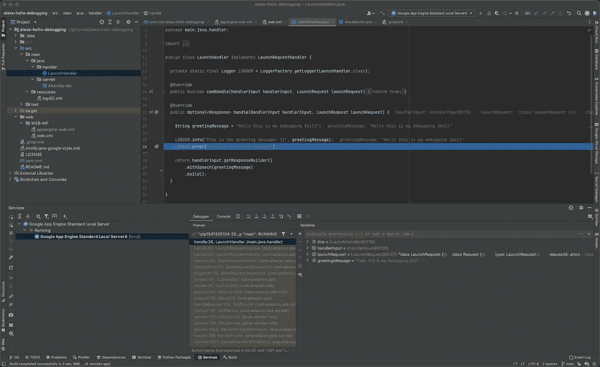

版权所有 2022 JetBrains s.r.o .，经许可使用。JetBrains IntelliJ 和 IntelliJ 徽标是 JetBrains s.r.o .的注册商标

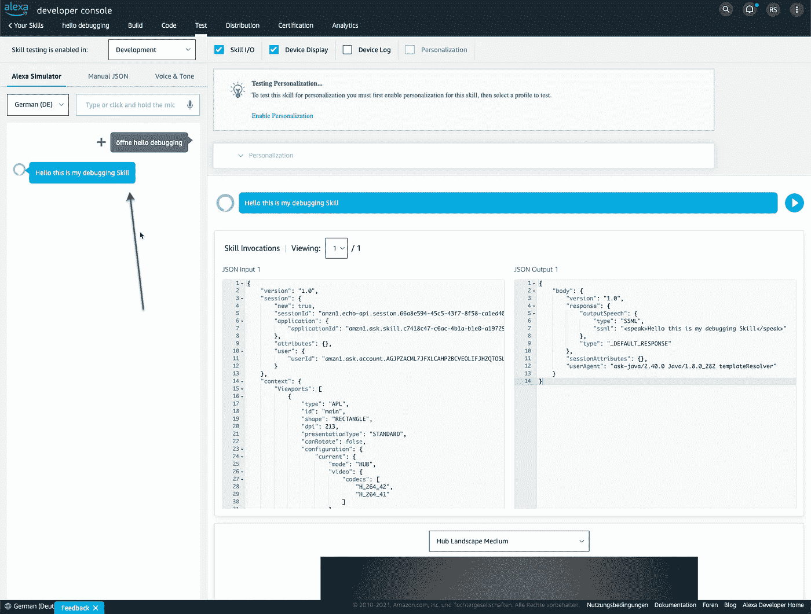

2010–2021 年，Amazon.com 公司及其子公司。保留所有权利。

# 摘要

让我总结一下我们的旅程。我们在 Alexa 开发者控制台中创建了一个新的 Alexa 技能，并设置了一个调用名称。

然后我们在 IntelliJ 中创建了一个 Java 项目，并添加了 Maven 和 Google App Engine 标准框架支持。在对配置文件做了一些小的调整后，我们使用`ngrok`将一个带有有效 SSL 证书的公共 URL 传输到我们的本地机器。

最后，我们在 Alexa 开发者控制台中的技能中添加了`ngrok`提供的 URL 并打开，触发了 IntelliJ 中的断点。就是这样！我希望我能够帮助你们中的一些人，并祝你们在开发 Alexa 技能时获得更多乐趣！

在我看来，既然这是一个好的实践，那么整个项目当然也可以在 [Github](https://github.com/raseidl/alexa-hello-debugging) 上获得。