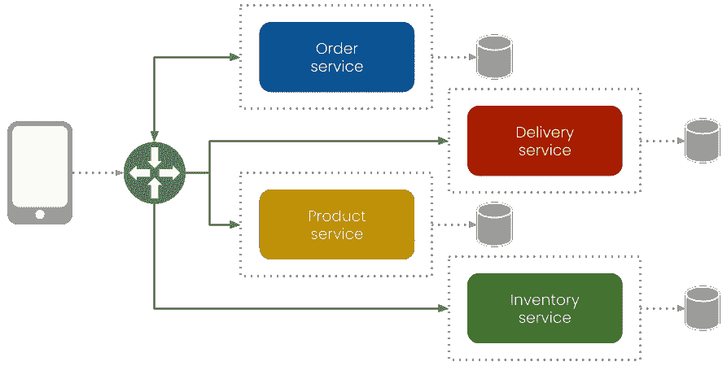

# 我如何在不重构的情况下将一个整体分割成多个微服务

> 原文：<https://betterprogramming.pub/how-i-split-a-monolith-into-microservices-without-refactoring-5d76924c34c2>

## 我通过即时架构风格变得更加敏捷的旅程

[李中清](https://unsplash.com/@picsbyjameslee?utm_source=medium&utm_medium=referral)在 [Unsplash](https://unsplash.com/?utm_source=medium&utm_medium=referral) 上拍照

微服务在过去几年里非常受欢迎，并对我作为全栈开发人员的工作产生了很大影响。但是这些年来，我从未失去对巨石柱的信心。微服务带来了很多额外的复杂性，在我见过的大多数情况下，这些复杂性并没有超过它们带来的价值。因此，我总是发现自己在提倡和捍卫一种单一的方法。这引发了很多讨论。

对我来说，整体架构和微服务架构没什么不同。如果处理得当，一个整体由具有强边界的模块组成。这给模块结构带来了高内聚和低耦合，使得应用程序更易于维护和更改。它还支持在同一个应用程序上与多个团队合作，而不会绊倒彼此。这是我听过很多次的赞成微服务的论调。

设计应用程序时，我发现很难定义正确的界限。无论它们是用于设置模块还是微服务。微服务有一些常见的分解模式，我发现它们同样适用于整体服务。在大多数情况下，按业务能力进行[分解](https://microservices.io/patterns/decomposition/decompose-by-business-capability.html)是一个很好的起点。例如，一个小型在线商店的基本结构可能是这样的。

模块化整体结构的想法肯定不是新的，但作为对微服务的反对，它获得了更多的关注。像萨姆·纽曼这样的专家写了很多关于这个主题的文章，新技术也从这些想法中涌现出来。一个很好的例子是 Java 应用程序的 Spring Modulith 项目。对于我工作过的大多数公司来说，这种类型的独石已经足够了。

在我看来，微服务架构只是整体架构的分布式变体。分布式系统既不简单也不便宜，所以选择它一定有很好的理由。对我来说，更好的应用程序结构或多团队支持都不是好的理由。重要的是运营相关的原因，如可扩展性、可靠性和可部署性。

如果模块边界足够强大，将模块化整体重构为微服务应该相当容易。这些模块可以独立地逐个重构。对我们的小型在线商店进行全面重构后，该应用程序可能如下所示。

有许多方法(模式)来组织微服务架构。没有放之四海而皆准的解决方案，因此正确的选择总是取决于具体情况。示例中使用的 [API 网关模式](https://microservices.io/patterns/apigateway.html)非常适合解耦服务、解决安全问题等等。它适合我作为大多数情况下的一个伟大的起点。

从一个整体开始，并逐渐将其重构为微服务，这听起来是一个很好的解决方案，但以我的经验来看并不实用。将模块重构为服务仍然需要大量的工作。建立新项目、端点、请求、操作等..一旦应用程序开始运行，当客户不断要求新特性时，很难找到资源将它放到另一个轨道上。当等待太久，事情开始分崩离析，气氛迅速转变。

这引起了我的思考。在理想世界中，一个整体可以过渡到微服务，而不需要任何重构。定义什么在哪里运行应该是一个配置的问题，并且可以随时改变。我喜欢这个想法，但是如何在不接触代码的情况下将模块转换成服务呢？在这个时候，我已经在研究一个可以帮助回答这个问题的概念。

作为一名全栈开发人员，我花了相当多的时间来建立前端和后端之间的通信，这总感觉是一个很大的开销。在我的文章[我如何通过不构建 API 来加速全栈开发中，我写了自动化两端之间通信的选项，以及我如何找到将通信从代码转移到运行时的解决方案。有了这个解决方案，前端可以直接导入和调用后端组件。运行库截获所有后端导入，并创建和提供远程实现。就像依赖注入器一样。](/how-i-speed-up-full-stack-development-by-not-building-apis-7f768335bec6)

使用该解决方案进行模块间的通信解决了向服务的自动过渡。但是运行时仅限于单个前端和后端部分。因此，它已经被重构，以支持无限数量的段，这些段可以单独部署，也可以作为一个组部署到前端或一个或多个后端。一个段包含一个或多个模块中的一个或多个组件。其内容由配置定义。小型在线商店应用程序现在可以这样设置。

在本例中，每个模块都放在一个单独的段中。交付部分需要负载平衡(由于跟踪和追踪特性),并被部署到多个服务器上。其余的数据段被分组并一起部署到一台服务器上。

可选地，模块可以被放置在单个片段中，并且稍后被移动到单独的片段。因为一个段只存在于配置中，所以将一个模块移动到另一个段对代码没有影响。这样，重新安排应用程序就可以及时完成，而无需重构。

该运行时已经成为在 MIT 许可下发布的开源项目。它被命名为 Jitar，是 Just-In-Time-ArchitectuRe 的缩写。由于全栈支持，它被实现为 Node.js 之上的一层，所以它只适合 JavaScript 和 TypeScript 应用程序。虽然我认为同样的事情在 Java 中也可以实现(而且可能。网？).关于 Jitar 的更多信息可以在[文档](https://docs.jitar.dev/)和 [GitHub repo](https://github.com/MaskingTechnology/jitar) 中找到。

暂时就这样了。我知道我已经跳过了很多关于如何处理数据、授权等的细节..在接下来的文章中，我想深入探讨一下。非常感谢你阅读这篇文章，我希望你喜欢它。

你能理解我说的事情吗？我总是乐于接受反馈，并乐意回答任何问题。

 [## 如何用 Jitar 将一个整体分割成微服务

### 了解如何使用 Jitar 运行时将整体转化为微服务，而无需重构

better 编程. pub](/how-to-split-a-monolith-into-microservices-with-jitar-95caf6f81e08)  [## 我如何通过不构建 API 来加速全栈开发

### 我通过自动化所有客户端-服务器通信来提高工作效率的旅程。

better 编程. pub](/how-i-speed-up-full-stack-development-by-not-building-apis-7f768335bec6)