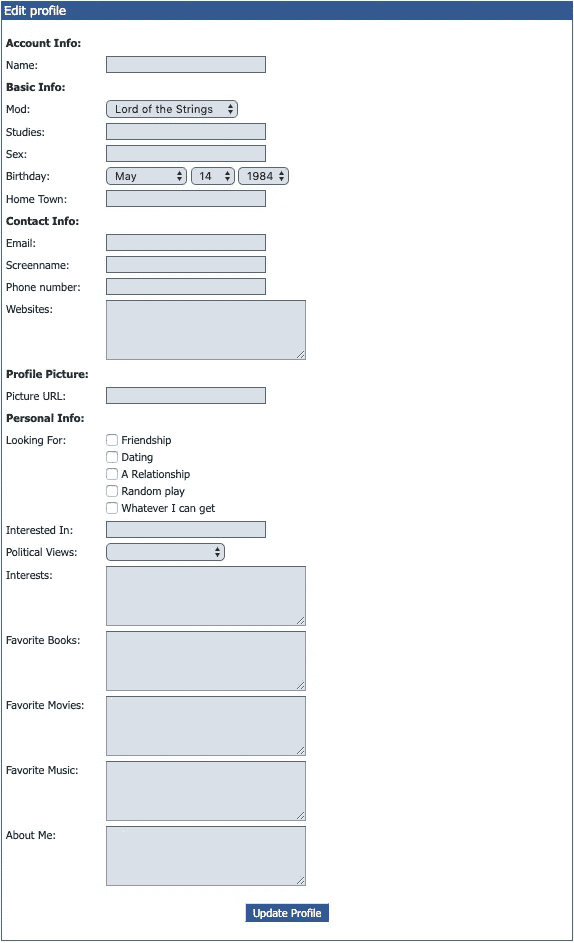

# 如何不编写功能测试

> 原文：<https://betterprogramming.pub/how-not-to-write-feature-tests-864a46932cfa>

## 没有测试，代码就会腐烂

Joyce McCown 在 [Unsplash](https://unsplash.com/s/photos/test?utm_source=unsplash&utm_medium=referral&utm_content=creditCopyText) 上的照片

随着你的代码库的增长，由一群特殊的贡献者竞相满足你的观众的不同需求，它很快开始蔓延。旧设计选择背后的意图在无休止的修补中丢失了，而职责分工瓦解了，重复的功能在系统之间的缝隙中游荡。

你需要重构，但是你害怕了。代码库太大了，很难理解它的整体，也不知道在一个地方重构一个功能是否会导致另一个地方的天塌下来。

一个健壮的测试套件消除了恐惧。只要一个控制台命令，你就可以知道你是否安全地清理了一个职业或者释放了四骑士。测试消除了基本维护的危险。

然而，写得不好的测试很容易和根本没有测试一样危险。我在制作《2005book》的过程中亲身体会到了这一点，这是一个复古的脸书克隆版。

如果您不按照产品代码的标准编写测试，那么您的维护工作量实际上会加倍。

测试必须随着产品代码的发展而变化。如果除了原作者之外，任何人都不能理解它们(或者原作者制造了如此惊人的混乱，以至于他们无法追溯自己的脚步)，你的团队将会尽一切努力避免接触测试套件。不仅您的生产代码正在腐烂，而且您已经将无用的测试代码添加到了垃圾堆中。

测试要求同样坚持 DRY 原则，关注点分离原则，以及您赋予生产代码的变量的谨慎的、富有表现力的命名原则。

为了突出这一点，这里列出了我在为 2005 年图书的编辑个人资料表单编写功能测试时所犯的所有错误，以及我为纠正这些错误所做的所有事情。

# 工具

## Ruby on Rails

## RSpec

Ruby 生态系统最流行的测试平台之一。

## 水豚

一个 Ruby 测试框架，模拟用户如何在浏览器中与你的应用程序交互。

# 第一次尝试

很少有人将老派社交网络与巨型表单区分开来。我对脸书最初的编辑个人资料形式的理解尤其深刻:

测试要求非常艰巨:确保每个字段都正确地将其输入保存到数据库中，并且这些值都被正确地检索并填充到后续的页面加载中。

这只是我第一次通过的 360 行庞然大物的一个例子:

## 测试驱动开发(TDD)的三大法则

在我们触及代码的状态之前，很明显我已经违反了 Robert C. Martin 的 TDD 三定律:

1.  在编写失败的单元测试之前，您不能编写产品代码。
2.  你不可以写超过足以失败的单元测试。
3.  您不能编写超过足以通过当前失败测试的生产代码。

我跳过了单元测试，直接进入了特性测试，认为模型的功能是理所当然的。一击。

更糟糕的是，我正在将这些测试改装到一个已经编写好的应用程序上，我有理由相信它是有效的。这可能会阻止未来的错误发展，但可能已经潜伏着一些我一无所知的讨厌的东西。

不要这样。编写一个测试，编写通过该测试的代码，然后编写下一个。测试是编程的一部分，而不是当你有时间时的次要活动。

## 单一责任原则

您应该注意的下一件事是，在我们到达测试代码之前，还有很多事情要做。在测试套件中，有多种通用的设置方法为测试运行做准备。

RSpec `let` helper 方法需要存在于测试套件中，但是普通的旧 Ruby 方法没有理由弄乱这个文件，尤其是如果它们可以被其他测试套件重用的话。运行测试是测试套件的工作——它不需要知道如何配置数据库来实现这一点。

这里还有第二个违反 SRP 的地方:唯一的测试套件`New Profile`应该测试一个新用户是否拥有正确配置的概要文件，但是它也测试概要文件编辑是否被正确地保存到数据库和从数据库中检索。这是危险的误导。

## 编写高性能测试

运行缓慢的测试不像能立即给出反馈的测试那样经常被使用。一旦你的测试工作，优化速度。

在我的第一次尝试中，这个`before`模块被设置为在每次测试之前运行:

每次测试之前，数据库中都会创建相同的记录，然后在测试结束时再次销毁。由于每个测试都依赖于完全相同的记录，这相当于毫无意义地浪费处理能力。本应在眨眼之间进行的测试却在几秒钟内完成。

## 不要重复自己(干)

重复是不可维护代码的标志。在这里，几乎每个测试都与另一个测试共享代码。有些线条出现在每一次**测试中。这里有一个特别令人讨厌的例子:**

## 硬编码的依赖项

在上面的例子中，注意到`expect`调用不仅指定了应该在屏幕上可见的文本，还指定了伴随它的 CSS。

如果网页的 HTML 结构发生变化，即使底层系统仍然工作，测试也会中断。这显然是疯狂的。

事实上，它正被迫对我的表单进行一次完整的前端重组，这让我觉得适可而止。这些测试是不可维护的——它们必须随着项目而改变或腐烂。

# 重构

一天之内，这个笨拙、笨拙、不可维护的庞然大物被缩减到 140 行。

## 分离的关注点

所有这些通用的方法塞满了之前的测试套件？扫入一个`ProfilesSpecSupport`模块。

如果将来不同的规范需要这些相同的测试对象，那么进一步通用化这个模块是微不足道的。

主测试文件中保留了许多助手方法:`test_text_field`和`test_dropdown`。这些特定于正在讨论的测试，所以我选择保留它们。然而，如果一个新的 spec 文件需要一个通用的现场测试，第一个调用的端口将是把这些提取到他们自己的模块中。

最初的测试套件也被一分为二:`New Profile`处理与创建新概要文件相关的功能，而`Edit Profile`负责确保概要文件可以被更新。

## 测试速度提高

以前数据库记录是在每个测试之前生成的，现在每个套件都有不同的`before(:all)`和`before(:each)`方法。

为每个测试套件创建一次共享测试对象。剩下`before(:each)`要做的就是从`ProfilesSpecSupport`调用高度抽象的`login`动作。

新的测试运行速度比第一次快 80%。

## 减少重复

测试一个表单是一种重复的练习。一个文本字段与另一个文本字段非常相似。测试下拉菜单的方法不会因下拉菜单的不同而改变。

为了将这种重复从测试本身中抽象出来，我编写了两个方法:`test_text_field`和`test_dropdown`。

针对特定字段运行测试非常简单，只需使用相关的字段 ID 以及要填充和期望的值来调用相应的方法:

目前，对表单是否在后续编辑中正确填充了新值的测试已经被删除，因为如果控制器向 Rails 的表单助手传递正确的对象，它们就必须正确填充表单。未来的控制器规范将恢复这种检查。

## 没有前端依赖性

所有那些针对特定 CSS 的硬编码检查都被移除了。相反，我只测试是否存在正确的内容。这为设计变更提供了更大的灵活性。

# 结论

为了让您的测试和您的产品代码一样干净——最好是更干净——请记住:

*   在测试失败之前，不要编写产品代码
*   每个测试套件，以及其中的每个测试，应该只做一件事。尽可能将助手方法抽象成模块。
*   优化测试速度:考虑哪些数据库事务是绝对必要的，哪些可以在每个套件的基础上运行
*   不要重复:检查在不同的上下文中做基本相同事情的测试，并构建通用函数来处理重复
*   最小化依赖性:不要编写依赖于前端运行的风格和结构的测试