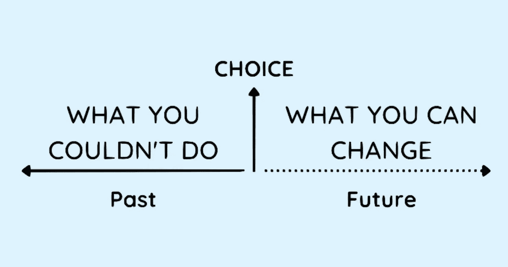

# 积极干预如何帮助我们看清

> 原文：<https://betterprogramming.pub/how-positive-intervention-helps-us-see-clearly-a349dd3b710e>

## 然而，这并不是厚颜无耻的坚持的结果。这是我们通过学习、洞察力和慷慨所获得的

鸣谢:作者

我的女儿迈拉现在已经八岁了，她小时候经常来找我说:

我不能滑下斜坡。

我不会跳这个舞步。

我不能修理这辆玩具车。

一直以来，我只是简单地让她用“还”来完成这个句子。

我还不能滑下斜坡！

我还不会跳这个舞步！

我还不会修这辆玩具车！

说“我做不到”会引发她永远做不到的信念，那不是她力所能及的。这让她没有足够努力就放弃了。说“我还做不到……然而”表示她现在还做不到，但是这是可以学习的。只要付出更多努力或采取更好的策略，这是可以实现的。一个是关于接受失败，另一个是关于拥抱挑战。

“我不能做”和“我还不能做”还有一个很大的区别*不行*就是卡在当下的感觉，现在不够好。*我还不能*是关于愿景，未来改进的动力。

这就是马克·吉布森，英国国家队的前成员，自 1982 年以来一直在指导孩子们，他把这描述为胜利者和抱怨者之间的区别。他说“成功者会列出一长串他们必须做的事情来学习他们想要的技能。我必须学会正确地倒立。我必须发展一种有效的从底部挥杆的方式。我必须在横梁上形成一个紧密的踢腿。另一方面，你的抱怨者会忙着创造一长串借口来证明他们的自我怀疑。我是一个糟糕的演员。我不会踢踏舞。我倒立的时候会害怕。换句话说，你的赢家正在形成一个行动计划，而抱怨者正在让他们平庸的根源越来越深。”

我还不能这么做。

这还没用。

我不知道…还不知道。

现在还说不通。

我还不明白。

我不擅长这个…目前还不擅长。

“还没有。”

# 塑造我们未来的力量

鸣谢:作者

人类天生倾向于终生学习新的思维方式和做事方式。然而的声音加强了这种好奇心。它提醒我们，我们可能还不够好，还不够熟练，那个盯着我们的可怕的东西可能会把我们吓坏，但它肯定在我们的能力范围之内。这可能需要更长一点的时间，但只有我们足够努力和足够长的时间，我们才能实现它。

赛斯·戈丁将“然而”描述为一个简单的缺失词。

他说“然而不是厚颜无耻的坚持的结果。这是我们通过学习、洞察力和慷慨所获得的。一路走来，还没把不能变成还没。你可以把它附加在任何与你的成就和贡献之旅相关的句子之后。

我还没有完成这个项目

我还没学会如何变戏法

我还没做成这笔交易

还没有。"

这是迄今为止不可思议的力量。

正如《纽约时报》的这篇文章所指出的，“如果你曾经拿起一个纵横字谜，对自己说，“我不够聪明”或“我没有足够大的词汇量，”这里有一个小秘密:纵横字谜不是对智力的测试，解决这个问题实际上不是关于你词汇量的大小。成为一名优秀的解决者就是要理解线索要求你做什么。”你可能还不知道如何解答纵横字谜。但是，你完全可以学会那样做。

这适用于一切。你并不是生来就具备生活中需要的所有技能，你必须努力去培养它们。

*   还不会开车？你可以学习驾驶它。
*   还不能成交吗？可以更好的学习谈判。
*   还不会投篮吗？你可以更好地学习投篮。

当你的固定心态想用“我做不到”来放弃的时候，用你的成长心态用“我还做不到……还不行”来修正它。然而“下一步是什么”的想法会把你道路上的障碍颠倒过来。它能让以前看似不可能的事情成为可能。它可以给你指出一条出路或另一条通往你需要去的地方的道路。

*   你没有在一项任务中失败，你只是还没有成功…还没有。
*   当你不知道答案的时候，你不会放弃，你只是还没有找到答案…还没有。
*   你不会带着“这不可能”的态度放弃，你会坚持“我只是还没想明白而已”

继续寻找方法变得更好，改进，改变你的处境。你有机会找到他们。放弃吧，别再找了，我保证你什么也找不到。

然而，希望的信号——我们脑海中的一个小小的声音告诉我们不要放弃，与我们面前的任何障碍作斗争，用新的策略来创造而不是对没有用的东西感到沮丧，把错误和失败视为进步的标志，梦想更大，更好，并使梦想成为可能。

只有当我们相信一切皆有可能时，一切皆有可能。

# 利用还没有的力量

通过将你的信念付诸行动来利用“尚未”的真正力量:

## 第一步:我还不能做…吗？

有没有什么你没有太多经验的事情或者你还不知道如何解决的事情？

*   你面临的一些问题是什么？
*   你想改变自己什么吗？

这些都是培养技能的好机会，这些技能将在未来对你有所帮助。列出你想学的“还不会做”的事情，或者你想改进的“还没做好”的事情。现在，把它们写下来。别忘了在每个句子的末尾加上“还”字。

## 第二步:再试一次

托马斯·爱迪生、莱特兄弟、迈克尔·乔丹和其他许多取得成功的人有什么共同点？

他们没有轻易放弃。他们知道做任何有意义的事情都需要不止一次的尝试。他们改变了与[失败](https://www.techtello.com/learning-from-mistakes/)的关系——一路迭代、失败、学习、改进。毕竟，当你尝试了很多次却失败了，你并不是一个失败者。你现在肯定知道什么不起作用了。这是心态的微妙转变，但却是区分从失败中受益的人和没有受益的人的重要转变，因为他们拒绝倾听、学习和改变。

采取那种态度。不是你做的每件事都需要数百小时和数千次的尝试。掌握一项技能可能需要几年时间，但只要有正确的态度，你可以在几周或几个月内精通任何事情。

## 第三步:寻求帮助

即使在用更好的策略和正确的努力尝试了多次之后，如果你还不能在工作中取得显著的进步，仅仅再尝试一次就不再有帮助了。是时候求助了。

取得进步并不意味着独自工作，它还需要与他人合作。其他人可以帮助你看到你看不到的东西。世界上一些最受尊敬和最成功的人是这样做的:他们不断地寻求帮助。他们乐于接受不适以获得他们需要的信息，提出问题以澄清他们的想法，并表现出向他人学习的好奇心。

在对学生的演讲中，巴拉克·奥巴马说“不要害怕提问。当你需要帮助时，不要害怕寻求帮助。我每天都这么做。寻求帮助不是软弱的表现，而是力量的表现。这表明你有勇气承认自己不懂的东西，并学习新的东西。”

难道不是吗？寻求帮助确实是力量的表现。它标志着对我们的局限性的自我意识，接受我们不知道的事情的谦逊，以及提出要求的勇气。最重要的是，这是自信的标志——自信我们有能力解决任何阻碍我们到达目的地的事情。真正的风险不是受到批评，面临拒绝，或者听起来很愚蠢。它不是找到你前进所需的建议。

只是寻求帮助。你还没有完成你开始的事情…还没有。

## 第四步:面对你的批评

坚持不懈地追求一个想法而不给[批评](https://www.techtello.com/how-to-deal-with-criticism/)留有空间会把我们困在自己的泡泡里，阻止我们变得更好。我们需要打破这个泡沫，打破我们对自己的幻想，敞开大门接受积极的批评。提高的唯一方法是积极寻找我们看不到自己的东西，或者像 Ryan Holiday 所说的“成为一名学生”

> “如果你认为你已经知道了，你就学不会。如果你确信自己是最好的，你就不会变得更好。接受反馈的艺术是生活中一项至关重要的技能，尤其是苛刻和批评性的反馈。我们不仅需要接受这种苛刻的反馈，还需要积极地征求反馈，当我们的朋友、家人和大脑告诉我们我们做得很好时，努力找出负面的反馈。”—瑞安·霍利迪

学会穿过噪音——识别大海捞针，这一智慧将帮助你向前迈进一步。不要陷入沉思，也不要被那些没用的或者无助于你康复的事情过度消耗。

“然而”可以是强大的。不只是为了你，也是为了你身边的每一个人。利用“然而”的力量并不会随着你而停止。你可以改变这么多人的生活，他们每天都和你打交道。当他们说他们不能做某事或想放弃时，你可以花点时间提醒他们(在这个过程中你自己也要提醒他们)。

他们可能不知道如何去做…只是现在还不知道。

# 摘要

1.  然而，这是可能性的声音。*不行*就是卡在当下的感觉，现在不够好。*我还不能*是关于愿景，未来改进的动力。
2.  不要说你做不到，说你做不到…还不行。
3.  从确定你想要培养的技能或者你想要完成的活动开始。
4.  任何有意义的成就都需要不止一次的尝试。不要急于去完成一个目标。实验，失败，重复。
5.  如果你还没有取得显著的进步，那就提出问题，寻求帮助。
6.  接受批评。批评不会削弱你的智力，它是你需要面对的残酷事实，以看清你处境中隐藏的现实。

感谢阅读。在[推特](https://twitter.com/techtello)上关注我，了解更多故事。

*这个故事最初发表于*[*https://www.techtello.com*](https://www.techtello.com/power-of-yet/)*。*