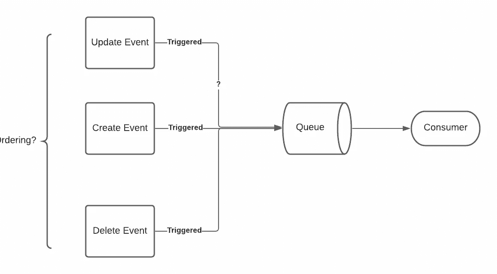

# 我们应该如何确定我们的微服务的排序？

> 原文：<https://betterprogramming.pub/how-should-we-determine-the-ordering-of-our-microservices-8bd0454f564d>

## 考虑分布式系统和微服务时的策略

作者照片。

微服务架构可以帮助团队异步开发应用。团队可以部署他们的代码库，创建一个更快的迭代和开发过程。然而，伴随着灵活性，开发分布式系统也变得复杂了。我们在单个系统中的许多假设在分布式系统中不起作用，我们需要重新评估我们如何在分布式系统中进行设计。

这方面的一个例子是时间排序。我最近想知道如何确保您创建的服务顺序正确。

假设您用两个微服务创建了一个事件驱动的架构:一个产品服务和一个订单服务。

产品服务将负责管理产品，订单服务是管理订单的可靠工具。产品服务可以发出一个`CreateEvent`和`UpdateEvent`，基于该事件，订单服务通过一个队列使用消息并更新其本地数据存储。

你如何保证`CreateEvent`能一直在`UpdateEvent`之前？

一个简单的解决方案是让订户进行检查。如果产品 A 不存在，我们可以将该值再次推入队列，假设`CreateEvent`出现故障。

但是，如果订户收到同一产品上的两个`UpdateEvents`出现故障，这将导致问题。

我们可能认为可以为每个事件创建一个时间戳，基于这个时间戳，我们可以决定是否更新时间。然而，这种方法可能也不正确。

# 时间呢？

时间在分布式系统中至关重要，不是因为我们关心系统中特定事件发生的时间，而是事件发生的顺序。通过我们的假设，时间可以帮助我们安排事情。

由于时间可以让我们观察到事件按时间顺序的创建和更新，所以我们可以分辨出`A`是在`B`之前还是之后。

时间的概念以及它在现实世界中的工作方式是线性的。原因是我们生活在一个单一的统一系统中，我们都同意时区和共享时钟(UTC)的概念。因此，当我们问一个特定地点的时间时，很少会有任何差异。

而且，我们认为事件通常是一个接一个发生的。例如，如果事件 A 的时间早于事件 B 的时间，则事件 A 发生在事件 B 之前。在这种情况下，我们假设事件的确切顺序与其发生的时间相关。

然而，这种心理模型在分布式系统中不起作用。在分布式环境中没有时间的概念，因为没有单一的真理源(全球时钟)。此外，这些事件通常同时发生在不同的地方。

因为我们不能根据时间来确定顺序，所以我们很难确定事件 A 是否发生在事件 b 之前。此外，分布式系统中的事件不是一个接一个发生的。它们可以同时、并行或同时发生。

# 总订单与部分订单

人类的时间水平是作为单一系统的时间模型的观点。由于单个系统中有一个统一的时钟，中央时钟系统可以根据事件发生的时间按特定的顺序排列事件。当我们知道一个系统中每一个事件什么时候会发生，我们就看到了它的总序。

在分布式系统中，每个节点都有自己的本地时钟，但它不知道另一个节点上另一个时钟的时间。该节点可能知道如何区分该节点内的事件*，但是不能将当前事件与其他节点上发生的事件排序。*

因此，分布式系统的状态是一种偏序，它既不保证网络也不保证每个节点上的节点的相对顺序。但是，每个节点都知道其本地顺序。

例如，我们知道事件 B 发生在事件 C 之后，并且有 A、B 和 C 进入。我们看到了 B 和 C 的顺序，但是 A 随时都可能发生。因此，我们不知道 A 的顺序。系统中的一个节点不能确定传入消息何时出现，或者另一个节点何时发送那些消息。

如果我们只能知道偏序。我们如何解决订购事件？

# 临时订单

也许我们不需要关心时间来安排系统中的事件。我们想了解排序的原因是我们想知道哪些事情发生了。因此，我们不需要关心事件发生的确切时间，而是一个事件如何导致另一个事件发生。

随意排序不是基于事件发生的时间，而是基于原因和结果。通过随意排序，我们不需要知道事件何时发生，只需要知道其原因和影响。这样，我们将大致了解事件的顺序。

在前面提到的问题中，我们可以确定在消费者端`CreateEvent`是否需要发生在`UpdateEvent`之前。然而，就两个`UpdateEvents`而言，我们无法说出哪个事件先于另一个事件发生。

我们可以尝试将`UpdateEvent`分开，只将`UpdateEvent`发送到带有递增版本号或原子计数器序列号的队列。在接收端，我们可以有一个存储版本号的数据存储，并检查传入事件是否比数据存储中当前存在的版本大一个以上。如果没有，我们可以使用一个缓冲区来重新排序，或者假设它没有按顺序，将它再次推到队列中。

假设你对临时订单更感兴趣。在这种情况下，您可以检查逻辑时钟或向量时钟，以生成分布式系统中事件的部分排序，并检测因果违规。

如果你有任何关于解决订购问题的其他见解或链接，请在下面的评论部分分享。

*最初发表于*[T5【https://edward-huang.com】](https://edward-huang.com/cloud/programming/tech/distributed-system/architecture/2020/12/21/how-to-determine-ordering-in-microservices/)*。*

# 资源

*   [订购分布式事件](https://medium.com/baseds/ordering-distributed-events-29c1dd9d1eff)
*   [全球范围的活动采购— Martin Krasser 的博客](https://krasserm.github.io/2015/01/13/event-sourcing-at-global-scale/)