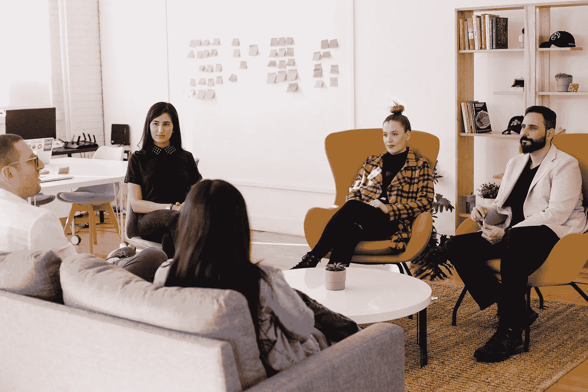

# 软件工程师如何在工作场所发展软技能

> 原文：<https://betterprogramming.pub/how-software-engineers-can-develop-soft-skills-in-the-workplace-569fc38ec5dd>

## 写作、演讲和与他人交流的重要性

由 [You X Ventures](https://unsplash.com/@youxventures?utm_source=unsplash&utm_medium=referral&utm_content=creditCopyText) 在 [Unsplash](https://unsplash.com/s/photos/meeting?utm_source=unsplash&utm_medium=referral&utm_content=creditCopyText) 上拍摄的照片

编程世界的新来者发现难以适应的一件事是不断的变化。软件的进入门槛如此之低，创造和探索新想法如此容易，以至于很容易发现自己迷失在疯狂中。新的框架、数据库和流程一直在不断涌现，维护您的技能组合可能是一项完全独立的工作。

# 软技能很重要

不过，有一点没有变，那就是软技能。过去最伟大的工程领导者没有编写 React 代码或使用无服务器架构，但他们仍然可能与今天的领导者分享以下特质:清晰沟通的能力，知道如何迎合受众的信息，以及能够在一个小组中筛选问题并将其分解。

与此同时，他们还需要能够跟上技术的发展——因此，能够快速学到足够危险的知识也是一个重要的考虑因素。

总体主题是发展软技能。这种技能将初级工程师和高级工程师、追随者和决策者、停滞不前的职业和不可思议的职业区分开来。

# 总结它的技巧

总结这个的技巧是什么？也许令人惊讶的是，我会说**销售**。

当我还是初级工程师的时候，我不明白为什么销售这么重要。似乎他们只是整天与人交谈，并得到了很好的回报。不应该有人能做到吗？

事实证明，它们是具有挑战性的对话，并且与优秀的工程技术一样重要。如果不能准确传达正确的信息，没有人会购买我们的产品，工程师也拿不到工资。

精通技术的销售人员非常罕见，在行业中非常罕见。然而，能够很好地展示和销售自己及其产品的软件工程师就更少了。

请记住，软件的存在不是为了让程序员可以玩新技术——这是一个很好的副作用，但它的存在是为了解决人类的问题。与普遍的看法相反，用户和客户并不关心这个应用程序是用 Ruby 还是 Java 编写的。它是否以他们需要的方式工作？事情是否如预期的那样出现在屏幕上？这对他们做必要的事情来说够快吗？

开发人员容易迷失在代码的杂草中，忘记他们工作的意图。代码库只是你提供的价值的一部分——另一个价值是如何使用它，如何最大化获得的利益，以及如何在它的基础上构建。

一个人如何变得更好？我认为销售有三个基本技能:写得好，说得好，联系得好。让我们检查这些。

# 谈写好文章

如果你已经做了一段时间的开发人员，你会意识到在代码库之外的大量的写作和阅读。

*   文档对于使用任何技术都是无价的。没有它，你就需要开始阅读源代码才能前进。
*   设计文档需要一致，以便团队可以在实施之前针对任何问题进行调整。
*   项目管理票需要良好的验收标准。否则，你永远不知道你什么时候完成了一项任务。
*   一般的维基页面应该清晰，这样人们就知道该做什么。

不幸的是，伟大的作品是例外，而不是常态。它超越了简单的语法、拼写和句法，更多的是关于:

1.  你面对的是正确的听众吗？营销人员和工程师不应该以同样的方式交流，因为他们有不同的背景和目标。
2.  简单吗？写得好很难，因为你的想法需要简洁。如果你不能保持简单，这可能意味着你还没有足够努力地思考这个信息。
3.  这需要存在吗？如果你写的东西可以在别处找到，考虑一下它是否真的有用。

为了在这方面做得更好，找机会尽可能多地写，并寻求反馈。卡尔·纽波特(Cal Newport)关于培养硬技能的书《好到他们不能忽视你:为什么在寻找你热爱的工作时技能胜过激情》(So Good them not Ignore You:Why Skills Trump pass Passion in the question for You Love Work)对激励很有帮助。向周围的人征求对你的设计文档和其他形式的文档的意见。看看他们是否对人们有所帮助，并且一定要注意那些被忽视的东西。

阅读好的书面交流材料——书籍(畅销小说或非小说)是一个很好的起点。令人惊讶的是，几乎所有在哲学、商业甚至娱乐界最受尊敬的思想家都有最清晰的文字。雷伊·达里奥的《原则:生活和工作》一书是一个很好的例子，说明某人的思想是如此简洁地提炼出来的，这无疑有助于他成功地执行有争议的想法。

此外，看看斯蒂芬·金的《写作:这门手艺的回忆录》，从大师那里获得一个有利的视角。

# 说得好

交流的另一半是通过口头讨论。无论是在一对一的谈话中，在会议中，还是在数千人面前，知道如何说和知道说什么一样重要。

这个话题也超越了成为一个圆滑的谈话者——最好的工程师和领导者通常愿意进行非常困难的谈话。

这部分是站着思考，部分是感觉你有尊重和权威来表达你的想法。

为了发展这一点，我提供了三个对我很有效的方法:

1.  **寻找不适**——通常，我们在现代生活中遇到的最可怕的事情涉及到其他人。在与高管的会议上发表不一致的意见是不舒服的。一个人去聚会很可怕。但是愿意接受不适是让你能够伸展自己的原因。通过足够的练习，我们在语言交流中保持的警惕会放松，让我们变得更加开放。
2.  **学习如何进行艰难的对话**——凯瑞·帕特森(Kerry Patterson)的《至关重要的对话:当风险很高时的对话工具》和克里斯·沃斯(Chris Voss)的《永远不要分割差异:谈判，就好像你的生活取决于它一样》是关于控制事情情感方面的优秀书籍，这样你就可以讨论重要的逻辑话题。
3.  **寻找公开演讲的机会**

# 关于连接

销售技巧的最后一点是建立联系的能力。

在“[闯入软件？你必须从科技职业顾问那里知道的招聘秘密，丹引用了下面这段话:](https://algodaily.com/lessons/hiring-secrets-you-must-know-from-a-tech-career-advisor)

> *“人际关系是我和学生们经常谈论的话题，因为它看起来很无聊，很多人对建立人际关系网感到焦虑。听着，归根结底是真正的好奇和兴趣。而是要有深深的同理心，为对方的生活增加价值。*
> 
> 我们在某些方面都是有联系的——也许你和你与之交谈的工程师上的是同一所高中？还是大学？或者在同一个地区长大。你们可能有相同的兴趣或从事相同的活动。总有办法联系上。”

当然，我最后会推荐一本书:戴尔·卡耐基的经典之作《如何赢得朋友&影响他人》向你展示了一套惊人的基本技能来建立你的人际网络。

*本指南最初发布于*[*https://algodaily.com*](https://algodaily.com/lessons/what-is-the-best-skill-to-pair-with-programming)*，我们在那里提供软件职业建议和技术面试课程。*