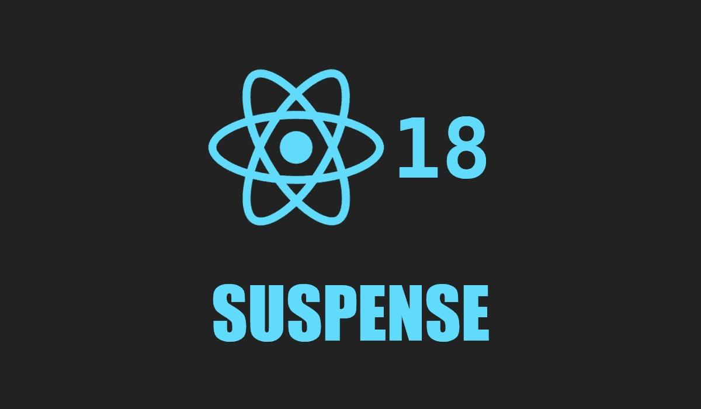

# React 18 中悬念的工作原理

> 原文：<https://betterprogramming.pub/how-suspense-works-in-react-18-c7617a50447f>

## 了解新的并发暂记和过渡 API

React `Suspense`特性作为`React 16`版本的一部分发布。在那里，它只有一个用例。它的本意是与它的`React.lazy` API 一起用于代码分割。当元素还没有被下载和呈现时，它将作为一个后备。但是它有一个主要的缺点。它不能在服务器端呈现引擎上使用。

它还有其他警告，但这些都只是暂时的。众所周知`Suspense`是 React 并发引擎模式的基石。它不仅仅意味着一个代码分割的专用 API。

随着 React 18 的发布，`Suspense`功能得到了进一步的开发和增强。它适合许多用例，现在它与`SSR`兼容。尽管如此，它仍然不能用于数据获取。这项功能仍处于试验阶段，可能会在将来的版本中推出。

React 团队提供了一个渐进的更新。只有通过使用新的`ReactDOM.createRoot` API，我们才能释放并发性和所有新奇的`Suspense`特性。

# 简要回顾

什么是`Suspense`？它是一个低级引擎 API，可用于暂停组件的执行。这是怎么做到的？简而言之，这一切都归结为一个组件抛出了一个被引擎拦截的承诺。它将推迟组件树的执行，直到承诺被解决或拒绝。

`<Suspense />`需要一个强制的`fallback`属性。这是我们指定占位符组件树加载行为的地方。如果有多个`<Suspense />`包装器会怎么样？它将从挂起的组件中获取最近的`<Suspense />`父组件。

让我们看一个例子:

在上面的代码中，当获取`<Content />`时，它将显示`<Loader variant="indeterminate" >`组件。当`<Header />`加载时，它将显示`<Loader />`组件。

# 改进的行为

在`16`和`17`中发现的悬念的稳定版本是并发思想的同步实现。它被称为`Legacy Suspense`。

在`Legacy Suspense`中，组件树将从 UI 中隐藏。不会被该丢弃的丢弃。这可以通过向父 DOM 元素添加`display: none`样式来实现。这种实现导致了生命周期事件触发的不一致性。这些在挂起的组件得到解决之前被激发。这导致了相当多的错误和不受欢迎的行为。

在`Concurrent Suspense`版本中，组件将在暂停时被丢弃。未完成的渲染树不会被提交。只有当组件准备好了，它才会被放入 DOM。它的布局效果将被激活。因此，执行顺序更加直观。组件现在完全是异步的。

**遗留悬念**

*   元素树会立即挂载到 DOM 中
*   效果/生命周期被激发
*   当悬念被触发时，树在视觉上是隐藏的
*   只有在挂起的组件被解析后，它才可见

**并发暂停**

*   在挂起的组件得到解决之前，不会挂载元素
*   效果/生命周期被激发

为什么 React 团队不直接实现`Concurrent Supense`方法？这是因为遗留类组件的生命周期。对于`Concurrent Suspense`引擎来说，没有合适的方法来处理像`componentWillMount`这样的事件。这就是 React 团队在所有前缀前加上`UNSAFE_`的原因。

# 带悬念的布局效果

我们之前只是触及了表面。那些`layout events`在`Concurrent Suspense`中会如何执行？有些组件可以删除，以后再添加到 DOM 中。

这些现在将在`hide`和`show`事件上运行。当 React 需要隐藏挂起的节点时，它会运行清理功能。当需要显示悬浮的元素时，它会重新触发它们的布局效果。

与`Legacy suspense`的情况相反，这些布局效果可能会运行多次。不再认为具有`[]`依赖关系的布局效果只会运行一次。最好不要把它们看作生命周期事件，而是不同 React 特性的行为单元。

如果我们看下面的例子:

我们可能会得到几个`log on mount`和`log on cleanup`日志语句。这取决于组件是否被挂起并多次重新添加。

# 服务器端渲染

在`SSR`中使用的时候`Legacy Suspense`会抛出一个错误。很不方便。

添加了新的 HTML 并发服务器渲染。它输出的不是一个`string`，而是一个`stream`。

那个`stream`可以用来提前推送最初的 HTML。它将包括`Suspense`后备占位符。当内容准备好时，它会发出一个带有`script`标签的 HTML 片段，将组件插入正确的位置。React 库将能够在流未完成时合成应用程序的一部分。

当`Concurrent Suspense`支持数据抓取时，这个流特性将会非常方便。

让我们来看看让这一切成为可能的 API:

让我们看看它在浏览器中的外观

来自 React 团队的带有悬念的 SSR 流 HTML 的表示在这里找到了。

绿色区域占位符是已经水合的元素。`spinner`是一个在服务器上挂起的组件，但还没有流。

更多信息，你可以在这里看到完整的细节[。](https://github.com/reactwg/react-18/discussions/37)

# 暂停列表 API

通过`React 18`，我们得到了另一个悬念引擎特性:`<SuspenseList />`。我们可以使用这个组件包装多个`<Suspense />`实例。有了这个特性，我们可以协调和编排如何向用户展示这些内容。这有助于减轻网络的不可预测性。

这需要两个道具:

*   **revealOrder** :定义了它们应该显示的顺序。选项有`forwards`、`backwards`、`together`。
*   尾巴:它让我们崩溃或隐藏所有的悬念。数值为`collapse`或`hidden`。默认情况下，它会显示所有的悬念回落。

让我们来看一个使用示例:

注意，在上面的例子中，出现的顺序是`forwards`。这将显示按顺序出现的组件。

# 过渡 API

React 18 版本附带了一些新的 API，可用于进一步微调`Suspense`体验。

我们可能希望在获取新组件时保留已加载的组件。当组件的下载/解析在后台发生时，用户将继续看到相关信息。为此，我们可以使用`transition API`。

我们来看一个具体的例子。假设我们有一组用户可以浏览的标签。切换选项卡时，显示旧的选项卡内容比显示新内容的`Suspense`回退更相关。页面应该保持互动。如果用户点击另一个标签，引擎将放弃当前的暂停任务并加载新的任务。

让我们看看代码的例子。我们来看看 React 18 之前的版本:

让我们使用新的`transition API`。`useTransition`钩子 API 提供了一个进度指示器`[0]`和一个启动不太关键的转换`[1]`的方法。

当处理异步发生时，页面将始终以交互方式开始。

重要的是向用户反馈正在发生的事情。通过使用`isPending`布尔值，我们可以使内容变暗。动作`pressing a tab`有直接反应:`content is dimmed`。

这是怎么回事？React 引擎在等待新版本完成时，会保留 UI 的先前版本树。它就像 React 在另一个部门同时工作。这将是同一个 JSX 树的两个版本。

有了这个转换 API，我们现在可以更好地控制应用程序的行为。我们对它的执行有更多的控制权。这将归结为我们具体的 UX 情景。

# 包裹

我们已经看到了所有来自`Concurrent Suspense` API 的很酷的特性。这是性能上的巨大进步。它还修复了一些与`Legacy Suspense`实现相关的错误。仅仅是`SSR`上的`Suspense`就值得升级到`React 18`。

尽管这个版本非常令人兴奋，我们还是迫不及待地想看到`Suspense data fetching`准备好。这将是一个巨大的游戏规则改变者，开启许多模式。我们必须有耐心。难点在于需要同步的移动棋子很多。

花了一些时间才完成这个版本。然而，他们对`Suspense`的实现值得等待。

感谢阅读。