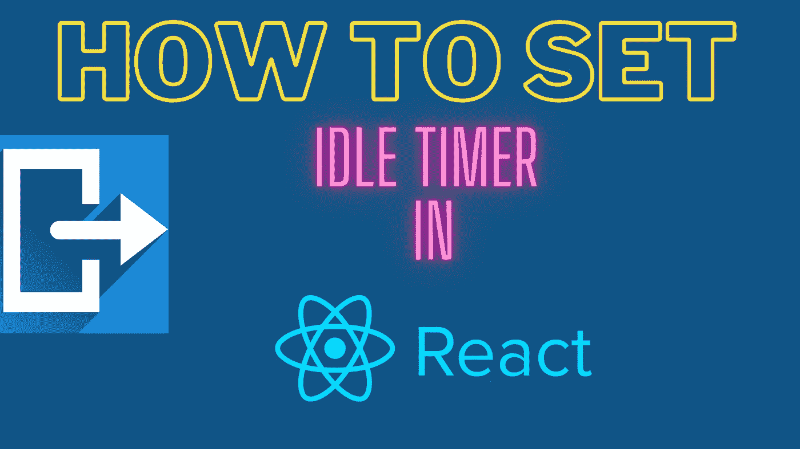

# 如何在 React.js 应用程序中添加空闲计时器

> 原文：<https://betterprogramming.pub/how-to-add-an-idle-timer-in-a-react-js-application-b5a4628233ec>

## 如何从会话中注销空闲用户的示例

作者照片

# 介绍

在构建 web 应用程序时，考虑应用程序用户的安全是很重要的。考虑到这一点意味着，作为一名开发人员，您需要考虑设备的类型以及用户访问您的应用程序的方式。

有时，用户可能会尝试在网吧等地方使用公共计算机访问您的 web 应用程序服务器。作为开发人员，为了保证应用程序用户的安全，您应该考虑这些类型的用户。

虽然许多活动教育用户如何使用公共计算机，但默认防止一些网络攻击也很重要。

防止诸如会话劫持之类的攻击发生的一种方法是通过实现空闲用户的注销。通过这种机制，在指定时间内没有活动操作的用户将自动从应用程序中注销。

现在，想象一个场景，一个用户在网吧使用完一台公共计算机后，匆忙地或者不知不觉地关闭了他/她用来访问您的应用程序的系统中的选项卡，而没有从他们的帐户中正确注销。如果您的应用程序不能检测用户空闲并注销他们，任何人都可以通过用计算机访问相同的网站来访问他们的帐户。因此，为了像这样帮助用户，您还可以设置一个空闲计时器来将用户从您的应用程序中注销。

在本文中，我将教你如何在 React.js 中设置一个空闲计时器，并注销空闲用户。因此，在本文的最后，您可以设置一个系统来检测空闲用户并让他们退出会话。

# 先决条件

要一步一步地学习本文，您的机器中应该有以下项目，并且您还需要熟悉以下概念:

1.  您需要在您的系统中安装最新版本的 Node.js，这将与节点包管理器一起提供，您将需要它们来创建 React.js 应用程序并安装一些重要的包。如果你的机器上没有 Node.js，你可以在[nodejs.org/en/](https://nodejs.org/en/)下载。请注意，您需要下载最新版本，而不是当前版本。
2.  您还需要熟悉 React.js 中的一些基本和高级内容，例如使用`create-react-app`包创建 React.js 应用程序，设置 React.js 应用程序，从应用程序文件夹树中删除所有不必要的样板文件，如何管理 React.js 中的状态，以及如何在 React.js 中创建自定义钩子。也可以访问官方 [React.js 文档](https://reactjs.org/docs/create-a-new-react-app.html)了解如何创建 React.js 应用，然后访问 [React.js 状态管理文档](https://beta.reactjs.org/learn/managing-state)了解如何管理 React.js 应用状态

如果您熟悉这些概念，并且在您的机器上安装了 Node.js，那么您可以很容易地理解本文。那么，我们开始吧。

# 创建并设置您的项目

要开始这个过程，我们需要一个 React.js 项目，所以如果您有一个 React.js 项目，就使用它。否则，运行以下命令创建 React.js 项目:

`npx create-react-app timer-app`

现在，您从这个应用程序中删除不必要的样板文件。

我们的应用程序将需要一个来自`npm`的名为`react-idle-timer` 的包。所以，运行下面的命令在你的应用程序中安装`react-idle-timer`

`npm install react-idle-timer — save`

因此，上面的命令将安装`react-idle-timer`包作为开发依赖项。现在我们可以开始用它来建造了。

# 创建一个 useIdleTimer 自定义挂钩

要创建一个定制钩子，您需要有一个以前缀`“use”`开头的文件，然后在这个文件中，添加定义您的定制钩子的代码。因此，在应用程序的 `src` 文件夹中创建一个文件夹。你可以给这个文件夹起任何你喜欢的名字，但是我决定在本教程中用`Hooks`作为我的文件夹名。

然后在`Hooks`文件夹中，创建一个文件来定义你的定制钩子。所以，调用文件 `useIdleTimer.js`。你可以在我的创建定制钩子的教程中了解更多关于定制钩子的知识。

现在将下面的代码添加到`useIdleTimer.js`文件中，以定义一个没有功能的定制钩子:

在这个钩子中，您需要从 React 导入 `the useState` 钩子，因为我们需要创建一个状态来检查用户是否空闲。然后，您还将从 `react-idle-timer`导入`useIdleTimer` 组件。如果用户变得空闲，这个组件有一些在设置由你的定制钩子执行的动作时有用的道具。

因此，用下面的代码从 React 导入 `useState`钩子，从`react-idle-timer`导入`useIdleTimer`组件:

下一步是从 `useIdleTimer` 组件中提取一些道具。在本文中，我们将利用`onIdle`和`idleTime`道具。您可以通过用下面的代码修改您的`useIdle`钩子来提取它们:

从上面的代码中，您提取了`onIdle` prop，这是一个您很快就会调用的函数。然后，您使用`idleTime`属性来定义用户在被注销之前允许保持不活动状态的时间(分钟)。因此，根据您正在构建的应用程序的类型，您可以将`idleTime` 设置为五分钟或更长。但由于这是一个实际案例，我将在`1`分钟离开。

定义我们的自定义钩子的下一步是创建一个状态，该状态将检查用户是否空闲，所以我将调用这个状态`isIdle`，然后与该状态一起，您需要创建一个`setState`函数来设置 `isIdle`状态。您还需要创建一个在用户空闲时调用的函数。因此，添加下面的代码来创建状态和函数:

因此，从上面的代码中，您用`setIsIdle`函数创建了`isIdle`状态。默认情况下，`isIdle`状态被设置为空。然后从第 5 行到第 10 行，你定义了一个 `handleOnIdle` 函数。现在，这个函数将负责如果用户保持空闲将会发生什么。注意，您用`setIsIlde`函数将`isIdle`状态设置为`true`，然后您注销控制台，用户处于空闲状态，随后是一个事件。

这个事件可能是当用户用鼠标在页面上悬停时发生的。您还注销了用户在控制台上的最后活动时间，并调用了一个我们尚未创建的`getActiveTime`函数。最后，您调用了`onIdle`函数。

这样，您现在可以创建`getActiveTime`变量，并使用下面的代码将它与`isIdle`状态一起返回:

在上面代码的第 4 行，您创建了两个方法，其中一个是我们调用的`getActiveTime`方法，另一个是`getRemainingTime`方法。现在，我们使用`useIdleTimer`来创建这些方法，然后我们传递一个超时值，该值将设置用户注销所需的时间。接下来，它将运行`onIdle`和去抖值。

最后，你用`isIdle`状态返回`getRemainingTime`和`getLastActiveTime`。这样，您的定制钩子就完成了，可以使用了。现在，您可以在应用程序的不同部分使用它。

请注意，您可以在一个组件中直接使用`react-idle-timer` 包，但是这并不是一个好主意，因为如果您需要在多个组件中使用它，那么您必须导致代码重复。

在下一节课中，让我向您展示如何在您的应用程序中使用`useIdle`钩子。

# 如何使用你的定时器自定义挂钩

因此，在上一节中，您创建了一个定时器客户挂钩，并将其命名为`useIdle`挂钩。现在，在这一节中，我将向您展示如何使用它在用户空闲一段时间后注销用户。

因为我在这个应用程序中没有私有路由，所以我将使用`App.Js`文件中的`App`组件，但是如果您有一个受保护的路由，那么这将是调用 `useIdle`钩子的完美位置。也就是说，在`App.Js`中，用下面的代码从`useIdleTimer`文件中导入 useIdle 钩子:

`import useIdle from ‘./hooks/useIdleTimer’`

然后，您需要创建一个将用户从应用程序中完全注销的函数。如果您的身份验证系统使用存储在应用程序会话中的令牌来授予用户对受保护页面的访问权限，那么最好使用此函数从会话中清除令牌。但是，如果您没有这样的认证系统，您可以在控制台上注销用户。

此外，您需要从您在上一节中创建的 useIdle 定制钩子中提取出 `isIdle`状态。

因此，将下面的代码添加到 return 语句之前的`App`组件中，以创建注销函数并提取 `isIdle`状态。

因此，使用上面的代码，您创建了一个`logout`函数，向控制台发送“用户被注销”消息。您还从`useIdle`钩子中提取了`isIdle`状态，然后将`logout` 函数分配给`onIdle`。当用户空闲时，会调用`logout` 函数，执行你所有的代码。因此，由于我有一个`console.log` 语句，消息将被记录到控制台。

最后，您必须检查用户是否空闲。如果用户是空闲的，那么您的应用程序可以显示“用户被注销”，但是如果用户保持活动，那么它应该显示“用户仍然是活动的”请记住，在您的`useIdle`定制钩子中，您默认将`isIdle`状态设置为 null，然后在用户空闲时将其设置回 true。

因此，默认情况下，`isIdle`状态既不为真也不为假，所以您的应用程序将首先显示一条“用户仍处于活动状态”的消息，然后如果您保持不活动状态大约 1 分钟，则将它更改为“用户已注销”。因此，将代码添加到您的`App`组件的返回语句中，以获得以下逻辑:

现在，如果您保存`useIdleTimer.Js`和`App.Js`文件并打开浏览器，您应该会看到大约 1 分钟的“您仍然处于活动状态”。之后，用户被注销，你应该会看到“你被注销”的文字。

现在，如果您之前有一个使用令牌的身份验证方法，并使用注销功能清除了这些令牌，那么当您刷新页面时，您将返回登录表单。

这样，即使经过身份验证，您也可以保护您的应用程序用户。

# 结论

身份验证攻击是 web 应用程序面临的常见攻击类型之一，在本文中，我刚刚向您展示了如何在空闲用户注销的帮助下防止会话劫持攻击。

在本教程中，您构建了一个自定义钩子来检查用户是否在您的应用程序中保持活动状态一段时间，如果是，您使用该自定义钩子将他们注销。

所以，现在你有一个适当的安全应用程序，防止会话劫持。感谢您通读这篇文章的结尾。