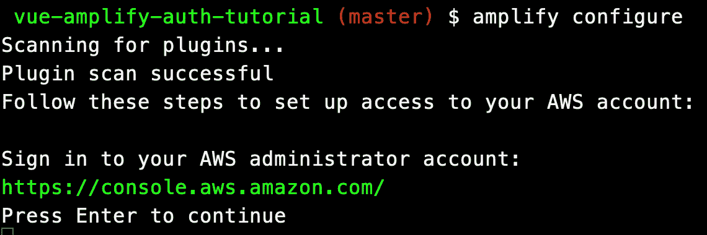
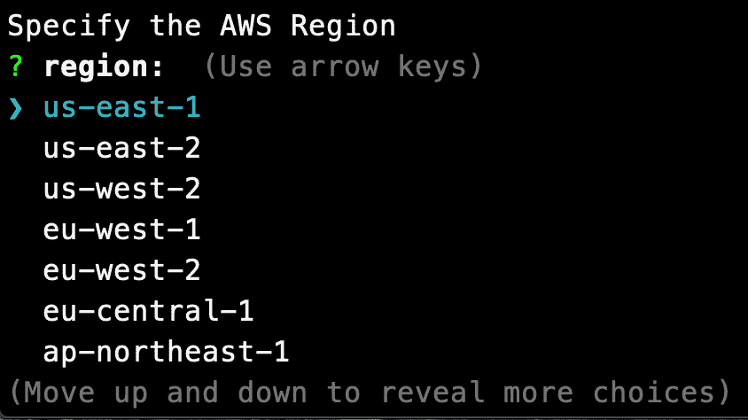
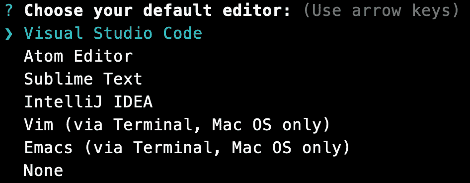

# 如何使用 AWS Amplify 向 Vue.js 应用程序添加身份验证

> 原文：<https://betterprogramming.pub/how-to-add-authentication-to-a-vue-app-using-aws-amplify-f10fbeef04d0>


由[菲利克斯·汉斯帕奇](https://unsplash.com/@fhanspach?utm_source=medium&utm_medium=referral)在 [Unsplash](https://unsplash.com?utm_source=medium&utm_medium=referral) 拍摄

## AWS Amplify 是一个为前端应用程序添加身份验证的工具。了解将其添加到您的 Vue 应用程序有多简单。

# 我们将创造什么

我们将使用 Vue CLI 创建一个非常简单的 Vue 应用程序。我们将修改默认的 scaffolded 应用程序，以便它提供一个注册为新用户的表单、一个登录页面和一个只显示给已登录用户的仪表板页面。

用户将能够使用电子邮件和密码注册。一旦他们注册并登录，就会看到仪表板页面。

# 创建我们的项目

我将使用 Vue CLI 为我们搭建一个项目。为此，您需要在系统上安装 Vue CLI。如果没有安装，可以使用以下命令进行全局安装:

```
npm install -g @vue/cli
```

现在我们可以使用 Vue CLI 来创建我们的项目。使用以下命令创建一个新项目:

```
vue create vue-amplify-auth-tutorial
```

你将被要求选择一个预置。选取“手动选择功能”，然后选择“babel”、“Router”和“Linter / Formatter”

系统会询问您是否要对路由器使用历史模式。选择“是”(应该是默认值)。

对于 linter，我选择“仅带有错误预防的 ESLint”

在 Vue CLI 完成之后，它会给你一些命令来切换到刚刚创建的新目录，并给你一些命令来启动服务器。遵循这些指示。一旦服务器启动，您就可以打开浏览器进入`localhost:8080`。您应该看到这个:


# AWS Amplify 是什么？

AWS Amplify 是由 Amazon 创建的开源框架，包含一组工具和服务，可以一起使用或单独使用。其中一个工具是 Amplify Auth。Amplify Auth 允许您快速设置安全认证，并控制用户在您的应用程序中可以访问的内容。

Amplify 框架使用 Amazon Cognito 作为主要的身份验证提供者。Amazon Cognito 是一个健壮的用户目录服务，处理用户注册、认证、帐户恢复和其他操作。

# 创建 AWS 帐户

首先，您需要在这里创建一个 AWS 帐户。如果您没有 AWS 帐户，[请按照这里的说明创建一个](https://aws.amazon.com/premiumsupport/knowledge-center/create-and-activate-aws-account/)。

# 安装和配置 Amplify CLI

Amplify CLI 是一个统一的工具链，用于为您的应用程序创建 AWS 云服务。您可以使用以下命令进行全局安装:

```
npm install -g @aws-amplify/cli
```

接下来，我们需要通过运行以下命令来配置 Amplify:

```
amplify configure
```

该命令将打开一个新的浏览器窗口，并要求您登录 AWS 控制台。登录后，返回终端，按`Enter`。



您将被要求指定 AWS 区域。选择离你最近的地区。



您需要指定新 IAM 用户的用户名。它会提供一个默认的名字，你可以按 enter 键使用，或者你可以指定你自己的名字。我将调用我的用户`auth-demo`。


当你点击`Enter`，你将被带回到你的浏览器。

单击下一步:权限按钮。

单击下一个:标签按钮。

单击下一步:查看按钮。

单击创建用户按钮。

现在回到您的终端，按`Enter`继续。

输入您刚创建的用户的`accessKeyId`，然后按`Enter`。

键入您刚刚创建的用户的`secretAcessKey`，然后按`Enter`。

您将被要求输入一个配置文件名。我将通过按下`Enter`来接受所提供的值(默认值)。

当一切完成后，您应该会在终端中收到一条消息，表明新用户已经成功设置。

# 初始化新的后端

现在我们有了一个运行的 Vue 应用程序，是时候设置 Amplify 了，这样我们就可以创建必要的后端服务来支持这个应用程序。从 Vue 应用程序的根目录运行:

```
amplify init
```

# 创建身份验证服务

我们需要向我们的 Vue 应用程序添加一个认证服务。在 Vue 应用程序的根目录中，输入以下命令:

```
amplify add auth
```

初始化 Amplify 时，会提示您输入一些关于应用程序的信息。输入项目名称。


将后端环境名设置为`dev`。


有时 CLI 会提示您编辑文件，它会使用这个编辑器打开这些文件。选择您喜欢的代码编辑器软件。



Amplify 将为您的前端应用程序提供连接到这个后端环境的配置文件。因为 Vue 是基于 JavaScript 的，所以我们在这里选择它。


我们使用 Vue，所以选择它作为我们的 JavaScript 框架。


Vue CLI 在`./src`文件夹下为您的项目设置源文件。选择`src`作为源目录路径。


当您的项目准备好托管时，Vue 会将您的网站生成到一个名为`dist`的文件夹中，供公众使用。这是默认设置，所以您可以按下`Enter`继续。


Amplify 的自动化部署需要知道构建发布应用程序需要哪些步骤。在这里，我们将它设置为 Vue CLI 的默认构建脚本。


如果 Amplify 需要在开发模式下运行应用程序，它需要知道如何启动开发服务器。同样，我们将使用 Vue CLI 的默认脚本。


最后，Amplify 需要一个 AWS 帐户来连接，这样我们就可以开始创建后端服务。这是您之前用`amplify configure`命令创建的配置文件。通过输入`y`并按下`Enter`选择“是”。


继续从列表中选择您的个人资料，然后按`Enter`。Amplify 现在将开始部署您的后端框架。


当您初始化一个新的 Amplify 项目时，会发生一些事情:

*   它创建了一个名为`amplify`的顶级目录来存储您的后端定义。在本教程中，您将添加一些功能，如身份验证、GraphQL API、存储和 API 的授权规则。随着您添加特性，`amplify`文件夹将随着定义您的后端堆栈的基础设施即代码模板而增长。基础设施即代码是创建可复制后端堆栈的最佳实践方式。
*   它在`src`目录中创建了一个名为`aws-exports.js`的文件，其中保存了您用 Amplify 创建的服务的所有配置。这就是 Amplify 客户端能够获得关于您的后端服务的必要信息的方式。
*   它修改了`.gitignore`文件，将一些生成的文件添加到忽略列表中
*   在 AWS Amplify 控制台中为您创建了一个云项目，可以通过运行`amplify console`来访问它。该控制台提供了后端环境列表、指向每个 Amplify 类别所调配资源的深层链接、最近部署的状态，以及有关如何升级、克隆、拉入和删除后端资源的说明

要部署服务，运行`push`命令。

# 安装放大器库

我们需要在 Vue 应用程序中安装 Amplify 依赖项。您可以使用以下命令安装它们:

```
npm install aws-amplify
```

# 配置我们的应用程序

我们需要在 Vue 应用中添加 Amplify。打开`main.js`文件，在最后一个导入行后添加以下内容。

```
import Amplify from 'aws-amplify';
import awsconfig from './aws-exports'; 
Amplify.configure(awsconfig);
```

上面的代码成功地配置了 Amplify。当您使用 Amplify CLI 添加或删除类别并更新后端配置时，`aws-exports.js`中的配置将自动更新。

# 创建注册页面

我们需要一个页面，允许新用户注册我们的应用程序。在 views 文件夹中，创建一个名为`Register.vue`的新文件。

我们需要将这个新页面添加到我们的路线中，然后在导航中显示它。打开`router`文件夹中的`index.js`文件。将此添加到 routes 数组中。

```
{
    path: '/register',
    name: 'Register',
    component: () =>
        import(/* webpackChunkName: "register" */ '../views/Register.vue'),
},
```

现在把这个加到我们的导航中。打开`App.vue`文件，在导航中添加一个`Register`条目。你的导航应该是这样的:

```
<div id="nav">
    <router-link to="/">Home</router-link> |
    <router-link to="/about">About</router-link> |
    <router-link to="/register">Register</router-link>
</div>
```

回到你的`Register.vue`文件中去。这一页将有一个用户把他们的电子邮件和密码注册为新用户的形式。下面是您需要放入模板部分的代码。

```
<div class="container">
    <form [@submit](http://twitter.com/submit).prevent="register">
        <h2>Register</h2>
        <input
            type="email"
            v-model="email"
            placeholder="Email address..."
        />
        <input
            type="password"
            v-model="password"
            placeholder="password..."
        />
        <button>Register</button>
    </form>
</div>
```

如果您查看我们的表单，两个输入字段和按钮就在旁边。

想要在三个字段之间增加一些间距吗？我可以在这个页面上添加 CSS，但是它只适用于这个页面。我们将在接下来创建的登录页面中再次使用该表单。为了获得在两个页面上都有效的样式，让我们将下面的 CSS 放到`App.vue`文件中。打开`App.vue`文件，添加如下样式:

```
input { 
  margin-right: 10px; 
}
```

返回到`Register.vue`文件。我们正在捕获用户输入的电子邮件和密码的值，所以我们需要将它们添加到数据对象中。将它们添加到数据对象中，如下所示:

```
data() { 
  return { 
    email: '', 
    password: '', 
  }; 
},
```

当用户提交表单时，它调用`register`方法。下面是该方法的代码:

```
async register() {
    try {
        await Auth.signUp({
            username: this.email,
            password: this.password,
        });
        alert('User successfully registered. Please login');
    } catch (error) {
        alert(error.message);
    }
},
```

这个方法使用我们安装的`aws-amplify`包中的`Auth`。在脚本部分的开头为它添加这个导入。

```
import { Auth } from 'aws-amplify';
```

现在打开您的应用程序，注册一个新用户。如果成功，您将收到一条提示，提示用户已注册。

# 创建登录页面

一旦用户在我们的应用程序中注册了帐户，他们需要一个页面来登录。在`views`文件夹中，创建名为`Login.vue`的新文件。

我们需要将这个新页面添加到我们的路线中，然后在导航中显示它。打开`router`文件夹中的`index.js`文件。将此添加到 routes 数组中。

```
{
    path: '/login',
    name: 'Login',
    component: () =>
        import(/* webpackChunkName: "login" */ '../views/Login.vue'),
},
```

现在把这个加到我们的导航里。打开`App.vue`文件，在导航中为`Register`添加一个条目。你的导航应该是这样的:

```
<div id="nav">
    <router-link to="/">Home</router-link> |
    <router-link to="/about">About</router-link> |
    <router-link to="/register">Register</router-link> |
    <router-link to="/login">Login</router-link> 
</div>
```

回到你的`Login.vue`文件。您可以复制`Register.vue`文件模板部分的 HTML 代码，并将其粘贴到这个新文件中。将`Register`的所有引用更改为`Login`。您的模板部分应该如下所示:

```
<div class="container">
    <form [@submit](http://twitter.com/submit).prevent="login">
        <h2>Login</h2>
        <input type="email" v-model="email" placeholder="Email address..." />
        <input type="password" v-model="password" placeholder="password..." />
        <button>Login</button>
    </form>
</div>
```

在脚本部分，添加对`Auth`的导入以及电子邮件和密码的数据对象。您的脚本部分应该如下所示:

```
<script>
import { Auth } from 'aws-amplify';
export default {
  name: 'Login',
  data() {
    return {
      email: '',
      password: ''
    }
  },
}
</script>
```

我们需要实现的最后一件事是登录方法。代码如下:

```
async login() {
    try {
        await Auth.signIn(this.email, this.password);
        alert('Successfully logged in');
    } catch (error) {
        alert(error.message);
    }
},
```

现在，如果您打开您的应用程序，您将能够使用之前注册的用户登录。

# 添加注销方法

我们需要添加一个按钮，以便用户可以注销我们的应用程序。打开`App.vue`文件。在导航中添加一个注销按钮。你的导航应该是这样的:

```
<div id="nav">
    <router-link to="/">Home</router-link> |
    <router-link to="/about">About</router-link> |
    <router-link to="/register">Register</router-link> |
    <router-link to="/login">Login</router-link> |
    <button [@click](http://twitter.com/click)="logout">Logout</button>
</div>
```

在脚本部分，添加一个`methods`对象，并包含`logout`方法。它应该是这样的:

```
methods: {
    async logout() {
        try {
            await Auth.signOut();
        } catch (error) {
            alert(error.message);
        }
    },
},
```

恭喜您，您已成功将 AWS Amplify 身份验证添加到您的 Vue 应用程序中。

# 获取代码

我的 GitHub 账户上有[的完整代码。](https://github.com/ratracegrad/Vue-Amplify-Auth-Tutorial)

# 使用其他身份验证方法

我写过几篇后续文章，介绍如何使用其他身份验证方法向 Vue 应用程序添加身份验证。

*   [使用 Firebase 进行认证](https://www.jenniferbland.com/how-to-add-authentication-to-a-vue-app-using-firebase/)
*   [使用 Auth0 进行认证](https://www.jenniferbland.com/how-to-add-authentication-to-a-vue-app-using-auth0/)

# 结论

AWS Amplify 是一个很棒的工具，它允许您在应用程序中添加身份验证。

希望你喜欢这篇文章。感谢阅读。

*原载于 2020 年 12 月 31 日 https://www.jenniferbland.com*[](https://www.jenniferbland.com/how-to-add-authentication-to-a-vue-app-using-aws-amplify/)**。**