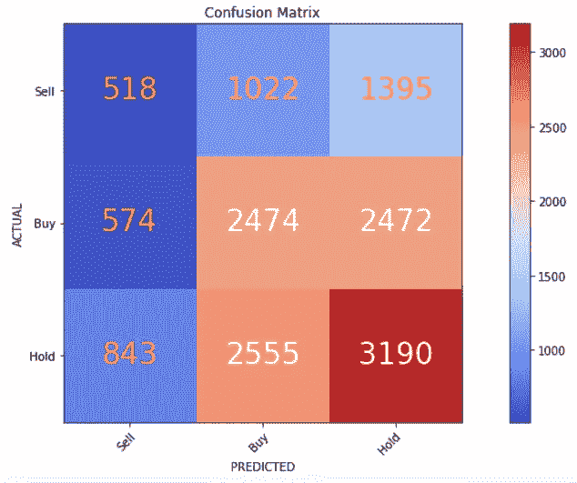
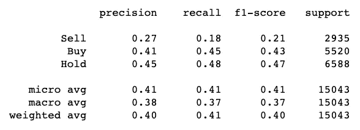

# 我建立了一个机器学习管道来分析基本的股票数据

> 原文：<https://betterprogramming.pub/how-to-analyze-fundamental-stock-data-with-machine-learning-pipelines-1128e0fa5b0f>

## 使用管道优化您的 ML 模型

在 [Unsplash](https://unsplash.com?utm_source=medium&utm_medium=referral) 上由 [Carlos Muza](https://unsplash.com/@kmuza?utm_source=medium&utm_medium=referral) 拍摄的照片

金融行业使用机器学习的一种方式是分析和预测股票价格的运动。关于基本面分析的技术(观察一只股票的财务报表以确定其价值)，机器学习可以用来分类一只股票是*买入*、*卖出*还是*持有*。通过向机器学习模型输入适当的金融数据，该模型可以根据新的但类似的数据来确定股票的价值。有各种机器学习分类模型可以用于许多不同的优点和缺点。那么我们如何选择一个呢？

这就是**机器学习管道**的用武之地。这个管道为我们提供了一个很好的方法，用非常少的代码行来简化和测试每个模型，使得模型选择过程更快。然而，这个管道只涵盖建模过程，而不是数据收集、清理或探索。收集、探索、清理和建模过程实际上已经在我们之前的文章中讨论过了。*请在下面查看我们将使用的数据(以及我们是如何获得的)以及更全面的分类建模形式。*

## 对于数据收集、清理和探索:

 [## 我建立了一个机器学习模型，像沃伦·巴菲特一样交易股票(第一部分)

### 利用机器学习进行股票基本面分析

medium.com](https://medium.com/swlh/teaching-a-machine-to-trade-stocks-like-warren-buffett-part-i-445849b208c6) 

## 对于分类建模和评估:

 [## 我建立了一个机器学习模型，像沃伦·巴菲特一样交易股票(第二部分)

### 利用机器学习进行股票基本面分析

medium.com](https://medium.com/datadriveninvestor/teaching-a-machine-to-trade-stocks-like-warren-buffett-part-ii-5d06427b13f7) 

# 创建管道

现在我们已经有了数据和分类模型的概念(都来自上面的文章)，我们可以开始使用管道来简化这个过程。

## 导入库

导入必要的库和数据

这部分代码类似于为建模准备数据的代码，除了缩放部分。相反，数据的缩放将发生在每个模型的管道中。此外，我们可以选择使用两组不同的数据:*重要的*与*相关的*特征集。这两个不同的数据集是在我们的[上一篇文章](https://medium.com/swlh/teaching-a-machine-to-trade-stocks-like-warren-buffett-part-i-445849b208c6/#d1b3)中创建的，可以通过查看上面的*数据收集、清理和探索*部分找到。

# 为每个模型的管道编码

在这里，我们为十个模型导入并创建管道，以测试运行我们的数据。由于我们构建的管道，我们能够在运行模型之前缩放数据，而不是在管道之外缩放。目前，每个模型将使用它们的默认参数。在上面代码的最后，我们构建了一个简单的循环，将 10 个模型管道中的每一个都拟合和训练到我们的数据中。根据我们选择的特定评估标准，我们将从这十个型号中选出三个性能最佳的型号。

# 每个型号的分类报告

从这段代码中，我们将打印出一个分类报告，其中包含关于重要评估指标的信息。此时我们将关注的评估指标是`Precision`和`F1-Score`。我们关注这些指标的主要原因是，我们正在处理一个不平衡的数据集。关于这些指标的进一步解释可以在我们之前关于建模和评估的 [*文章*](https://medium.com/datadriveninvestor/teaching-a-machine-to-trade-stocks-like-warren-buffett-part-ii-5d06427b13f7/#5b9f) 中找到。

# 网格搜索模型管道

现在我们已经建立了我们的前三个模型，我们可以通过利用`GridSearchCV`来提高它们的性能。这将测试我们设置的每个模型的各种参数，以便找到性能最好的一个。然后将这些新调整的模型进行相互比较，只有一个将被选为我们未来分类的主要模型。

# 形成网格搜索和参数

上面我们已经编码出了前三个分类器使用的不同参数。我们给了每个参数不同的值来迭代，找到最佳组合。然后，我们创建了一个小字典，包含每个模型的管道及其各自的参数。接下来，我们将使用给定的参数对这些模型进行网格搜索。

# 开始网格搜索

这里我们开始网格搜索过程。根据计算机规格，此过程可能需要相当长的时间，所以如果您仍然在等待几个小时后完成，请不要担心。每次网格搜索完成后，我们将使用最佳参数调整的最佳性能模型保存到字典中，以便以后访问。

之后，我们打印出前三个优化模型的分类报告，以观察我们想要的特定评估指标的任何改进(`Macro Average F1-Score`)。

# 混淆矩阵

为了更直观地展示我们的调优模型的表现，我们转向混淆矩阵。这将以一种更吸引人的形式向我们展示我们模型的性能。

在开发了创建更具视觉吸引力的混淆矩阵的功能之后，我们就能够为我们最终调整的机器学习分类器绘制出最终的图像和完整的分类报告。

调谐随机森林分类器的混淆矩阵

优化随机森林分类器的完整分类报告

这里的分类报告可以解释为`Buy`类有 41%的时间被正确分类。在原始数据集中，它对其中的 45%进行了分类，而遗漏了另外的 55%。这听起来可能不令人印象深刻，但考虑到[基线模型的分数](https://medium.com/datadriveninvestor/teaching-a-machine-to-trade-stocks-like-warren-buffett-part-ii-5d06427b13f7#bdb0)，这相当于随机猜测，这些数字是一个进步。

# 结束语

我们的最终分类模型是通过管道和网格搜索的结合找到的。这些管道让我们能够缩放数据，然后拟合和训练分类器。接下来，我们能够根据特定的评估指标，网格搜索表现最好的三个模型。然后，在完成之后，我们能够缩小这个数据集的最后一个模型。通常，这个过程可能会占用几个不同的文件或笔记本，但通过管道，我们能够将其压缩到一个笔记本中。

尽管我们的评估数字看起来不太好，但仍然比我们的[基线模型](https://medium.com/datadriveninvestor/teaching-a-machine-to-trade-stocks-like-warren-buffett-part-ii-5d06427b13f7#bdb0)要好。最终，这些数字对我们仍然意义重大，因为在某种程度上，我们正在试图预测未来。仍然有潜在的改进需要做，比如用其他来源来改进初始数据集，或者改变每个类的一些要求。然而，这篇文章的总体目的是演示使用管道来精简和简化机器学习建模过程。请随意修改您看到的任何代码，以改进这个项目，然后也许你可以创建一个比任何其他股票专家更好的分类器！

> [在这里注册一个中级会员，可以无限制地访问和支持像我这样的内容！在你的支持下，我赚了一小部分会费。谢谢！](https://marco-santos.medium.com/membership)

## GitHub:

 [## Marcos an 93/股票表现预测工具-2.0

github.com](https://github.com/marcosan93/Stock-Performance-Predictor-2.0)