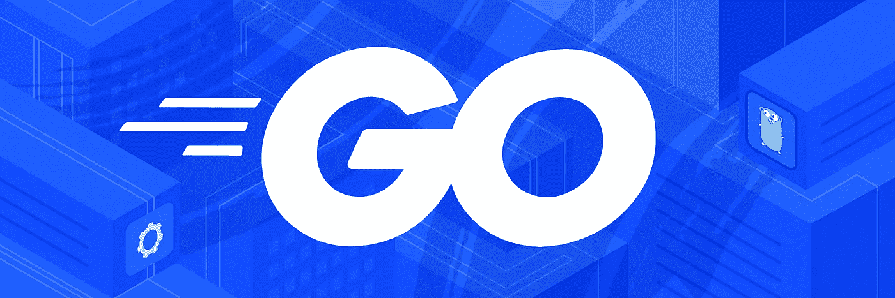
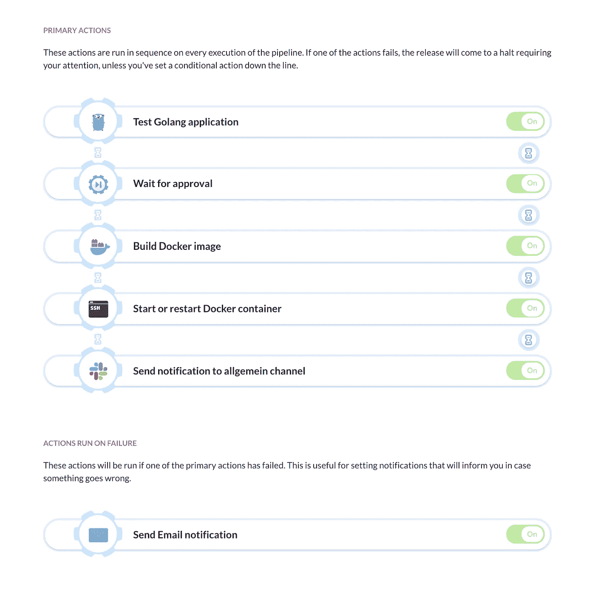
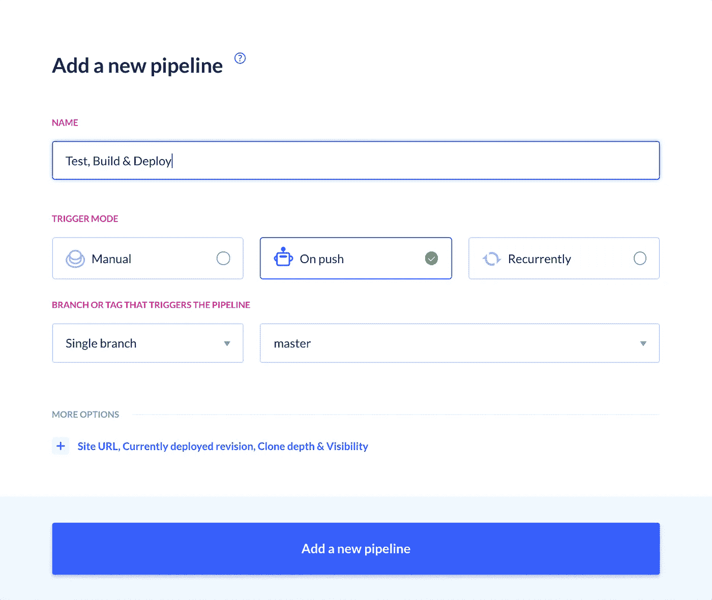
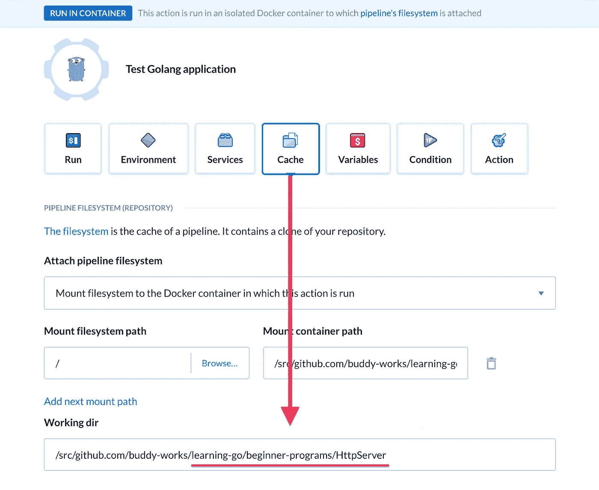
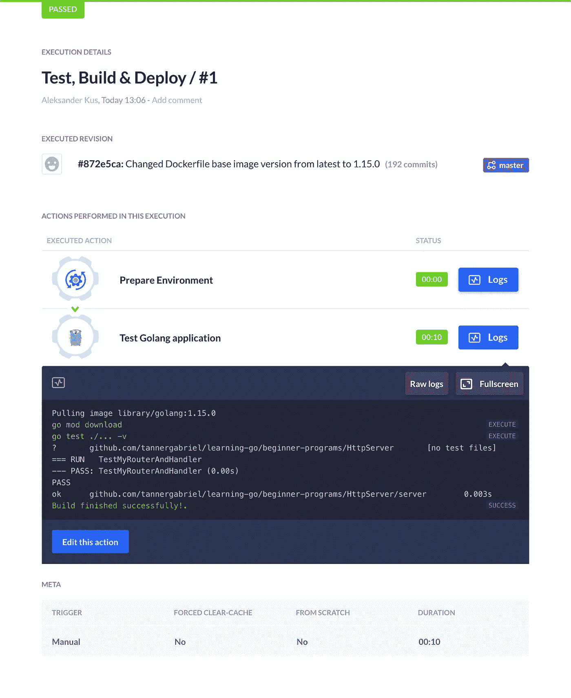
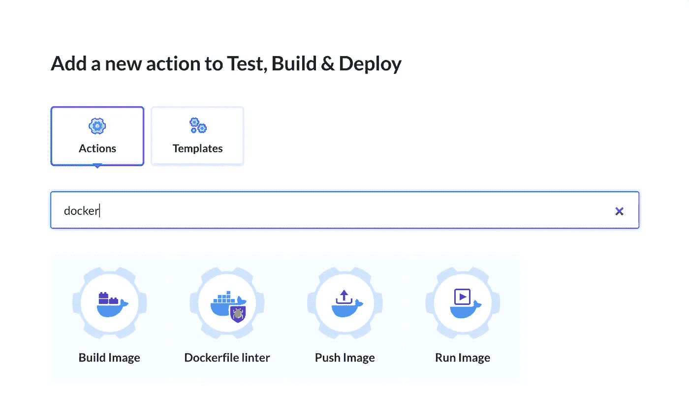
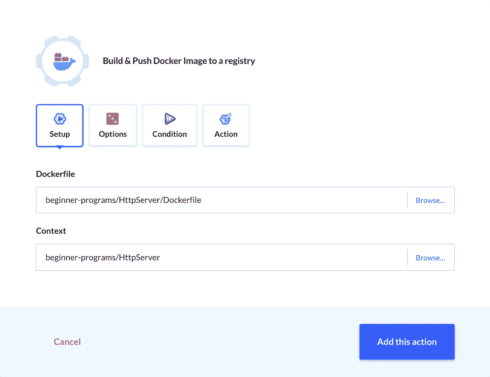
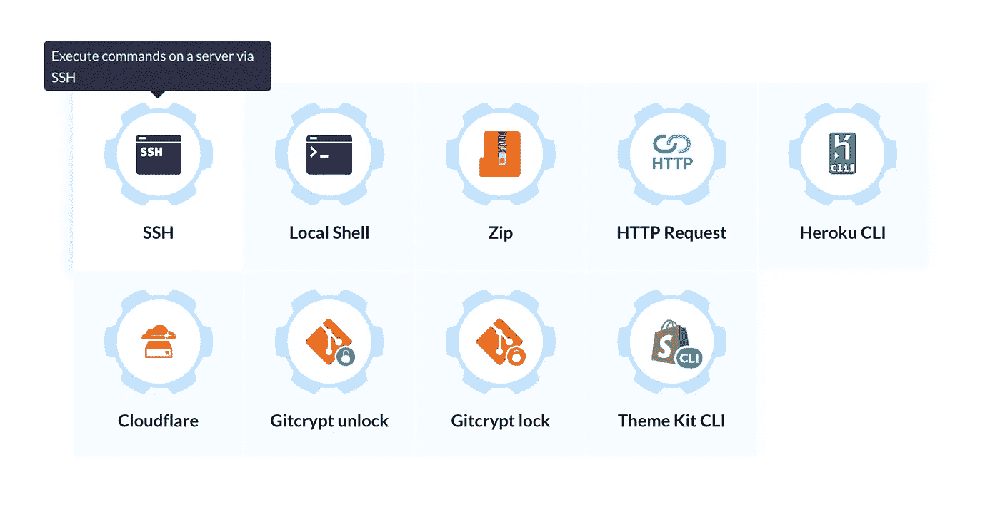
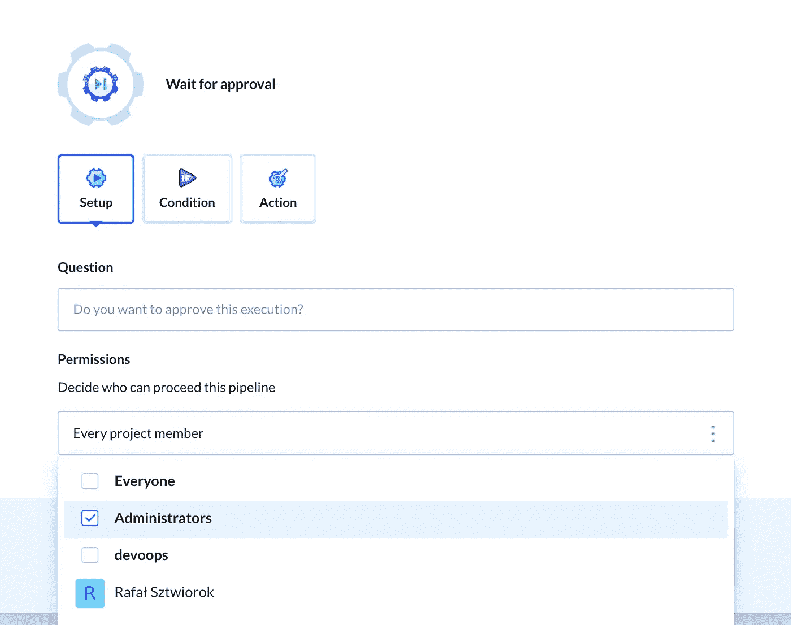
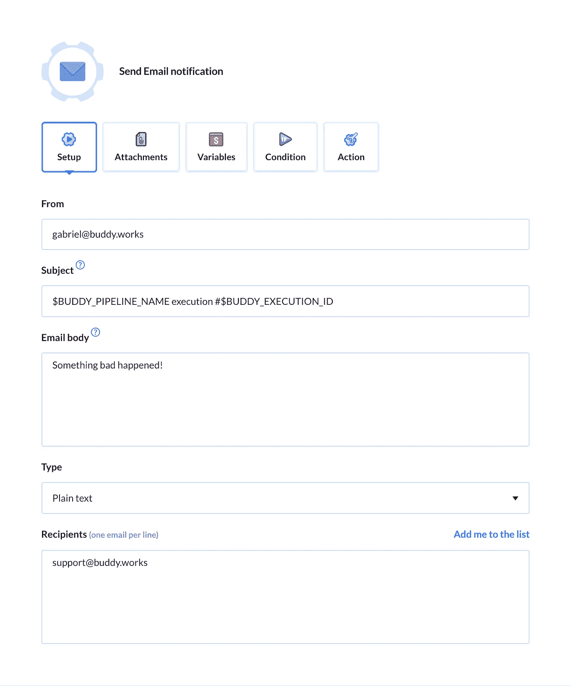

# 如何使用 Buddy CI/CD 自动交付 Golang

> 原文：<https://betterprogramming.pub/how-to-automate-golang-delivery-with-buddy-ci-cd-b9dfb8fd60b6>

## 更快的 CI/CD



图片来源:作者

[Buddy](https://buddy.works/?utm_source=medium&utm_medium=referral&utm_campaign=gabrieltanner_rp&utm_content=golang) 是一个持续集成、交付和部署工具，它利用 Git 在设置管道以自动化您的存储库任务时提供舒适和可定制的体验。

巴迪的[管道](https://buddy.works/docs/pipelines/introduction?utm_source=medium&utm_medium=referral&utm_campaign=gabrieltanner_rp&utm_content=golang)由开发者定义的一组动作组成，这些动作以特定的顺序运行，在执行 Git 推送时可以手动或自动执行。这种可视化方法也使得初学者和 DevOps 专家能够在尽可能短的时间内轻松建立起功能齐全的管道。

在本文中，我们将为 Golang 应用程序建立一个连续的交付管道。管道将帮助我们实现两件事:

1.  通过提供标准化的开发反馈循环，加快开发过程
2.  通过降低手动错误的风险，实现更安全的部署



成品管道

我们将通过构建一个管道来实现这一点，该管道首先测试应用程序，然后构建一个 Docker 容器映像(如果测试成功的话)。Docker 图像随后将被拉出并在数字海洋水滴上运行。我们还将通过 Slack 和电子邮件向项目成员发送最新构建状态的通知。

本指南中使用的操作:

*   [出发](https://buddy.works/actions/go?utm_source=medium&utm_medium=referral&utm_campaign=gabrieltanner_rp&utm_content=golang)
*   [SFTP](https://buddy.works/actions/sftp?utm_source=medium&utm_medium=referral&utm_campaign=gabrieltanner_rp&utm_content=golang)
*   [宋承宪](https://buddy.works/actions/ssh?utm_source=medium&utm_medium=referral&utm_campaign=gabrieltanner_rp&utm_content=golang)
*   [松弛](https://buddy.works/actions/slack?utm_source=medium&utm_medium=referral&utm_campaign=gabrieltanner_rp&utm_content=golang)
*   [电子邮件](https://buddy.works/actions/email?utm_source=medium&utm_medium=referral&utm_campaign=gabrieltanner_rp&utm_content=golang)

# 第一步。开始

要遵循本教程，请确保您安装了以下工具:

1.  [Golang](https://golang.org/) —这样您就可以在本地运行和测试应用程序。
2.  [DigitalOcean CLI](https://github.com/digitalocean/doctl) —以便您可以设置管道所需的所有数字海洋资源(也可以使用 GUI 完成)。
3.  [Docker](https://www.docker.com/)——安装在本地开发者机器上，用于封装和运行我们的应用程序。

## 测试应用程序

在本文中，我们将使用 GitHub 上的一个[现有项目，这样更容易理解本文。该应用程序是一个非常基本的 HTTP 服务器，使用标准的 Golang 库，带有两个 GET 端点，显示一些硬编码的文本。](https://github.com/buddy-works/learning-go/tree/master/beginner-programs/HttpServer)

如果您想使用自己的应用程序，这是可以的，但是请记住，操作中的一些命令和目录可能会发生变化。

让我们从从 GitHub 克隆应用程序并在本地运行它开始:

```
$ git clone https://github.com/buddy-works/learning-go.git 
$ cd learning-go/beginner-programs/HttpServer/
```

现在可以使用`go run`命令启动应用程序:

```
$ git run main.go
```

现在您可以在`localhost:8080`访问该应用程序。您应该看到一个基本的网页打印“Hello World！”

## 将申请归档

要将应用程序部署为容器，我们需要创建一个 Docker 文件，其中包含 Docker 映像的定义。

我已经将 Dockerfile 包含在了`HttpServer`项目的根目录中。以下是内容:

文件中的每一行都相当于构建 Docker 映像过程中的一个步骤。为了更好地理解，我们来看一下:

*   第一行使用`FROM`关键字定义了容器启动的基础映像，后面是所需的映像和版本(在本例中是 Golang 官方映像的版本 1.15.0)。
*   之后，我们使用`WORKDIR`关键字设置当前工作目录，并通过将`GO111MODULE`变量设置为`on`来启用 Go 模块。
*   关键字`COPY`让我们将文件从主机系统复制到容器中。这里我们用它将`go.mod`和`go.sum`文件复制到容器中，这样我们就可以使用`go mod download`命令安装所有需要的依赖项。
*   安装完所有的依赖项后，我们可以继续将剩余的文件复制到容器中，并使用`go build`命令构建应用程序。这将给我们一个可执行文件，我们可以使用`CMD`关键字来执行。

## 启动 Docker 映像

现在可以使用以下命令构建并运行 Docker 映像:

```
$ docker build -t httpserver . 
$ docker run -p 8080:8080 httpserver
```

`build`命令将通过执行我们在 Docker 文件中定义的步骤来创建 Docker 映像。`-t`标志用于给 Docker 图像一个特定的标签。一旦成功构建了映像，就可以使用 run 命令来启动容器。`-p`标志用于将容器的端口 8080 发布到主机的端口 8080。在浏览器中打开`http://localhost:8080`，验证应用程序是否正常运行。

# 第二步。建立数字海洋资源

在我们开始构建 CI/CD 管道之前，让我们从设置所需的数字海洋资源和安装必要的工具开始。为了创建资源，我们将使用 DigitalOcean CLI，也称为 [doctl](https://github.com/digitalocean/doctl/releases) 。

启动一个终端，如果还没有的话，用`doctl auth init`命令向 CLI 验证自己。

使用下面的命令创建一个 droplet 来托管我们的应用程序。我们使用 DigitaloOean Docker 映像，因为我们将在教程的最后一步使用 Docker 部署应用程序。

```
$ doctl compute droplet create buddy-golang --region fra1 --image docker-18-04 --size s-1vcpu-2gb
```

通过检查当前状态，等待液滴准备就绪:

```
$ doctl compute droplet list buddy-golang
```

随着 droplet 的创建，是时候在系统上安装 Golang 了。为此，您可以遵循来自 DigitalOcean 的[安装指南](https://www.digitalocean.com/community/tutorials/how-to-install-go-on-ubuntu-18-04)。

# 第三步。持续集成管道

既然我们已经设置好了所有的资源，现在是时候创建一个管道，每当我们对代码库进行更改时，它将自动测试、构建和部署我们的应用程序。

## 项目配置

[登录您的好友帐户](https://buddy.works/?utm_source=medium&utm_medium=referral&utm_campaign=gabrieltanner_rp&utm_content=golang)并创建一个新项目，在该项目中，您选择 GitHub 作为 Git 托管提供商，并选择 learning-go 作为存储库:


在 Buddy 中创建新项目

## 管道配置

向项目中添加一个新管道，并将触发器设置为`On push`，以便在有东西被推送到 GitHub 存储库时执行管道。第二步是选择 Buddy 将要部署的分支。说到名称，您可以随意称呼管道:



在 Buddy 中创建新管道

在下一个屏幕上，您可以选择将添加到管道中的第一个操作。因为我们有一个用 Go 编写的应用程序，并且希望使用 Golang 工具测试和构建它，所以我们需要添加 Go 操作:


将 Golang 操作添加到好友管道

在操作详细信息中添加以下命令:

```
# Download dependencies 
go mod download # Execute Golang test files 
go test ./... -v
```

下面是它的实际情况:


配置 Golang 命令

让我们浏览一下这些命令:

*   `go mod download`命令用于安装应用程序所需的所有依赖项。
*   `go test ./... -v`命令运行目录中所有的 Golang 测试并打印结果。`-v`标志，也称为 *verbose* ，用于打印更详细的测试结果，使它们在失败时更容易调试。

接下来，你需要在`cache`窗口中选择动作的工作目录。如果您正在使用示例应用程序，这需要是`/src/github.com/TannerGabriel/learning-go/beginner-programs/HttpServer`。



戈朗行动工作指导

最后，我们需要将动作使用的 Golang 版本从当前标准值更改为`1.15.0`，因为 Golang 模块在旧版本(版本 1.11 及以下)中不受支持:


在动作细节中更改 Golang 版本

## 测试管道

完成 Golang 操作的配置后，您可以通过手动单击屏幕右上角的“运行管道”按钮来测试管道。然后，您可以单击管道查看执行细节:



运行测试管道

# 第四步。连续输送管道

既然测试已经成功运行，是时候在我们的 DigitalOcean droplet 上构建和部署应用程序了。因为我们希望使用 Docker 部署我们的应用程序，所以在我们的 droplet 上使用它之前，我们首先需要构建图像并将其推送到某种容器注册表中。

## 构建应用程序

在这一步中，我们将构建应用程序的 Docker 映像，并将其推送到容器注册中心。我们将使用 Docker Hub 作为注册表，因为它是最受欢迎的，可以免费用于公共图像(加上一个私人图像是免费的)。

注意:请随意使用另一个公共注册表或您自己的私有注册表。如果你想知道如何从头开始创建自己的私有注册表，你可以遵循[这个指南](https://gabrieltanner.org/blog/docker-registry)。

首先从动作花名册的 Docker 部分添加构建图像动作:



向管道添加构建映像操作

接下来，我们需要选择 Dockerfile 作为我们图像的基础，以及执行构建命令的上下文。在这里，我们选择项目的目录:



为 Docker 构建操作配置目录

现在，您只需要选择一个注册表，并在选项窗口中提供将映像推送到您的帐户所需的凭据。您还可以设置图像的存储库和标签:


为 Docker 图像选择注册表

## 运行 Docker 映像

下一步是在我们的数字海洋液滴上部署和运行图像。目前还没有官方的好友动作，所以我们将使用 SSH 动作:



将 SSH 操作添加到好友管道

将动作添加到管道后，我们需要配置它以匹配我们的 droplet 设置:

*   将认证模式设置为`Password`(如果使用 SSH 密钥，则选择`Private SSH key`或`Buddy workspace key`)
*   填写用于登录服务器的 IP 地址、用户名和密码

接下来，将以下命令添加到操作详细信息中:

```
# Pull Docker image 
docker pull gabrieltanner/golang-http-server:latest # Stop and remove the container if it already exists 
docker stop http-server || true && docker rm http-server || true # Start the new container 
docker run -p 8080:8080 -d --name http-server gabrieltanner/golang-http-server
```

让我们浏览一下这些命令:

*   `docker pull`命令用于从所选服务器上的容器注册表中提取我们的图像。
*   第二个命令用于停止和删除现有的容器。需要这样做来将容器更新到新构建的映像版本。如果容器没有运行，这些命令将返回错误。这是预期的行为，所以我们需要使用`... || true`忽略它。
*   `docker run`命令启动容器，并使用`-p`标志向主机系统发布端口 8080。

正确配置的 SSH 操作如下所示:


SSH 操作配置

您可以使用[环境变量](https://buddy.works/docs/pipelines/environment-variables?utm_source=medium&utm_medium=referral&utm_campaign=gabrieltanner_rp&utm_content=golang)来存储敏感数据，如登录和密码。

## 可选:等待批准

在将新版本部署到生产服务器之前，您可以在流程中添加某种手动确认。这可以通过在您的管道中添加“等待批准”操作来实现:



等待批准配置

## 测试管道

一旦完成了对新添加的操作的配置，就应该重新运行管道来测试功能了。为此，您可以将一些更改推送到 Git 存储库，或者单击`Run pipeline`按钮来手动触发运行:


管道后期执行详细信息

现在，您的 Golang 应用程序有了一个全功能的持续集成/部署管道。然而，在每次推送至所选分支时，您仍然可以添加一些有用的操作，以使您了解应用程序的当前构建状态。

# 第五步。(可选)发送成功或失败通知

在这一节中，我们将看看如何发送通知，让您和您的团队了解最新的构建状态。

以下是发布本文时所有可用通知操作的列表:


通知操作

为此，我们将对失败的构建使用电子邮件操作，对成功的构建使用 Slack 操作，但是如果您不使用 Slack，也可以使用不同的操作。

成功构建的通知可以通过在管道底部添加另一个操作来发送，该操作只有在所有其他操作成功时才会执行。需要将故障通知操作添加到管道的`ACTIONS RUN ON FAILURE`部分。

将操作添加到管道后，使用操作设置页面中的环境变量对其进行自定义。示例电子邮件配置可能如下所示:



电子邮件通知

# 摘要

你有它！您已经成功地为您的 Golang 应用程序设置了自己的 CI/CD 管道，每当您对 Git 存储库进行修改时，它会自动测试和部署您的应用程序，甚至向您和您的同事发送包含当前构建状态的通知。我建议你试试文章中显示的不同的[好友动作](https://buddy.works/actions?utm_source=medium&utm_medium=referral&utm_campaign=gabrieltanner_rp&utm_content=golang)，并根据你的目的进一步定制设置。尽情享受吧！


完整的 Golang 输送管道

感谢阅读！如有疑问，欢迎留言评论。