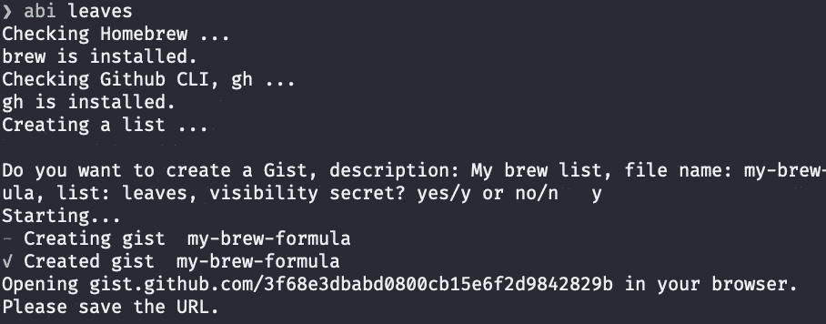

# 如何在新的 Mac 或 Linux 上自动安装自制软件

> 原文：<https://betterprogramming.pub/how-to-automate-homebrew-installs-on-your-new-mac-or-linux-51e06881c5b7>

## 你不需要一个接一个地安装自制软件包


经[水焰](https://www.waterflame.com/)许可的像素艺术。

[更新时间:2021 年 6 月 30 日]

如果你在 macOS 上编程，你可能会使用[自制软件](https://brew.sh/)。即使你是 Linux 用户，你也可能在用[自制](https://docs.brew.sh/Homebrew-on-Linux)。我用自制软件安装了大部分应用和工具。在我的 2017 款 macOS 上，我安装了[大约 100 个公式](https://gist.github.com/shinokada/b58ac38f0f388ace76b7e5b91b0fed2c)和 [30 桶](https://gist.github.com/shinokada/32f0cc30fb48be090bf541ad387def47)的家酿。

这个月，我买了一台新的 MacBook Pro (M1 芯片),我不想一个一个地安装所有的应用和工具。所以我创建了[自动化 Brew 安装程序](https://github.com/shinokada/abi) (Abi)。Abi 从你的自制配方和木桶中创造 GitHub Gists。它还从这些要点列表中安装自制公式(包)和木桶。

```
**Table of Contents**
· [Prerequisite](#cef7)
· [Homebrew’s Formula, Cask, and Tap](#e05f)
· [Installing Abi](#363e)
· [Log Into GitHub](#c06a)
· [Creating Gists](#a735)
  ∘ [File name and description](#63bf)
  ∘ [A secret gist](#ab13)
· [Edit Gist Lists](#fcad)
· [Automate Brew Installation](#a31b)[**Conclusion**](#563f)
```

# 先决条件

你需要有一个 GitHub 账户和一些使用终端的经验。

# 家酿啤酒的配方、桶和龙头

家酿称其包定义文件为“公式”家酿木桶是一个安装 GUI 应用程序的扩展。当你安装自制酒桶时，你可以在你的应用程序目录中找到它们。自制 tap 是由像你我这样的第三方创建的包。

让我们开始使用 Abi。

# 安装 Abi

您可以在终端上运行以下命令来安装 Abi:

```
brew tap shinokada/abi && brew install abi
```

或者使用 [Awesome package manager](https://github.com/shinokada/awesome) :

```
awesome -i shinokada/abi
```

# 登录 Github

当你安装 Abi 的时候，它会安装 Github CLI `gh`。安装 Abi 后，在您的终端上使用`gh`登录 GitHub:

```
gh auth login
```

按照说明登录 Github。

# 创建 Gists

让我们在您的 Mac 上创建一个家酿配方要点和一个木桶要点:

```
abi leaves
```



abi 叶的输出。图片由作者提供。

这将创建一个带有默认文件名和描述的自制公式要点。默认文件名和描述是“我的 brew 配方”和“我的 brew 列表”它会打开一个浏览器来显示你的要点。

让我们用默认文件名和描述创建一个家酿木桶要点:

```
abi cask
```

酒桶要点的默认文件名和描述是“我的酿造酒桶配方”和“我的酿造酒桶列表”


abi 桶的输出。图片由作者提供。

## 文件名和描述

您可以使用`-d "description" -f file-name`创建一个包含您的描述和文件名的自制要点。确保文件名或描述中包含“木桶”。请在描述中使用引号，因为您将有空格。

```
abi leaves -d "My brew list 2021-06-30" -f brew-list-mac-2017
abi cask -d "My brew cask list 2021-06-30" -f brew-cask-list-mac-2017
```

## 公共要旨

您可以使用`-p`标志创建一个公共公式要点:

```
abi leaves -p
# Or adding description and file name 
abi leaves -p -d "My secret gist" -f brew-list-2017
```

# 编辑要点列表

您可能希望编辑生成的要点列表。浏览要点，删除或添加新的公式。

如果你想添加更多的自制公式，可以在这个网站上找到它们。注意不要混淆配方和桶。木桶的配方中有`--cask`。

# 自动化 Brew 安装

现在在另一台 Mac 上，让我们根据你的要点安装公式。

安装 Abi:

```
brew tap shinokada/abi && brew install abi
```

安装自制公式从一个要点。使用`install`标志从 Gist URL 安装公式:

```
abi install Your-Gist-URL
```

例如:

```
abi install [https://gist.github.com/shinokada/136f21f96170fb8f0fb0691bfd45242b](https://gist.github.com/shinokada/136f21f96170fb8f0fb0691bfd45242b)
```

这将安装自制公式和水龙头(记住水龙头是与公式一起列出的)。

让我们从一个要点安装自制酒桶。使用`installcask`标志表示安装木桶公式。同样，添加您的木桶要点 URL:

```
abi installcask Your-Gist-URL
```

例如:

```
abi installcask [https://gist.github.com/shinokada/32f0cc30fb48be090bf541ad387def47](https://gist.github.com/shinokada/32f0cc30fb48be090bf541ad387def47)
```

当您需要帮助时:

```
abi -h
```

了解您是否拥有最新的 Abi 版本:

```
abi -v
```

# 结论

如果你想安装 GNU 核心工具，macGNU 包会用自制软件安装它们。

[](/how-to-make-macos-command-utilities-compatible-with-gnu-core-utilities-87889b266f4b) [## 如何让 macOS 命令实用程序与 GNU 核心实用程序兼容

### 在 macOS 上安装 GNU 命令实用程序

better 编程. pub](/how-to-make-macos-command-utilities-compatible-with-gnu-core-utilities-87889b266f4b) 

或者您可以使用 Abi 来安装它们。这两个选项将导致相同的安装。

你正在寻找流行的自制软件包吗？请看[Jovan Hernandez](/my-top-homebrew-packages-for-2020-b6565d46de85)的【2020 年顶级自制软件包 [Jay Chow](https://medium.com/u/2a6012289fe3?source=post_page-----51e06881c5b7--------------------------------) 的[自制工具](https://javascript.plainenglish.io/top-10-homebrew-tools-you-didnt-know-you-needed-in-2020-5007fb2cf561)和[Artturi Jalli](/5-must-have-homebrew-packages-for-command-line-lovers-d3d18c48199a)的 [5 个命令行爱好者必备自制软件包](/5-must-have-homebrew-packages-for-command-line-lovers-d3d18c48199a)。

让我知道你对 Abi 的看法。

编码快乐！

**通过** [**成为**](https://blog.codewithshin.com/membership) **会员，可以完全访问媒体上的每一个故事。**


[https://blog.codewithshin.com/subscribe](https://blog.codewithshin.com/subscribe)

[](https://medium.com/mkdir-awesome/how-to-automate-cleaning-up-your-trash-and-downloads-directory-1ac2815b2089) [## 如何自动清理你的垃圾和下载目录

### 用一行代码在 macOS 上设置一个清理计划

medium.com](https://medium.com/mkdir-awesome/how-to-automate-cleaning-up-your-trash-and-downloads-directory-1ac2815b2089) [](https://medium.com/mkdir-awesome/a-new-simple-package-manager-for-script-languages-a1228fd0972a) [## 一个新的简单的脚本语言包管理器

### 管理安装和卸载的简单工具

medium.com](https://medium.com/mkdir-awesome/a-new-simple-package-manager-for-script-languages-a1228fd0972a) [](https://medium.com/mkdir-awesome/automate-creating-a-github-repo-with-a-line-of-code-on-linux-f21fb2aafebd) [## 在 Linux 上用一行代码自动创建 Github Repo

### 介绍 Gitstart 的更新版本

medium.com](https://medium.com/mkdir-awesome/automate-creating-a-github-repo-with-a-line-of-code-on-linux-f21fb2aafebd) [](https://medium.com/mkdir-awesome/how-to-use-manop-to-print-only-selected-content-from-the-man-page-11309b9efa38) [## 使用 Manop 只打印手册页中选定的内容可以节省时间

### Manop 是一个简单的 Bash 脚本，输出选项和描述

medium.com](https://medium.com/mkdir-awesome/how-to-use-manop-to-print-only-selected-content-from-the-man-page-11309b9efa38)