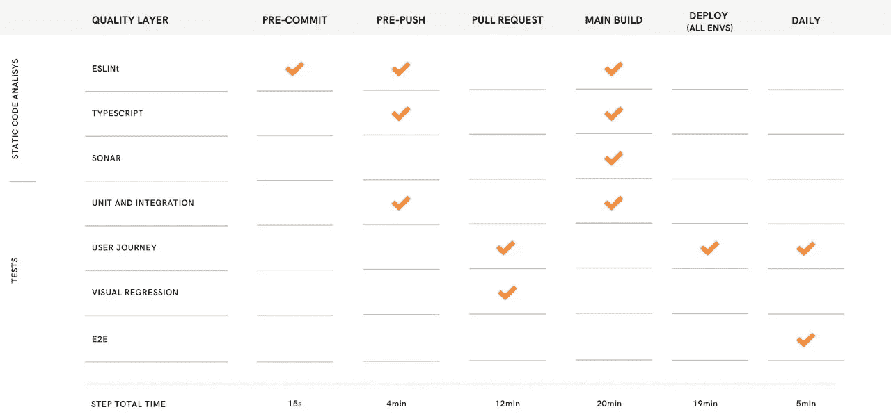

# 如何避免断产

> 原文：<https://betterprogramming.pub/how-to-avoid-breaking-production-part-1-dcebd0b7ca9e>

## 第一部分


由[菲利斯](https://unsplash.com/@miniminion?utm_source=medium&utm_medium=referral)在 [Unsplash](https://unsplash.com?utm_source=medium&utm_medium=referral) 上拍摄的照片

当一个 bug 发生时，多快可以修复？作为工程师，我们最关心的问题之一是始终保持产品的可用性和可靠性。然而，我们还需要在不影响客户体验的情况下不断发布新功能。2022 年，我们不能简单地依赖自动化单元测试作为质量保证。这还不够。有一种技术组合可以用来实现这一点，这就是我们今天要探讨的内容。

```
This article is authored by [Lucas Tagliani](https://medium.com/@lucastagliani) and [Thayse Onofrio](https://thayseonofrio.com/), since we recently paired in a tech lead role.
```

## 首先，让我们分享一些背景

作为开发者和/或技术领导者，我们已经工作了 2.5 年。

我们目前的技术堆栈主要是 [React](https://reactjs.org/) 和 [Typescript](https://www.typescriptlang.org/) 在[微前端架构](https://micro-frontends.org/)上，几乎每天都使用 Jenkins 将软件部署到生产中——我们通常避免周五，以防万一。

好了，现在有足够的背景。让我们开始深入研究我们所经历的步骤和我们用来交付软件的工具，经常并且自信地:

# 1.静态代码分析

它帮助你避免最明显的错误，代码气味，并防止人类打字错误。它还可以保持代码在源代码中的一致性，并向您显示哪里的代码更复杂，因此您可以在代码变得难以维护之前采取行动。

我们目前使用的工具是用于几乎所有文件扩展名的 eslint。ts 和。tsx 文件，以及大多数文件的[声纳](https://www.sonarqube.org/)。

通常，在设置了一些规则之后，您就可以在您的管道中利用它了——甚至更早，在您的预提交钩子中，这正是我们为类型检查和 eslint 验证所做的。如果有任何问题，我们实际上会阻止自己做出承诺。然后，Sonar 会在我们的代码到达 GitHub 的主分支时对其进行扫描，并通知我们任何问题。

# 2.单元和集成测试

这不是关于我们覆盖了多少%,而是我们决定覆盖应用程序的哪些部分——并且我们实际上试图覆盖它的每一个部分。这就是为什么我们在单元和集成测试中有超过 90%的代码覆盖率。默认情况下，我们不以这种方式测试的唯一文件是配置文件。

在这里，我们不仅测试快乐路径，还测试我们能想到的所有边缘情况。这些测试通常很便宜，不需要太多时间，也不需要太多资源。这就是为什么我们可以在不到 2 分钟的时间内运行近 3000 个测试，并且在每次推送到我们存储库中的任何分支之前，我们都在本地进行测试——我们有可接受的理由使用本地资源，而不是在我们的拉请求管道中运行它。对于我们的情况，这可能很具体，但我们可以稍后再讨论。

Jest 和 [react-testing-library](https://testing-library.com/docs/react-testing-library/intro/) 是我们在这个级别的测试中使用的主要测试工具。

我们也尽可能地使用测试驱动开发( [TDD](https://martinfowler.com/bliki/TestDrivenDevelopment.html) )，这有助于我们只在已经有了覆盖该场景的测试后才编写真正的代码。我们不能说我们有多喜欢 TDD，我们也看不到一个更好的方法来更快地获得关于我们的代码的反馈，以及一个更简单的设计的所有好处。

# 3.用户旅程测试

即使我们确保使用单元测试和集成测试来覆盖我们的基础，也有更复杂的场景，我们只能通过实际运行应用程序来重现和验证。为此，我们使用 [Cypress](https://www.cypress.io/) 进行用户旅程测试。

Cypress 允许我们像终端用户一样点击按钮、输入文本、悬停元素、按键和做一些动作。这与 react-testing-library 提供给我们的非常相似，但是 Cypress 是在*运行*真正的应用程序时完成的，而不是仅仅由*渲染*其中的一部分。

我们不想创建与前一层完全相同的测试，所以我们选择应用程序中的主要特性，并且通常测试它们的最佳路径。这些测试需要时间并消耗大量资源，因此在向这一层添加大量测试之前记住这一点很重要，否则，我们将需要很长时间来运行管道并向我们提供反馈。

明智地选择你的用户旅程测试。在我们的上下文中，一个叫做“当用户点击关闭按钮时，模态应该被关闭”的测试是这一层测试的一个很好的例子。我们还在不同的视窗(例如，移动和桌面)中测试它，以确保我们在两者中保持一致。

我们的主要目标是尽快获得反馈，所以我们专注于覆盖不同可能性的大量单元测试，而只在需要的时候进行用户旅程测试。每当我们向我们的主分支发出一个 pull 请求时，我们就会启动一个 docker 容器，其中包含我们的应用程序，并且我们会针对我们的应用程序运行我们的用户旅程测试。这就是我们如何确保我们所有的主要场景在任何变化后继续工作。

# 4.端到端测试

假设我们的应用程序是一个微前端，即使当我们执行运行真实应用程序的用户旅程测试时，与整个网站相比，我们只是覆盖了它的一部分。我们的端到端(E2E)测试覆盖了跨应用的场景。一个很好的例子是“用户应该能够搜索，选择，支付和获得一个产品的估计到达时间”。

在我们的例子中，有一个独立的团队拥有这一层测试，它不是在应用程序的每个管道中运行，而是每天定期运行。

这些测试很难维护，因为您至少需要对每个相关的应用程序有一些了解，并确保契约(在我们的前端环境中通常是 HTML 选择器)仍然存在，即使单独进行了大的更改。具体和开放的渠道可能是不同团队之间保持清晰和有效沟通的好方法。

# 5.视觉回归测试

在我们进入如何使用它的细节之前，让我们解释一下基础，因为可视化回归测试可能并不常见。可视化回归测试可以通过截取组件的屏幕截图并将其与同一组件的预期版本进行比较来捕捉 UI 错误。第一次配置时，它会对您的组件进行截图，并将其称为“基线”，这被认为是您截图的正确版本。从那时起，任何其他截图都将与基线进行比较。如果存在差异，根据您选择的比较级别，它将使检查点失败，并将其标记为未解决，这也可能会中断您的管道。这就是我们想要的，因为它将防止您向代码中添加意外的更改。如果更改是预期的，那么您可以简单地批准它并再次运行。如果不是预期的，您可能希望在再次推送之前修复它。

我们应用程序的部分目标是提供其他团队使用的组件，这意味着文档、一致性和兼容性对我们来说非常重要。我们一直使用两个主要工具来提供它:

*   故事书(story book):我们展示所有可导出的组件(称为故事),其他团队可以尝试并轻松修改。我们还提供了如何使用它的详细描述和具体的案例。
*   Applitools :这个包可以让我们单独截取每个故事的截图，然后与我们的基线进行比较，如果有任何差异，如颜色、边距、字体大小或其他任何东西，它会让你知道。

目前，在我们打开的每一个拉取请求中，我们为桌面故事截取了 50 多个屏幕截图，为移动故事截取了 40 多个屏幕截图。它帮助我们避免了向用户引入非故意的 UI 更改，我们可能永远不会被肉眼发现。

如果你想试试这个工具，它对一个用户和几个检查点是免费的，否则，你需要付费。

您还可以选择使用常规快照方法，因为它也可以跟踪组件的样式。我们以前有过，但我们注意到错误地更新快照太容易了，这就是我们转向更强大的解决方案的原因。

## 把所有的都集中在一起

现在，您已经了解了我们在生产部署之前使用的所有实践，我们将其全部总结在一个表格上，因此您可以看到我们在哪个层运行每个步骤，以及需要多长时间。

注意:最后一行不仅考虑了花费在质量层上的时间，还考虑了其他行为，比如构建、安装和发布。



在文章的[第二部分中，我们将了解有助于我们确保生产在部署期间和部署后正常运行的其他实践。其中一些实践包括部署频率、部署策略(如蓝/绿或淡黄色版本)、功能标志、a/b 测试、可观察性和随叫随到模型。](https://medium.com/@lucastagliani/how-to-avoid-breaking-production-part-2-134188ec02d4)[在这里阅读第二部分！](https://medium.com/@lucastagliani/how-to-avoid-breaking-production-part-2-134188ec02d4)

你当前项目的生产途径是什么？有什么区别？你有哪些层是我们没有的？