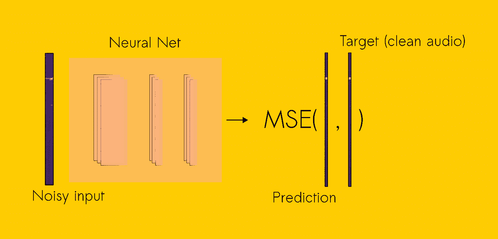
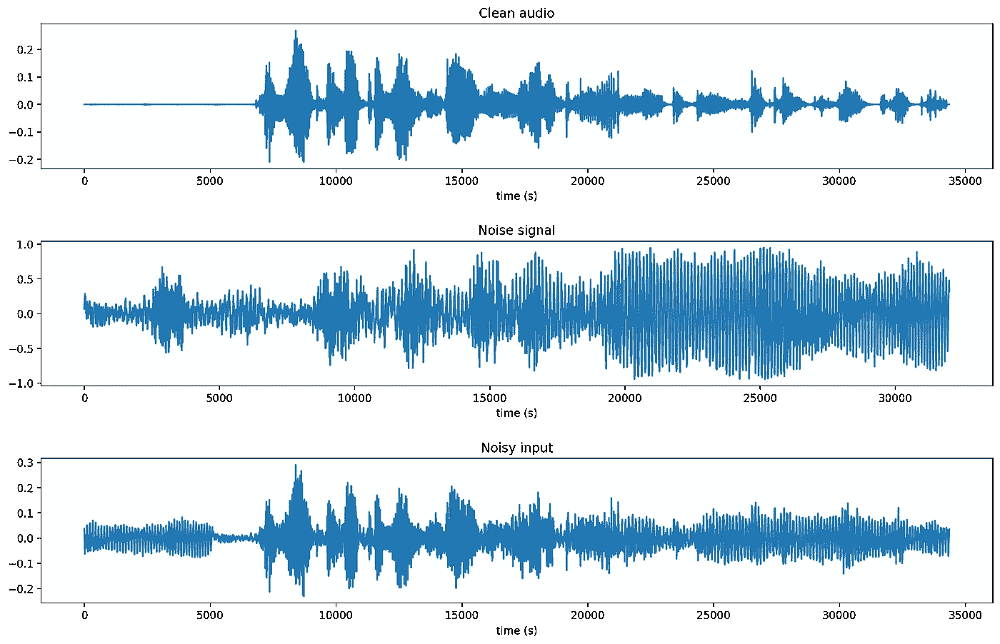
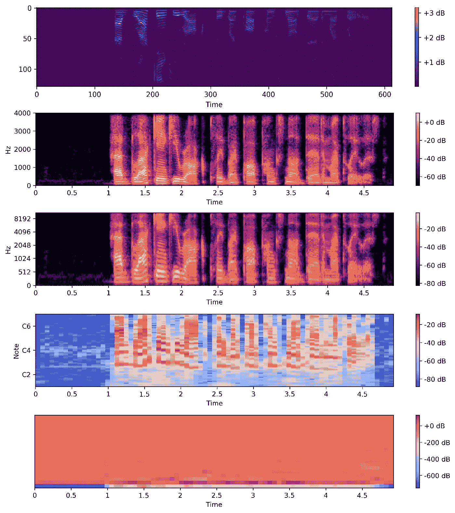
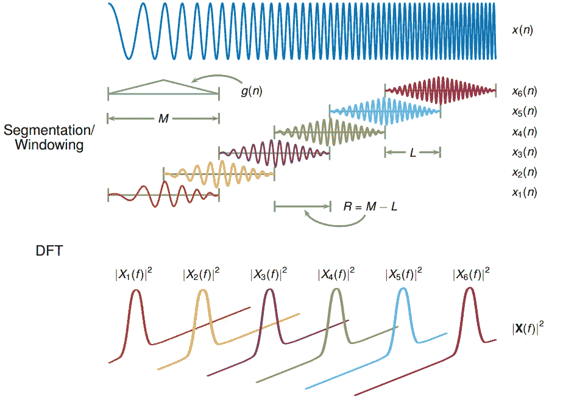
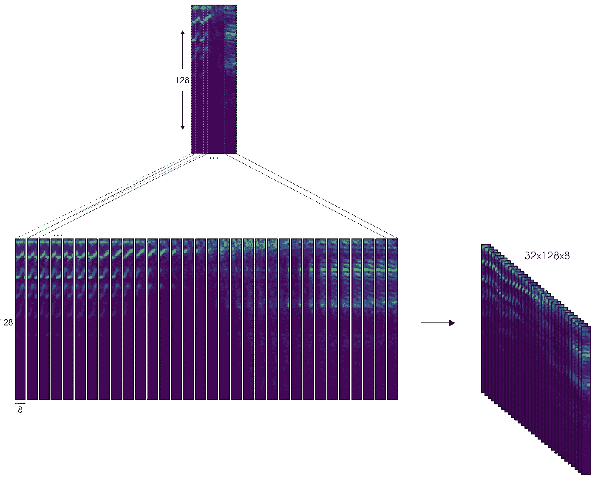
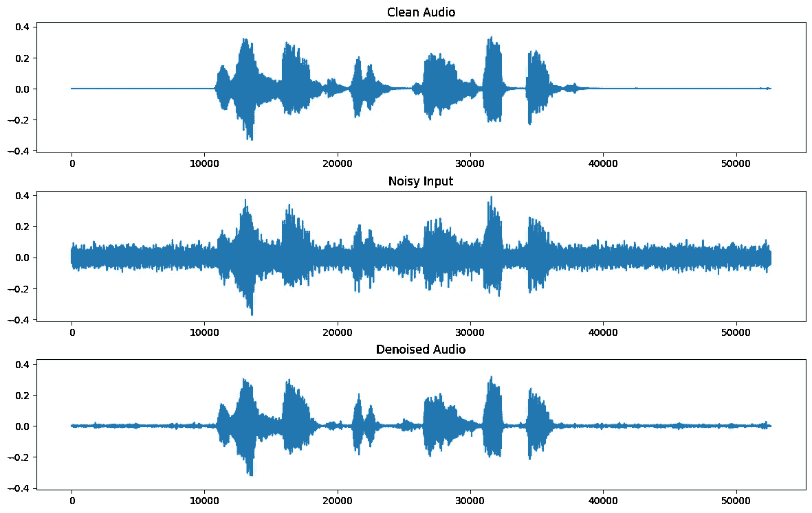

# 如何使用 TensorFlow 2.0 构建深度音频去噪器

> 原文：<https://betterprogramming.pub/how-to-build-a-deep-audio-de-noiser-using-tensorflow-2-0-79c1c1aea299>

## 实用深度学习音频去噪

泰勒·桑托斯·席尔瓦

# 介绍

语音去噪是一个由来已久的问题。给定一个有噪声的输入信号，目标是在不降低目标信号的情况下滤除这种噪声。你可以想象有人在视频会议中讲话，而背景音乐正在播放。在这种情况下，语音去噪系统的任务是去除背景噪声，以改善语音信号。除了许多其他用例之外，这种应用对于视频和音频会议尤其重要，因为噪声会显著降低语音清晰度。

语音去噪的经典解决方案通常采用[生成模型](https://medium.com/free-code-camp/an-intuitive-introduction-to-generative-adversarial-networks-gans-7a2264a81394?source=friends_link&sk=8c9400c176e01c019d9adc5d75990f5e)。这里，像[高斯混合](https://towardsdatascience.com/how-to-code-gaussian-mixture-models-from-scratch-in-python-9e7975df5252)这样的统计方法估计感兴趣的噪声，然后恢复去除噪声的信号。然而，最近的发展表明，在数据可用的情况下，深度学习往往优于这些解决方案。

在这篇文章中，我们使用卷积神经网络(CNN)来解决语音去噪问题。给定一个有噪声的输入信号，我们的目标是建立一个统计模型，可以提取干净的信号(源)并将其返回给用户。这里，我们着重于从城市街道环境中常见的十种不同类型的噪声中分离出常规语音信号。

# 数据集

对于语音去噪问题，我们使用了两个流行的公开可用的音频数据集。

*   [Mozilla Common Voice(MCV)](https://voice.mozilla.org)
*   [urban sound 8k 数据集](https://urbansounddataset.weebly.com/urbansound8k.html)

正如 Mozilla 在 MCV 网站上所说:

> Common Voice 是 Mozilla 的一项倡议，旨在帮助机器学习真人说话的方式。

该数据集包含多达 2454 个小时的录音，分散在简短的 MP3 文件中。这个项目是开源的，任何人都可以在上面合作。这里，我们使用了数据的英语部分，它包含 30GB 的 780 个经过验证的小时的语音。这个数据集的一个非常好的特征是说话者的巨大可变性。它包含了各种年龄和口音的男人和女人的录音。

UrbanSound8K 数据集还包含声音的小片段(< =4s)。然而，有 8732 个标记的十种不同的常见城市声音的例子。完整列表包括:

*   0 =空调
*   1 =汽车喇叭
*   2 =儿童 _ 玩耍
*   3 =狗叫
*   4 =钻孔
*   5 =发动机空转
*   6 = gun_shot
*   7 =手提钻
*   8 =警报器
*   9 =街道 _ 音乐

你可能会想到这一点，我们将使用城市的声音作为语音示例的噪声信号。换句话说，我们首先获取一个小的语音信号——这可以是某人从 MCV 数据集中随机说出一句话。

然后，我们给它添加噪声——比如一个女人在说话，一只狗在背景上吠叫。最后，我们使用这个人工噪声信号作为我们深度学习模型的输入。反过来，神经网络接收这个嘈杂的信号，并试图输出一个干净的表示。

下图显示了来自 MCV 的干净输入信号(上图)、来自 UrbanSound 数据集的噪声信号(中图)以及产生的噪声输入(下图)-添加噪声信号后的输入语音。另外，请注意噪声功率的设置使得[信噪比](https://en.wikipedia.org/wiki/Signal-to-noise_ratio) (SNR)为零 dB(分贝)。高于 1:1(大于 0 dB)的比率表示信号多于噪声。

# 数据预处理

当前深度学习技术的大部分好处在于，手工制作的特征不再是建立最先进模型的必要步骤。以 SIFT 和 SURF 这样的特征提取器为例，这些特征提取器常用于[全景拼接](https://towardsdatascience.com/image-panorama-stitching-with-opencv-2402bde6b46c?source=friends_link&sk=bfab65ef25a3c81639ecc4e04ba17864)这样的计算机视觉问题。这些方法从图像的局部提取特征来构建图像本身的内部表示。但是，为了实现必要的概化目标，需要做大量的工作来创建足够强大的功能，以应用于现实世界的场景。换句话说，这些特性需要对我们日常经常看到的常见转换保持不变。这些变化可能包括旋转、平移、缩放等。当前深度学习的一个很酷的事情是，这些属性中的大多数都是从数据和/或特殊操作(如卷积)中学习的。

对于音频处理，我们也希望神经网络从数据中提取相关特征。然而，在将原始信号馈入网络之前，我们需要将其转换为正确的格式。

首先，我们将音频信号(来自两个数据集)下采样至 8kHz，并从中移除无声帧。目标是减少计算量和数据集大小。

请务必注意，音频数据不同于图像。由于我们的假设之一是使用 CNN(最初是为计算机视觉设计的)进行音频去噪，因此了解这种细微的差异非常重要。原始形式的音频数据是一维时间序列数据。另一方面，图像是瞬间的二维表现。由于这些原因，音频信号通常被转换成(时间/频率)2D 表示。

梅尔频率倒谱系数(MFCCs)和恒定 Q 频谱是音频应用中常用的两种表示方法。对于深度学习，经典的 MFCCs 可能会被避免，因为它们删除了大量信息，并且不保留空间关系。然而，对于源分离任务，计算通常在时间-频率域中进行。音频信号在大多数情况下是非平稳的。换句话说，信号的均值和方差并不随时间而变化。因此，在整个音频信号上计算傅立叶变换没有多大意义。为此，我们向 DL 系统提供使用 256 点短时傅里叶变换(STFT)计算的频谱幅度矢量。您可以在下面看到音频信号的常见表示。

音频数据的常见 2D 表示。从上到下:(1) STFT 震级谱；(2)声谱图；(3)Me-谱图；(4)常数-q；(5)梅尔频率倒谱系数

为了计算信号的 STFT，我们需要定义一个长度为 M 的窗口和一个跳跃大小值 r，后者定义了窗口如何在信号上移动。然后，我们在信号上滑动窗口，计算窗口内数据的离散傅里叶变换(DFT)。因此，STFT 只是对数据的不同部分应用傅立叶变换。最后，我们从 256 点 STFT 向量中提取幅度向量，并通过移除对称的一半来取第一个 129 点。所有这些过程都是使用 Python Librosa 库完成的。下图来自 [MATLAB](https://www.mathworks.com/help/signal/ref/stft.html) ，展示了这个过程。

学分: [MATLAB STFT](https://www.mathworks.com/help/signal/ref/stft.html) docs

这里，我们将 STFT 窗定义为长度为 256、跳数为 64 的周期性汉明窗。这确保了 STFT 向量之间有 75%的重叠。最后，我们连接八个连续的有噪声的 STFT 向量，并使用它们作为输入。因此，输入向量具有(129，8)的形状，并且由当前 STFT 噪声向量加上七个先前的噪声 STFT 向量组成。换句话说，该模型是一个自回归系统，它根据过去的观察结果预测当前信号。因此，目标由来自干净音频的形状(129，1)的单个 STFT 频率表示组成。下图描述了特征向量的创建。

# 深度学习架构

我们的深度卷积神经网络(DCNN)很大程度上是基于[一个用于语音增强的全卷积神经网络](https://arxiv.org/abs/1609.07132)所做的工作。这里，作者提出了级联冗余卷积编码器-解码器网络(CR-CED)。

该模型基于对称编码器-解码器架构。这两个组件都包含卷积、ReLU 和批处理规范化的重复块。总的来说，该网络包含 16 个这样的块——总计 33K 个参数。

此外，一些编码器和解码器模块之间存在跳跃连接。这里，来自两个分量的特征向量通过相加来组合。与 ResNets 非常相似，skip 连接加快了收敛速度，减少了渐变的消失。

CR-CED 网络的另一个重要特征是卷积只在一维上进行。更具体地说，给定形状(129 x 8)的输入频谱，卷积仅在频率轴(即第一个轴)上执行。这确保了频率轴在正向传播期间保持不变。

少量训练参数和模型架构的结合，使得该模型超级轻量级，具有快速执行，特别是在移动或边缘设备上。

一旦网络产生输出估计，我们就优化(最小化)输出和目标(干净音频)信号之间的均方差(MSE)。

# 结果和讨论

让我们来看看 CNN denoiser 取得的一些成果。

首先，听听来自 MCV 和 UrbanSound 数据集的测试示例。它们分别是干净的语音和噪声信号。概括地说，干净的信号被用作目标，而噪声音频被用作噪声源。

如果你听样本有困难，你可以在这里访问原始文件[。](https://github.com/sthalles/sthalles.github.io/tree/master/assets/practical-dl-audio-denoising/examples)

现在，看看作为模型输入的噪声信号以及相应的去噪结果。

下面，您可以将去噪的 CNN 估计(底部)与目标(顶部是干净的信号)和有噪声的信号(中间用作输入)进行比较。

正如你所看到的，考虑到任务的难度，结果是可以接受的，但并不完美。事实上，在大多数例子中，模型设法平滑了噪声，但并没有完全消除噪声。看一个不同的例子，这一次背景中有一只狗在叫。

这阻碍了更好的估计的原因之一是损失函数。均方误差(MSE)成本优化了训练示例的平均值。我们可以认为这是寻找均值模型，平滑输入噪声音频，以提供干净信号的估计。因此，解决方案之一是为源分离任务设计更具体的损失函数。

一个特别有趣的可能性是使用 GANs(生成对抗网络)来学习损失函数本身。事实上，音频去噪的问题可以被框定为信号到信号的转换问题。与图像到图像转换非常相似，首先，发生器网络接收一个噪声信号，并输出干净信号的估计值。然后，鉴别器网络接收噪声输入以及发生器预测器或真实目标信号。通过这种方式，GAN 将能够学习适当的损耗函数，以将输入噪声信号映射到其相应的干净信号。这是一个有趣的可能性，我们期待着实施。

# 结论

音频去噪是一个长期存在的问题。通过遵循本文中描述的方法，我们以相对较小的努力获得了可接受的结果。轻量级模型的好处使它对边缘应用程序很有兴趣。下一步，我们希望探索新的损失函数和模型训练程序。

你可以在这里得到完整的代码。

感谢阅读！