# 如何在 2019 年用 Firebase 建立 Hello-World Cron 作业

> 原文：<https://betterprogramming.pub/how-to-build-a-hello-world-cron-job-with-firebase-in-2019-659bd89d0f88>

## 针对 2019 年的变更进行了更新


当我第一次开始编程时，我想创建的第一个工具之一是一个可以每天(或其他时间间隔)运行代码块的应用程序。

但是当你刚刚起步的时候，就像我一样，我不知道该去谷歌搜索什么来找到解决方法。如果你不太了解我，我原本是学心理学的，原本自学如何在 MATLAB 中编码。我写这篇文章是为了解释为像我这样的人编写一个 *cron 作业*(可以在指定时间间隔运行的代码块)的基本构建块。

因此，无论你是一个有经验的程序员还是像我一样的菜鸟，这里有你需要知道的编写你的第一个 cron 工作的一切。

下面是您需要熟悉的工具列表，以便进行后续操作:

*   节点. js
*   BASH 的基本命令行内容

# 1.先决条件

我们需要做的第一件事是确保 Node.js 安装在我们的机器上。您可以通过打开终端程序并运行以下命令来检查您是否已经安装了它:

```
node -v
```

如果你得到“错误命令没有找到”的错误，那么你没有安装它。只要去[这里](https://nodejs.org/en/)下载它真的很快。

如果它给了你一个版本，那么你就可以使用 Node.js 了。

其次，我们需要确保安装了最新版本的 npm。Npm(或节点包管理器)是我们将要安装 Firebase CLI 的方式。Npm 是 Node.js 自带的，但是你下载了 Node.js 并不代表你有最新版本的 npm。为了安全起见，请运行以下命令:

```
npm install npm@latest -g
```

最后，我们需要安装 Firebase CLI(或命令行界面)。这将允许我们从终端初始化和部署我们的云功能。

如果你想阅读下载的文档，你可以在这里阅读更多。

但是如果您不耐烦(像我一样)，只需在您的终端中运行以下命令:

```
npm install -g firebase-tools
```

# 2.有些东西需要运行你的代码

如果您曾经思考过 cron 作业是如何工作的，那么您可能已经意识到，为了实际执行您的代码，某些设备需要处于活动状态。

您有三种常见的选择:

## 云函数

Cloud Functions 非常容易设置，非常轻量级，让 cron 工作变得轻而易举。因为它很容易使用，我们将在整个教程中使用它。

有很多很棒的技术可以设置云功能，你不会错的。不过，我推荐 AWS Lightsail 或者谷歌的 Firebase。在本教程中，我们将使用 Firebase，因为他们的 CLI 对于部署云功能来说非常简单。

## AWS/数字海洋类型实例:

另一种选择是建立自己的机器实例。简而言之，这基本上意味着你正在激活世界上某个地方的一台将永远运行的计算机(就像你现在所在的这台计算机一样)。因为它总是开启、激活并由其他人维护，所以它可以在一定时间间隔内执行您的代码。

为此，我强烈推荐 AWS EC2 实例、DigitalOcean 或 Kubernetes 集群。

## 为你自己的硬件编程

这与设置机器实例基本相同，只是您负责确保机器正在运行并得到维护。除非你是专家，否则我不建议你这么做——除非你只是想玩玩树莓派什么的。

# 3.初始化 Firebase 项目

现在让我们开始写一些代码。

1.  打开你的终端。

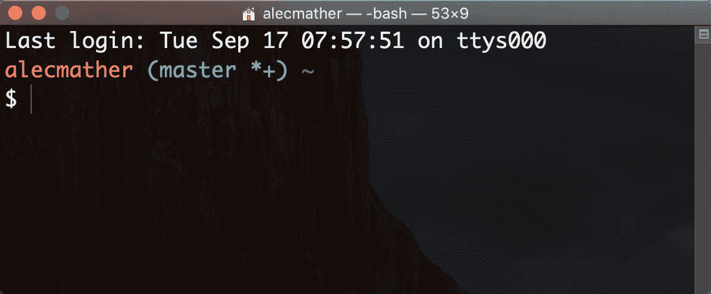

如果您不知道如何打开它，请前往您的 spotlight 搜索并搜索“终端”

我将进入我的项目目录，但是您可以导航到您想要存储代码的任何位置。

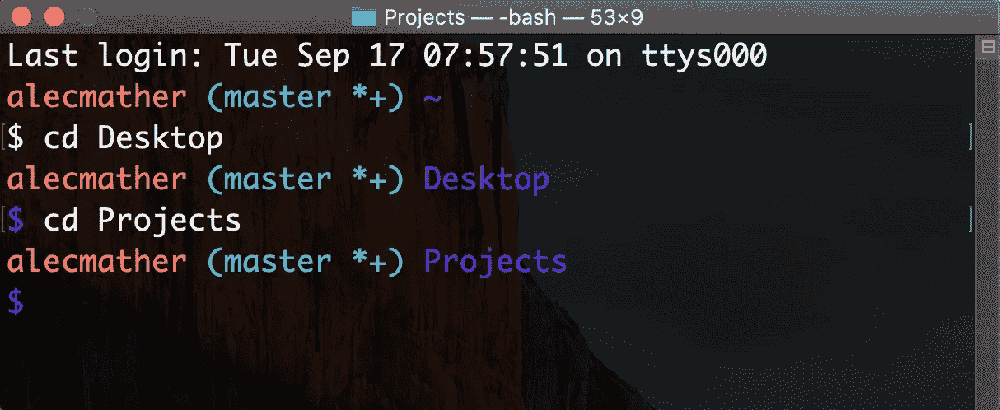

现在我需要创建我的项目目录，这是我将要存储这个项目的地方。因此，让我们用以下内容创建一个新文件夹:

```
mkdir HelloWorldFirebase
```

并通过以下方式导航进入:

```
cd HelloWorldFirebase
```

这将带我们来到这里:

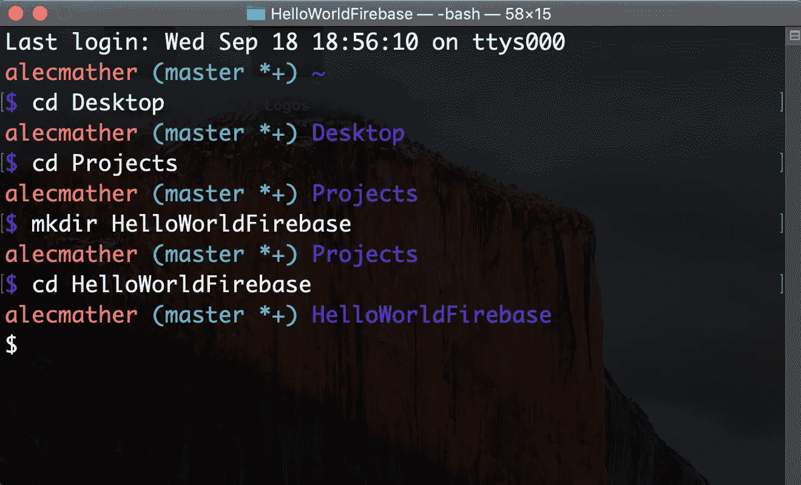

好了，现在我到了我想去的地方，所以我要通过键入以下命令来初始化一个新的 Firebase 应用程序:

```
firebase init
```

**注意:**如果您得到“错误命令‘Firebase’未找到”，那么您没有正确安装 Firebase CLI。请返回，并尝试再次安装。

如果一切正常，您将得到如下所示的输出:

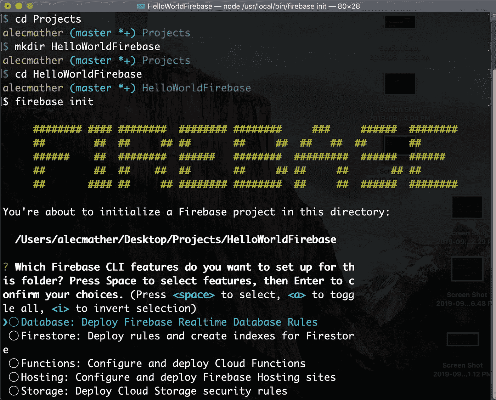

Firebase 让我们的初始化过程变得超级简单。您可以使用键盘上的箭头选择其中一个初始化选项。

我们想用云函数做的就是让代码每分钟左右运行一次。因此，我将通过点击 space 来选择“功能:配置和部署云功能”选项，然后通过点击 Enter 来确认我的选择。

然后，它会要求您选择一个现有项目或创建一个新项目。为了保护现有项目的隐私，我不会在这一步显示我的屏幕，但您只需向下滚动并选择[创建新项目]。

然后它会让你选择一种语言，Javascript 或 Typescript。

我选了 JavaScript，但是如果你喜欢 Typescript，你就做你的。

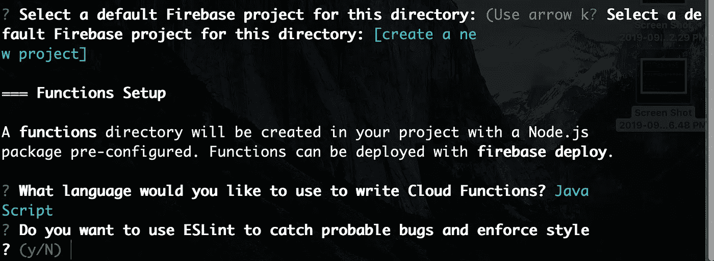

它会问你是否要启用 ESLint。只需按 Y 并输入。


这只是问你是否想现在安装 npm 依赖项，这是你最终要做的事情，所以我们不妨现在就做。按 Y 并输入。

如果一切按计划进行，我们应该会看到类似这样的内容:

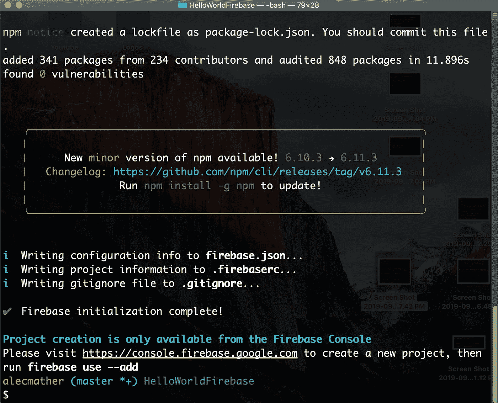

如果你已经走了这么远，恭喜你！您已经用 Firebase 初始化了您的第一个云函数。

# 4.配置 Google 云控制台

首先，您需要登录 Firebase 控制台。前往[这里，](https://firebase.google.com/)并登录或注册谷歌。一旦你进去了，就去[这里](https://console.firebase.google.com/)创建你的第一个项目。

同样，为了保护我的项目的隐私，我不会在这一步显示我的屏幕，而只是单击“添加项目”的大按钮

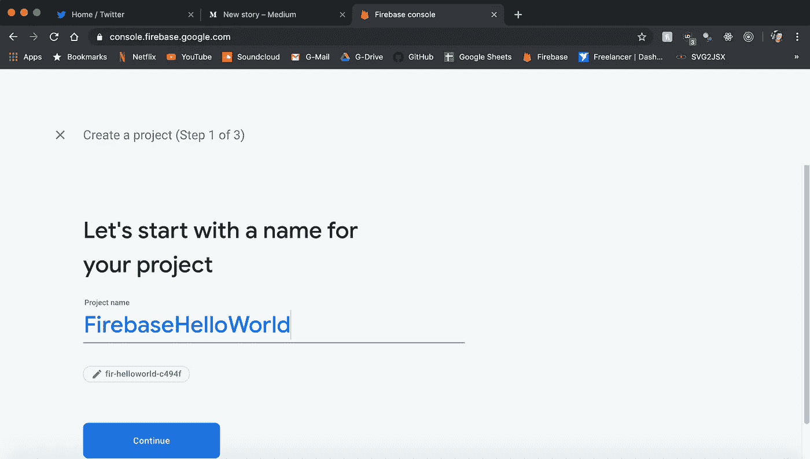

请原谅我的 chrome 标签，我边走边写

为你的项目选择一个名字(他们对某些字符有一些限制)，然后点击“继续”

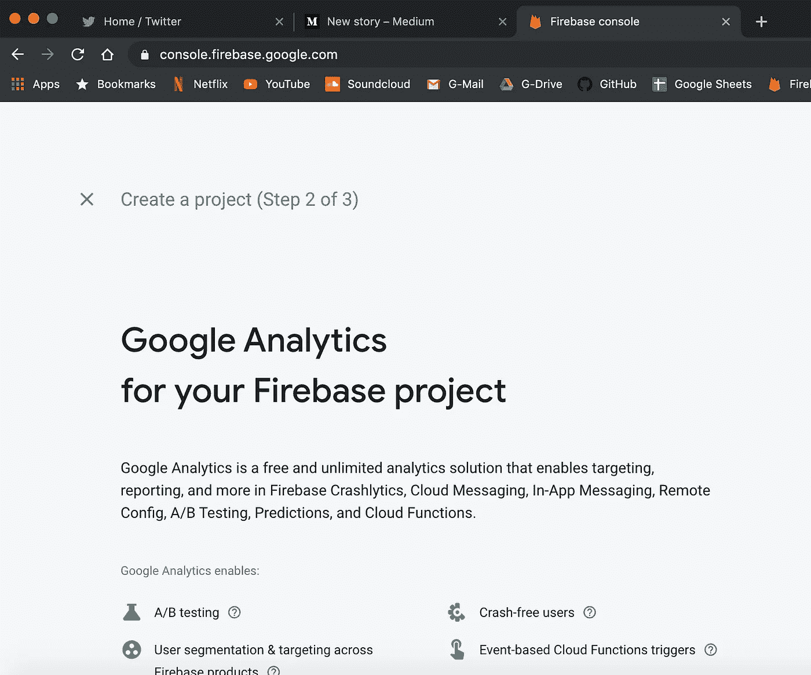

这将把你带到第二步。

向下滚动一点，关闭谷歌分析。我们不需要那个。


点击“创建项目”

给它一秒钟来初始化你的应用程序，再次点击继续，它会带你到 Firebase 控制台。

在这里结束之前，我们还需要做两件事(有点烦人)。

## 升级您的账单方案并添加信用卡。

我知道这很糟糕，但谷歌这样做是为了让你不能只是开始使用 8 万亿 TB 的计算能力。如果你超过一定限度，他们会告诉你。但是相信我，你不用付出任何代价就能得到一大笔钱。尤其是在发展的时候。

首先，你需要创建一个谷歌帐户。点击[这里](https://console.cloud.google.com/billing?authuser=0&consoleUI=FIREBASE&folder&organizationId=0)，登录，点击“创建账户”


选择一个名字(你叫它什么并不重要)。


然后通过正常的帐单帐户设置的东西。

当你完成后，点击“提交”，它会把你带到这个控制台。


太棒了，现在你有了一个可以链接你的项目的谷歌账单账户。

回到你的 Firebase 控制台[这里，](https://console.firebase.google.com/)并选择你创建的项目，看起来应该是这样的:


左手边是你的导航。现在，我们有了 Spark 计划，我们希望将我们的项目升级到 Blaze 计划，这样我们就可以启用计费。

查看导航底部显示“升级”的地方，然后点击它。

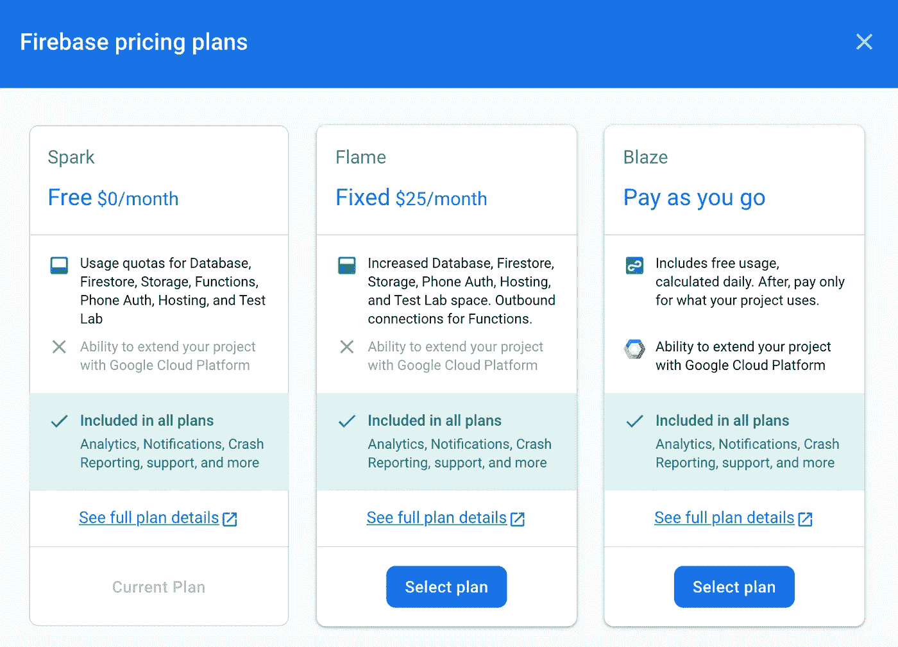

点击“火焰”下的“选择计划”

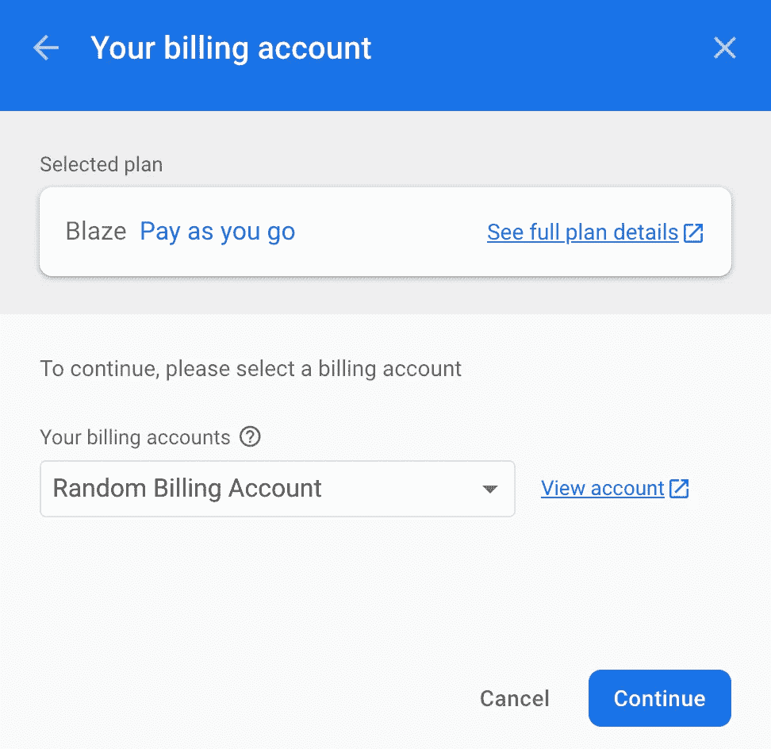

现在选择您刚刚创建的要链接到的帐单帐户。如果你只有一个账单账户，那么它不会给你一个下拉菜单。但是，因为我有多个，它允许我选择我想要链接的一个。

此外，“随机计费帐户”是我为我的计费帐户选择的名称。这不仅仅是某个人的叙述。

点击“购买”(别担心，他们不会向你收取任何费用)，你应该会收到一封通知你升级的电子邮件。

好的。我们结束了。

## 设置您的 GCP 资源位置

实际上我不知道为什么 Google 只对 cron 作业要求这个，但是我们需要设置我们的 GCP 资源位置。不过，这很简单。

在 Firebase 控制台的导航中，找到靠近顶部的小齿轮符号。点击它，然后点击“项目设置”，这将带你到这里:

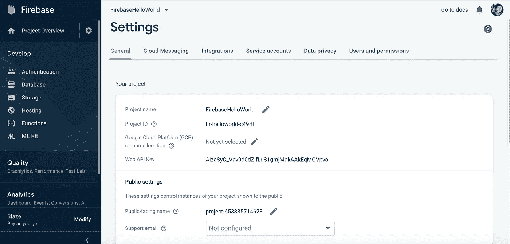

在“谷歌云平台(GCP)资源位置”的右边，点击“尚未选择”旁边的小铅笔，这将打开它:


你总是可以在下拉列表中搜索位置，看看哪一个离你最近，但我住在洛杉矶，所以我将使用 us-west4。

好了，我们终于完成了控制台。

# 5.编写您的项目代码

在您喜欢的文本编辑器中打开您的项目目录。我将使用 VSCode。

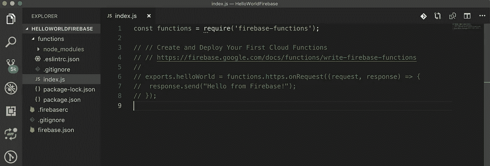

这是我们项目的基本结构。出于我们正在做的事情的目的，我们真正关心的唯一事情是“functions”目录中的 index.js 文件。让我们打开它。

它给了我们一个示例云函数，写在这里的评论中。然而，这个例子是一个 HTTP 函数，我们想要一个 cron 作业。两者之间的区别在于它们是如何被调用的:

*   通过向函数发送 HTTP 请求(如 GET 或 POST 请求)来调用 HTTP 函数，这与服务器在收到传入请求时调用路由的方式相同
*   根据计划调用 cron 作业

我将添加运行我们的程序所需的最少代码。


如果你不在乎这意味着什么，你可以跳到下一节。如果你感兴趣，我会分解这段代码的每一行。

1.  `exports.myPubSubFunction`

这是将我们的函数添加到 exports 对象中，并将我们的函数称为“myPubSubFunction”

exports 对象可以包含多个函数，所以如果我们想要添加更多的函数来部署到 Firebase 项目中，我们可以在这个 index.js 文件中向 exports 对象添加更多的函数。

2.`functions.pubsub`

functions 类是我们在这个文件中做所有 Firebase 工作的基础。

前面我们看到了一个 HTTP 函数的例子，它是这样实现的:

```
functions.http
```

我们想要创建所谓的发布/订阅功能，这基本上只是 Firebase 对 cron 作业的一种说法。

3.`.schedule('* * * * *')`

这是我们安排工作的方式。五个星号代表这个想法，“每分钟做这个功能。”如果你想学习如何创建自己的时间间隔，去 [Cron Tab Guru，](https://crontab.guru/#1_*_*_*_*)会帮到你。

4.

```
.onRun(() => {console.log(‘Hello World’);})
```

这是回调函数，当我们的函数实际被调用时，它将被调用。在这里，我们所做的就是告诉 Firebase 控制台记录一个老式的“Hello World”

# 6.使用 Firebase CLI 部署

感谢 Firebase 让这一部分变得如此简单。

再次打开终端程序，导航到项目目录。我要用 VSCode 集成终端。

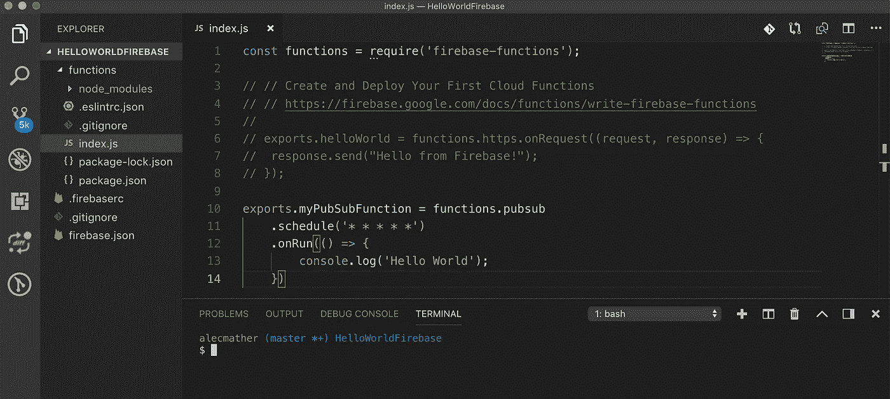

## 1.使用以下命令从命令行登录到您的 Firebase 帐户:

```
firebase login
```

它会给你提示。只需点击 Y 并输入，这将打开您的浏览器与谷歌认证。做所有的登录工作，当你完成后，关闭页面并返回到你的终端。现在，您应该在终端程序中登录。

## 2.将本地代码链接到您创建的 Firebase 控制台项目

为了链接您的项目，您需要获得您的项目 ID。使用此命令:

```
firebase list
```

这将列出 Firebase 控制台中所有活动的项目。第二列显示“项目 ID /实例”，是项目 ID。找到您创建的项目，并从第二列复制 ID。

然后使用以下命令:

```
firebase use --add <Paste your project ID here>
```

所以我的看起来像这样:

```
firebase use --add fir-helloworld-c494f
```

## 3.部署您的项目

终于，我们期待已久的时刻…

```
firebase deploy
```

这将把你的项目推到云端。如果所有的检查都没问题，你就可以走了。


我的终端告诉我我准备好了

## 4.检查以确保您的项目正在运行

回到 [Firebase 控制台](https://console.firebase.google.com/)，选择您的项目，在导航中应该有一个显示“功能”的按钮。点击它，它会把你带到这里:


它现在显示我们有一个活动的 cron 作业以“* * * *”的时间间隔运行。点击“日志”查看 console . log(“Hello World”)。

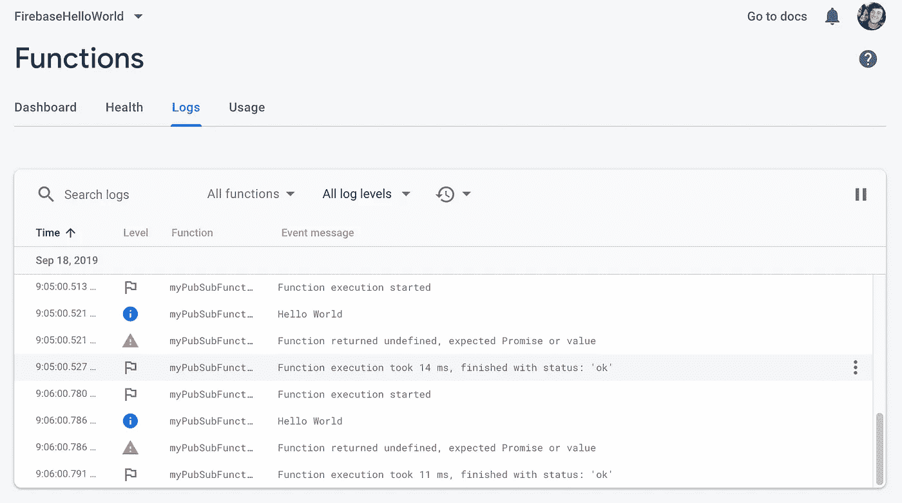

我们看到我们的工作正在运行。

**注意:**你在我的日志中看到的警告仅仅意味着在我们的函数中，我们没有返回任何值，显然他们希望我们返回一些东西。要解决这个问题，我们可以将它添加到我们的代码中:


保存我们的文件。

使用以下命令再次部署我们的功能:

```
firebase deploy
```

它会再次执行所有检查。

回到 Firebase 控制台，在那里我们再次查看我们的日志。

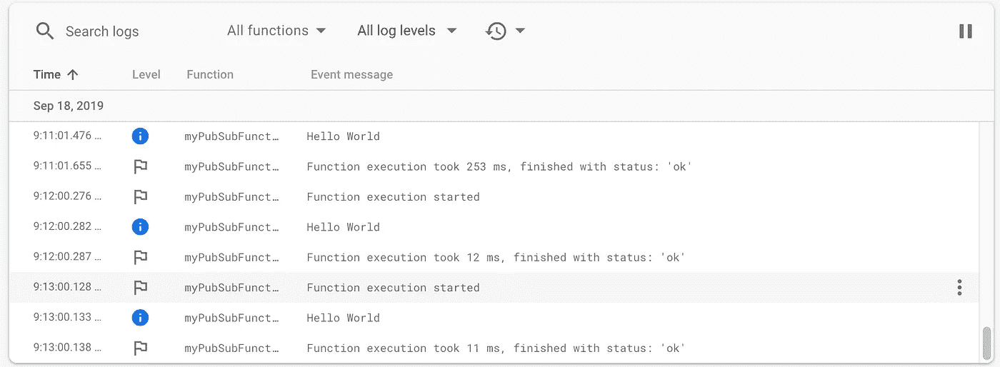

它已经不在了。