# 如何不用编码构建一个图像爬虫

> 原文：<https://betterprogramming.pub/how-to-build-an-image-crawler-without-coding-ffb6c8245c2e>

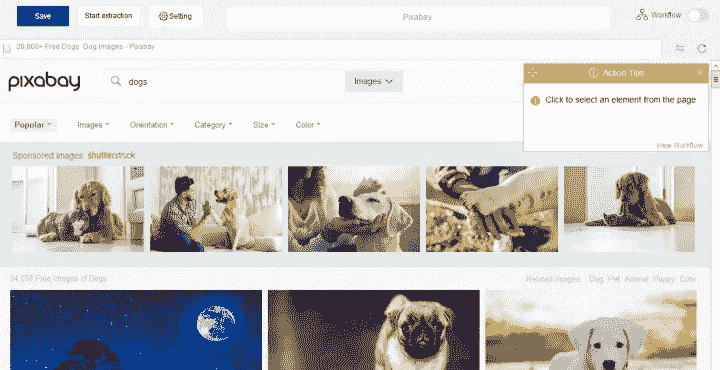

从网页中保存图像非常简单，只需右键单击并选择“图像另存为”但是，如果您有数百甚至数千张图像需要保存，该怎么办呢？同样的伎俩会奏效吗？

在本文中，我想向您展示如何快速构建一个图像爬虫，而无需编码。即使你完全没有技术背景，你也应该能在 30 分钟内搞定。无论你出于什么原因需要这些图片——无论是重新博客、倒卖还是机器培训——同样的技巧可以扩展到几乎任何网站。

并非所有的图像都是平等的。一些图像可以直接从网页上获取，其他图像只能通过点击缩略图来触发。

在本教程中，我将通过几个例子向您展示如何处理这些场景。

准备好了吗？让我们开始吧。

**你将需要以下工具:**
* [Octoparse](https://www.octoparse.com/download) :一个无需编码的可视化网页抓取工具
* [Tab Save](https://chrome.google.com/webstore/detail/tab-save/lkngoeaeclaebmpkgapchgjdbaekacki) :一个 Chrome 插件，在提供一个网址列表后立即保存图片

## **先决条件**

如果你熟悉 Octoparse 的一般工作方式，那就更好了。如果你是这个工具的新手，octoperse Scraping 101 也可能有所帮助。

# **示例 1:直接从网页获取图像**

为了演示，我们将从 Pixabay.com 刮狗的图像。要跟进，在 Pixabay.com 搜索*狗*。这应该能让你进入这一页。

1.单击“+任务”在高级模式下开始新任务。然后，在文本框中输入目标网页的网址，点击“保存网址”

Octoparse 截图

你应该到达这里:

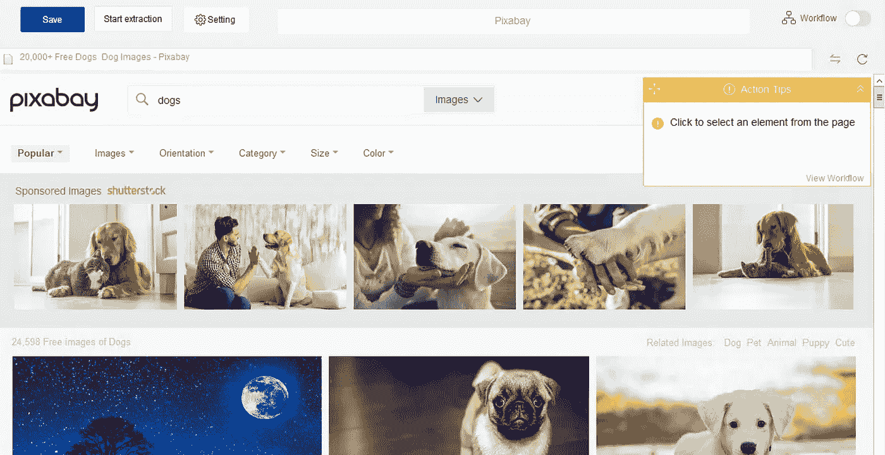

Octoparse 拍摄的 Pixabay.com 截图

2.接下来，我们将告诉机器人获取什么图像。

点击第一张图片。“行动提示”现在显示为“选中图像，找到 100 个相似的图像。”这太好了——正是我们所需要的。继续选择“全选”，然后选择“循环提取图像 URL”

3.当然，我们不只是想要第一页的图片，而是想要所有页面的图片(或者需要多少页就有多少页)。

为此，向下滚动到当前页面的底部，找到“下一页”按钮，然后点击它。

我们显然想多次点击“下一页”按钮，所以从“操作提示”中选择“循环点击所选链接”是有意义的

现在，只需确认是否一切都设置妥当。切换右上角的工作流程开关。完成的工作流应该如下所示:

此外，检查数据面板，并确保我们正确提取了所需的数据。

4.在运行爬虫程序之前，还有一件事要做。

在调试过程中，我偶然注意到，当你向下滚动网页时，HTML 源代码会被动态刷新。换句话说，如果网页没有向下滚动，我们将无法从源代码中获得相应的图像 URL。幸运的是，Octoparse 很容易自动滚动。

我们将需要添加自动滚动，当网站第一次加载以及当它分页。

点击工作流程中的“转到网页”。在工作流程的右侧，选中“高级选项”，并选中“完成加载后向下滚动到页面底部”

然后，决定滚动的次数和速度。这里我设置滚动次数= 40，间隔=1 秒，滚动方式=向下滚动一个屏幕。这基本上意味着 Octoparse 将向下滚动一个屏幕 40 次，每次滚动间隔 1 秒。

我不是随意设置的，但是我确实做了一些微调来确保这个设置有效。我还注意到，使用“向下滚动一个屏幕”而不是“向下滚动到页面底部”是很重要的这主要是因为我们需要的图像 URL 只是逐渐刷新到源代码。

对分页步骤应用相同的设置。

点击工作流程中的“点击分页”,并使用完全相同的自动滚动设置。

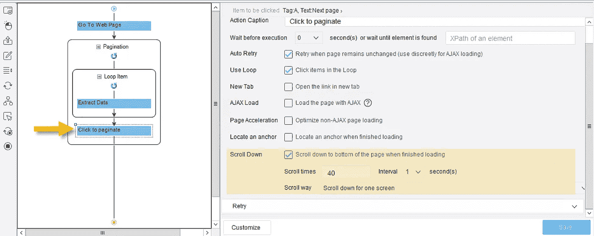

5.就是这样。你完了。这不是好得不真实吗？让我们运行爬虫，看看它是否工作。

点击左上角的“开始提取”。选择“本地提取”这基本上意味着你将在自己的电脑上运行爬虫，而不是在云服务器上。您可以[下载本例中使用的爬虫文件](https://www.dropbox.com/s/sivivqqzck61326/Pixabay_example1.otd?dl=0)，然后[亲自试用](https://helpcenter.octoparse.com/hc/en-us/articles/360025323191-How-do-I-import-a-task-file-and-run-it-to-get-the-data-needed-)。

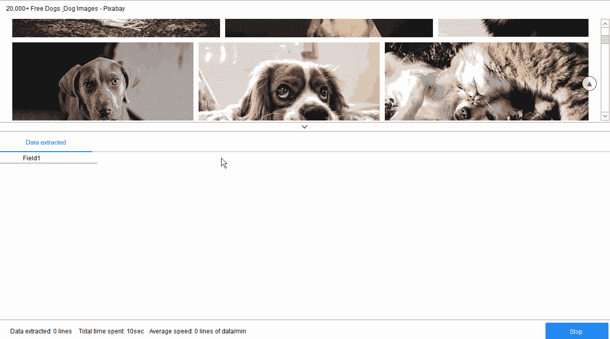

# **例 2:刮取全尺寸图像**

问:如果你需要全尺寸的图像怎么办？

在这个例子中，我们将使用同一个网站，[https://pixabay.com/images/search/dogs/](https://pixabay.com/images/search/dogs/)，来演示如何获得完整尺寸的图片。

1.点击高级模式下的“+ Task”开始新任务。

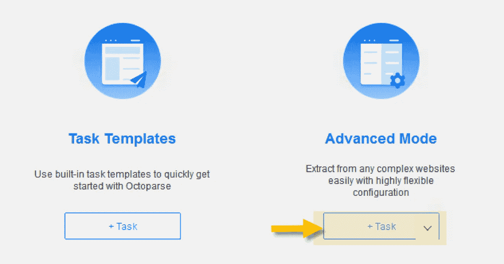

2 **。**在文本框中输入目标网页的网址，然后点击“保存网址”继续。

3.与前面的例子不同，我们可以直接捕捉图像，我们现在需要单击每个单独的图像，以便查看/获取完整大小的图像。

当你点击第一张图片时，操作提示应该是“选中图片，找到 100 张相似图片。”选择“全选”

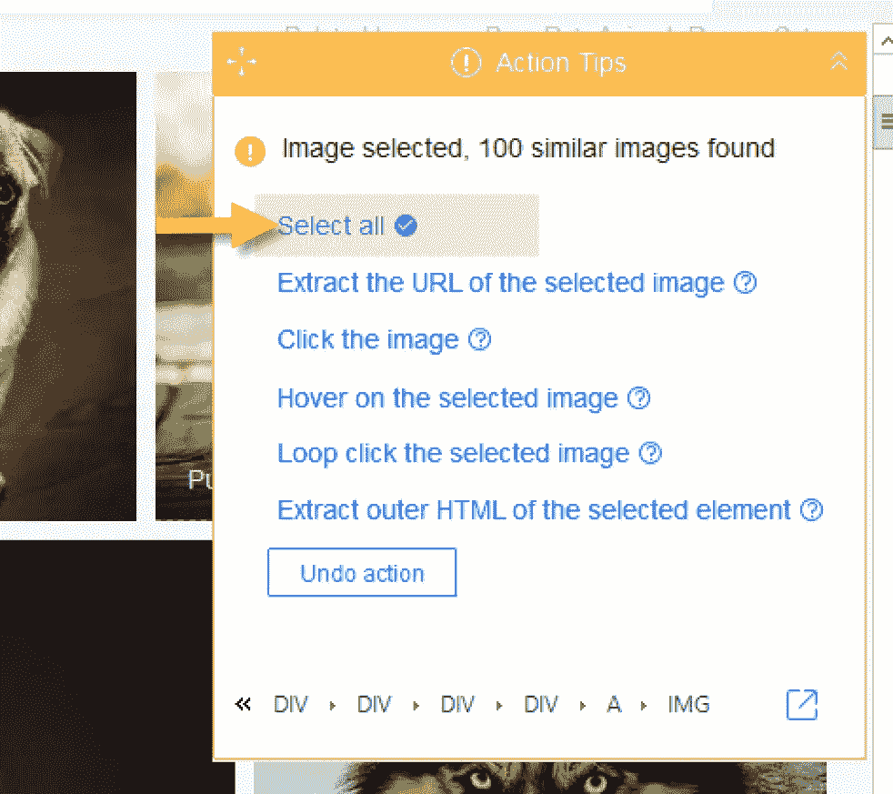

然后，选择“循环点按每个图像”

4.现在我们已经到达了带有全尺寸图像的页面，事情就简单多了。

点击全尺寸图像，然后选择“提取所选图像的网址”

像往常一样，检查数据面板，并确保我们正确提取了所需的数据。

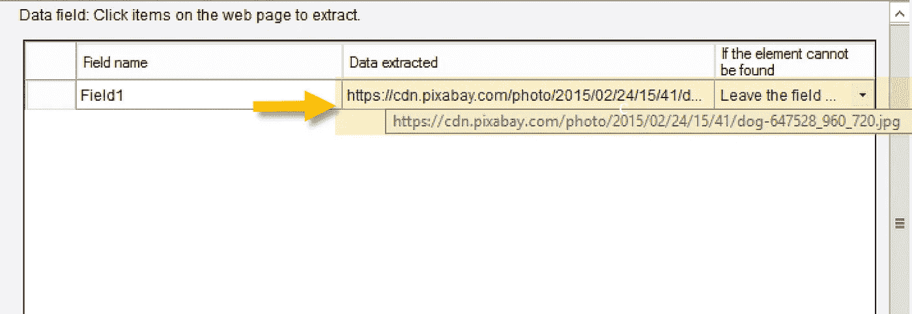

5.按照示例 1 中相同的步骤添加分页步骤。

点击“转到网页”，找到“下一页”按钮，然后点击它。在“操作提示”上选择“循环单击选定的链接”

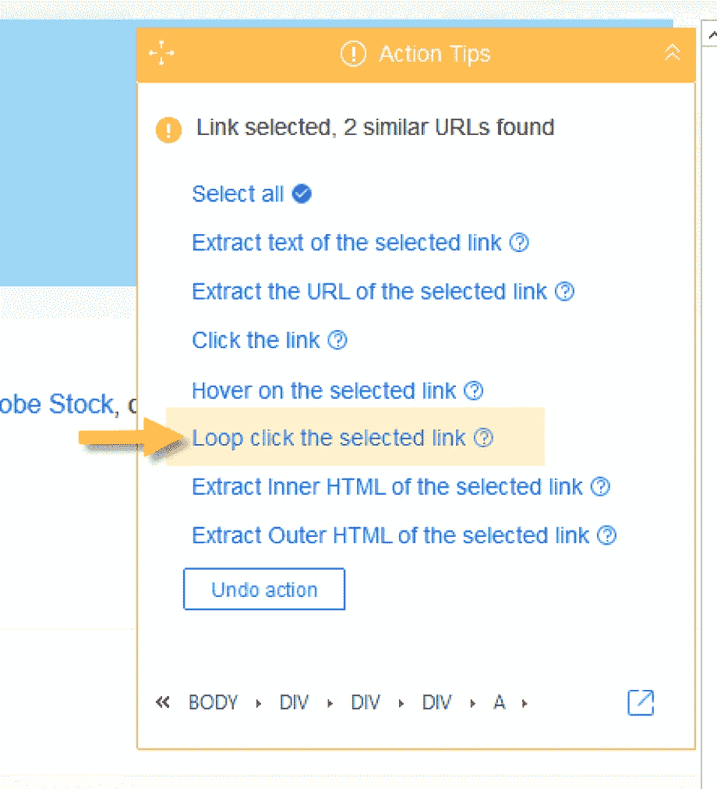

完成的工作流应该如下所示:

如果看起来不一样。拖动它来移动它。

6.完成了。测试运行爬虫。你可以下载本例中使用的[爬虫](https://www.dropbox.com/s/1uuc3kr9vqswgjc/Pixabay_example2.otd?dl=0)文件，[自己尝试一下](https://helpcenter.octoparse.com/hc/en-us/articles/360025323191-How-do-I-import-a-task-file-and-run-it-to-get-the-data-needed-)。

# **示例 3:从缩略图获取全尺寸图像**

我敢肯定，当你在网上购物或碰巧经营一家网店时，你一定见过类似的东西。

对于产品图片来说，缩略图绝对是最常见的图片展示形式。缩略图的使用大大减少了带宽和加载时间，使人们浏览不同的产品变得更加友好。

有两种方法可以使用 Octoparse 从缩略图中提取全尺寸图像。

**选项 1:** 您可以设置一个循环点击来点击每个缩略图，然后在加载后提取全尺寸图像。
**选项 2:** 由于大多数缩略图图像与对应的全尺寸图像共享完全相同的 URL 模式，但仅具有指示不同尺寸的不同编号，因此提取缩略图 URL 然后将缩略图尺寸编号替换为全尺寸对应图像的编号是有意义的。这可以通过 Octoparse 内置的数据清理工具轻松完成。

因为我们已经经历了与示例 2 中的选项 1 类似的事情，所以我将在这个示例中详细阐述选项 2。我们将使用 Flipcart.com 上的[产品页面进行演示。](https://www.flipkart.com/philips-bt40-portable-bluetooth-speaker/p/itmexgkftbzuajvr?pid=ACCEXGKFR79ZCVU7&lid=LSTACCEXGKFR79ZCVU7PH7DNE&marketplace=FLIPKART&srno=b_1_1&otracker=hp_omu_Deals%2Bof%2Bthe%2BDay_3_2.dealCard.OMU_16VFAOR33XHT_2&otracker1=hp_omu_SECTIONED_neo%2Fmerchandising_Deals%2Bof%2Bthe%2BDay_NA_dealCard_cc_3_NA_view-all_2&fm=neo%2Fmerchandising&iid=ae2041ed-0dcd-47ce-9bdb-c900cb062e34.ACCEXGKFR79ZCVU7.SEARCH&ppt=browse&ppn=browse&ssid=mop63dok340000001566964763185)

在我们开始工作之前，有必要通过查看缩略图及其全尺寸副本的图像 URL 来确认这种策略是否适用。所以我精心挑选了一个缩略图来检查。

**缩略图网址:**[*https://ruk minim 1 . flix cart . com/image/128/128/jatym 4 w 0/speaker/mobile-table t-speaker/v/u/7/Philips-in-Bt 40 bk-94-original-imafybc 9 ysphpzhv . JPEG？q=70*](https://rukminim1.flixcart.com/image/128/128/jatym4w0/speaker/mobile-tablet-speaker/v/u/7/philips-in-bt40bk-94-original-imafybc9ysphpzhv.jpeg?q=70Full-size)

**全尺寸网址:**[*https://ruk minim 1 . flix cart . com/image/416/416/jatym 4 w 0/speaker/mobile-table t-speaker/v/u/7/Philips-in-Bt 40 bk-94-original-imafybc 9 rqhdna 8 z . JPEG？q=70*](https://rukminim1.flixcart.com/image/416/416/jatym4w0/speaker/mobile-tablet-speaker/v/u/7/philips-in-bt40bk-94-original-imafybc9rqhdna8z.jpeg?q=70)

请注意，这两个 URL 之间唯一的区别是表示图像大小的数字:“128”表示缩略图，“416”表示全尺寸图像。

这意味着只要我们提取了缩略图 URL，我们就可以简单地通过用“416”替换“128”来将它们转换成完整大小的 URL。

让我们看看它的实际效果。

1.启动 Octoparse 应用程序，开始一个新任务，然后在文本框中输入目标 URL。

2)单击第一个缩略图。“操作提示”现在显示为“元素已选中”。找到 5 个类似的按钮。太棒了。Octoparse 自动识别剩余的缩略图。

选择“全选”

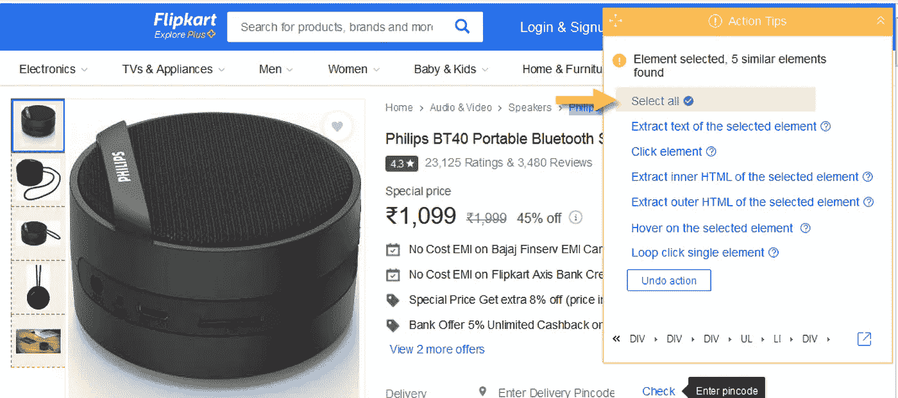

然后，选择“提取所选元素的文本”这显然不是我们想要的，但我们可以在以后改变它。

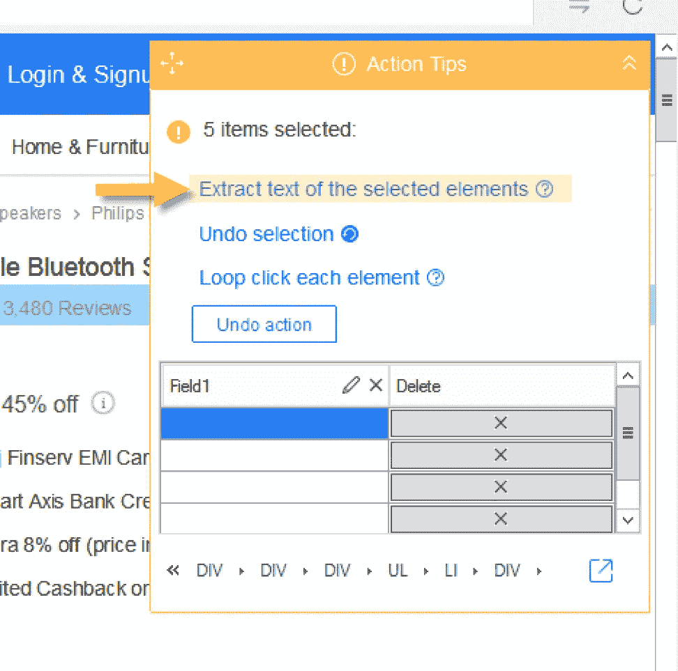

切换右上角的“工作流程”开关。请注意，我们没有提取任何内容。

嗯，这是意料之中的，因为显然没有要提取的文本。我们真正需要获取的是隐藏在 HTML 源代码中的图片 URL。所以现在我们需要改变要提取的数据类型。

3.点击底部的“定制”图标。然后单击“定义提取的数据”选中“提取外部 HTML，包括源代码、格式文本和图像”点击“确定”保存。

4.使用正则表达式工具从整个外部 HTML 块中匹配图像 URL。

再次单击“自定义”图标。这一次，单击“细化提取的数据”有几个数据清理步骤需要添加。

点按“添加步骤”，然后选择“与正则表达式匹配”如果你不熟悉正则表达式，可以随意使用内置的正则表达式工具，这是我非常喜欢的。

正则表达式工具是不言自明的。输入所需数据串的开头和结尾。点击“生成”，相应的正则表达式就生成了。点击“匹配”查看所需数据是否匹配成功。如果您希望匹配多行，请选中“全部匹配”

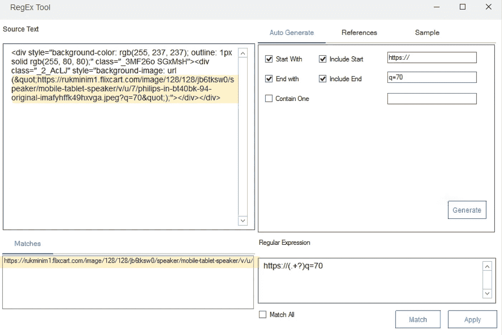

5.完事了吗？很接近——但还不是时候。请记住，这只是缩略图网址，我们仍然需要用“416”替换“128”，以使它们成为全尺寸的图像网址。

再次单击“添加步骤”。选择“替换”将“128”替换为“416”点击“评估”最后，我们有了我们需要的 URL。

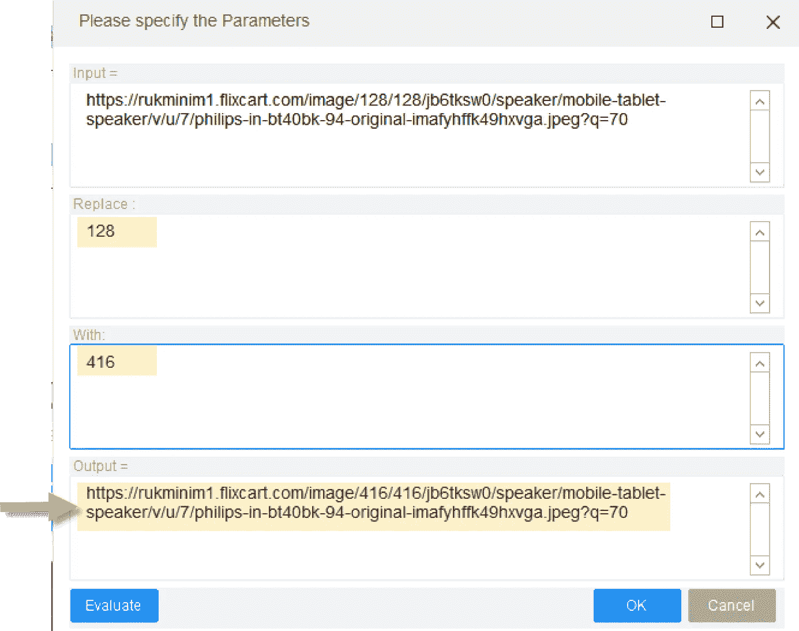

检查提取的数据。

6.测试运行爬虫。

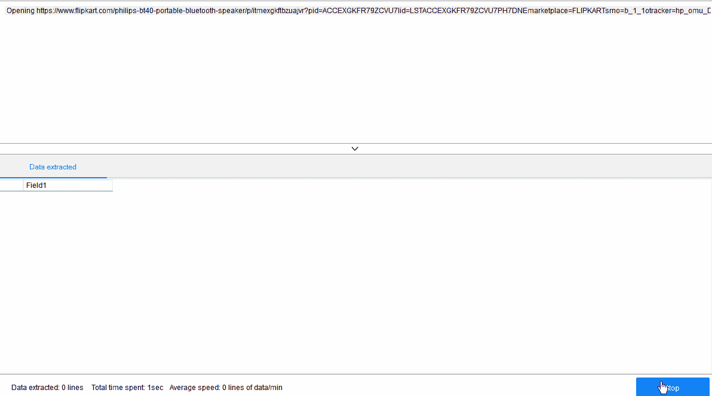

在上面的例子中，我们将每个图片 URL 提取为单独的一行。如果你需要把所有的 URL 都提取出来呢？这可以通过一次提取所有缩略图的外部 HTML 来完成。然后，使用 RegEx 匹配出各个 URL。替换大小数字，你将得到所有的全尺寸图像的网址提取到一个单独的行。

1.  加载网站，点击其中一个缩略图。单击“操作提示”右下角的“展开”图标，直到整个缩略图部分以绿色突出显示，这基本上意味着它们被选中。

2.在“操作提示”上选择“提取所选元素的外部 HTML”

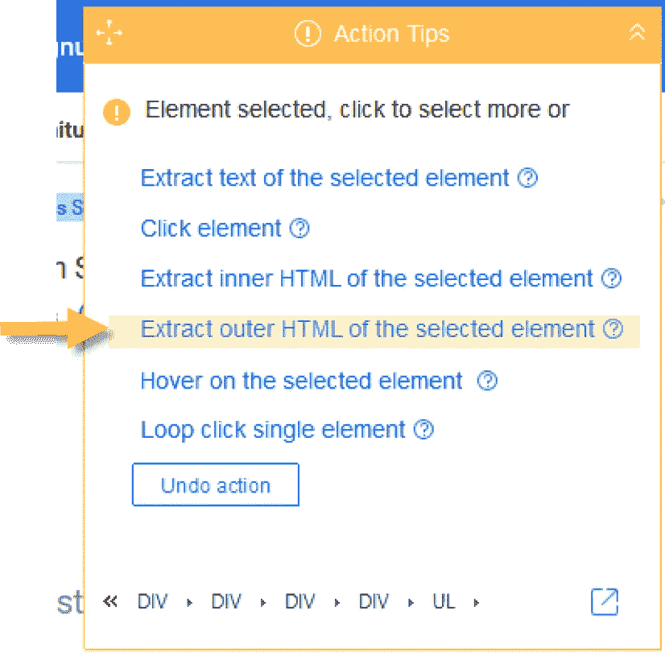

3.切换回工作流模式。

重复相同的数据清理步骤，匹配出各个缩略图 URL。

这次选中“匹配所有”，因为我们需要从提取的 HTML 代码中匹配多个 URL。

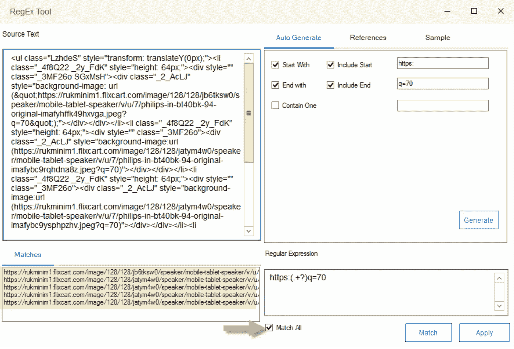

再次将“128”替换为“416”最后，我们将所有完整大小的图像 URL 提取到一行中。您可以下载本例中使用的[爬虫文件](https://www.dropbox.com/s/59rvp9lahxl8mkk/Flipcart_example3.otd?dl=0)，并由[亲自试用](https://helpcenter.octoparse.com/hc/en-us/articles/360025323191-How-do-I-import-a-task-file-and-run-it-to-get-the-data-needed-)。

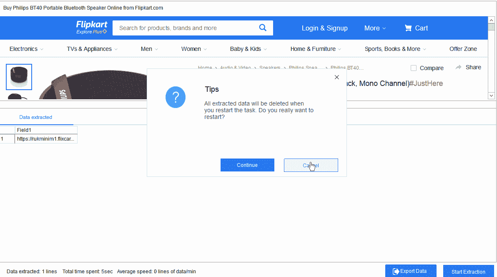

现在我们已经提取了图像的 URL，让我们继续使用我最喜欢的工具之一 [Tab Save](https://helpcenter.octoparse.com/hc/en-us/articles/360018324071-How-to-download-images-from-a-list-of-URLs-) 下载实际的图像文件。网络上也有其他类似的[图片下载软件](https://www.octoparse.com/blog/free-image-extractors-around-the-web)，而且大部分都是免费的。

1.  将提取的数据导出到 Excel 或类似格式。

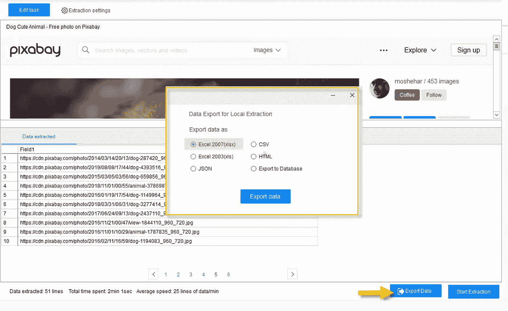

2.将图像 URL 复制并粘贴到选项卡保存。

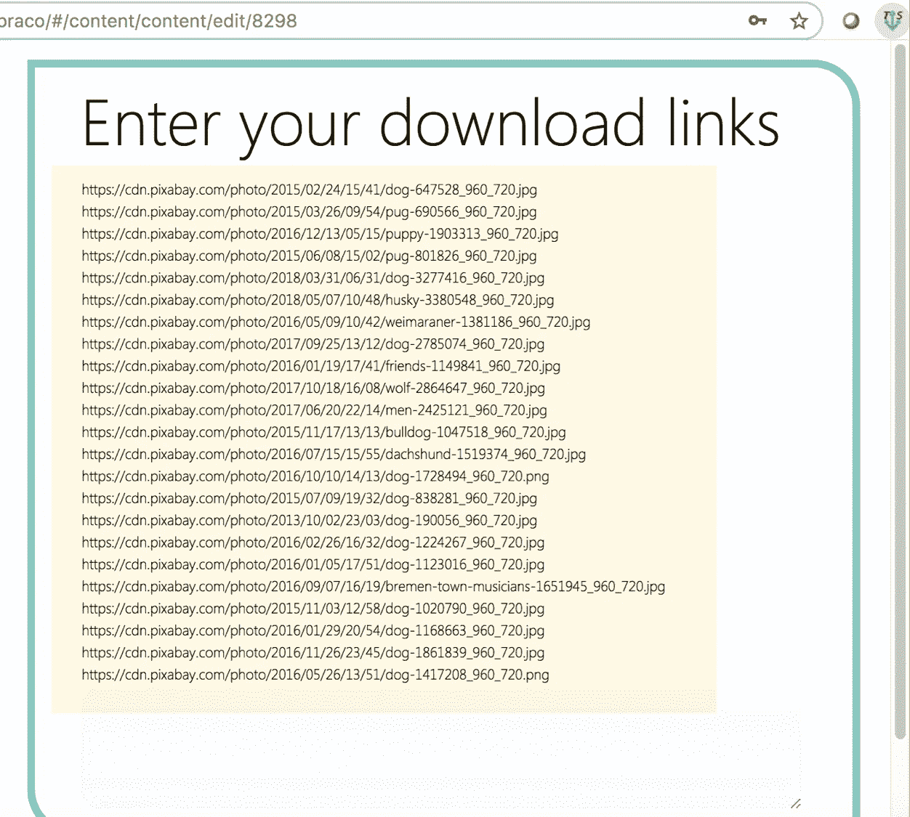

3.单击底部的下载图标开始下载文件。

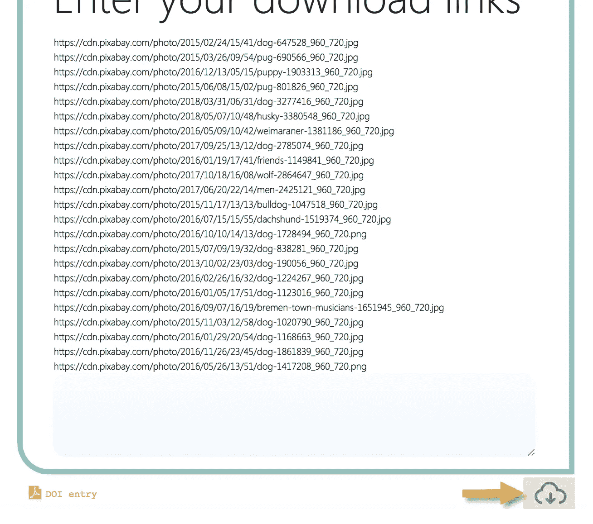

我希望这篇教程给了你一个从网上提取图像/数据的良好开端。也就是说，每个网站都是不同的。根据你的目标网站，可能需要做一些调整来使它工作。但是一般的概念和工作流程可以扩展到大多数网站。