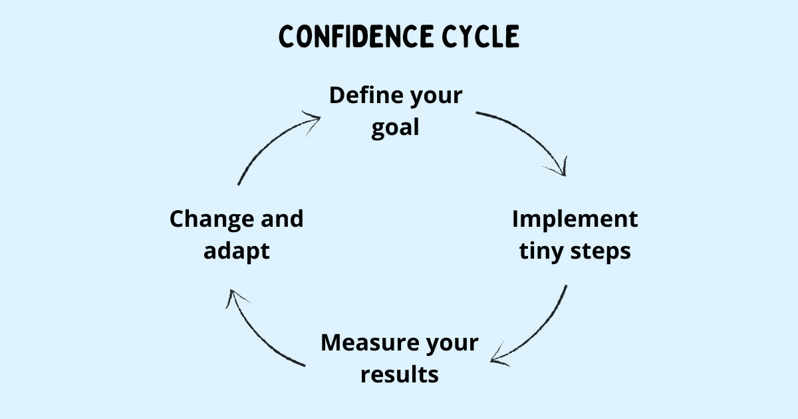

# 如何建立持久的信心

> 原文：<https://betterprogramming.pub/how-to-build-confidence-that-lasts-a3965b6fea20>

## 摘自我的新书——《反思冒名顶替综合症:建立自信，战胜自我怀疑，走向成功》



鸣谢:作者

冒名顶替综合症可能会让你满脑子找借口，因为自我怀疑而感到麻痹，让你很难鼓起勇气分享你的观点，让你纠结于错误和失败，反复播放你脑海中的负面磁带。

当你陷入它的思维陷阱时，你可能会认为是缺乏能力阻止了你去追求你想要的东西。但是阻碍你的不是能力，而是你缺乏自信。当你失去对自己的信心时，再多的能力也不能让你成功。能力给你技能和信心，这是你真正完成工作的基础。

《信心密码》一书的作者凯蒂·凯和克莱尔·希普曼说:“成功与信心的关系比与能力的关系更密切。”研究还表明，要想出人头地，自信比能力更重要。

在 1982 年的一项研究中，心理学家 Barry Schlenker 和 Mark Leary 探索了自信和能力认知之间的联系。一个 48 人的样本被要求对 60 个面临网球比赛的假想个体的能力进行评级。他们收到了两条信息:他们从很差到很好的预测表现和他们的实际表现。之后，他们必须对每个假设的个人能力进行评级。研究得出了这样的结论:那些对他们的比赛做出乐观预测的人被样本观察者认为比那些做出更温和预测的人更有能力，当他们的说法与他们的表现一致时或者当观察者没有他们实际表现的数据时更是如此。实际上，他们的自信极大地影响了其他人对他们能力的看法。

这并不意味着当你知道自己表现不好时，你会假装自信。真正的自信来自对自己的技能和能力的现实评估，而不是自我贬低。问题是:当你的头脑告诉你恰恰相反时，你怎么能做到这一点呢？当它不断要求你淡化你的成就。当它说你不属于。当你还没开始就要求你放弃的时候。当你连自己都不相信自己有能力的时候，你怎么能自信呢？

我们会处理的。但首先，我们来定义一下自信。

伊万·约瑟夫博士是一位屡获殊荣的表演教练，他曾执教过国家和世界冠军及奥运会选手。他将信心定义为“相信自己能够完成任何任务的能力或信念，无论机会、困难或逆境如何。你能完成它的信念。”这的确是描述自信最常见的方式之一。在这个定义中，自信是一种感觉:一种你能做好或成功的感觉。

但是，自信还有另一个我们经常忽略的定义。源自拉丁语“fidere”，意思是“信任”，信心也被定义为相信所选择的行动是最好或最有效的。这么说吧，自信是一种行动。这不是一种绝对肯定你会取得成功的感觉，不是一种对可能的失败没有恐惧的感觉，也不是一种对可能出错的事情没有自我怀疑的感觉。更确切地说，是不顾感受采取行动的勇气；相信自己无论结果如何都会采取行动。换句话说，自信不是在第一次失败、第一次挑战或第一次遭遇逆境时退缩。自信也是坚持:不管有多大困难，都有能力走出去，做好工作，并坚持下去。

当你只把自信当成一种感觉时，它会带你走上一条黑暗的道路，让你产生消极的想法，想出你不能做某事的所有理由。将自信视为一种行动，你的思维就会转向有效解决问题，而不是停滞不前。它帮助你想出克服障碍的策略，建议你如何提高和建立新技能，以及你可以做些什么来学习、成长和发展。失败和错误不再是灾难。对自己行动能力的信心有助于你以建设性的方式接近他们，当他们出现时，你能更好地准备应对。

这就是作家兼压力管理权威 Russ Harris 所说的“信心差距”他说，当人们坚持*的信念时，他们就会陷入困境，“在我能够实现我的目标、发挥我的巅峰状态、做我想做的事情或成为我想成为的人之前，我必须感到自信。”*当你已经在处理不值得和自我怀疑的感觉时，如果你在做重要的事情之前等待自信，你可能要等很长时间。真正的自信不是来自于没有恐惧。它是通过改变你与恐惧的关系来建立的，或者如拉斯·哈里斯所说*“自信的行动是第一位的；自信的感觉随后而来。”*

他说，与其陷入你的想法中，试图与它们斗争或评估它们是真是假，更重要的是它们是否有帮助。为了让你自己有能力采取行动，成为你真正想成为的人，即使你的大脑正在产生各种各样的原因来解释为什么不能这样做，问问自己，你是否允许这些想法来指导你的行动:

*   他们会帮助你达到你想要的结果吗？
*   他们会帮助你成为你想成为的人吗？
*   他们会帮助你创造你想要的生活吗？

如果答案是“不”，那么你可以认识到这个想法是“无益的”

现在你知道了用积极的行动取代自我怀疑是建立自信的一个伟大策略，请遵循以下 3 步流程:

1.  实施微小的步骤
2.  衡量你的结果
3.  改变和适应

# 实施微小的步骤

当接受新的挑战、新的任务或第一次做某事时，自我怀疑的浪潮是不可避免的。思考结果或最终结果会阻止你开始。这项任务的巨大规模和复杂性，加上失败的可能性，使它变得更加困难。到达目的地的路径可能还不清楚，但你可以通过一系列微小的步骤到达那里。微小的步骤需要将你的目标分解成微小的日常行动，每一步都让你离任务更近一步。

例如:

*   为了做一个演讲，在镜子前大声练习几天。接下来，在朋友或家人面前练习。接下来，和你的团队一起做。不断增加挑战，直到你达到一个让演讲看起来很自然的程度。
*   要写一本书，从每天写 100 个字开始。逐渐增加每日计数，从 100 到 200 到 500 到 1000 到 2000。从你信任的人那里获得对你初稿的反馈。进行编辑。对你网络中的其他人重复这个过程。
*   为了达成交易，在日常生活中与你的孩子、配偶、经理或团队成员练习谈判。接下来，与团队成员或某个众所周知擅长谈判的人进行角色扮演，练习实际的交易。和多位同事一起这样做，获得不同谈判风格的经验。

为什么微小的步骤有用？一小步一小步地关闭你大脑抵制和害怕变化的警报系统，让你专注于当前的任务，并导致持续的改进——这是建立自信的三个基本要素。这些小步骤起初可能看起来微不足道，但反复练习它们会加强你大脑中的神经通路，使这些小步骤更容易执行。曾经令人畏惧的事情变成了第二天性。你大脑中的新连接创造了下一个挑战的刺激。

《习惯的力量》一书的作者查尔斯·杜希格将这些微小的进步称为——

> 小胜利听起来确实如此，也是 keystone 习惯如何产生广泛变化的一部分。大量的研究表明，小胜利具有巨大的力量，这种力量与胜利本身的成就不成比例……一旦取得一个小胜利，就会产生有利于另一个小胜利的力量。小胜利通过将微小的优势转化为模式，让人们相信更大的成就触手可及，从而推动变革。

一旦你确定了微小的步骤，就按照心理学家、目标和计划如何影响认知、情绪和行为的研究员彼得·戈尔维茨所描述的那样，将它们付诸行动，即创造实施意图——事先制定一个计划，说明你打算在何时何地采取行动。换句话说，当情况 x 出现时，我会做出反应 y。研究表明，只要简单地写下一个计划，明确规定你打算在何时何地采取行动，你就更有可能坚持到底。

实施意图=我将在[时间][地点]采取[行动]

例如:

*   从周一到周六早上 7 点，我会在办公桌前为我的书写 100 个字。
*   我会在每天晚上 8 点晚饭后在我的卧室里对着镜子练习说我演讲的内容。
*   我将在周一和周三下午 2 点午餐后在会议室与我的团队成员练习谈判。

如果事情没有按计划进行呢？想想所有可能让你无法采取行动的障碍，并设计一个替代计划来应对它们。这将有助于你更好地准备适应突发事件，无论遇到什么都保持在正轨上。为此，使用“如果-那么”版本设计实现意图。

如果[这种情况发生]，那么我将[这样做]

例如:

*   如果我不能在周一早上 7 点为我的书写 100 个字，因为我必须参加我儿子的学校活动，那么我会在周一晚上 8 点写。
*   如果我不能在周四晚上 8 点练习演讲，因为那天是我哥哥的生日，那么我会在第二天早上 6 点练习。
*   如果我不能在周三下午 2 点练习谈判技巧，因为在同一时间有一个全体会议，我会在下午 6 点会议结束后和我的团队一起练习。

将你的目标分解成微小的步骤，然后用实现的意图来实现它们，这样就能把它们变成小胜利。小胜利累积起来就是人生的大目标。曾经看似遥不可及的东西，现在完全在你的舒适区内。小步战略适用于任何你想抓住的机会，任何你需要面对的挑战，或者任何你想掌握的技能。

# 衡量你的结果

管理大师彼得·德鲁克说:“衡量的东西会改进。”生活中的一切都是如此。无论你是在努力实现一个目标，培养一项新技能，还是在完成一项艰巨的任务，如果没有学习、适应和改正的态度，你就无法进步。一个很好的方法是在你的过程中实现一个强大的反馈循环。

不加评判地衡量你每天的表现——不要自责。当你没有达到自己的期望时，不要进行无情的自我批评，因为这会阻碍进步。自我批评往往会适得其反，增加你的不快乐程度，让你拖延而不是努力实现你的目标。相反，通过思考你可以采取的行动来反思结果:

*   什么效果好？
*   什么没用？下一次你如何做得不一样？
*   哪些障碍是你没有预见到的？
*   根据你取得的进步，你从别人那里得到了什么反馈？
*   基于你目前所学的一切，你的小步骤需要哪些改变？

# 改变和适应

最后，如果你不愿意改变和适应，所有这些努力都不会有好结果。你已经实现了一些微小的步骤。你已经测量了你的结果。现在，不要打退堂鼓，不要拖延对你的过程做出改变，即使一开始看起来很难。同样重要的是，你要调整和适应周围的变化，而不是一成不变。寻找你周围的信号。有什么不对劲吗？

例如:让我们假设你被赋予了在你的组织中推广一个新流程的责任。您已经根据从您的团队和其他职能部门收集的数据和反馈最终确定了一项战略。你满怀希望地测试推出这个策略的一小部分。但是等等，它惊人地失败了。在衡量你的结果时，你发现了一个不再有效的关键假设。你知道这意味着什么。你必须重新开始，重做作业。这时你的大脑可能已经开始播放弄巧成拙的故事“你不行”“你搞砸了。每个人都会发现你是个骗子。”

那只是你的想法。它在工作。你需要做你的。花点时间想一想，坚持一个显然行不通的计划好呢，还是穿上袜子回去工作好呢？在推出整个策略之前，要认识到你发现了一个错误的假设。承认你的知识和技能帮你节省了大量的时间和精力。庆祝现在还不算太晚。将这个小挫折从“我失败了”重新定义为“我现在知道什么是行不通的了。”想出一个新的策略，重复这个过程:实施微小的改变，衡量你的结果，改变和适应。

遵循这三个步骤，关注你的进步，是消除你不值得和自我怀疑的感觉的完美解药。你可以亲眼看到你的头脑告诉你的一切都不是真的。你有证据:你已经采取了行动。你已经学会了。你取得了巨大的进步。如果你只是简单地相信你的判断性想法，并决定什么都不做，这一切都是不可能的。自信来自于通过工作克服恐惧，而不是无所事事。

```
This article is an excerpt from my new book: 
[Rethink Imposter Syndrome: Build Confidence, Beat Self-Doubt and Succeed](https://www.techtello.com/rethink-imposter-syndrome/).
```