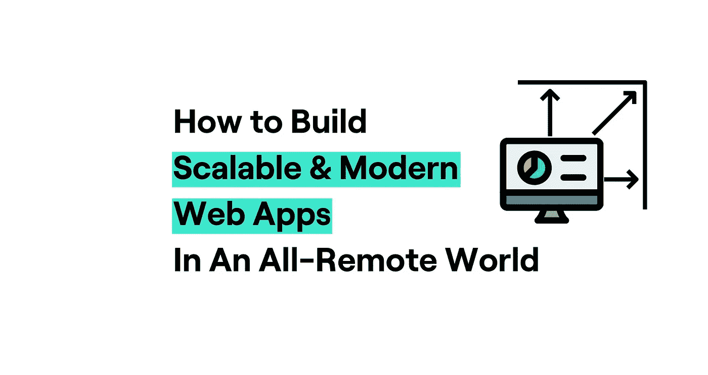

# 如何在一个完全远程的世界中构建可扩展的现代 Web 应用程序

> 原文：<https://betterprogramming.pub/how-to-build-scalable-modern-web-apps-in-an-all-remote-world-e62b8710f957>

## 在构建可扩展的现代 web 应用程序的同时，增加远程软件团队的成功几率

图片来源:作者

说到现代 web 应用，可伸缩性才是王道。仅仅让 web 应用程序表现良好是不够的:它们还必须表现良好，即使在大量并发用户的需求突然激增时也是如此。

似乎这还不够，即使在最好的情况下，构建可伸缩的 web 应用程序也需要大量的时间、资源和战略规划。当你把一个远程开发团队加入进来时，这个任务变得更加具有挑战性——在我们这个经济高效、全球化的世界中，这种情况经常发生。

好消息是，有相当多的工具和技巧可以用来构建现代的可伸缩 web 应用程序。在 Zartis，我们多年来一直经营着一项面向远程的业务，拥有 100 多名工程师。在与分布式软件团队合作的同时，我们已经收集了他们的智慧，并提炼了关于如何创建可伸缩的 web 应用程序的成熟实践。

# 为什么构建可扩展的现代 Web 应用程序很重要？

今天的用户期望闪电般的加载时间、24/7 的高可用性以及用户体验的最小中断，而不管有多少人试图访问您的 web 内容。除此之外，还有出色的用户界面和客户支持。如果你做不到，他们就会放弃你的应用，转而使用更具扩展性的网络应用，提供更好的用户体验。

不要射杀信使——这就是数字市场的残酷现实。想想这个:最近，ALDO Group [发现](https://simplified.dev/performance/impact-of-web-performance)他们的移动应用程序的快速渲染比平均水平多产生 75%的收入，比慢速渲染多产生 327%的收入。但这还不是全部。他们桌面应用的相应数字是惊人的 212%和 572%！

# 远程工作如何影响软件开发过程？

我们的工程师都同意，在构建现代 web 应用程序时，远程协作有三个常见的陷阱。

以下是现代 web 应用程序开发的常见陷阱——以及您想做些什么。

## 1.不发布实时更新和使用私人信息工具

这一切都始于组织文化。对于分布式软件团队来说，低效的沟通是一个严重而又普遍的问题。无论是由于文化差异、语言障碍、连通性差，还是仅仅因为跨越不同的时区，不良的沟通会减慢甚至危及现代应用程序开发过程。关键的可伸缩性细节可能会在翻译中丢失，一些团队成员甚至可能没有得到备忘录。

解决办法？

至少，您应该让您的远程开发团队使用一个支持视频、电话会议和屏幕共享的私人消息工具。想想 [Zoom](https://zoom.us/) ， [Highfive](https://highfive.com/) ， [Google Hangouts](https://hangouts.google.com/) ，[微软团队](https://www.microsoft.com/de-de/microsoft-365/microsoft-teams/group-chat-software)，或者任何你更喜欢的交流渠道，真的。

接下来，考虑使用 [Slack](https://slack.com/) 或类似的消息传递平台，该平台具有用于共享源代码的通道和留言板插件。这将确保您的远程工程师在所有计算机系统和移动电话之间进行有效和即时的协作。

最后，确保向所有团队成员发送重要新进展的实时更新。这不仅让每个人都了解情况，还促进了透明和包容的决策。要构建一个可伸缩的 web 应用程序，你需要每个人的投入和一个包容性的开发环境。

## 2.没有充分利用分散的云服务

在与分布式软件团队合作时，您最不希望的事情就是依赖本地的和受位置限制的服务器。

而是使用云存储服务。它是否是开源的是你需要根据你的信息系统的需求来决定的。与传统的文件存储不同，通过互联网连接，可以从世界上的任何地方访问远程服务器。此外，它们可以轻松升级，以适应更多的数据或不断增长的用户数量，从而在最短的停机时间内保持较短的响应时间。有许多容器编排系统，Docker 和 Kubernetes 是目前使用最多的，它们可以帮助您轻松扩展应用程序，而不必从头构建基础架构。

我们的许多客户利用 Azure 云服务或亚马逊网络服务(AWS ),内置对其公共云需求的支持。还有许多私有云提供商可以为您需要的特定存储服务和云功能提供定制解决方案。

这样，您的远程工程师将能够快速有效地访问构建可扩展 web 应用程序所需的数据。在简化工作流程、持续集成和部署活动、系统监控等方面，它让生活变得更加轻松。

## 3.忽视分布式团队的网络和设备安全

仅仅因为您的远程工程师在数百甚至数千英里之外，并不意味着您不应该给予他们与您的内部团队同样高水平的网络安全考虑。如果你做不到这一点，你将把你的 IT 系统和软件开发过程都置于风险之中。

防止这种情况的一些方法包括:

*   使用集中管理的计算机和电话
*   使用 VPN 保护敏感、机密和个人信息
*   确保所有分散的团队成员都有一个安全、私密的远程互联网连接

# 构建可伸缩 Web 应用程序的最佳实践

现在您已经知道该做什么了，接下来让我们来看看您是如何确保可伸缩性和一致的性能的，而不管有多少用户或负载。

## 1.微服务架构

构建可伸缩的 web 应用程序时，分散架构是必须的。现代 web 开发非常依赖微服务。这种类型的架构将应用程序分成分散的系统、松散耦合的组件和轻量级协议。与 monolith 架构不同，这种方法允许您开发、测试、维护和升级作为独立模块的单个 web 服务，而不会影响整个应用程序或工作流。

结果呢？更快的上市时间、增强的安全性、更短的吞吐量、装载时间和停机时间。但更重要的是，分散式架构允许您实时扩展应用程序，对最终用户的干扰最小。

## 2.贮藏

缓存是可伸缩性最好的朋友。如果您的远程开发团队正在开发任何类型的面向公众的 web 服务，他们应该认真考虑实现某种形式的缓存，以避免每次都必须重新呈现页面。缓存降低了数据加载成本，允许更快的数据检索，并且消除了返回原始数据库的需要。

也就是说，缓存是有代价的，应该只在有意义的地方使用。数据离开所需的时间(TTL)决定了缓存的有用性。如果您的数据很少发生变化，长期缓存它通常是一个好主意。一个典型的例子是目录页面，它为每个请求加载相同的产品，并且工作流保持不变。但是，如果您需要页面实时显示最新数据，就不要缓存它。

## 3.负载测试

除非您在部署前进行负载测试，否则您永远无法知道您的应用程序是否可伸缩。目标是创建一个应用程序可能遇到的数据和用户流量的真实模拟，以查看它如何达到标准。它将揭示负载平衡是否需要进一步的工作，并显示哪些方面需要改进。

如果您没有用合理的负载平衡策略将潜在的可伸缩性问题扼杀在萌芽状态，那么当它们在部署后出现时，您将不得不处理它们。这可能导致昂贵的定制、性能下降、停机和收入损失。

当有新的软件工程师加入项目时，负载测试尤其有用。虽然这个过程可能会影响部署速度，但缓慢的启动肯定是值得的。彻底的系统测试，从单元测试到性能测试，确保新的软件开发人员在开始重构代码时不会破坏应用程序的其他模块。

如果您正在利用分布式计算，测试自动化会更加困难，但是风险会更低。在把网络内容发布到万维网上之前，确保万无一失。

## 4.多个数据库(SQL + NoSQL)

提高应用程序可伸缩性的另一个捷径是使用多个数据库，例如 SQL 和 NoSQL。虽然这两者在市场营销中经常被定位为对立面，但结合使用它们实际上有助于确保数据的完整性、一致性和可靠性。

这种方法还提高了容错能力，降低了总体成本，并允许您将用户访问分散到多个数据库中，这又有助于负载平衡。此外，您可以将数据库放在全球多个地区，以进一步缩短访问时间。所有这些都对可伸缩性有直接影响。

该行业显然已经意识到了这一点。ScaleGrid 最近的一项研究发现，44.3%的企业使用两个甚至更多的数据库来扩展他们的应用程序。其中，SQL + NoSQL 组合是最受欢迎的，被 75.6%的调查参与者使用。

无论您是否将 MySQL、Microsoft SQL Server 或 PostgreSQL 与 MongoDB、MariaDB 或其他非关系数据库相结合，我们都已经看到了许多这种结合有助于进一步稳定应用层的用例。如果您将云服务、虚拟网络和服务器添加到组合中，您就万事俱备了！

## 5.无状态应用程序

为了获得最大的可伸缩性，请考虑让您的 web 应用程序无状态。在无状态协议下，接收服务器不保留用户会话数据。相反，数据是以一种方式发送的，这种方式使接收方能够独立于同一会话中以前的信息包来读取单个信息包。这使得无状态应用非常适合高流量，因为这种数据模型减轻了服务器负载，提高了性能。

然而，在某些情况下，有状态协议会工作得更好。其中包括具有更丰富数据格式的实时和基于流的应用程序，速度和超高性能是必不可少的。

# 可扩展性、现代网络应用和远程工作:最终想法

如果您没有优先考虑实现一个流畅的工作流，那么在与分布式软件团队一起工作时，构建可伸缩的 web 应用程序会是一个挑战。不过，也不是不可能。对您的 IT 基础设施、技术堆栈、数据模型和 web 开发模型进行一些经过深思熟虑的调整，应该足以确保您的分布式应用程序能够构建现代的、可伸缩的 web 应用程序，而且这些应用程序还具有成本效益，受用户欢迎。跨所有操作系统，可能是基于网络的 Linux 或微软系统或 iOS 或 Android 应用程序。

感谢阅读！