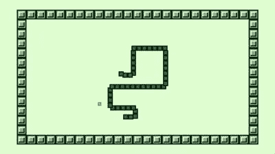
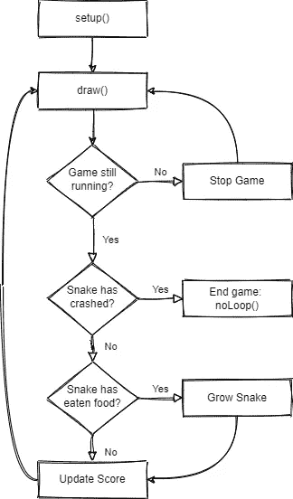

# 用 P5.js 构建一个贪吃蛇游戏

> 原文：<https://betterprogramming.pub/how-to-build-your-first-snake-game-with-p5-js-577a45909fd7>

## 借助 P5.js 框架和一些 JavaScript 的魔力

回想我开始编码之旅的时候，我记得我相信一个新手不可能编写完整个游戏。光是“实时更新”、用户输入和游戏处理的想法就让我相信，要最终达到游戏开发的水平，我还需要几年时间。

嗯，我想犯错是人之常情。在这篇文章中，我将向你展示如何编写你的第一个游戏，以及为什么没有理由害怕它。如果你对阅读整本书不感兴趣，可以看看完成的[产品](http://github.com/burlienterprises/p5-snake)。

**免责声明**:如果你已经对 HTML 和 CSS 的工作原理有了一些基本的了解，那就更好了。如果不是这样，不要慌。查看[摩哂陀·乔杜里的这篇伟大的文章](https://medium.com/@iampika/html-and-css-fundamentals-6b8f7d90911b)，之后别忘了回来看看:)。

## TL；蛇博士，那是什么？

来源: [Roku 指南](https://www.rokuguide.com/sites/default/files/Snake-Screenshot1.png)

让我们先快速解释一下我们将要创建的游戏:Snake。这绝对是 70 年代的经典之作，但对所有没有听说过它的孩子来说，它是免费的，有趣的，而且会让你很紧张。

基本上，堡垒之夜是给老人的。我第一次接触这个游戏是因为它曾经预装在我们的翻盖手机上。每当你不小心打开浏览器，在网上冲浪两秒钟(感觉更像是十年)后，你内心的恐慌就会沸腾，这个游戏是让你冷静下来的理想选择。你们中的一些人可能还记得那种感觉。

无论如何，游戏的目的是让你用键盘上的箭头键控制的蛇成长。如果蛇撞到边缘或自己的身体，游戏就结束了。通过收集随机放在游戏板上的苹果，种植是可能的。

# 让编码开始吧

## 设置

首先，我们将使用[样板文件](https://github.com/bsplt/p5js-boilerplate)来开始我们的项目。样板文件很大程度上是一个模板，负责我们需要的文件夹结构和文件引用。它还包括 P5.js，这是一个易于使用的 JavaScript 库，有一个巨大的社区，非常适合用它来创建游戏和可视化。我也认为它非常适合开始编码。

## 布局和设计

在编写任何游戏逻辑之前，我总是建议你创建一个基本布局并添加一些风格。大多数人反对这种方法，会先写 JavaScript 代码，但是设计优先的方法有一个很大的优势:如果代码不工作(很可能一开始就不工作)，至少有一些好看的东西；).

布局在`index.html`文件中创建。如果我们要为我们的元素编写任何自定义样式，我们会将它们放入`css/style.css`。相反，我们将使用一个名为 [Pico.css](https://picocss.com/docs/) framework 的 CSS 框架来处理所有元素的默认样式。我们可以简单地将预定义的样式作为类添加到元素中。

下面是最终的代码:

最终设计和布局

## 使用 P5.js

既然设计已经完成，开始变魔术的时候到了。如前所述，我们将使用 P5.js 框架实现游戏逻辑，并将代码放入`main.js`文件中。

P5 的主要原理很简单。用户应该能够用代码创建绘图，并将它们直接放入 HTML 的`<canvas>`对象中。不像普通的 JavaScript，你不需要自己调用`onLoad()`函数；P5.js 库通过提供两个函数来完成这一切:

*   `setup()` —这是游戏板设置和初始化的地方
*   `draw()` —这是游戏处理和逻辑实现的地方。基本上，游戏循环是在这里编码的。

如果你有兴趣了解更多关于 P5 的知识，请查看 Johannes Preis 的这篇文章。

## 搭建画布

在编码任何东西之前，我们必须告诉框架它应该在 setup 函数中把图形放在哪里。为此，必须创建一个画布对象，并在`setup()`函数中将 HTML 容器的 id 指定为画布的父对象。

至于图画的颜色，这必须在`draw()`函数中指定，因为在游戏的每次迭代中，每个字段都必须更新。

## 实现游戏循环

现在，我们如何实现这个游戏呢？想法是这样的:游戏板被分割成块。块数和块大小在它们自己的变量中设置。

在循环的每一次迭代中，蛇都向它当前移动的方向移动一个街区。方向也是在它自己的变量中设置的，只有当用户单击其中一个箭头键时才会改变。这条蛇只不过是一些颜色与其他颜色不同的积木。块的位置保存在一个数组中，对于蛇的每个块，绘制一个背景不同于画布的矩形。

基本的游戏循环如下:

游戏循环

## 碰撞检测

每当蛇撞到棋盘的边缘或自己的身体时，游戏结束。对于这两种方法，只有头部需要考虑，因为身体的其他部分总是跟着头部走。

## 蛇的运动

每当用户按下箭头键时，蛇就改变它的运动方向。使用框架提供的`keyPressed()`方法可以很容易地拦截这个事件。

x 方向的负值表示蛇向左移动，y 方向的负值表示蛇向上移动。

## 食品加工

食品加工可能是整个事情中最棘手的部分。通过选择随机的 x 和 y 值，苹果被放置在棋盘上的一个位置。然而，只有当蛇的身体没有任何部分占据这个位置时，苹果才会被放在这个位置。如果蛇吃了它，苹果会被随机放在另一个地方。而且蛇成长一格，分数也增加。

## 游戏分数和状态

最后但同样重要的是，必须建立开始-停止-暂停过程。为此，我们对之前放在 HTML 中的按钮使用一个普通的事件监听器。然后点击改变设置状态的变量。这是在游戏循环中查询的。如果设置为暂停，则跳过大多数处理。

## 最后的想法

恭喜你，你刚刚编写了你的第一个游戏！如果你想直接看到最终代码，那么你可以点击[这里的](https://github.com/burliEnterprises/p5-snake)。请随意使用它和/或在您的机器上试用它。

我希望你喜欢这篇文章。欢迎给我写你开始编程时编写的第一个游戏，或者留下任何关于游戏的想法:)。