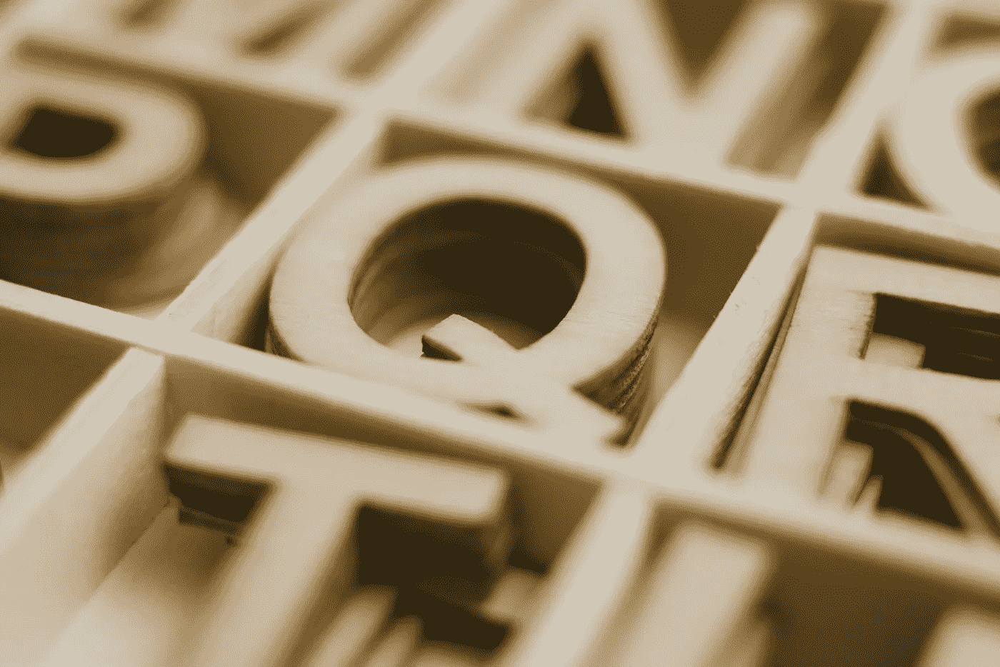

# 如何在 Python 中大写一个字符串中的所有单词

> 原文：<https://betterprogramming.pub/how-to-capitalize-all-words-in-a-string-in-python-f2b0066a5327>

## 将“hello world”转换为“Hello World”



亚历山大·安德鲁斯在 [Unsplash](https://unsplash.com/s/photos/capital-letters?utm_source=unsplash&utm_medium=referral&utm_content=creditCopyText) 上拍摄的照片

对于这个任务，我们将使用一些 Python 技术来拆分、修改和重建我们的字符串，以便每个单词的第一个字母都大写。

让我们从每个难题的简要概述开始，这样我们可以更清楚地回顾解决方案。

*   **这个。split() String 方法:**该方法将一个字符串转换成一个列表，使用一个可选参数作为分隔符来分割字符串。如果没有指定分隔符，那么将使用任何空格来分割字符串。
*   **List Comprehension:** 作为 Python 工具箱中真正强大的工具，List Comprehension 是一种从可迭代和可选的条件表达式创建列表的方式。iterable 中的每一项都可以在理解的范围内进行修改，从而得到非常简洁和高性能的代码。
*   **这个。capital()String 方法:**该方法将返回首字母大写的字符串。
*   **这个。join() String 方法:**这个方法将一个给定的列表转换成一个字符串，使用提供的值作为分隔符。如果你来自 JavaScript 背景，你可能习惯于`.join()`是一个数组方法——然而，在 python 中，它是一个字符串方法。字符串分隔符作为基本对象提供，列表作为参数传递给`.join()`。

# 解决方案

现在，我们对解决方案的每一部分都更加熟悉了，让我们深入了解一下。

我们首先设置我们的字符串值，然后把它分成一个列表:

```
message = "hello world"parts = message.split(" ")
```

我们通过向`.split()`传递一个空格来分隔每个单词。如果我们分割一系列逗号分隔的值，方法调用将是`.split(",")`。

接下来，我们将使用列表理解和`.capitalize()`方法来修改每个字符串的第一个字母:

```
capitalized_parts = [p.capitalize() for p in parts]
```

这里发生的是我们通过`parts`循环，将每一项分配给变量`p`。然后将`p.capitalize()`的解析传递给我们新创建的列表。

最后，我们将列表转换回字符串:

```
capitalized_message = " ".join(capitalized_parts)
```

这需要一些时间来适应，但是您首先以字符串的形式提供分隔符——在我们的例子中是一个空格——然后使用列表作为参数调用`.join()`方法。

到目前为止，为了清晰起见，我们一步一步地前进。然而，整个解决方案可以浓缩成一个语句——很棒，对吧？

```
message = "hello world"capitalized_message = " ".join([
   word.capitalize()
   for word in message.split(" ")
])print(capitalized_message) # Hello World
```

如果您愿意这样做，您可以很容易地使用这个语句并创建一个接受两个参数(字符串和分隔符)的函数，以便在必要时重用。

你有没有一种首选的方法来大写一个字符串中的所有单词？您还使用列表理解对文本执行了哪些类似的转换？请在下面分享您的评论和反馈！