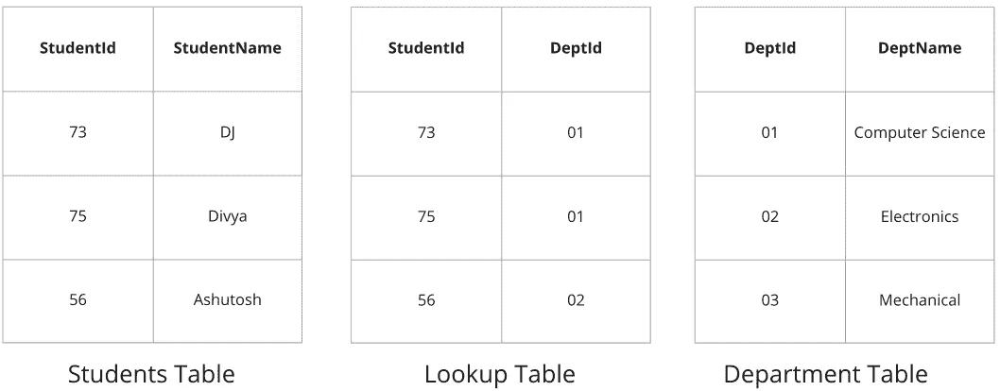
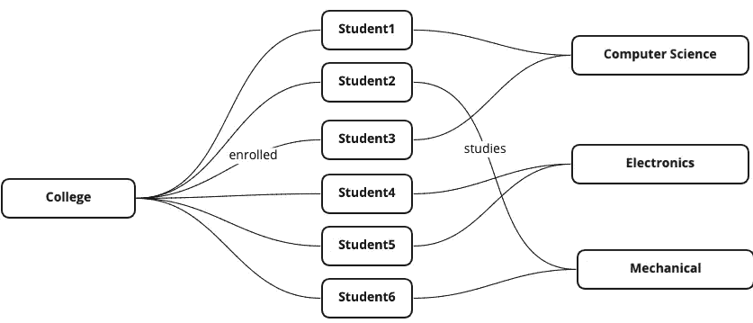
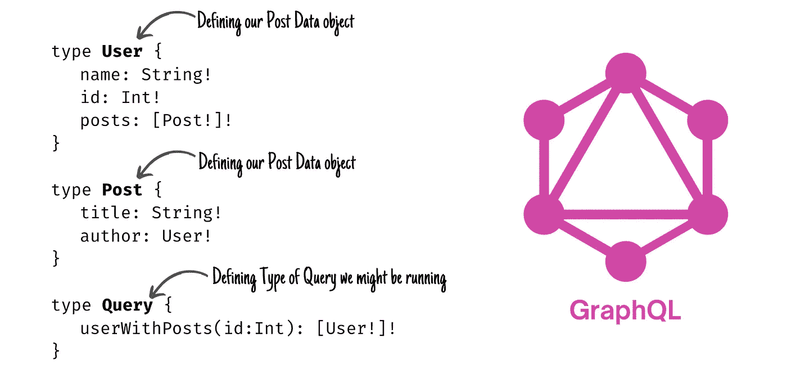
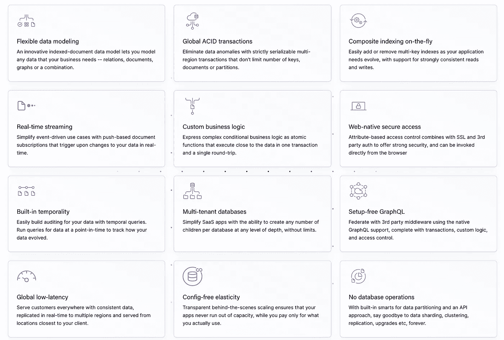

# 如何为您的应用选择合适的数据库

> 原文：<https://betterprogramming.pub/how-to-choose-the-right-database-for-your-app-c9b29ae0b8ae>

## 让这些数据库决策变得更简单、更明智

从事新项目总是非常令人兴奋——我们可以自由地以任何我们想要的方式设计和构建这些东西。但是这个计划，如果做得不好，将来会给我们带来很多痛苦。

选择您的应用程序数据库是您必须做出的关键决定之一，通过这篇文章，我打算向您介绍各种数据库选项，并列出一些利弊，以帮助您做出更明智的数据库决定。

# 按键**–**值

我们的数据库的结构就像一个 JSON 对象——每个键都是唯一的，每个键都指向某个值。

它将数据保存在内存中，虽然速度很快，但有容量限制，所以无法存储大量数据。由于不涉及磁盘，一切都非常快。

不涉及任何查询或连接，所以不需要担心太多的数据建模。由于没有模式，开发人员总是可以根据自己的喜好灵活地更改数据。

## **什么时候使用这个技巧**

*   这种技术主要用作缓存机制，用于非常频繁地获取和观察部分数据的情况
*   因此，键值技术作为一种缓存机制与其他数据库一起被广泛使用

# 宽栏

这就像是关键价值，但却是兴奋剂。修改该值以存储一组列，而不仅仅是普通数据。

随着列的引入，您现在可以对相关数据进行分组，但是仍然没有合适的标准模式。因此，每个键可以指向不同分组的数据。

由于没有模式，它可以处理非结构化数据，并带有一种叫做 CQL 的查询语言，类似于 SQL，但功能要弱得多。

数据源源不断，比如来自物联网设备、股票市场、金融交易或你的网飞手表历史记录。

## **什么时候使用这个技巧**

*   频繁写入
*   不经常更新或读取

这仍然不是通用的。因此，它可以用于存储我们所有不同应用程序的历史数据。

# 文档风格数据库

这是我们使用的最流行的数据库技术之一。这显然由文档组成，每个文档都是一组键**–**值对。它们是非结构化的，不需要模式。

文档被组合成*集合，*并且这些集合可以被组织成一个逻辑层次。

这种数据的逻辑集合使您能够以一种更符合逻辑的方式对相关数据进行分组，这似乎类似于关系数据库。

## **由于我们的数据库不能运行连接查询，我们该如何一次获得所有相关的数据呢？**

我们一起储存！我们鼓励您的数据库非规范化，数据重复/不一致是我们准备做出的权衡。

读取速度确实很快，但是在确保数据一致性的同时写入和更新数据可能有点困难。

文档数据库非常适合通用应用程序，可能也非常适合大多数应用程序、游戏和物联网。

如果您真的不确定您的数据库模式，那么文档数据库是开始的最佳方式。

## **流行的文档型数据库**

当您有大量数据时，文档样式的数据库就不够用了，这些数据可能彼此直接或间接相关。

对于这些场景，您必须运行多个复杂的查询，然后在前端应用程序中合并所有接收到的数据，或者您可以使用关系数据库，其中这些复杂的查询由数据库管理。

# 关系数据库

我们都听说过这些数据库，最流行的是 MySQL、Postgres 和 SQL Server。它们已经存在了一段时间，并且仍然是许多应用程序的流行选择。

我们使用结构化查询语言(SQL)。

## “关系”的意义

想象一下一个汽车工厂，那里有不同的生产汽车零件的中心。

假设车门是在一个地方制造的，而车轮、车身和内饰都是在不同的地方制造的。

想象中的汽车工厂蓝图

每个制造的零件都有一个唯一的 ID。

因此，一旦汽车需要组装，你可以从所有这些不同的地方获取所有的零件，然后组装你的汽车。

为了建造这样一个工厂，我们将创建这样一个工厂的蓝图，它确保制造汽车的整个过程是非常高效和最优的。当在数据库中使用时，这个蓝图被称为*模式*。

因此，我们需要为我们的数据库规划模式，以确保我们的数据库对于应用程序的数据需求也是非常高效的。

## 不利方面

*   就像随着时间的推移，改变汽车工厂的布局以符合不断变化的需求会花费汽车公司大量的时间和金钱一样，当大规模的应用程序必须这样做时，情况也是类似的。当您的需求明确时，请确保使用关系数据库。
*   此外，一旦你建立了一个月生产 30 辆汽车的工厂，你就不能轻易地将工厂规模扩大到月生产 90 辆汽车。类似地，我们的关系数据库可能更难扩展，但也有一些例外，如蟑螂数据库和 PostgreSQL 就是为大规模工作而设计的。

## 好的一面

*   SQL 数据库符合 ACID 标准，这意味着我们的数据有效性和完整性永远不会受到影响，即使读写操作可能会失败，这使得它非常适合银行/金融相关数据
*   一旦有了一个模式，就可以确保存储的数据总是按照一组验证存储在一个固定的结构中，这些验证是在模式中定义的

## 最适合你的是什么？

*   如果你的需求是清晰的，并且你确定你不需要对需求做任何剧烈的改变，就去做这个吧
*   如果你对需求不是很确定，并且处于试验阶段，那么最好使用 NoSQL 数据库

但是如果我们不需要创建模式，可以直接将关系存储为数据呢？

# 图形数据库

这里，我们的数据存储在节点中，关系被定义为边。挺甜的！让我们看看怎么做。

如果您必须在一个 SQL 数据库中找出所有学习计算机科学的学生，您将需要一个查找/中间人表来分别存储所有学习计算机科学的学生的记录。

在图形中，它会更加简单，因为我们不必单独存储数据的关系部分，这是这种新风格的本能。

关系在图表中更容易记录和维护

有了这种直接显示两个节点之间关系的新方法，我们复杂的连接查询变得简单多了，与 SQL 相比，大大提高了数据库的性能。

因此，当您依赖于大量的连接操作并且性能因此而降低时，请使用这样的数据库。

# 可搜索数据库

如果你正在构建一个像 Google 这样的应用程序，在一个小字符串查询搜索中，你必须快速返回所有匹配的记录——你说的是一个全文搜索引擎。

这些数据库基于 1999 年开始的 Apache Lucene 项目。

Algolia 和 MeiliSearch 是全文搜索引擎。

它们看起来类似于文档类型的数据库。我们有一个索引，我们向它添加数据对象。搜索数据库引擎将分析文档中的所有文本，并创建一个叫做*倒排索引的东西。*

当您查询某个内容时，数据库只会检查倒排索引，这使得整个过程看起来非常快，即使对于大型数据库也是如此。

我把最激动人心的留到了最后。

# 多模型数据库

有多种选择，但最受欢迎的似乎是[动物群](https://fauna.com)。

作为应用程序开发人员，我们通常只关心 JSON，我们可以在应用程序的前端使用它。

有了动物群，我们不必担心数据建模、模式、缩放、复制或标准化，只需获得我们的 JSON 数据。我们定义如何使用 GraphQL 访问我们的数据。

我们举一个 Instagram 类 app 的场景为例。我们将使用 JSON 为`User`、`Post`和`Query`定义规则。

我们刚刚上传了我们的 GraphQL 模式——它自动创建一个集合来存储数据和索引来查询数据。

在幕后，它计算出如何利用不同的范例，如基于您提供的 GraphQL 模式的关系、图形和文档。

我们只是简单地添加我们的数据，就像我们在文档数据库中做的一样，我们不会被数据建模的限制所束缚。

最棒的是——它符合 ACID 标准，速度极快。

你不需要担心基础设施。只需定义您如何需要数据，云将为您处理其余的事情。

## 不利方面

显然，价格是一个不利因素。伟大的东西不是免费的，但它们确实为想要学习的开发者提供了慷慨的计划/开源选项——小型创业公司也是如此。

以下是一些值得注意的动物特征:

我们还没完！要学习不同的数据库还有很多，但我希望这是对我们作为开发者在应用程序中使用的各种选项的一个很好的介绍。

# 更多关于数据库的阅读

 [## 数据库的类型

### 根据使用要求，市场上有以下类型的数据库可供使用——让我们解释一下…

www.tutorialspoint.com](https://www.tutorialspoint.com/Types-of-databases)  [## 数据库中的全文搜索:Algolia vs Elasticsearch | Algolia 博客

### 大多数应用程序和网站都是建立在数据库之上的。它可以是传统的关系数据库，如 MySQL…

www.algolia.com](https://www.algolia.com/blog/full-text-search-in-your-database-algolia-versus-elasticsearch/)  [## 实施网飞媒体数据库

### 在本系列的前几篇博文中，我们介绍了网飞媒体数据库(NMDB)及其突出的“媒体…

netflixtechblog.com](https://netflixtechblog.com/implementing-the-netflix-media-database-53b5a840b42a)  [## 手机应用的后端应该用 AWS 还是 Firebase？

### 哪种解决方案最符合您的需求？

medium.com](https://medium.com/better-programming/should-you-use-aws-or-firebase-for-the-back-end-of-your-mobile-app-a28f93540520) 

感谢阅读。祝你愉快！