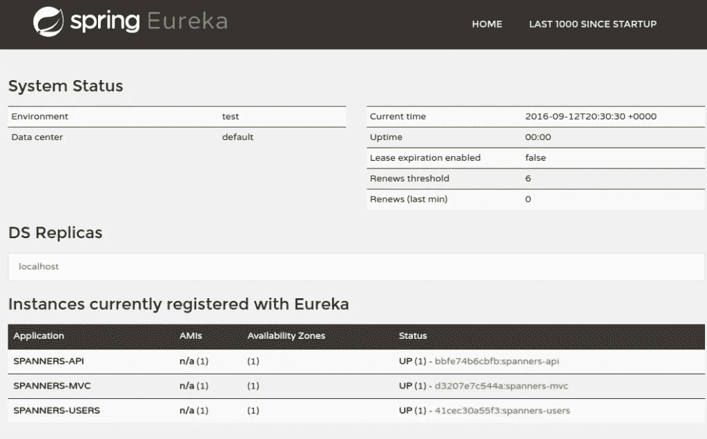

# 如何使用 Eureka 连接到微服务

> 原文：<https://betterprogramming.pub/how-to-connect-to-a-microservice-with-eureka-580bfdb4955a>

## 不再需要硬编码主机名和端口

诺亚·布舍尔在 [Unsplash](https://unsplash.com?utm_source=medium&utm_medium=referral) 上的照片

与微服务合作可能是一件好事，也可能是一件坏事。如果服务的数量很大，您希望避免硬编码每个服务的位置。更好的是，您希望避免将主机名和端口放在代码中。

服务可以被重新定位。您还可以增加实例的数量。结果是:这导致在与它们通信的微服务中进行手动配置。

当您完成配置，并最终工作时，您不希望一个更改导致十个其他服务停止。太多的耦合是不好的。现在你可能已经厌倦了听到这些，但是在这种情况下很容易解决。

春天网飞尤里卡为你解决这个配置地狱。你可以把它想象成一个中心，在这里你可以列出并找到你所有的微服务。

然后你可以问——Eureka，你能给我一个我新创建的微服务的实例吗？

你和我在一起吗？在本文中，您将学习如何使用 Java 和 Spring 定位微服务。另外，你将会看到 Spring 为你做了多少。

*你也可以用其他语言连接到 Eureka，Python 就是一个例子。所以你真的不必担心用 Java 创建一个网飞尤里卡服务器。如果这是你担心的事情，它不会把你锁在语言里。*

# 我们如何获得服务实例的 URI？

要完全理解 Spring 能为你做什么，最好从简单开始。为了理解它，让我们看看引擎盖下发生了什么。

老实说，我第一次尝试确定实例的位置时非常天真。

算法非常简单。首先使用发现客户端。您要求它返回具有特定名称的所有实例。然后你拿一个实例，并要求其 URI。

您可以在下面找到代码。这很简单，而且很有效。

上面的代码可以工作，并返回第一个实例——但并不理想。只要使用一个实例，就足够了。它不能很好地扩展多个实例。这是一个问题。我们希望避免手动配置。

如果您有多个实例，负载将不会很好地分布。如果一台服务器承担了所有的负载，它就会关闭。你不想那样。负载应始终均匀分布；否则，使用多个实例是没有意义的。

您可以自己编写负载平衡代码。确保每个现有实例都得到一部分负载。但是它很快变得更加复杂。毕竟不是每个实例都是平等的。

您可以使用 Spring 自己的负载平衡功能，而不是修改代码以使每个实例获得相同的流量。这就避免了自己编写代码，从而节省了时间和金钱。

你甚至会发现上面的代码甚至是不必要的。很快就可以扔掉了。

# 幸运的是春天为我们做了这些

通常，您希望咨询一个微服务，并为其添加功能。您会发现使用 WebClient 或 RestTemplate 很容易访问底层微服务。

*我个人更喜欢 WebClient，因为它允许非阻塞调用，这是与底层微服务交流时非常有趣的一点。如果您可以合并多个调用，它们不一定一个接一个地执行，而是同时执行。这节省了宝贵的时间，而且效率更高。*

在上一节中，我提到 Spring Boot 可以为我们做负载平衡。您所要做的就是向 WebClient bean 添加一个注释。之后，你对微服务的每一次调用都会很好地分布在可用的实例上。

非常优雅，而且不用自己动手也很好。这样，你就不会犯代价高昂的错误。

现在，您已经准备好直接查询实例了。它的美妙之处在于主机名和端口是自动找到的。所以你再也不需要配置它了。

作为开发者，剩下唯一要做的就是在 Eureka 注册你的微服务。从那时起，您只需要知道服务的名称。

下面，我举个例子，教你怎么找书。

*不要担心语法。在反作用弹簧中，多个结果称为通量，一个结果称为单声道。如果你不熟悉反应弹簧，相信我，它比看起来容易。*

Spring 集合 Eureka 微服务的方式简直太神奇了。尤其是当你发现配置是微服务解耦的最大障碍的时候。

在本文中，您了解了如何在 eureka 服务器上查询实例。你也看到了春天让你更加轻松。除了主机名解析，它们还使得负载平衡变得容易。

如果你对此感兴趣，我推荐你也去看看 Spring Cloud Gateway。在这里，您可以轻松地将呼叫重定向到底层微服务。

此外，还值得看一看与底层微服务通信的 Feign 客户端。

我当然没有发现春天所能提供的一切。如果你看完文章后有什么小技巧，欢迎分享。在这个令人兴奋的世界里，我们每天都在学习。