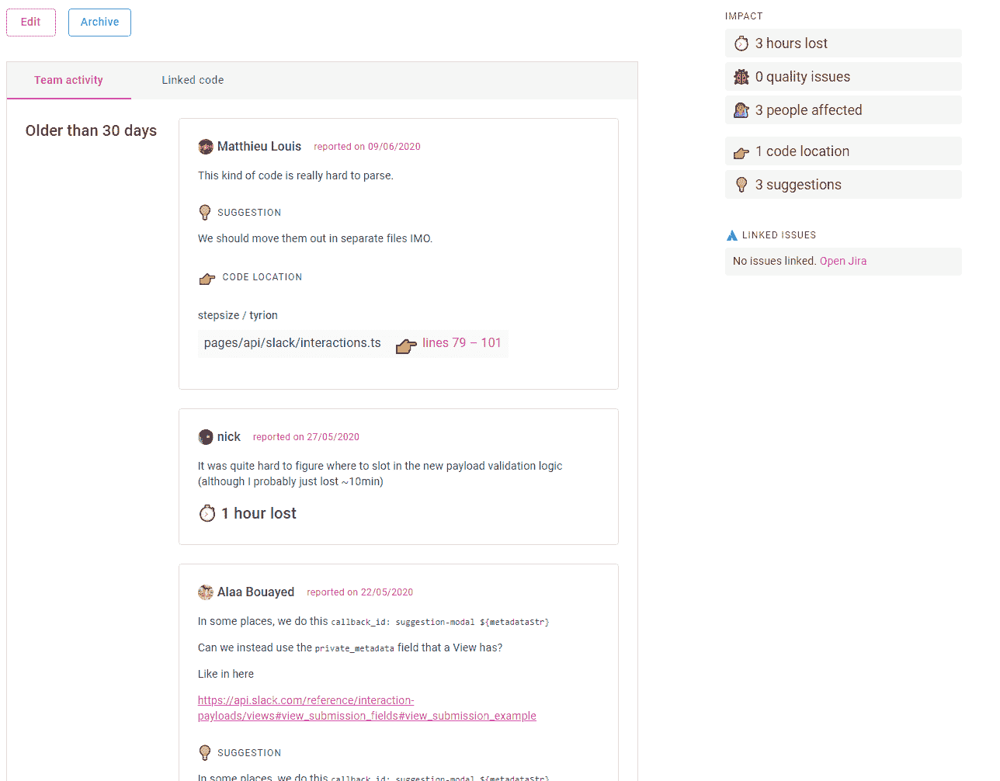

# 如何说服人们处理技术债务

> 原文：<https://betterprogramming.pub/how-to-convince-people-to-deal-with-a-tech-debt-591d62671c0f>

## 科技债务的商业案例

在过去的六个月里，我采访了 200 多名顶尖软件工程师，讨论科技债务。在这篇文章中——这是我从这次经历中学到的知识系列的第一篇——我将与你分享我们领域中的佼佼者如何为任何给定的科技债务创造商业案例。

运用这些经验，你也会明白你应该首先解决哪些债务。它们将帮助你释放你所需要的资源，让你说服你的同事——尤其是高层管理人员——这是正确的举措。

我开始了这个旅程，决心找到控制技术债务的工程团队的共同特征。但在这一过程中，我还发现了其他一些东西——即使在那些科技债务管理良好的公司，也不是所有的债务都得到了解决。

这些公司有信心留下一些债务，而其他债务立即被安排到下一个冲刺阶段。这很有道理。让我解释一下。

[我以前写过](https://blog.stepsize.com/how-to-stop-wasting-engineering-time-on-technical-debt/)你应该解决阻碍你发展的债务，但是我采访过的最好的工程团队对他们的选择如此冷静和自信，显然还有更多。

我意识到，我必须找到得到解决的科技债务的共同特征，并将它们与那些无人问津的债务进行对比。

这就是我最有趣的面试问题的由来:“得到解决的科技债务和没有得到解决的科技债务之间有什么区别？”

一旦你明白了这个问题的答案，你就永远不会为留下一些债务而感到难过。你将能够用一个真实的商业案例来支持你解决另一笔债务的热情请求。

你不需要 MBA，这比“商业案例”听起来要简单得多。

# 如何为科技债务寻找商业理由

一旦你确定了你正在考虑的科技债务是[小型、中型还是大型](https://blog.stepsize.com/the-perfect-process-to-manage-tech-debt/)，问自己以下两个问题。

## 1.这种债务是一个关键特征吗？

回顾你的产品路线图，弄清楚你正在考虑的债务是否会影响关键特性的交付。例如，您当前查询数据库的方式可能不允许您在 SaaS 产品的仪表板上显示实时数据。这是一个简单的问题，但是需要一个对代码库有适当了解的工程师的专业知识来解决它——可能是一个团队领导。

如果这种债务确实会导致某个功能的发布出现问题，请记下来。这是包含在你的技术债务项目报告和与相关产品经理讨论中的重要数据。

正如威尔·埃利斯(Soundcloud 工程公司的 SVP)告诉我的，科技债务有一个特别反常的影响，你可能需要深入挖掘才能发现:

> 您的路线图中是否缺少一些功能，因为现有的债务使它们无法交付，并且人们已经放弃了这个想法？

这比你想象的要经常发生。一个常见的罪魁祸首是多年来僵化的应用程序基础数据模型中的债务。这将阻止您进一步进行修改。

例如，您可能已经在这样的前提下构建了您的应用程序，即在您的 B2B 软件中，每个帐户只允许有一个唯一的组织。然后，一些大型跨国公司走过来，告诉你他们有 50 家公司的投资组合，他们希望汇总所有数据，突然之间，你基于现有前提的数据模型不再适用。但是现在，为时已晚，因为如果不重新构建整个应用程序，就无法更改它们。

## 2.这段代码将来会被大量修改吗？

如果产品路线图上的工程工作没有触及债务所在的代码——并且如果债务不是任何 bug 或其他质量问题的根本原因——您可能应该不管它。可以以后再处理；你几乎肯定会发现其他更紧迫的债务需要首先处理。

然而，如果你计划在这个代码上做很多工作，试着估计一下过去由于债务已经浪费了多少工程时间。一旦你有了这个数据点，然后进行推断——到你发布这个特性的时候，这笔债务已经浪费了多少时间？如果这个数字远远大于你偿还债务所需要的时间，那么这是显而易见的——偿还债务。

类似地，弄清楚这种债务是否是特定错误、中断、UX 问题或过去客户投诉的根本原因。再一次，推断估计当你完成代码工作时，它将花费多少业务成本。如果这些质量问题对客户来说是昂贵的——因此对业务来说也是如此——你可以争辩说，在任何人通过处理债务所在的代码引入更多问题之前，债务应该被修复。

这些问题很难回答，尤其是对于一个没有合适工具的工程师来说。例如，如何找到跨越一个巨大代码库的多个部分的债务的答案？没有一个人能够独自完成这项工作。

但是不要绝望。这就是步长的作用。

# 技术债务项目模板供您遵循

Stepsize 是一款 SaaS 产品，旨在帮助工程团队管理技术债务。它的一个主要特点是为你提供可定制的模板来记录任何给定的“技术债务项目”，我们称之为“技术债务项目”。

你可以随意在谷歌文档、概念或吉拉中复制这个模板，但是我强烈建议你用 Stepsize 开始免费试用。你说我有偏见是什么意思？

Stepsize 是集成到工程师工作流中的唯一工具，因此他们可以在不离开编辑器、GitHub 或 Slack 的情况下报告债务及其业务成本。他们可以将希望解决的科技债务直接注入他们在吉拉的冲刺阶段。这就是你得到数字的方法:

下一个截图显示了你如何从第一线获得每个工程师的报告——以及他们对解决债务的建议和它在你的代码库中的确切位置:

这听起来可能不多，但我保证，这一点——以及使用正确的技术债务管理流程——会使吉拉死气沉沉的技术债务积压与 Stepsize 上不断发展的新技术债务墙产生差异。

# 这个故事的寓意

得到解决的债务有坚实的商业案例作为后盾。你不能指望科技债务通过你组织中的所有过滤器，如果没有通过，就落在你的路线图上。就这么简单，就应该这样。

重要的是，不厌其烦地为科技债务进行商业论证不仅仅是为了说服人们。它是关于做出正确的决定来推动你的业务向前发展。我们是工程师；我们喜欢“完美”但完美是“已发货”的敌人不要陷入那个陷阱，也不要在下一次科技债务被优先于对业务更重要的其他债务时感到不安。它的时代将会到来。