# 如何为 GPT 创建 Chrome 扩展-3 个问题

> 原文：<https://betterprogramming.pub/how-to-create-a-chrome-extension-for-gpt-3-questions-8b045ad5288>

## **演示如何构建一个 Chrome 扩展，并在不离开当前页面的情况下直接从浏览器向 GPT-3 提问。**


我是使用 OpenAI **Playground** 的忠实粉丝，我有许多保存的模板用于生成登陆页面标题和检查我的语法。在本演练中，我们将构建一个 Chrome 扩展，这样您就不必离开浏览器来询问 GPT 3 问题。

我们将使用 ReactJS 作为视图引擎来构建扩展，用您的逻辑呈现一个弹出窗口。

# 放弃

不要发布带有任何 API 密钥的应用程序或扩展；本教程只是一个创建 Chrome 扩展的演练。如果你打算发布一个应用或扩展，不要暴露未加密的 API 密钥/秘密/凭证。

我们将使用以下方法:

1.  React.js
2.  OpenAI SDK

这里是我们将采取的步骤的摘要:

1.  创建 React.js 应用程序
2.  创建扩展更新
3.  安装材料用户界面(可选)
4.  创建扩展用户界面
5.  获取 OpenAI API 密钥
6.  添加 OpenAI 配置
7.  创建 GPT-3 完井
8.  添加收藏夹图标
9.  上传扩展
10.  UI 修复
11.  保存状态(可选)
12.  问吧

先决条件:

*   结节
*   npm

# 1.创建 ReactJS 应用程序

让我们从创建一个新的 React 应用程序开始。首先，在计算机上您喜欢的目录中运行以下命令:

```
npx create-react-app your-app-name
```

这将开始创建常规的 React 应用程序，可能需要几分钟时间。安装完成后，将`**cd**`放入文件夹`your-app-name`并启动应用程序:

```
cd your-app-name
npm start
```

这将打开一个新的浏览器窗口，起点如下:

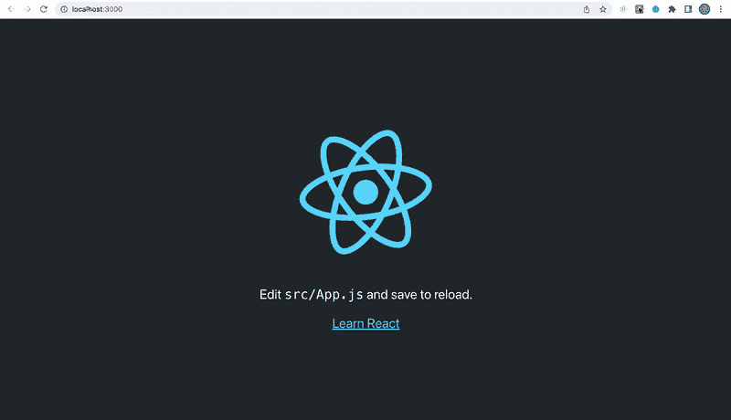

下一步是安装 Material UI，这是一个完全加载的组件库和设计系统[https://mui.com/](https://mui.com/)

# 2.创建扩展更新

现在我们有了一个 react 应用程序，我们需要对扩展结构进行 2 处修改。第一步是更新`public/manifest.json`文件。清单描述了源包包含的内容和扩展的权限。

打开`public/manifest.json`并将其更改为以下结构:

```
{
    "manifest_version": 3,
    "name": "YOUR_EXTENSION_NAME",
    "description": "DESCRIPTION",
    "version": "1.0.0",
    "action": {
        "default_popup": "index.html",
        "default_title": "Open the popup"
    },
    "icons": {
        "16": "icon.png",
        "48": "icon.png",
        "128": "icon.png"
    },
    "permissions": [
        "scripting",
        "activeTab",
        "storage"
    ],
    "host_permissions": [
        "https://*/"
    ]
}
```

然后将下面的代码片段添加到您的`src/App.js`文件的最顶端:

```
/*global chrome*/
```

太好了，我们准备好开始构建应用程序了。

# 3.安装材料用户界面(可选)

在本指南中，我将使用材质 UI 来格式化 UI；这是一个完全加载的组件库和设计系统，具有生产就绪的组件。

从安装库开始，在之前创建的文件夹`your-app-name`中运行这个命令:

```
npm install @mui/material @emotion/react @emotion/styled
```

```
npm install @mui/icons-material
```

让我们继续安装图标包，它由导出为 React 组件的 SVG 图标组成:

现在我们已经安装了材质 UI，让我们开始构建扩展应用程序。

# 4.创建扩展用户界面

在这一节中，我们将构建一个只有一个文本字段和一个按钮的超级简单的应用程序。该按钮将调用 OpenAI SDK，并向 GPT-3 提出一个问题。然后，在文本字段下方可以看到响应。

改变标题从改变 Chrome 扩展的标题开始。打开`public/index.html`，将`title`标签改为您自己的名字:

```
 <title>GPT-3 Chrome extension</title>
```

Create React app 附带了重载和 ES6 支持，因此您应该已经在浏览器选项卡中看到了更改:

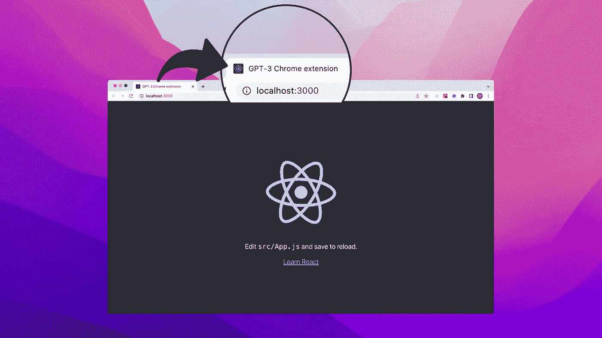

好的，继续删除`src/App.js`中已经写好的代码，用一个容器和网格替换它。您的`App.js`现在应该是这样的:

```
import React, {useState} from "react";
import "./App.css";

import { Box, Container, Grid, TextField } from "@mui/material";

function App() {
  return (
    <Container>
      <Box sx={{ width: "100%", mt: 4  }}>
        <Grid container>
          <Grid item xs={12}>
          </Grid>
        </Grid>
      </Box>
    </Container>
  );
}

export default App;
```

继续为 GPT-3 提示符创建变量:

```
const [prompt, setPrompt] = useState("")
```

此外，添加以下代码片段来创建文本字段:

```
<TextField
  autoFocus
  fullWidth
  label="Your text"
  variant="outlined"
  multiline
  rows={4}
  margin="normal"
  value={prompt}
  onChange={(e) => {
    setPrompt(e.target.value);
  }}
/>
```

创建此函数来处理 API 调用:

```
async function handleSubmit() {
  return
}
```

然后创建一个调用函数的按钮:

```
<Button
  fullWidth
  disableElevation
  variant="contained"
  onClick={() => handleSubmit()}
>
  Submit
</Button>
```

应用程序现在看起来应该是这样的:

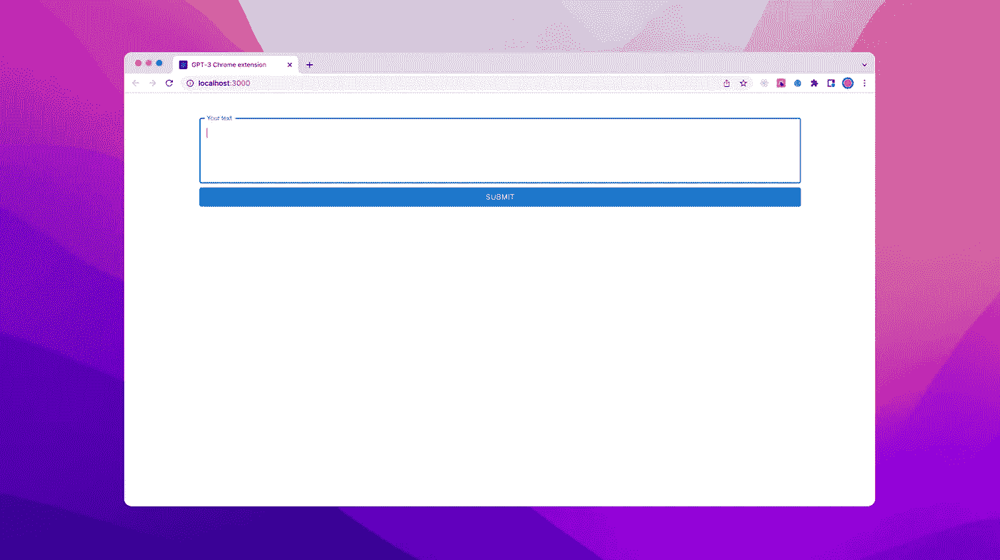

这里是目前为止`App.js`中的所有代码:

```
import React, { useState } from "react";
import "./App.css";

import { Box, Button, Container, Grid, TextField } from "@mui/material";

function App() {
  const [prompt, setPrompt] = useState("");

  async function handleSubmit() {}

  return (
    <Container>
      <Box sx={{ width: "100%", mt: 4 }}>
        <Grid container>
          <Grid item xs={12}>
            <TextField
              fullWidth
              autoFocus
              label="Your text"
              variant="outlined"
              multiline
              rows={4}
              margin="normal"
              value={prompt}
              onChange={(e) => {
                setPrompt(e.target.value);
              }}
            />
            <Button
              fullWidth
              disableElevation
              variant="contained"
              onClick={() => handleSubmit()}
            >
              Submit
            </Button>
          </Grid>
        </Grid>
      </Box>
    </Container>
  );
}

export default App;
```

让我们添加另一个变量来跟踪 API 调用:

```
const [isLoading, setIsLoading] = useState(false)
```

导入一个名为`AutoRenew`的图标:

```
import AutorenewIcon from '@mui/icons-material/Autorenew';
```

并将图标添加到按钮上，并添加一个禁用条件:

```
<Button
 fullWidth
 disableElevation
 variant="contained"
 disabled={isLoading}
 onClick={() => handleSubmit()}
 startIcon={
   isLoading && (
     <AutorenewIcon
       sx={{
         animation: "spin 2s linear infinite",
         "@keyframes spin": {
           "0%": {
             transform: "rotate(360deg)",
           },
           "100%": {
             transform: "rotate(0deg)",
           },
         },
       }}
     />
   )
 }
>
 Submit
</Button>
```

调用 API 时，当`isLoading`为`true`时，这个代码片段将使图标旋转。

最后，让我们在按钮下为 API 响应添加一个`Paper`组件。首先创建一个新变量:

```
const [response, setResponse] = useState("")
```

并添加一个`Paper`组件，一旦我们有了响应，它就会被填充:

```
<Grid item xs={12} sx={{mt:3}}>
  <Paper sx={{p:3}}>{response}</Paper>
</Grid>
```

我们已经完成了一个非常简单的 UI，并且我们准备创建向 OpenAI 发送 API 请求的逻辑。

# 5.获取 OpenAI API 密钥

在我们继续编写 API 调用之前，让我们获取 API 调用所需的 OpenAI 凭证。

进入[https://beta.openai.com/](https://beta.openai.com/)，登录点击你的头像**查看 API 键**:

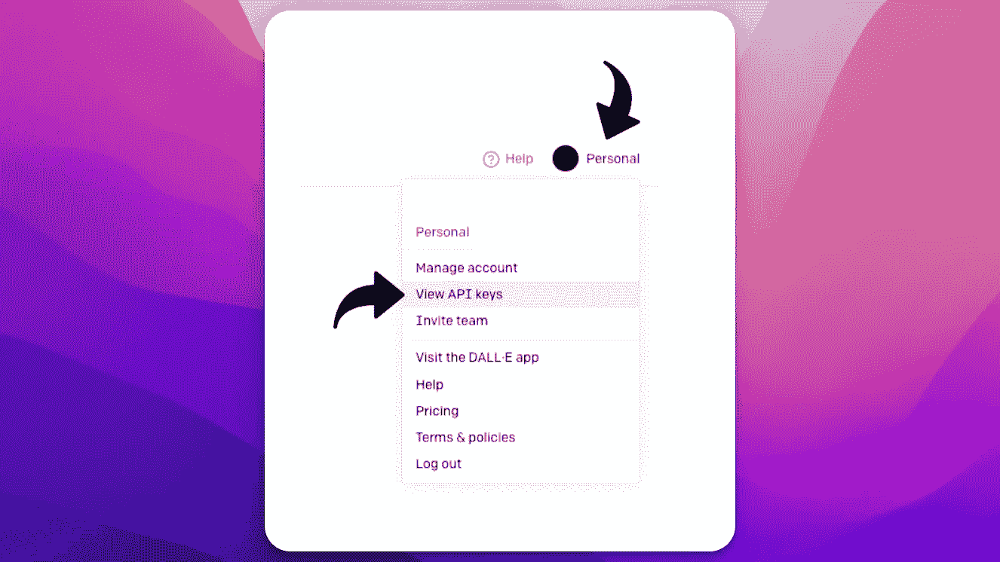

然后创建一个**新的密钥**并保存它以备请求:

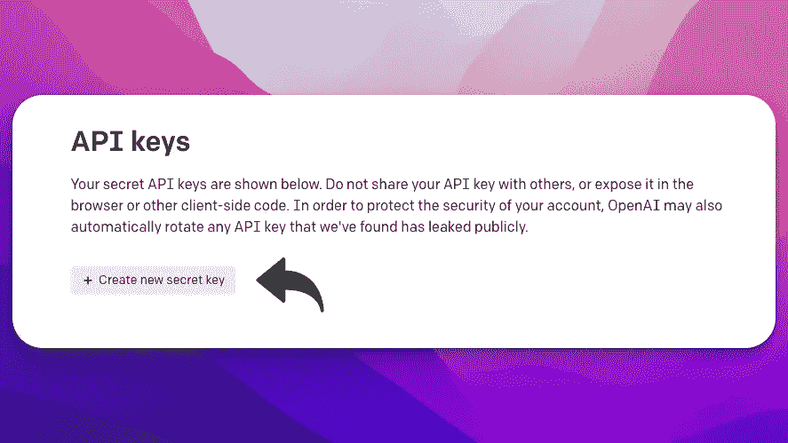

然后点击`Settings`，为您的账户保存**组织 ID** :

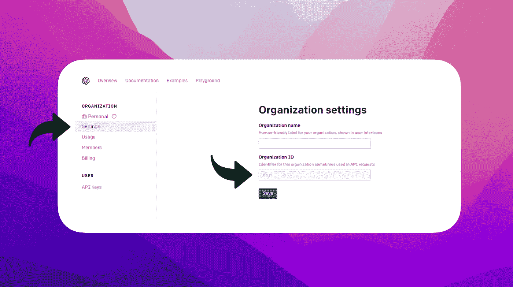

现在我们有了发出 API 请求所需的所有凭证。

# 6.添加 OpenAI 配置

安装 OpenAI 节点库:

```
npm install openai
```

然后从库中导入`Configuration`和`OpenAIApi`:

```
import { Configuration, OpenAIApi } from "openai";
```

使用 API 密钥和组织 id 初始化库:

```
const configuration = new Configuration({
  apiKey: YOUR_OPENAI_API_KEY,
});

const openai = new OpenAIApi(configuration);
```

现在我们准备创建一个完成。

# 7.创建 GPT-3 完井

我们终于准备好通过 API 调用 GPT-3 完成来完成`handleSubmit`函数。

将`handleSubmit`更新为:

```
async function handleSubmit() {
    setIsLoading(true);

    try {
      const completion = await openai.createCompletion({
        model: "text-davinci-002",
        prompt: prompt,
        max_tokens: 100,
      });
      setResponse(completion.data.choices[0].text);
      setIsLoading(false);
    } catch (e) {
      alert("Error: ", e);
      setIsLoading(false);
    }
  }
```

响应保存在`response`变量中，并显示在文本字段的正下方:

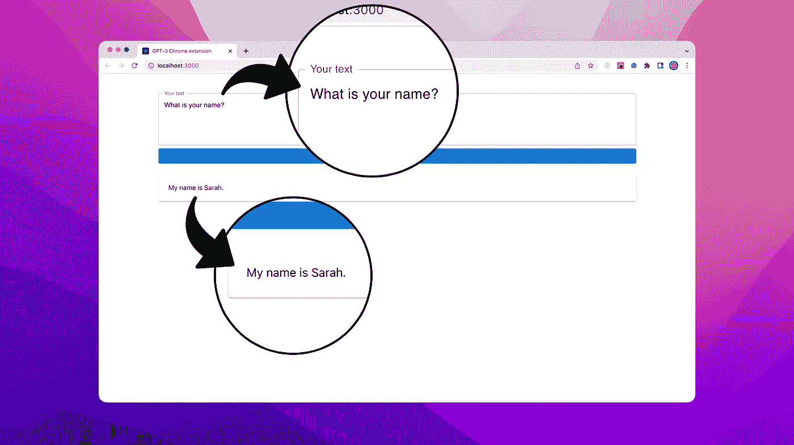

太好了，我们有工作逻辑来提问和显示结果。

最后一步是创建一个 favicon，它将是你的 Chrome 扩展的小图标，类似于下面两个:

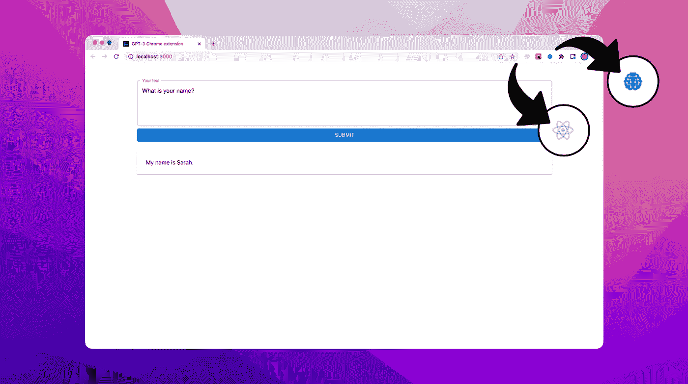

# 8.创建收藏夹图标

让我们为我们的应用程序创建一个 favicon，这也将是代表你的 Chrome 扩展的小图标。

从找到一个你喜欢的图像开始。我用的是 https://icons8.com/的图标——如果你想免费使用图标，记得链接到 icons8.com。我有一个月订阅，给你 100 次下载/月。

接下来是将你的图片上传到[https://realfavicongenerator.net/](https://realfavicongenerator.net/)——浏览所有步骤，最后点击**生成你的收藏夹图标和 HTML 代码**:

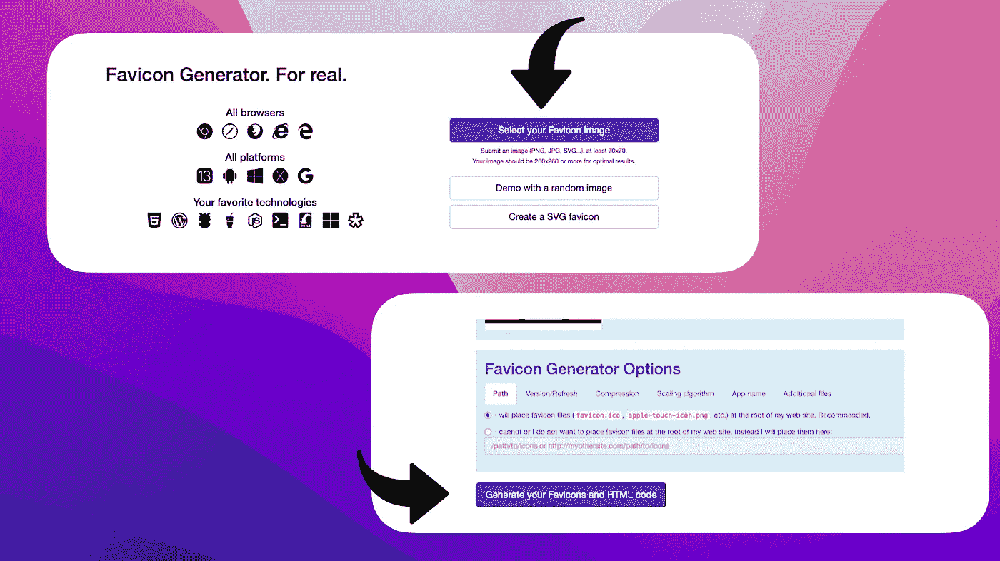

生成软件包后，单击以下载软件包:


解压软件包并将文件`favicon.ico`复制到你的应用文件夹`public`，这将替换当前的`favicon.ico`:

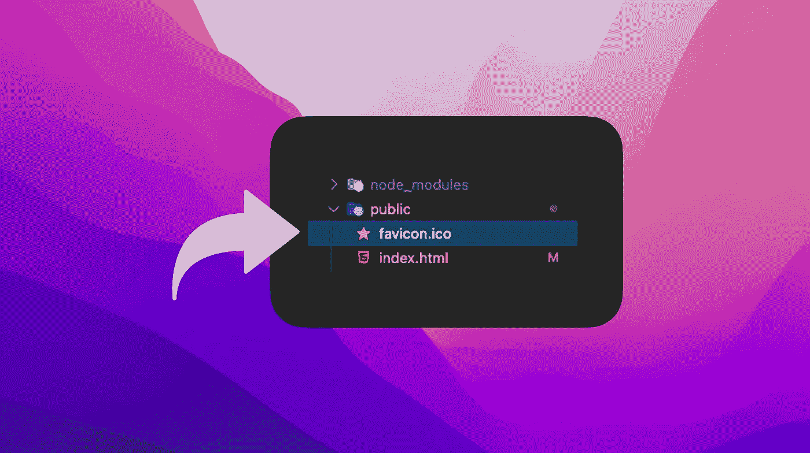

还将一个更大的`png`文件复制到`/public`，按照我们之前在清单中写的那样命名为`icon.png`:


如果刷新浏览器，您应该会看到新的 favicon:


现在我们已经准备好了所有的部分，让我们构建并上传扩展到 Chrome。

# 9.上传扩展

首先在扩展目录中运行以下命令:

```
npm run build
```

该命令将在您的扩展目录的**根**文件夹中创建一个新的`/build`文件夹；这是我们将上传到 Chrome 的文件夹。

构建完成后，在新选项卡中访问`chrome://extensions`并点击 **Load unpacked** :


然后选择刚刚创建的`/build`文件夹:


你有它！如果你在 Chrome 中点击你的扩展菜单，你会看到你的小图标，点击它，我们的扩展弹出窗口应该是这样的:

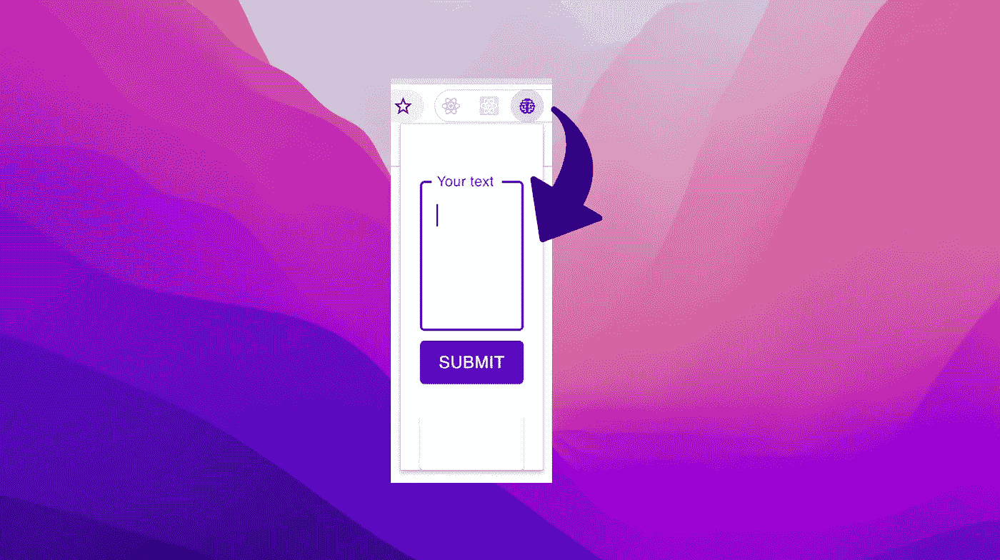

唯一的问题是它很窄。让我们在下面的最后一节解决这个问题。

# 10.UI 修复

好吧，扩展弹出窗口很窄，让我们来解决这个问题。打开`src/index.css`并将**宽度**和**高度**添加到**车身标签**中:

```
body {
  width: 800px; /* Add width */
  height: 1000px; /* Add height */
  margin: 0;
  font-family: -apple-system, BlinkMacSystemFont, "Segoe UI", "Roboto", "Oxygen",
    "Ubuntu", "Cantarell", "Fira Sans", "Droid Sans", "Helvetica Neue",
    sans-serif;
  -webkit-font-smoothing: antialiased;
  -moz-osx-font-smoothing: grayscale;
}
```

仅此而已。再次运行`npm run build`，然后访问`chrome://extensions/`并更新扩展:

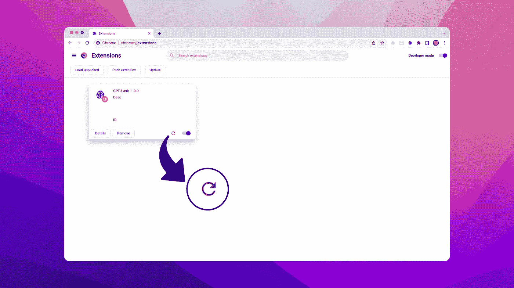

应用程序现在应该有这么宽:

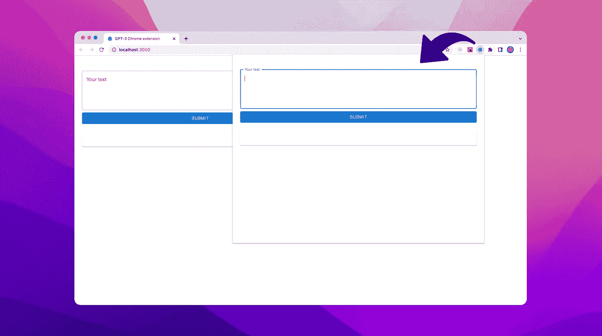

# 11.保存状态(可选)

该应用程序现在完全正常工作。您将注意到的一件事是，一旦您从弹出窗口中单击出来，所有输入数据都将消失:

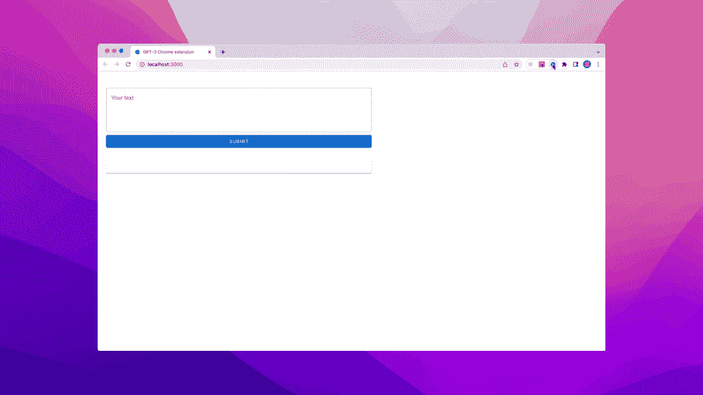

以下是如何在局部变量中保存当前状态的方法。首先将**提示符**保存到本地状态。

将此代码片段添加到您的 **TextField** 组件的 **onChange** 中:

```
onChange={(e) => {
  setPrompt(e.target.value); // Keep
  chrome.storage.local.set({ prompt: e.target.value }); // Add this
}}
```

这个代码片段将把提示存储到本地变量`prompt`。

除了将变量保存在 Chrome 本地存储器中，如果你关闭弹出窗口，我们还希望能够将这个值添加到你自己的变量`prompt`中。

通过将`useEffect`钩子添加到`src/App.js`文件中来实现。然后添加这个代码片段，它在本地 Chrome 变量中查找变量`prompt`，并用`useState`将值保存在您自己的变量`prompt`中:

```
useEffect(() => {
  try {
    chrome.storage.local.get(null, function (data) {
      if ("prompt" in data) {
        setPrompt(data.prompt);
      }
    });
  } catch (e) {
    console.log("Error due to local state");
  }
}, []);
```

该错误消息是在本地运行应用程序时出现的。

现在再次运行`npm run build`，打开`chrome://extensions/`并更新你的扩展。当您关闭弹出窗口时，您的提示现在保存在本地:


这就是一切，现在你有一个工作的 Chrome 扩展，当你关闭弹出窗口时，你的输入数据被保存在本地。让我们试着问一些问题。

# 12.问吧

让我们试试最后一个应用程序:

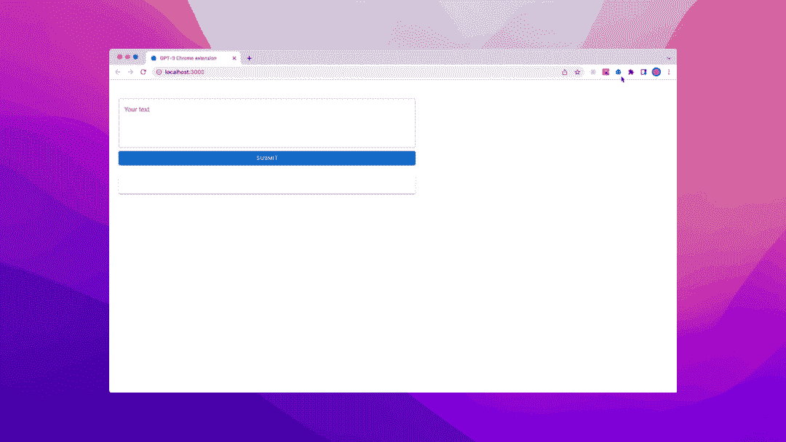

这是构建您的第一个 Chrome 扩展的快速而简单的演练。如果你想自己实现，这里有带源代码的[回购](https://github.com/norahsakal/create-gpt3-chrome-extension)。

感谢阅读

*原载于*[*https://norahsakal.com/blog/create-gpt3-chrome-extension*](https://norahsakal.com/blog/create-gpt3-chrome-extension)