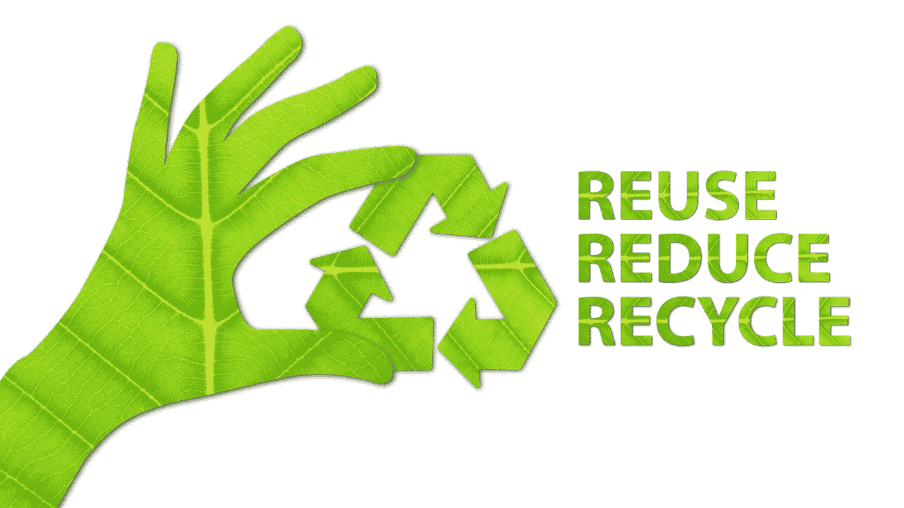

# 如何创建一个可重复使用的网页刮刀

> 原文：<https://betterprogramming.pub/how-to-create-a-reusable-web-scraper-5a5aa9af62d9>

## 停止不断修改你的网页抓取工具



来自[讲故事者](https://www.raconteur.net/sponsored/reduce-reuse-recycle-smart-packaging-to-protect-what-matters)的照片。

网页抓取工具非常有趣。当网页上的元素改变时，不断地修改代码并不有趣。这就是为什么我开始创建一个更好的网络抓取项目——一个可以通过最小的编辑更新抓取新网站的项目。

第一步是将 web scraper 的每个部分分成独立的逻辑部分:

1.  页面请求者
2.  页面验证器
3.  模板化页面处理器

# 页面请求者


照片来自[玩具兄弟](https://toybros.com/should-guests-be-able-to-request-music-at-your-wedding/)。

页面请求者有一些锦囊妙计。下载网站时有很多要考虑的。你要确保你的用户代理是随机的，不要太频繁地从同一个域请求。

此外，停下来分析一个页面为什么没有下载的成本可能非常昂贵——尤其是如果您有一个为几个站点一次运行几个小时的刮刀。因此，我们将处理这些请求，并将它们保存为一个文件。

将请求保存到文件中还有另一个好处。你不必担心丢失的标签会毁掉你的网页抓取器。如果您的处理器是独立的，并且您已经下载了页面，那么您可以根据自己的需要快速、频繁地处理它们。如果您发现有另一个数据元素需要抓取，该怎么办？别担心。只需添加标签，并在您已经下载的页面上重新运行您的处理器。

下面是一些示例代码，说明这在实践中是什么样子:

# 页面验证器


图片来自[中](https://medium.com/artisans-of-tech/handling-validating-user-input-more-with-sauciness-in-android-with-java-d1bbf10d767)。

页面验证器检查文件并解开请求。它将读取请求的状态代码，如果请求代码是类似于 408(超时)的代码，您可以让它将站点重新排队等待下载。否则，验证器可以将文件移动到实际的 web 抓取模块进行处理。

你也可以收集为什么一个页面没有下载的数据。也许你请求页面太快，被禁止。这些数据可用于调整您的页面下载程序，使其尽可能快地运行，并减少错误。

# 模板化页面处理器

这是你期待已久的神奇酱。第一步是创建我们的数据模型。我们从我们的网址开始。对于每个不同的站点/路径，可能有不同的数据提取方法。我们从一句格言开始，像这样:

```
models = {
  'finance.yahoo.com':{},
  'news.yahoo.com'{},
  'bloomberg.com':{}
}
```

在我们的用例中，我们希望提取这些网站的文章内容。为此，我们将为仍然包含所有数据的最小外部元素创建一个选择器。例如，下面是 finance.yahoo.com 的示例页面:

```
Webpage Sample
<div>
    <a>some link</a>
    <p>some content</p>
    <article class="canvas-body">
        <h1>Heading</h1>
        <p>article paragraph 1</p>
        <p class="ad">Ad Link</p> 
        <p>article paragraph 2</p>
        <li>list element<li>
        <a>unrelated link</a>
    </article>
</div>
```

在上面的代码片段中，我们希望将文章作为目标。所以我们将同时使用文章标签和类作为标识符，因为这是包含文章内容的最小包含元素。

```
models = {
  'finance.yahoo.com':{
    'root-element':[
            'article', 
            {'class': "canvas-body"}
     ]
  },
  'news.yahoo.com'{},
  'bloomberg.com':{}
}
```

接下来，我们将需要确定文章中的哪些元素是垃圾。我们可以看到有一个`ad`类(记住现实生活中不会这么简单)。因此，为了指定我们想要删除它，我们将在配置模型中创建一个`unwanted_elements`元素:

```
models = {
  'finance.yahoo.com':{
       'root-element':[
            'article', 
            {'class': "canvas-body"}
        ],
        'unwanted_elements': [
            'p',
            {'class': "ad"}
        ]
  },
  'news.yahoo.com'{},
  'bloomberg.com':{}
}
```

现在我们已经剔除了一些垃圾，我们需要注意我们想要保留哪些元素。因为我们只寻找文章元素，所以我们只需要指定我们想要保留的`p`和`h1`元素:

```
models = {
  'finance.yahoo.com':{
       'root-element':[
            'article', 
            {'class': "canvas-body"}
        ],
        'unwanted_elements': [
            'p',
            {'class': "ad"}
        ]
        'text_elements': [
            ['p'],
            ['li']
        ]  },
  'news.yahoo.com'{},
  'bloomberg.com':{}
}
```

现在是最后一部分——主聚合器！我将忽略配置文件的解包和加载。如果我写了全部代码，这篇文章将永远不会结束:

# 结论

使用这段代码，您可以创建一个模板，用于从任何网站提取文章文本。你可以看到完整的代码，以及我是如何开始在我的 GitHub 上实现它的。

[](https://github.com/dtaivpp/NewsTicker/blob/master/src/scrape_page.py) [## dtaivpp/NewsTicker

### 这个项目抓取网页，并为股票代码创建一个公共舆论行情指示器

github.com](https://github.com/dtaivpp/NewsTicker/blob/master/src/scrape_page.py)