# 如何在 JavaScript 中创建和铸造一个令牌(ERC-20 令牌)

> 原文：<https://betterprogramming.pub/how-to-create-and-mint-a-crypto-coin-erc-20-token-in-javascript-ef39ecc74e27>

## 让您快速启动并运行的方法

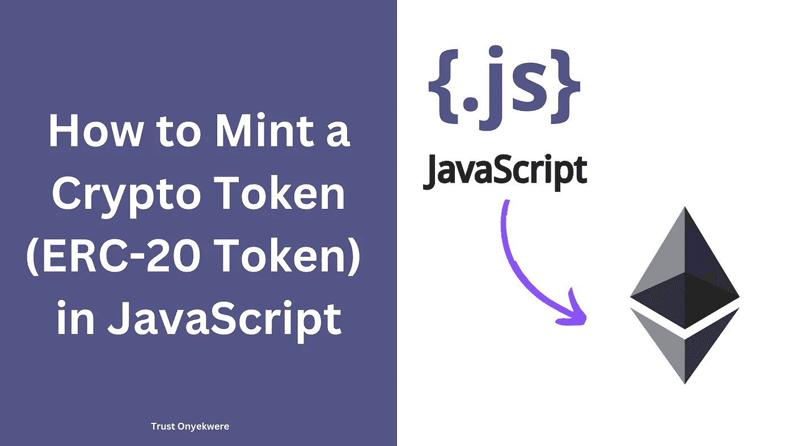

由作者使用 Canva 创建

本指南的目标是演示如何使用 JavaScript 和 Bunzz SDK 在尽可能短的时间内创建一个 ERC-20 令牌，而无需编写 Solidity。

本指南分为两部分，分别涵盖以下主要概念:

1.  在十分钟内创建并部署一个 ERC-20 令牌到区块链
2.  用 JavaScript 制作一个 ERC-20 令牌并将其公开

先说基础:[什么是 ERC20 令牌](https://medium.com/codex/token-standards-erc-20-vs-erc-721-vs-erc-1155-2e4a09dc0f8a)？

# 什么是 ERC 20 代币？

ERC-20 令牌是以太网上的“可替换”数字令牌集。

ERC 20 标准允许开发者在以太网上创建他们自己的令牌。

> ERC 代表以太坊征求意见。

以太坊不只是区块链，像比特币；它是一个平台。这意味着开发人员和构建人员可以利用它来构建产品和解决方案，而无需从头构建自己的区块链。

有了 ERC-20 标准，你可以在以太网上建立一种加密货币。许多知名的数字货币都使用 ERC-20 标准。一些流行的例子是:

*   系绳美元(USDT)
*   美元硬币(USDC)
*   柴犬(SHIB)
*   币安美元(BUSD)
*   BNB (BNB)
*   十六进制
*   制造商(MKR)

要使用 ERC-20 标准创建数字货币，您需要以下内容来完成本指南:

1.  VS 代码集成开发环境或任何其他集成开发环境
2.  JavaScript/React 知识
3.  Bunzz 控制台
4.  Bunzz SDK
5.  元掩码浏览器扩展

我们开始吧。

首先，您将使用 Bunzz 控制台在以太坊区块链上创建令牌，然后使用 Bunzz SDK 用 JavaScript 创建令牌。

# 如何创建 ERC-20 令牌

首先，访问 [Bunzz](https://www.bunzz.dev/) ，如果你是这个平台的新手，登录或者注册。

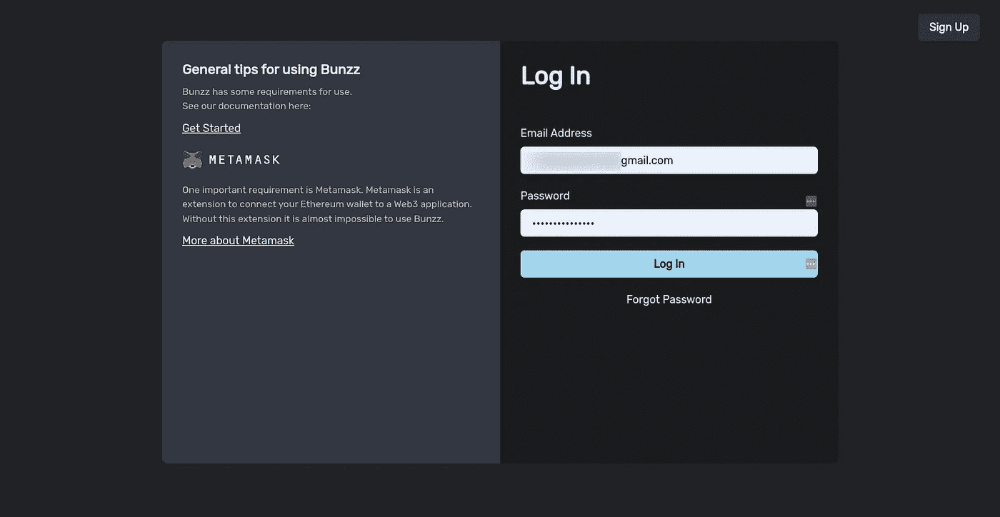

一旦您登录，您将可以访问 Bunzz 仪表板，在这里所有的神奇的事情都会发生。下一步是连接元掩码钱包，然后创建 DApp，如下图所示:

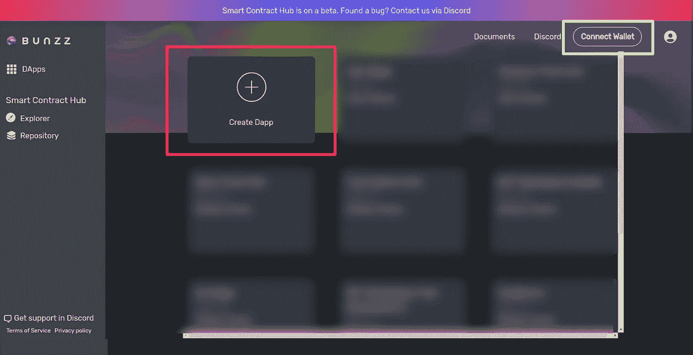

给你的 DApp 一个名字。你可以用任何想到的名字。我使用加密令牌作为我的。

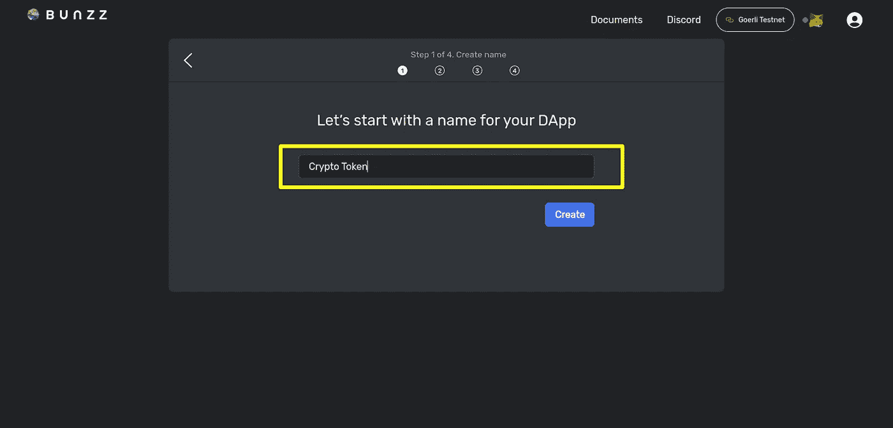

接下来，您将被要求为 DApp 选择一个网络。您可以根据自己的意愿选择 Testnet 或 Mainnet。我选择了 Goerli Testnet，如下图所示:

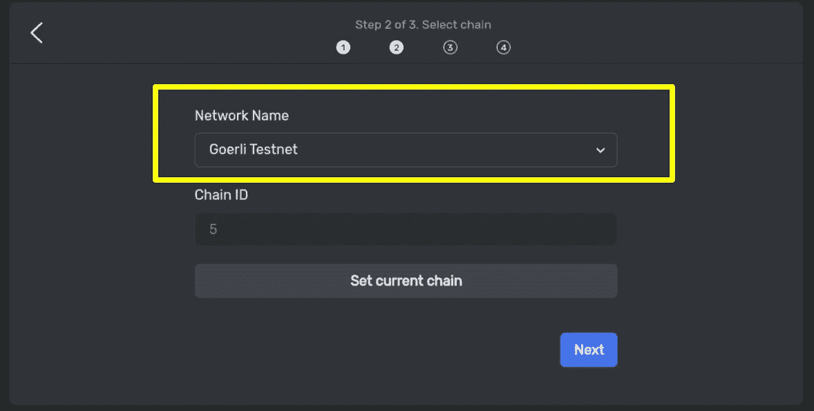

接下来是从许多可用的已经制作好的智能合同模板中选择一个模板。由于我们正在推出加密货币，我们将选择简单的 ERC20 令牌。

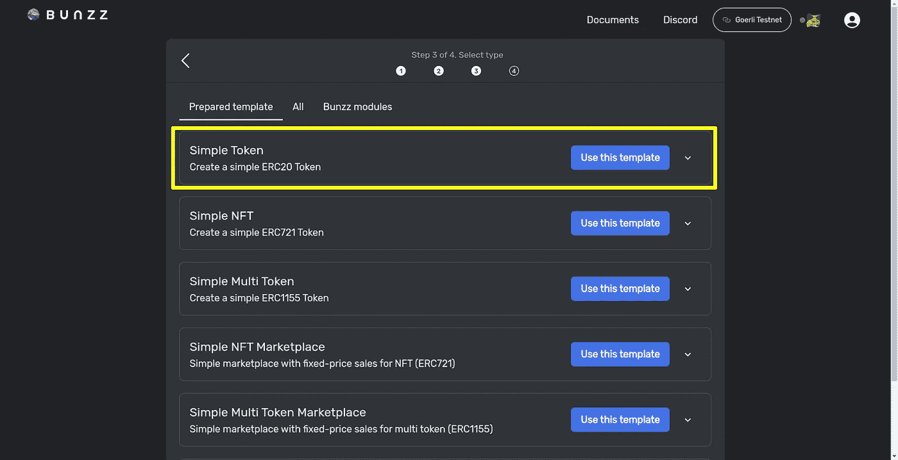

如下图所示，下一步是通过添加名称和符号来自定义令牌。我已经命名的象征测试信任货币和 TTC 作为象征。

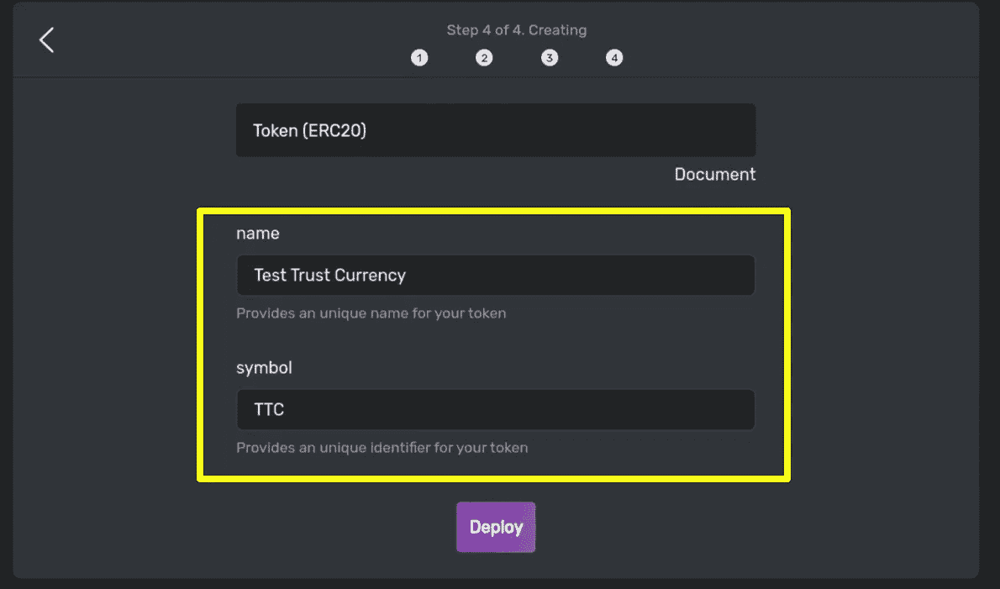

如果您希望查看 ERC20 智能合约背后的代码，请单击文档按钮。未来，Bunzz 将为开发人员添加编辑代码功能，以便在 Solidity 代码中添加额外的功能。

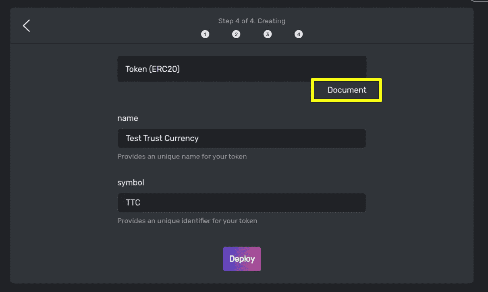

完成定制后，单击 deploy 并等待它同步，方法是批准将通过 Metamask 弹出的三个事务，如下图所示:


万岁！

你已经做到了。我们已经为名为 TTC 的新令牌成功部署了 ERC20 智能合约。

正如您在下图中看到的，仪表板现在有了其他功能，可以让我们随心所欲地与新推出的令牌进行交互和使用。

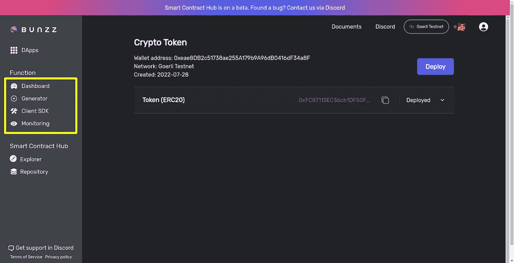

现在，继续检查[以太扫描令牌跟踪器](https://goerli.etherscan.io/tokens)并确认新令牌是否真的在区块链上。为此，复制下图中突出显示的令牌地址:

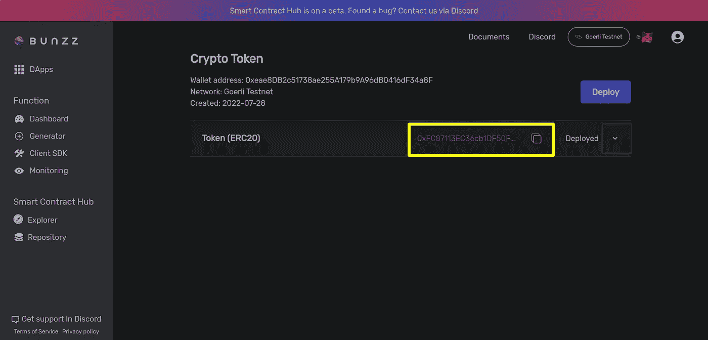

一旦你复制了地址，前往[以太扫描令牌跟踪器，](https://goerli.etherscan.io/tokens)粘贴地址，并搜索。

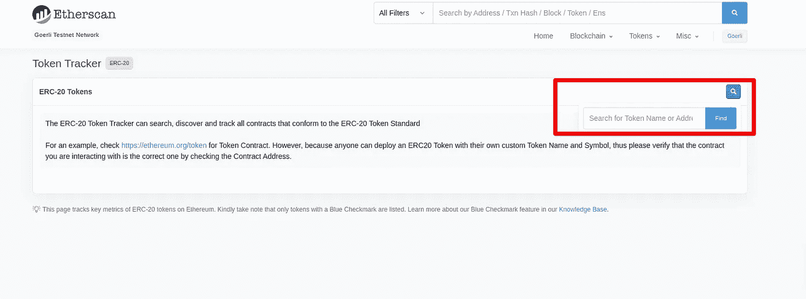

太好了！你可以在下图中看到我们在以太坊链上创建的令牌名称和符号。再次祝贺你！

如果你仔细看下面的图片，你会注意到链上没有加密令牌的供应。在第二部分中，我们将修复这个问题，并铸造我们创建的测试信任货币(TTC)。


# 铸造 ERC 20 元代币

要添加新加密令牌(TTC)的初始供应，您需要创建它。

铸造代币是什么意思？

> “什么是铸币？在加密货币中，铸造是一种分散的方法，使人们能够在没有中央机构(如政府或银行)参与的情况下生成新的令牌。它可以是不可替代的令牌，也可以是加密硬币。”— [货币市场基金](https://coinmarketcap.com/alexandria/glossary/minting\)

在本指南中，目标是铸造 TCC 并将令牌供应添加到区块链中以供使用。

我们开始吧！

# 第一步。创建前端应用程序

为了使本指南更简单，我为这个项目提供了 React 前端代码。您可以通过此[链接](https://github.com/lastrust/bunzz-demo/tree/main/erc20)克隆回购。

这是你应该看到的:

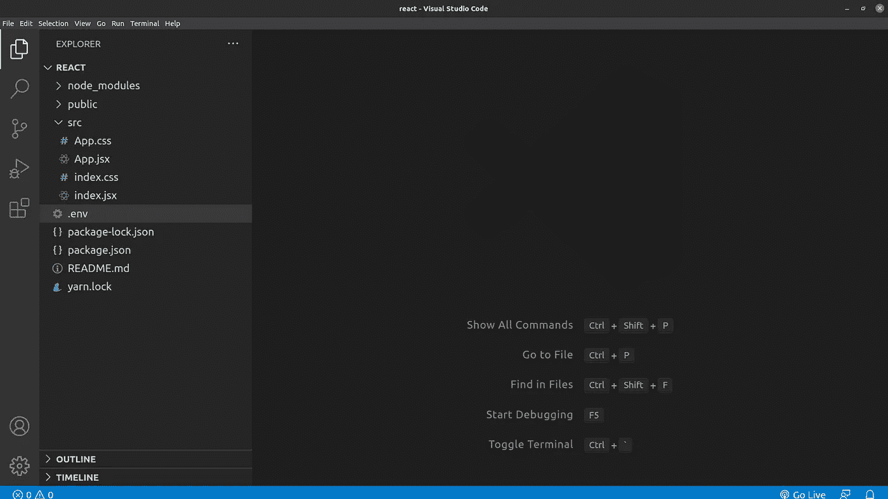

VS 代码上的克隆反应项目

# 步骤 2:安装依赖项

接下来，使用 npm 软件包管理器和以下命令安装所有依赖项:

```
npm install
```

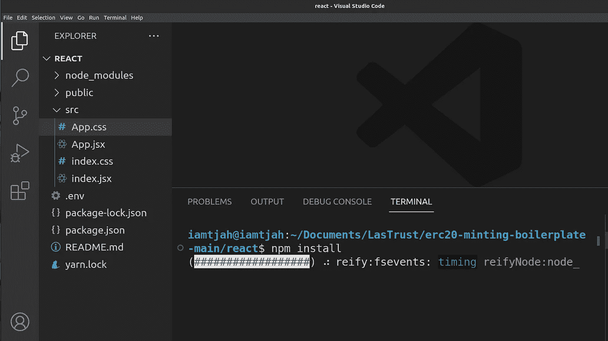

在 VS 代码终端上运行 npm install

如果您的系统上尚未安装 npm，请访问此[链接](https://docs.npmjs.com/downloading-and-installing-node-js-and-npm)在您的系统上安装 npm。

# 步骤 3:复制 DAPP_ID 和 API_KEY 值

转到 Bunzz 仪表板中的 Client SDK 选项卡，复制 Dapp ID 和 API 键值，并保存它以备后用。


Bunzz 仪表板

# 步骤 4:登录您的元掩码帐户

由于我们需要与以太坊区块链进行交互，因此将使用安全钱包 metamask。如果你使用的是 Chrome 或 Firefox，Metamask 提供了一个易于使用的钱包作为 Chrome 或 Firefox 的扩展。

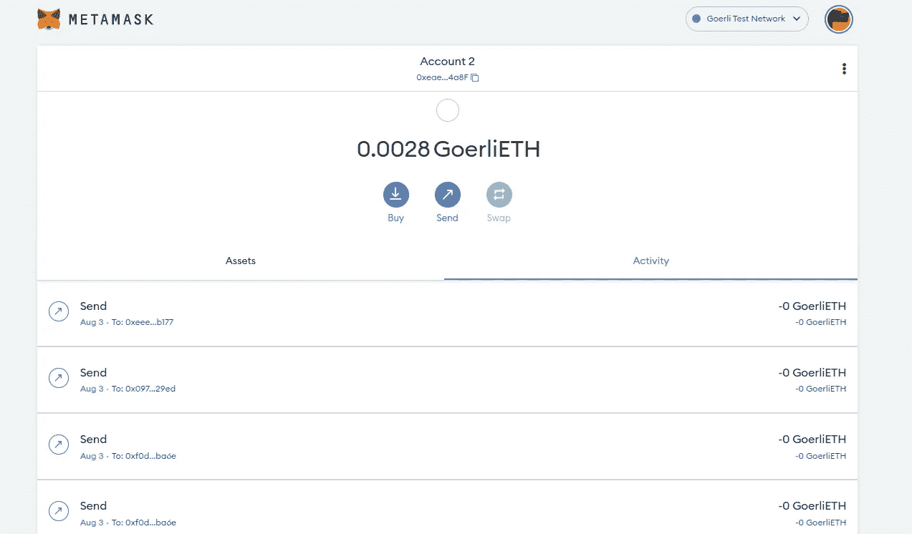

登录时的元掩码视图

你需要做的就是下载它，安装它，然后注册或登录。可以访问这个[链接](https://metamask.io/)下载 metamask。

# 第五步:启动 React 应用程序

在 VS 代码终端上用 npm run start 命令启动 react 服务器。


在 VS 代码终端上运行 npm run start

下面的界面是您在启动 react 服务器时应该看到的。


React 应用程序在浏览器上运行时

# 步骤 6:设置 DAPP_ID 和 API_KEY

为了成功铸造您的 ERC-20 令牌，它需要一些关于您之前部署的智能合约的信息。

Bunzz SDK 将使用您的 DAPP ID 和 API 密钥从 Bunzz 控制台获取所需的信息。

要在您之前克隆的 React app 项目中设置`DAPP_ID`和`API_KEY`常量，请在 VS 代码终端中使用以下命令创建一个. env 文件:

> 触摸。包封/包围（动词 envelop 的简写）

复制您在步骤 3 中复制的 Dapp ID 和 API 键值，并将其粘贴到。env 文件，如下图所示:


的。env 文件是添加 DAPP_ID 和 API_KEY 值的地方

在`App.jsx`文件中，您可以看到`DAPP_ID`和`API_KEY`值被调用的位置。

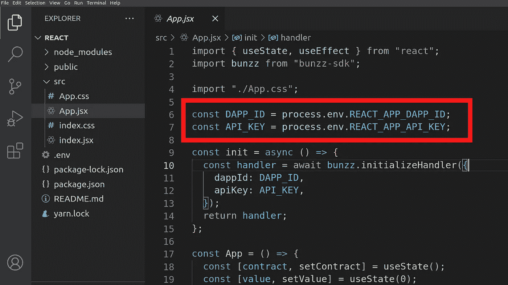

DAPP_ID 和 API_KEY 常量被分配给。环境文件。

# 第七步:铸造你的令牌

保存后，再次启动应用程序或去前端应用程序，如果已经开始，并指出你想铸币的数量，在我的情况下是 1。


为要签名的事务弹出元掩码

当你点击薄荷按钮，这笔交易所需的汽油费，然后弹出，确认，就这样。您已经成功铸造了您的 ERC20 令牌。

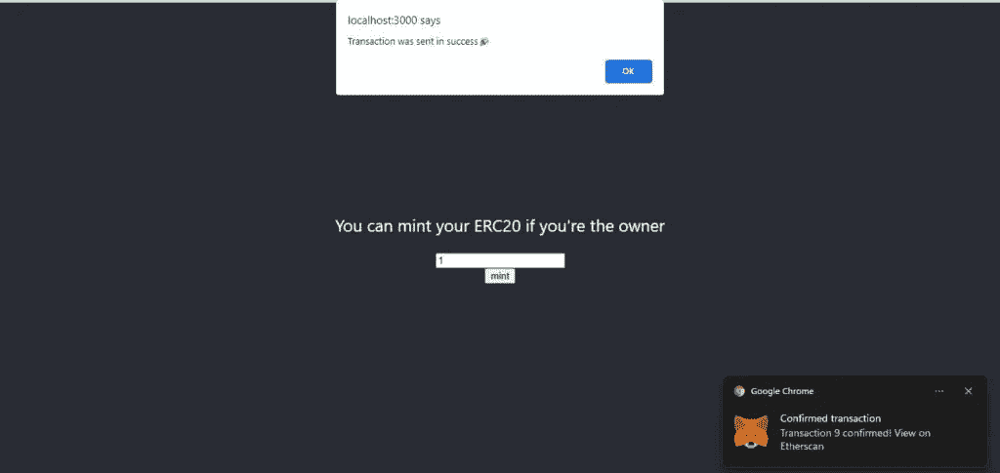

如果铸造完成，将弹出成功消息。

就是这样！

恭喜你！现在，您已经创建、部署并制定了自己的 ERC-20 合同。

为了确认我们已经创建了加密令牌，请转到 [Etherscan 令牌跟踪器，](https://goerli.etherscan.io/tokens)粘贴令牌地址(就像我们在第 1 部分末尾所做的那样)，并进行搜索。


TCC 的供应现在是 1

太好了！

如上图所示，令牌的总供应量为 1，这是我们在 React 应用程序上创造的。您可以尝试一下，并探索如何在现实生活中使用它。

要了解更多关于用于创建智能合同的代码，请访问 [Bunzz 文档](https://www.npmjs.com/package/bunzz-sdk)和 [Bunzz GitHub](https://github.com/lastrust) 账户。

# 结论

如果您决定制作自己的公共令牌，请确保仅将本指南作为起点。这是一个需要很长时间才能完全理解的深刻话题。

除了创建令牌，您还需要考虑在发布后使其成功，并研究其他项目及其发布，以了解哪些项目运行良好，哪些项目运行不良，这有助于创建您自己的令牌。

```
**Want to Connect?**If you follow these steps and got stuck, or if you have any questions, feel free to reach out on [Discord](http://discord.gg/wCFUV6rNd7) or send a DM on [Twitter](https://twitter.com/iamtjah).
```