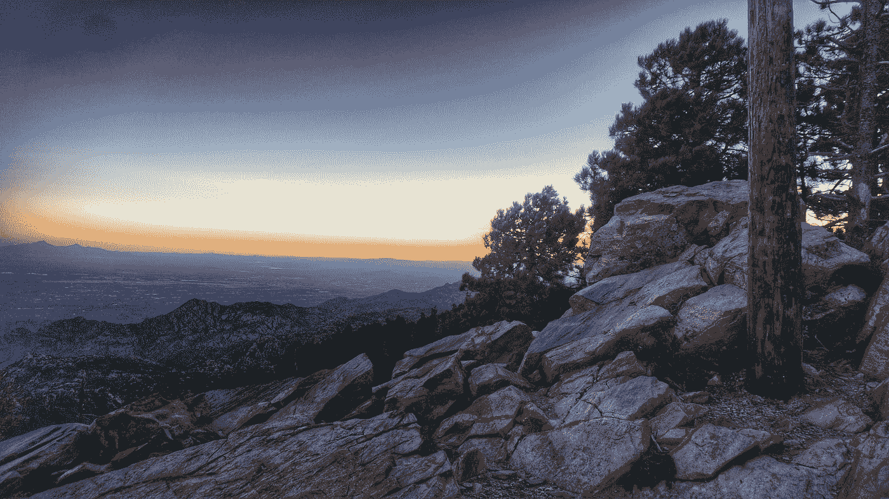
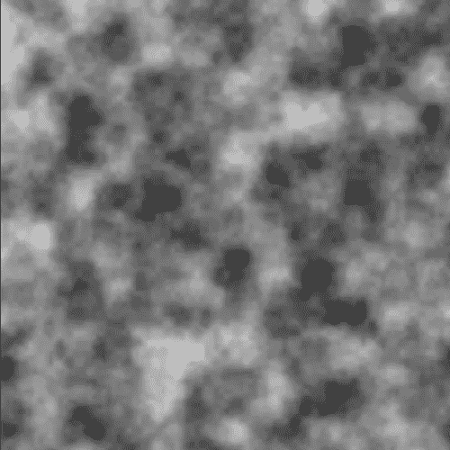
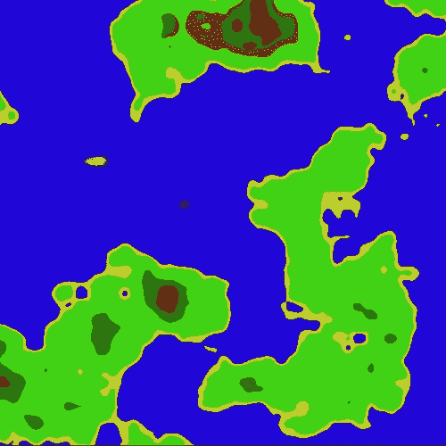
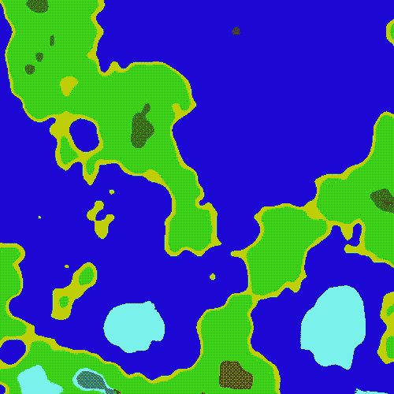

# 如何使用程序生成在你的游戏中创造无限的世界

> 原文：<https://betterprogramming.pub/how-to-create-infinite-worlds-in-your-games-using-procedural-generation-d4d4baecd3cb>

## 探索像《我的世界》和 Terraria 这样的游戏如何从无到有生成无限的、多样的开放世界——包括代码示例



科尔顿·迪安·马歇尔在 [Unsplash](https://unsplash.com?utm_source=medium&utm_medium=referral) 上的照片

几乎我们所有人都至少玩过一次自动生成地形的游戏。这类游戏确实是通过不断提供新的情境来刺激用户坚持玩下去。

如果你是一个注重细节的开发人员，你可能想知道这些无限的世界是如何产生的。尽管它们都有复杂的特征，但都归结于一些细微的随机性。

# 什么是程序世界生成？

[程序化生成](https://en.wikipedia.org/wiki/Procedural_generation)是一种使用算法创建数据的方法，而不是手动创建。当涉及到计算机游戏时，它用于自动生成世界和特征，而不需要开发者来构建它们。这种技术被广泛应用在基于开放世界的游戏中，比如《我的世界》、地球、无人天空，玩家可以自由探索和互动。

就开发时间和成本而言，过程化的世界生成比手工方式有很大的优势。由于游戏没有附带巨大的预建地图，下载大小往往会小得多。此外，一旦主世界生成引擎完成，新特性通常很容易实现。

现在，让我们来看看这个过程实际上是如何工作的。我将向您展示如何生成二维世界。

对于代码示例，我选择使用[处理](https://processing.org/)——一个基于 Java 编程语言的图形库和 IDE 为了简单起见，但是您可以随意使用任何您觉得更舒服的技术。然后我会链接到我的 GitHub 库，在那里可以找到完整的源代码。

**注意:**我将为 GitHub gists 的代码着色特性使用`.java`文件扩展名。所有这些文件实际上都有`.pde`扩展名。

# 什么是噪声，为什么它很重要？

我们都熟悉噪音的概念，最常用于识别无组织的、令人讨厌的声音。我给你介绍一下[值噪声](https://en.wikipedia.org/wiki/Value_noise)，它是由一组点组成的，这些点的值受其周围点的影响。

这些值彼此相关的事实是世界生成的一个关键方面，因为你会期望世界附近的位置看起来相似，而不是在天空中偶然发现一条河。



柏林噪波图示例-受周围环境影响的点集。

最常用的噪声类型之一是[柏林噪声](https://en.wikipedia.org/wiki/Perlin_noise)，以其创造者肯·柏林命名。柏林噪声允许你生成任意维数的[伪随机](https://en.wikipedia.org/wiki/Pseudorandom_number_generator)有机模式。

我不会关注这个算法背后的数学细节，因为许多编程语言都有内置函数。反正如果你想深入挖掘，这里有[全解释](https://en.wikipedia.org/wiki/Perlin_noise#:~:text=of computer graphics.-,Algorithm detail,-[edit])。

# 噪波图及其用法

噪波图是给定 n 维空间区域中噪波的图形表示，通常是游戏中的 2D 或 3D。在程序生成的情况下，它们表示特定的世界特征，如海拔、温度、湿度等。

地图中的每个点决定了最终产品中的某个值。让我们看看如何使用处理来生成噪波图，在这种情况下是针对地形的海拔高度:

用于生成高度的 2D 噪声图的代码。

正如你可能已经猜到的，我们也可以为我们的世界应该有的每一个特征生成多个噪波图。[先前的噪声图像](https://cdn-images-1.medium.com/max/800/1*riseeLubyzsyIJ8-2n-PeQ.png)正是由该函数生成的。

那么，一个世界还应该有什么其他特征呢？在我的例子中，我还选择了温度和湿度。生成这些地图的过程与我刚刚介绍的类似。

唯一的区别是给定点的湿度也是由其温度决定的，而温度也受地形高度的影响，这完全是有道理的。例如，在现实世界中，3000 米处的温度通常低于海平面。

温度和湿度二维噪声图生成代码。

既然你已经看到了噪波贴图是如何相互干扰的，是时候谈谈最有趣的部分了:生物群落。

# 生物群落及其确定方式

首先，什么是生物群落？来自[国家地理](https://www.nationalgeographic.org/encyclopedia/biome/) : *一个生物群落是以其植被、土壤、气候和野生动物为特征的一大片区域。*正如您可以从定义中推断的那样，生物群落是由我们从噪声图中生成的一组特定特征决定的。剩下要做的就是根据生物群落应有的特征，将这些价值映射到不同的生物群落中。

为了把过程说清楚，我们来看一个例子:长满草的平原。顾名思义，平原的海拔应该比较低。既然草长在那里，它们肯定不会干燥，也不会冻僵。

如何调整这些值取决于程序员，并且完全取决于实现。寻找最佳值的过程包括生成各种世界，每个世界的参数都略有不同，看看你最喜欢什么结果。


绿草如茵的平原上的生物群落(作者[阿尼苏尔·拉赫曼](https://unsplash.com/@arjabedbd?utm_source=medium&utm_medium=referral)在 [Unsplash](https://unsplash.com?utm_source=medium&utm_medium=referral) 上)

在我的例子中，我假设草原的海拔值一定在 135 到 169 之间，这是我通过反复试验得出的任意值。我还假设温度必须在 0 到 50 之间，湿度也必须在 0 到 50 之间。

**注:**这些值不是以米、度或百分比表示的。它们只是相应地图中特定坐标处的原始值。

为了便于表示，让我们在处理中创建一个`Range`和一个`Biome`类:

范围和生物群落类别。

现在，我们可以将我们的草原和其他一些生物群落作为一个对象，并将它们存储在一个数组中，该数组将成为我们的生物群落列表:

生物群落阵列及其特性。

一旦定义了世界生物群落列表，就该创建生物群落地图了。

生物群落图，就像我之前谈到的地图一样，是一组具有特定赋值的点。在这种情况下，x，y 坐标处的值是最符合噪波图中该点参数的生物群落。

为了更清楚，我们再举一个例子。假设海拔、温度和湿度地图在坐标 x、y 处的值分别为 140、25 和 25。由于所有这些都符合平原 135-169 的海拔范围和 0-50 的温度和湿度范围，该坐标处的生物群落应该是平原。

现在，我们不用手动检查一组值是否符合哪个生物群落，而是为其编写一个函数，如下所示:

这肯定不是确定生物群落最有效的方法，但我想尽可能保持简单。

一旦所有的点都分配了生物群落，就该生成图形表示了。这就是使用`Biome`类的颜色属性的地方。

让我们编写一个在屏幕上绘制最终地图的函数:

下图是生成的图形:



生物群落图。海中的一组岛屿。

如您所见，生成的地图与您在现实世界中看到的有些相似。唯一剩下的就是一些小细节，比如树木、岩石等等。由于这只是一个演示，我不会一步一步地展示如何生成这些，但如果您愿意，您可以为所有这些微观特征创建一个噪波图，并在图上绘制它们，就像我为海拔、温度和湿度等宏观特征展示的那样。

# 随机种子

[随机种子](https://en.wikipedia.org/wiki/Random_seed)是用于初始化伪随机数发生器的简单数字。第一个伪随机值由种子生成，随机序列的所有其他数字都依赖于它。

当你需要可预测的结果时，种子的用处就来了。事实上，对于同一种子，生成的伪随机数序列保证总是相等的。

这意味着，举例来说，如果你发现了一个非常好的世界，你想保存并用于一个游戏，你可以只保留它的随机种子。此外，如果你想和某人分享一个特定的世界，你不需要无限的带宽来发送一个无限的世界:你只需要发送种子。

在处理过程中，可以用内置函数`noiseSeed()`具体设置`noise()`函数的随机种子。它将一个整数(随机种子)作为参数，不返回任何内容。

```
int mySeed = 54;
noiseSeed(mySeed);
```

这个种子生成的每一张地图看起来都完全一样，假设世界生成的代码保持不变。

# 关于世界世代的进一步提示

为了在游戏中实现程序化的世界生成，你可能需要考虑将世界分成几块，以便只加载需要的资源。

要在世界中移动，你只需要在移动的方向上移动 x，y 坐标。噪波函数将根据新位置生成噪波值(从而生成贴图)。

这是我这篇文章所基于的项目的一个镜头。你可以看到当你在世界中移动时，新的地形是如何生成的。



坐标改变时程序世界生成的演示。

如果你感兴趣的话，这里我包括了这个项目的 [GitHub 库](https://github.com/nic-obert/procedural-generation)。我将否认，虽然代码质量不是最好的，因为这意味着是一个《我的世界》类游戏的原型，我正计划作出。

我希望你喜欢这篇文章，并且学到了一些关于游戏如何创造世界的新知识。

感谢阅读！