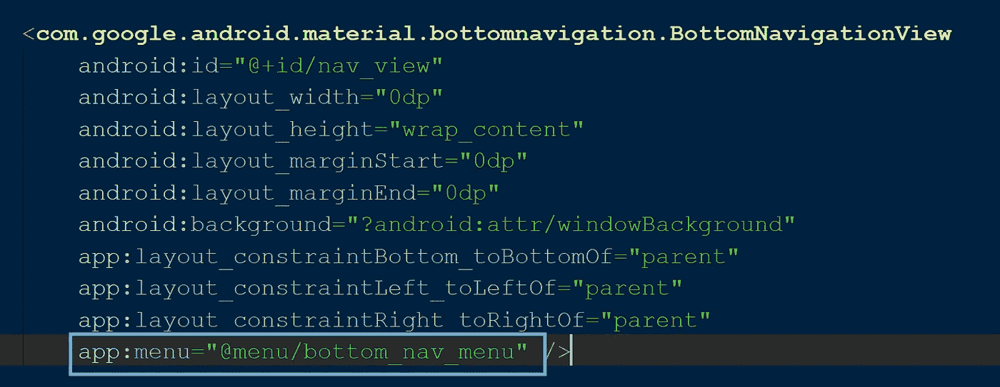

# 如何用谷歌底部导航栏创建通知徽章

> 原文：<https://betterprogramming.pub/how-to-create-notification-badges-with-google-bottom-navigation-bar-330925474f6d>

## 关于徽章你需要知道的一切


照片由[克拉克·范德贝肯](https://unsplash.com/@snaps_by_clark?utm_source=unsplash&utm_medium=referral&utm_content=creditCopyText)在 [Unsplash](https://unsplash.com/s/photos/patterns?utm_source=unsplash&utm_medium=referral&utm_content=creditCopyText) 上拍摄

底部导航栏使用户只需轻触鼠标即可轻松访问主视图并在主视图之间切换。当一个应用程序有三到五个顶级目的地时，推荐使用它们。

我们可以使用许多底层的工具栏库在我们的应用程序中包含高级特性，而无需编码。但使用本机库是最有效的方式——第三方库可能会增加你的应用程序大小，可能不支持黑暗模式等高级功能，并且可以随时弃用该库。我建议你使用标准的谷歌军事导航视图。

# 综合

要使用 Google material 底部导航栏，我们首先需要在项目中包含 martial 库。为此，您需要在应用程序级的`build.gradle`文件中的`dependencies`节点下包含以下代码行。

```
implementation 'com.google.android.material:material:1.0.0'
```

# 如何使用

首先，您需要将底部导航视图包含到布局文件中，如下所示:

在这里，我们将底部导航视图添加到布局中，并限制它显示在底部。然后，为了在导航视图中显示项目，我们需要创建一个菜单，所有项目都显示在底部栏中，并将该菜单分配给导航视图。首先，让我们创建一个包含三个项目的菜单，如下所示:

现在，让我们使用 menu 属性将这个菜单包含在底部导航视图中。看一看:



这就是我们需要做的。简单吧？看一下输出:


# 如何展示徽章

我们已经为底部栏中的项目实现了图标和文本。在你的产品将来的某个时候，在底部栏显示通知数似乎是合理的，这样用户可以很快发现他们有未读通知。

这时徽章就派上用场了。在 1.0.0 版本中，材料底部栏默认不支持徽章，但我们可以使用一些策略来添加徽章。

在我们开始之前，让我们看看我们想要达到的目标:


显示计数为三的通知标记是我创建的自定义布局，并以编程方式添加到菜单项通知中。

让我们一步一步来。我们需要创建一个圆形 drawable，在形状节点的帮助下显示在计数后面。看一看:

现在，我们需要创建我们的自定义布局，我们已经`textview`显示计数，并分配以上创建的 drawable 作为背景:

现在我们已经创建了自定义布局，是时候将视图添加到底部的`navigation-view`项了。

首先，我们需要创建一个视图并将`custom_badge_layout`膨胀到视图中，如下所示:

这里我们已经创建了一个名为`notificationsBadge` 的视图，并使用`LayoutInflater`将`cutom_badge_layout`膨胀到视图中。

唯一剩下的就是把视图添加到底部`navigation-view`。这很简单:

现在我们知道了如何添加徽章，是时候学习如何移除它们了。正如你在上面的代码中看到的，我们什么也没做，只是使用`addView`函数给`viewGroup` 添加了一个视图。同样，我们使用`nav_view` 上的`removeView` 功能移除徽章:

# 如何用材料设计库 1.1.0 创建徽章？

谷歌最近发布了下一个版本的材料设计库(1.1.0)。通过升级，我们可以直接创建徽章，无需任何自定义布局。看看如何在使用升级版库时将徽章添加到底部`navigation-view`:

要移除徽章，我们需要用需要移除徽章的`menuItemId`调用`removeBadge`函数。

```
nav_view?.**removeBadge**(**R.id.navigation_notifications**)
```

我们可以用升级后的库创建圆点和数字徽章。如果你没有提到计数，那么它将显示为一个点，否则，它将显示你分配的数字:


# 升级的库有问题

1.1.0 库的素材设计很梦幻，但是我正在开发的 app 在我把素材库升级到 1.1.0 的时候因为各种原因多次崩溃。这不像是库有错误，但是我们需要在代码中做很多改变。

崩溃的一个原因是我在我的根活动中使用了`non-material`主题，其中 material bottom `navigation-view`是膨胀的。为了解决这个问题，我们需要将根活动的主题更新为 material 主题。

如果您是一名应用程序开发人员，这可能很容易，但是如果您是一名库开发人员呢？应用程序开发人员不太可能正确地更改主题来使用您的库！

# 结论

我在这里解释的两个解决方案非常适合使用，但是要务实，使用任何适合你的情况。我建议升级你的材料设计库，使用本地代码。另一方面，如果你在一个假设的情况下，就像我上面提到的那样，使用旧版本并创建你自己的徽章，如上所示。

感谢您的阅读。